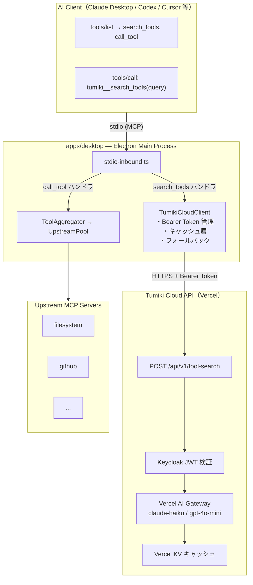
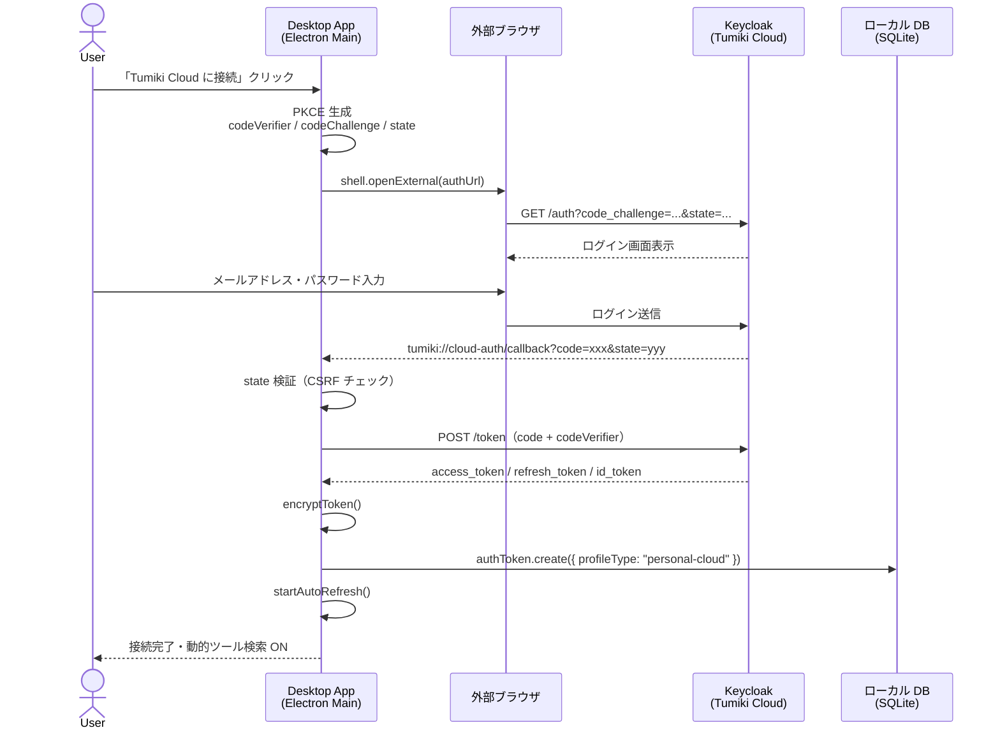
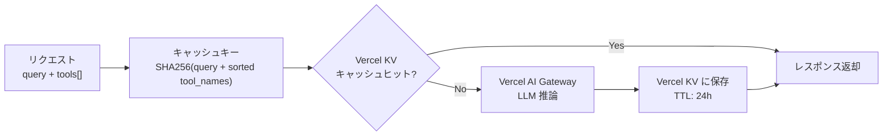
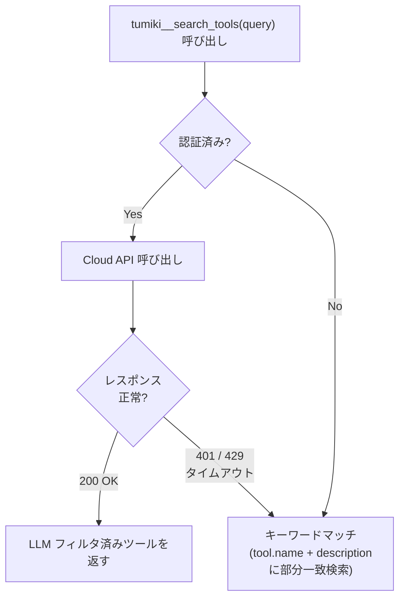
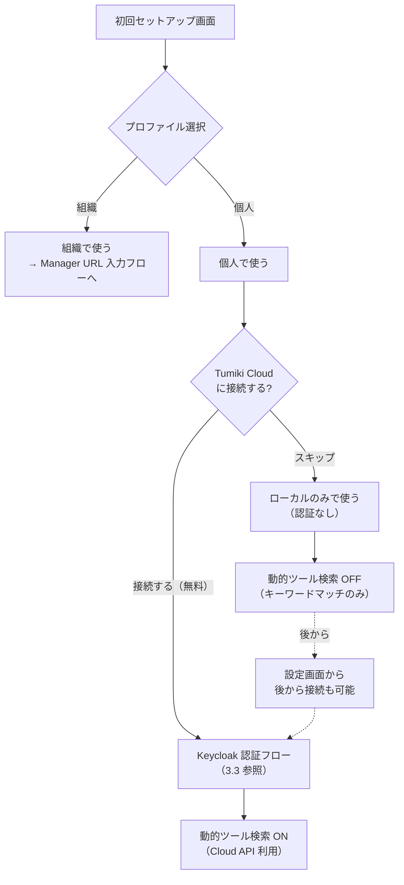

# Dynamic Tool Search — 設計ドキュメント

> 作成日: 2026-05-13  
> ステータス: 設計中（未実装）

---

## 1. 概要

Tumiki Desktop の個人プロファイルに **Keycloak 認証** を追加し、認証済みユーザーへ
**Tumiki Cloud API（Vercel AI Gateway）** 経由の動的ツール検索を提供する。

### 解決する課題

| 課題 | 現状 | 本機能後 |
|---|---|---|
| ツール数爆発 | 全ツールを `tools/list` で返す（コンテキスト圧迫） | メタツールだけ返し、クエリで絞り込む |
| クライアント依存 | MCP Sampling は Claude Desktop のみ確実 | Cloud API で全クライアント対応 |
| 個人プロファイルの機能不足 | ローカル完結でクラウド機能なし | Keycloak 認証でクラウド機能を解放 |

---

## 2. アーキテクチャ全体図



---

## 3. 認証設計（個人プロファイル × Keycloak）

### 3.1 既存プロファイル構造との対比

```typescript
// 現状（shared/types.ts）
type DesktopProfile = "personal" | "organization"

// personal → ローカル完結（クラウド機能なし）
// organization → Manager の Keycloak で認証済み
```

**本機能の追加**:  
`personal` プロファイルに **Tumiki Cloud 専用の Keycloak realm** での認証オプションを追加する。  
組織プロファイルの Keycloak とは **完全に独立した realm**（ユーザーが自分で Keycloak URL を設定しない）。

### 3.2 Keycloak 設定（Tumiki Cloud 側）

| 項目 | 値 |
|---|---|
| Realm | `tumiki-cloud` |
| Client ID | `tumiki-desktop-personal` |
| Grant Type | Authorization Code + PKCE |
| Redirect URI | `tumiki://cloud-auth/callback` |
| Scope | `openid profile email offline_access` |
| Token 有効期限 | 15 分（access）/ 30 日（refresh） |

### 3.3 認証フロー



### 3.4 Personal Cloud Profile の状態管理

```typescript
// 追加する型（shared/types.ts）
type PersonalCloudProfile = {
  connectedAt: string
  email: string        // id_token から取得
  displayName: string  // id_token から取得
}

// ProfileState に追加
type ProfileState = {
  activeProfile: DesktopProfile | null
  organizationProfile: OrganizationProfile | null
  personalCloudProfile: PersonalCloudProfile | null  // ← 追加
  hasCompletedInitialProfileSetup: boolean
}
```

### 3.5 トークンストレージ

既存の `db.authToken` テーブルをそのまま活用する。  
組織プロファイルのトークンと衝突しないよう `profileType` カラムを追加する。

```prisma
// packages/db/prisma/schema.prisma に追加
model AuthToken {
  id           String   @id @default(cuid())
  profileType  String   @default("organization")  // "organization" | "personal-cloud"
  accessToken  String
  refreshToken String?
  idToken      String?
  expiresAt    DateTime
  createdAt    DateTime @default(now())
}
```

---

## 4. Tumiki Cloud API 設計

### 4.1 エンドポイント

```
POST https://cloud.tumiki.app/api/v1/tool-search
Authorization: Bearer <access_token>
Content-Type: application/json
```

**リクエスト**:
```json
{
  "query": "ファイルを読みたい",
  "tools": [
    {
      "name": "filesystem__read_file",
      "description": "ファイルを読み込む",
      "serverName": "filesystem"
    }
  ],
  "maxResults": 10
}
```

**レスポンス**:
```json
{
  "tools": [
    {
      "name": "filesystem__read_file",
      "description": "ファイルを読み込む",
      "relevanceScore": 0.95
    }
  ],
  "cached": false,
  "durationMs": 380
}
```

### 4.2 Vercel AI Gateway の活用

```typescript
// Cloud API 内部（Vercel Next.js）
import { generateObject } from "ai"
import { anthropic } from "@ai-sdk/anthropic"

const { object } = await generateObject({
  model: anthropic("claude-haiku-4-5"),  // 安価・高速モデル
  schema: z.object({
    selectedTools: z.array(z.string()),
  }),
  prompt: buildToolSelectionPrompt(query, tools),
})
```

**選定理由**:
- claude-haiku / gpt-4o-mini レベルで十分（構造化出力タスク）
- Vercel AI SDK の `generateObject` で型安全なレスポンス
- Vercel KV でキャッシュ（同一クエリ・同一ツールセットは再利用）

### 4.3 キャッシュ戦略



---

## 5. Desktop 側の実装設計

### 5.1 TumikiCloudClient（新規）

**配置**: `apps/desktop/src/main/cloud/tumiki-cloud-client.ts`

```typescript
type TumikiCloudClient = {
  searchTools: (query: string, tools: McpToolInfo[]) => Promise<McpToolInfo[]>
  isAuthenticated: () => Promise<boolean>
}

const createTumikiCloudClient = (cloudApiBaseUrl: string): TumikiCloudClient => {
  // 1. db から personal-cloud トークンを取得
  // 2. POST /api/v1/tool-search
  // 3. 認証失敗(401) → フォールバック
  // 4. レート超過(429) → フォールバック
}
```

### 5.2 stdio-inbound.ts の変更

**動的検索モード** が有効な場合のみ `tools/list` の返却内容を変更する。

```typescript
// ListTools: 動的検索モード時はメタツールのみ返す
server.setRequestHandler(ListToolsRequestSchema, async () => {
  if (isDynamicSearchEnabled) {
    return {
      tools: [
        {
          name: "tumiki__search_tools",
          description: "クエリでツールを検索して候補一覧を返す",
          inputSchema: { ... }
        },
        {
          name: "tumiki__call_tool",
          description: "指定したツールを実行する",
          inputSchema: { ... }
        },
      ]
    }
  }
  // 既存動作（全ツール返却）
  const tools = await core.listTools()
  return { tools }
})

// tumiki__search_tools の実装
// tumiki__call_tool の実装（core.callTool に委譲）
```

### 5.3 フォールバック戦略



---

## 6. UI フロー（個人プロファイル × クラウド接続）



---

## 7. セキュリティ考慮点

| 項目 | 対策 |
|---|---|
| トークン保護 | 既存の `encryptToken` / `decryptToken` をそのまま利用 |
| ツール定義の送信 | tool.name + tool.description のみ送信（inputSchema は送らない） |
| PKCE 必須 | 既存の `generateCodeVerifier` / `generateCodeChallenge` を流用 |
| state 検証 | CSRF 対策は既存ロジックと同一パターン |
| Cloud API の JWT 検証 | Keycloak の公開鍵で署名検証（JWKS endpoint 利用） |

---

## 8. 実装フェーズ

### Phase 1 — 認証基盤（個人プロファイル × Keycloak）

- [ ] `personalCloudProfile` 型追加（`shared/types.ts`）
- [ ] `AuthToken` テーブルに `profileType` カラム追加（DB マイグレーション）
- [ ] `profile-store.ts` に `connectPersonalCloud` / `disconnectPersonalCloud` 追加
- [ ] `cloud-oauth-manager.ts` 作成（既存 `oauth-manager.ts` をベースに Tumiki Cloud 向け設定）
- [ ] IPC ハンドラ追加（`ipc/cloud-auth.ts`）
- [ ] UI: 設定画面に「Tumiki Cloud 接続」ボタン追加

### Phase 2 — Cloud API 構築（Vercel）

- [ ] Vercel プロジェクト作成
- [ ] `POST /api/v1/tool-search` 実装
- [ ] Keycloak JWT 検証ミドルウェア
- [ ] Vercel AI Gateway + generateObject 実装
- [ ] Vercel KV キャッシュ実装
- [ ] レート制限実装

### Phase 3 — 動的ツール検索統合

- [ ] `TumikiCloudClient` 作成（`apps/desktop/src/main/cloud/`）
- [ ] `stdio-inbound.ts` に `tumiki__search_tools` / `tumiki__call_tool` 追加
- [ ] `ProxyHooks` にクラウドクライアント注入
- [ ] フォールバック（キーワードマッチ）実装
- [ ] 動的検索モードの有効/無効フラグ管理

### Phase 4 — 改善・モニタリング

- [ ] 検索精度の計測（どのクエリでどのツールが選ばれたか）
- [ ] キャッシュヒット率モニタリング
- [ ] ローカル埋め込み検索の検討（エンタープライズ向けプライバシー対応）

---

## 9. 未決事項

| 項目 | 検討内容 |
|---|---|
| Keycloak のホスティング | Tumiki Cloud 専用インスタンス or Auth0/Clerk への置き換え |
| 個人ユーザーの課金モデル | Free tier の上限設計・Pro プランへの誘導 |
| ツール定義の送信範囲 | description のみか inputSchema まで含めるか（精度 vs プライバシー） |
| `tumiki__call_tool` の必要性 | AI Client が直接 prefixed tool を呼べる場合は不要 |
| エンタープライズ向けプライベートモード | ツール定義をクラウドに送らずローカル埋め込みで検索 |
