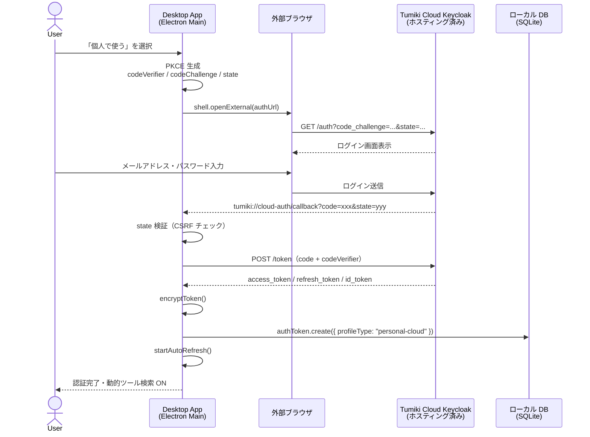
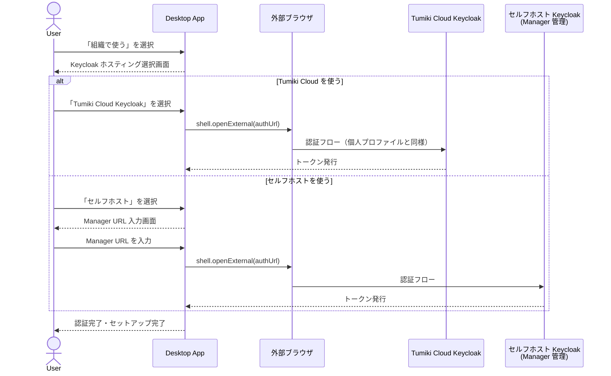
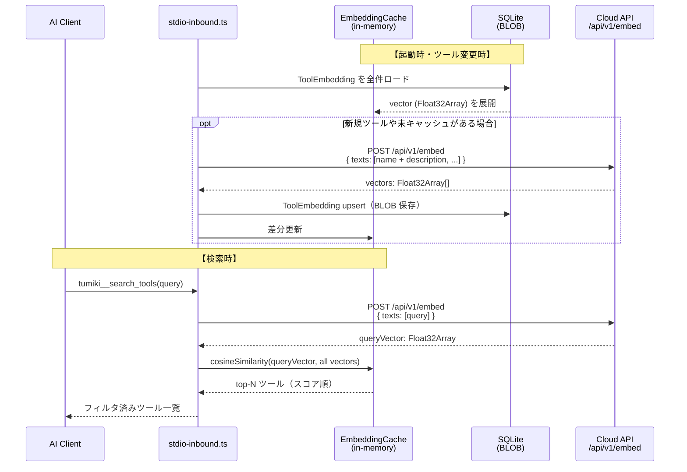
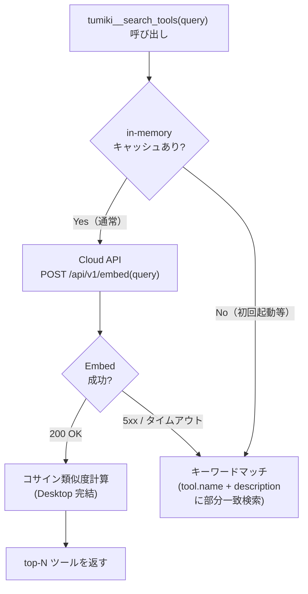
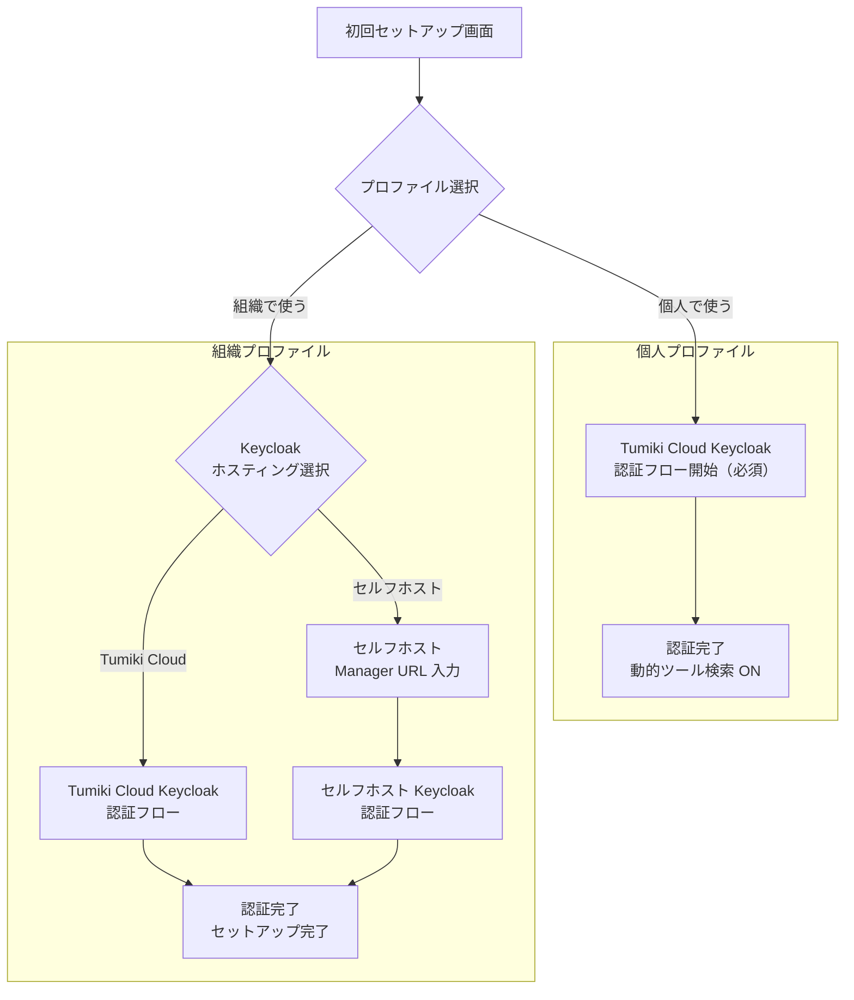

# Dynamic Tool Search — 設計ドキュメント

> 作成日: 2026-05-13  
> 最終更新: 2026-05-14  
> ステータス: 設計中（未実装）

---

## 1. 概要

Tumiki Desktop の個人プロファイルに **Tumiki Cloud Keycloak 認証（全員必須）** を追加し、
認証済みユーザーへ **Embedding ベースの動的ツール検索** を提供する。

ツール記述を事前に Embedding しておき、コサイン類似度で検索する設計とする。
LLM（`generateObject`）を使わないため、検索ごとのコストが発生しない。

組織プロファイルは Keycloak のホスティング先を **Tumiki Cloud（クラウド）か
セルフホスト** から選択できるよう拡張する。

### 技術選定の背景

| 方式 | コスト | レイテンシ | スケーラビリティ | 採用 |
|---|---|---|---|---|
| LLM（generateObject） | 検索ごとに発生 | 高（500ms〜） | ユーザー増でコスト爆発 | ✗ |
| **Embedding + コサイン類似度** | ツール変更時のみ | 低（数ms） | ユーザー数に依存しない | **✓** |
| ハイブリッド（Embedding + LLM rerank） | 中 | 中 | 良好 | 将来の精度改善オプション |
| MCP Sampling | クライアント負担 | クライアント依存 | クライアント対応待ち | 将来の選択肢として保留 |

### 解決する課題

| 課題 | 現状 | 本機能後 |
|---|---|---|
| ツール数爆発 | 全ツールを `tools/list` で返す（コンテキスト圧迫） | メタツールだけ返し、クエリで絞り込む |
| クライアント依存 | MCP Sampling は Claude Desktop のみ確実 | Desktop 完結の Embedding 検索で全クライアント対応 |
| 個人プロファイルの機能不足 | ローカル完結でクラウド機能なし | Keycloak 認証必須化でクラウド機能を提供 |

---

## 2. アーキテクチャ全体図

```
┌─────────────────────────────────────────────────────────────────┐
│  AI Client (Claude Desktop / Codex / Cursor / etc.)             │
│                                                                 │
│  tools/list → [tumiki__search_tools, tumiki__call_tool]         │
│  tools/call  tumiki__search_tools(query="ファイルを読みたい")    │
└────────────────────────┬────────────────────────────────────────┘
                         │ stdio (MCP)
┌────────────────────────▼────────────────────────────────────────┐
│  apps/desktop (Electron Main Process)                           │
│                                                                 │
│  stdio-inbound.ts                                               │
│  ├─ search_tools ハンドラ                                        │
│  │   └─ EmbeddingSearchClient.search(query)                     │
│  │       ├─ Cloud API で query を Embed                          │
│  │       └─ in-memory コサイン類似度計算 → top-N 返却           │
│  └─ call_tool ハンドラ  → ToolAggregator → UpstreamPool         │
│                                                                 │
│  EmbeddingCache（in-memory）                                    │
│  └─ Map<toolName, { vector: Float32Array, toolInfo }>           │
│      ├─ 起動時: SQLite BLOB から復元                             │
│      └─ ツール変更時: Cloud API で再 Embed → BLOB 更新          │
│                                                                 │
│  SQLite（ローカル DB）                                           │
│  └─ ToolEmbedding テーブル（toolName, embedding: BLOB）          │
└────────────────────────┬────────────────────────────────────────┘
                         │ HTTPS + Bearer Token
                         │ （Embed リクエストのみ。検索は Desktop 完結）
┌────────────────────────▼────────────────────────────────────────┐
│  Tumiki Cloud API  (Vercel — Next.js API Routes)                │
│                                                                 │
│  POST /api/v1/embed                                             │
│  ├─ Keycloak JWT 検証                                           │
│  ├─ AI SDK embedMany / embed（text-embedding-3-small 等）        │
│  └─ ベクトル返却（Float32 配列）                                │
└─────────────────────────────────────────────────────────────────┘
```

---

## 3. プロファイル別 認証設計

### 3.1 プロファイル構造の変更方針

```typescript
// 現状（shared/types.ts）
type DesktopProfile = "personal" | "organization"

// personal    → ローカル完結（クラウド機能なし）         ← 変更
// organization → Manager の Keycloak で認証済み          ← 拡張
```

| プロファイル | 変更前 | 変更後 |
|---|---|---|
| `personal` | ローカル完結・認証なし | **Tumiki Cloud Keycloak で認証必須** |
| `organization` | Manager 指定の Keycloak のみ | **Tumiki Cloud or セルフホスト Keycloak を選択** |

### 3.2 個人プロファイルの Keycloak 設定

Tumiki Cloud Keycloak は既にホスティング済み。Desktop 側の設定値は固定値として組み込む。

| 項目 | 値 |
|---|---|
| Issuer | `https://auth.tumiki.app/realms/tumiki-cloud`（固定） |
| Client ID | `tumiki-desktop-personal`（固定） |
| Grant Type | Authorization Code + PKCE |
| Redirect URI | `tumiki://cloud-auth/callback` |
| Scope | `openid profile email offline_access` |
| Token 有効期限 | 15 分（access）/ 30 日（refresh） |

### 3.3 個人プロファイルの認証フロー

個人プロファイルを選択した時点で認証フローを開始する（スキップ不可）。



### 3.4 組織プロファイルの Keycloak 選択フロー



### 3.5 Personal Cloud Profile の状態管理

```typescript
// 追加する型（shared/types.ts）
type PersonalCloudProfile = {
  connectedAt: string
  email: string        // id_token から取得
  displayName: string  // id_token から取得
}

// ProfileState に追加
type ProfileState = {
  activeProfile: DesktopProfile | null
  organizationProfile: OrganizationProfile | null
  personalCloudProfile: PersonalCloudProfile | null  // ← 追加（personal 選択時は必ず設定）
  hasCompletedInitialProfileSetup: boolean
}
```

### 3.6 トークンストレージ

既存の `db.authToken` テーブルをそのまま活用する。  
組織プロファイルのトークンと衝突しないよう `profileType` カラムを追加する。

```prisma
// packages/db/prisma/schema.prisma に追加
model AuthToken {
  id           String   @id @default(cuid())
  profileType  String   @default("organization")  // "organization" | "personal-cloud"
  accessToken  String
  refreshToken String?
  idToken      String?
  expiresAt    DateTime
  createdAt    DateTime @default(now())
}
```

---

## 4. Embedding ベース ツール検索設計

### 4.1 全体フロー



### 4.2 Desktop 側 DB スキーマ（Embedding 保存）

```prisma
// apps/desktop/prisma/schema.prisma に追加
model ToolEmbedding {
  id           String   @id @default(cuid())
  toolName     String   @unique  // "filesystem__read_file"
  serverName   String
  embedding    Bytes    // Float32Array を little-endian バイト列として保存
  modelVersion String   // "text-embedding-3-small" 等
  updatedAt    DateTime @updatedAt
}
```

**BLOB のエンコード・デコード**:
```typescript
// Float32Array → Bytes
const toBlob = (vector: Float32Array): Buffer =>
  Buffer.from(vector.buffer)

// Bytes → Float32Array
const fromBlob = (blob: Buffer): Float32Array =>
  new Float32Array(blob.buffer, blob.byteOffset, blob.byteLength / 4)
```

### 4.3 in-memory キャッシュ設計

```typescript
// apps/desktop/src/main/cloud/embedding-cache.ts

type CachedTool = {
  vector: Float32Array
  toolInfo: McpToolInfo
}

type EmbeddingCache = {
  /** 起動時に SQLite BLOB から全件ロード */
  load: () => Promise<void>
  /** ツール追加・更新（Cloud API で Embed → BLOB 保存 → memory 更新） */
  upsert: (tools: McpToolInfo[]) => Promise<void>
  /** ツール削除 */
  remove: (toolNames: string[]) => void
  /** コサイン類似度で上位 N 件を返す */
  search: (queryVector: Float32Array, topN: number) => McpToolInfo[]
}
```

**コサイン類似度計算**（Cloud API 不要、Desktop 完結）:
```typescript
const cosineSimilarity = (a: Float32Array, b: Float32Array): number => {
  let dot = 0, normA = 0, normB = 0
  for (let i = 0; i < a.length; i++) {
    dot   += a[i] * b[i]
    normA += a[i] * a[i]
    normB += b[i] * b[i]
  }
  return dot / (Math.sqrt(normA) * Math.sqrt(normB))
}
```

### 4.4 キャッシュ更新タイミング

| イベント | アクション |
|---|---|
| アプリ起動 | SQLite から全 Embedding を in-memory にロード |
| MCP サーバー接続完了 | 新規ツールのみ Cloud API で Embed → upsert |
| MCP サーバー切断 | 該当ツールを cache から remove |
| MCP サーバー設定変更 | 変更分のみ再 Embed → upsert |

ツール変更頻度が低いため、**再 Embed コストはほぼ発生しない**。

---

## 5. Cloud API 設計

### 5.1 エンドポイント（Embed のみ）

LLM 呼び出しを完全に排除し、Embedding API のラッパーとして機能する。

```
POST https://cloud.tumiki.app/api/v1/embed
Authorization: Bearer <access_token>
Content-Type: application/json
```

**リクエスト**:
```json
{
  "texts": [
    "filesystem__read_file ファイルを読み込む",
    "github__create_pr プルリクエストを作成する"
  ]
}
```

**レスポンス**:
```json
{
  "vectors": [
    [0.023, -0.145, 0.872, ...],
    [0.101, 0.234, -0.341, ...]
  ],
  "model": "text-embedding-3-small",
  "dimensions": 1536
}
```

### 5.2 Cloud API 実装

```typescript
// Vercel Next.js — app/api/v1/embed/route.ts
import { embed, embedMany } from "ai"
import { openai } from "@ai-sdk/openai"

const model = openai.embedding("text-embedding-3-small")

export const POST = async (req: Request) => {
  // Keycloak JWT 検証（ミドルウェア）
  const { texts } = await req.json()

  const { embeddings } =
    texts.length === 1
      ? { embeddings: [(await embed({ model, value: texts[0] })).embedding] }
      : await embedMany({ model, values: texts })

  return Response.json({ vectors: embeddings, model: "text-embedding-3-small", dimensions: 1536 })
}
```

**選定理由**:
- `text-embedding-3-small`: $0.02 / 100万トークン（LLM の 1/10 以下）
- API 呼び出しはツール変更時 + クエリ時のみ（検索ごとに LLM を呼ばない）
- AI SDK の `embedMany` で複数ツールを一括処理

### 5.3 コスト比較

| 方式 | 100ユーザー × 1000 検索/日 | スケール時の懸念 |
|---|---|---|
| LLM（claude-haiku） | 約 $12.5/日（※） | ユーザー数 × 検索数で線形増加 |
| **Embedding** | 約 $0.02/日（クエリ Embed のみ） | ほぼ定額 |

※ ツール 200 件 × 平均 500 トークン × $0.25/1M tokens

---

## 6. Desktop 側の実装設計

### 6.1 EmbeddingSearchClient（新規）

**配置**: `apps/desktop/src/main/cloud/embedding-search-client.ts`

```typescript
type EmbeddingSearchClient = {
  /** MCP サーバー接続時にツールを登録・Embed */
  registerTools: (tools: McpToolInfo[]) => Promise<void>
  /** MCP サーバー切断時にツールを削除 */
  removeServer: (serverName: string) => void
  /** クエリに近いツールを返す */
  search: (query: string, topN?: number) => Promise<McpToolInfo[]>
}
```

### 6.2 stdio-inbound.ts の変更

```typescript
server.setRequestHandler(ListToolsRequestSchema, async () => {
  if (isDynamicSearchEnabled) {
    return {
      tools: [
        {
          name: "tumiki__search_tools",
          description: "自然言語クエリでツールを検索して候補一覧を返す",
          inputSchema: {
            type: "object",
            properties: {
              query: { type: "string", description: "やりたいことを日本語または英語で記述" },
              limit: { type: "number", default: 10 },
            },
            required: ["query"],
          },
        },
        {
          name: "tumiki__call_tool",
          description: "指定したツールを実行する",
          inputSchema: { ... },
        },
      ],
    }
  }
  // 既存動作（全ツール返却）
  return { tools: await core.listTools() }
})
```

### 6.3 フォールバック戦略

認証は必須のため「未認証」ルートは存在しない。
Cloud API の一時的な障害（Embed API 不達）に備えてキーワードマッチにフォールバックする。



---

## 7. UI フロー



---

## 8. セキュリティ考慮点

| 項目 | 対策 |
|---|---|
| トークン保護 | 既存の `encryptToken` / `decryptToken` をそのまま利用 |
| ツール定義の送信 | tool.name + tool.description のみ Embed（inputSchema は送らない） |
| PKCE 必須 | 既存の `generateCodeVerifier` / `generateCodeChallenge` を流用 |
| state 検証 | CSRF 対策は既存ロジックと同一パターン |
| Cloud API の JWT 検証 | Keycloak の公開鍵で署名検証（JWKS endpoint 利用） |
| Embedding モデルの API キー | Cloud API 側のみ保持（Desktop に漏洩しない） |

---

## 9. 実装フェーズ

### Phase 1 — 認証基盤

- [ ] `personalCloudProfile` 型追加（`shared/types.ts`）
- [ ] `AuthToken` テーブルに `profileType` カラム追加（DB マイグレーション）
- [ ] `profile-store.ts` に `connectPersonalCloud` / `disconnectPersonalCloud` 追加
- [ ] `cloud-oauth-manager.ts` 作成（既存 `oauth-manager.ts` をベースに Tumiki Cloud 向け固定設定）
- [ ] 組織プロファイルに Keycloak ホスティング選択 UI 追加
- [ ] IPC ハンドラ追加（`ipc/cloud-auth.ts`）
- [ ] UI: 個人プロファイル選択時に Keycloak 認証を自動開始

### Phase 2 — Cloud API 構築（Vercel）

- [ ] `POST /api/v1/embed` 実装（embedMany ラッパー）
- [ ] Keycloak JWT 検証ミドルウェア
- [ ] Vercel へのデプロイ

### Phase 3 — Embedding キャッシュ基盤（Desktop）

- [ ] `ToolEmbedding` テーブル追加（DB マイグレーション）
- [ ] `toBlob` / `fromBlob` ユーティリティ実装
- [ ] `EmbeddingCache`（in-memory）実装
- [ ] 起動時の SQLite → memory ロード処理
- [ ] MCP サーバー接続・切断イベントとの連携（upsert / remove）

### Phase 4 — 動的ツール検索統合

- [ ] `EmbeddingSearchClient` 作成（`apps/desktop/src/main/cloud/`）
- [ ] `stdio-inbound.ts` に `tumiki__search_tools` / `tumiki__call_tool` 追加
- [ ] `ProxyHooks` に `EmbeddingSearchClient` 注入
- [ ] フォールバック（キーワードマッチ）実装

### Phase 5 — 精度改善（任意・将来）

- [ ] ハイブリッド: Embedding 上位候補を LLM で rerank
- [ ] MCP Sampling 対応クライアントが普及したら Sampling オプション追加

---

## 10. 未決事項

| 項目 | 検討内容 |
|---|---|
| Embedding モデル選択 | `text-embedding-3-small`（低コスト）vs `text-embedding-3-large`（高精度）|
| ベクトル次元数 | 1536（small）or 3072（large）→ BLOB サイズと精度のトレードオフ |
| ツール定義の送信範囲 | description のみか inputSchema まで含めるか（精度 vs プライバシー） |
| `tumiki__call_tool` の必要性 | AI Client が直接 prefixed tool を呼べる場合は不要 |
| 個人ユーザーの課金モデル | 将来的な Pro プランへの誘導設計 |
