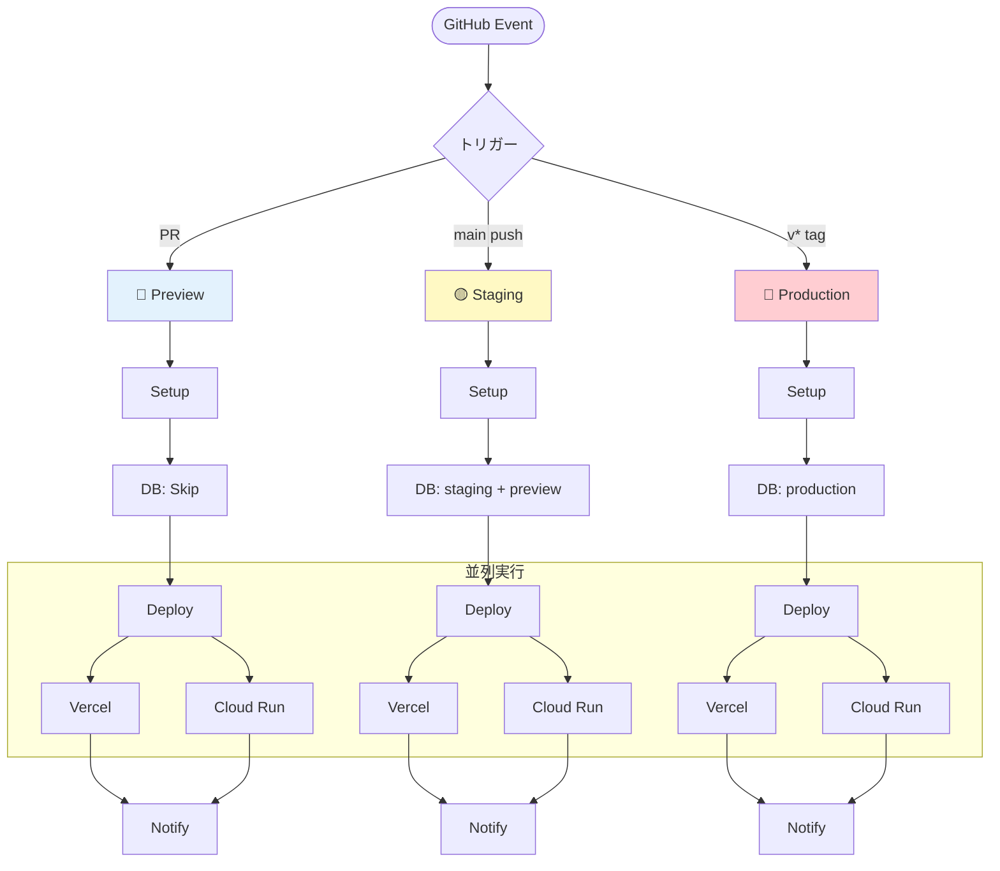

# Tumiki デプロイメントワークフロー

## 📊 全体フロー



## 🔄 デプロイフロー

### トリガー → 環境判定

| トリガー | 環境 | DB Migration | Cloud Run |
|---------|------|-------------|-----------|
| PR作成/更新 | Preview | なし | PRごとのサービス作成 |
| **PR クローズ** | - | - | **PRサービス自動削除** |
| main push | Staging | staging + preview DB | staging サービス更新 |
| v* tag | Production | production DB | production サービス更新 |

### ジョブの流れ

1. **Setup**: 環境を判定（preview/staging/production）
2. **Migrate DB**: データベースマイグレーション（previewはスキップ）
3. **Deploy**: Vercel と Cloud Run に並列デプロイ
4. **Notify**: 結果をSlackに通知

## 🎯 各環境の詳細

### 🔵 Preview環境
- **目的**: PR確認・コードレビュー
- **DB**: なし（マイグレーションスキップ）
- **デプロイ先**:
  - Vercel: 一時プレビューURL
  - Cloud Run: `tumiki-mcp-proxy-preview` サービス

### 🟡 Staging環境
- **目的**: 統合テスト・QA
- **DB**: staging DB + preview DB の両方をマイグレート
- **デプロイ先**:
  - Vercel: staging URL
  - Cloud Run: `tumiki-mcp-proxy-staging` サービス

### 🔴 Production環境
- **目的**: 本番リリース
- **DB**: production DB のみマイグレート
- **デプロイ先**:
  - Vercel: production URL
  - Cloud Run: `tumiki-mcp-proxy-production` サービス (`https://server.tumiki.cloud`)

## 🌐 Cloud Run サービス一覧

| サービス名 | 環境 | カスタムドメイン | URL形式 | 用途 |
|-----------|-----|----------------|---------|------|
| `tumiki-mcp-proxy-pr-{PR番号}` | Preview | なし | `https://tumiki-mcp-proxy-pr-{PR番号}-*.a.run.app` | PR確認（PRごとに個別） |
| `tumiki-mcp-proxy-staging` | Staging | `https://stg-server.tumiki.cloud` | `https://tumiki-mcp-proxy-staging-*.a.run.app` | 統合テスト |
| `tumiki-mcp-proxy-production` | Production | `https://server.tumiki.cloud` | `https://server.tumiki.cloud` | 本番環境 |

**重要**:
- **Preview環境**: 各PRごとに独立したCloud Runサービスを作成（例: PR #372 → `tumiki-mcp-proxy-pr-372`）
  - 複数のPRが同時に存在可能
  - カスタムドメインは使用せず、自動生成URLを使用
  - **PRクローズ時に自動的にCloud Runサービスを削除**（`cleanup-pr.yml` ワークフローで実行）
- **Staging/Production環境**: 固定のCloud Runサービスを使用
  - **カスタムドメインは初回デプロイ時に自動設定されます**（GitHub Actionsで実行）
  - DNS設定が必要な場合は、デプロイログに手順が表示されます

## 📦 デプロイ処理の詳細

### Vercel
1. パッケージビルド（db, utils, tsup-config）
2. `vercel deploy [--prod]` 実行
3. デプロイURLを抽出・出力

**実装**: `.github/actions/deploy-vercel/action.yml` (46行)

### Cloud Run
1. GCP認証 & Docker設定
2. Dockerイメージビルド & プッシュ
3. Cloud Runデプロイ（環境変数、Secrets、VPC設定）
4. **カスタムドメイン自動設定** 🆕
   - 各環境にカスタムドメインを自動マッピング
   - DNS設定が必要な場合は手順を表示
   - SSL証明書の自動プロビジョニング
5. ヘルスチェック（最大5回リトライ）

**実装**: `.github/actions/deploy-cloudrun/action.yml` (255行)

**セキュリティ**:
- Secret Manager: DATABASE_URL, REDIS_URL等
- VPC Connector経由でプライベートDB接続
- サービスアカウント権限管理

## 🛠️ ローカルデプロイ

### Vercel
```bash
vercel login
vercel deploy --prod
```

### Cloud Run
```bash
# ビルド & プッシュ
docker build -t asia-northeast1-docker.pkg.dev/$PROJECT/tumiki/mcp-proxy:latest \
  -f apps/mcp-proxy/Dockerfile .
docker push asia-northeast1-docker.pkg.dev/$PROJECT/tumiki/mcp-proxy:latest

# デプロイ
gcloud run deploy tumiki-mcp-proxy-production \
  --image=asia-northeast1-docker.pkg.dev/$PROJECT/tumiki/mcp-proxy:latest \
  --region=asia-northeast1
```

## 🔍 トラブルシューティング

### 確認手順
1. GitHub Actionsのログを確認
2. 失敗したジョブを特定
3. エラーメッセージを確認

### チェックリスト
- [ ] GitHub Secretsが正しく設定されているか
- [ ] GCPサービスアカウントの権限が適切か
- [ ] Vercel Tokenが有効か
- [ ] データベース接続情報が正しいか
- [ ] Dockerイメージのビルドが成功しているか

## ⚙️ Vercel環境変数の設定

### Preview環境

Preview環境では、各PRごとに異なるCloud Run URLが生成されるため、**Vercel環境変数の自動設定は困難**です。

**対応方法**:
1. **ローカル開発**: `http://localhost:8080` を使用
2. **PR環境**: 自動生成されたCloud Run URLを確認し、必要に応じて手動設定
   - URLはGitHub ActionsのCloud Runデプロイログに表示されます
   - 例: `https://tumiki-mcp-proxy-pr-372-xxxxx.a.run.app`

### Staging/Production環境

カスタムドメインを使用することで、URLが固定され、**環境変数の再設定が不要**になります。

| 環境 | 変数名 | 値（カスタムドメイン） |
|-----|-------|---------------------|
| Production | `NEXT_PUBLIC_MCP_PROXY_URL` | `https://server.tumiki.cloud` |

**利点**:
- ✅ 1回設定すれば、以降の手動設定が不要
- ✅ URLが変更されないため、安定した運用が可能
- ✅ GitHub Actionsで自動的にカスタムドメインが設定される

**前提条件**: DNS設定が必要（初回のみ）
詳細は [Vercel環境変数セットアップガイド](../../docs/vercel-environment-setup.md) を参照

## 🧹 PR環境のクリーンアップ

PRをクローズ（マージまたは単なるクローズ）すると、自動的にCloud Runサービスが削除されます。

### 動作

1. **トリガー**: PRのクローズ（`pull_request.closed` イベント）
2. **処理**: 対応するCloud Runサービス（`tumiki-mcp-proxy-pr-{PR番号}`）を削除
3. **結果**: リソースが自動的にクリーンアップされ、コストを削減

### ワークフロー

実装: `.github/workflows/cleanup-pr.yml`

```yaml
on:
  pull_request:
    types: [closed]
```

**利点**:
- ✅ PRクローズ時に自動的にリソースを削除
- ✅ 手動クリーンアップが不要
- ✅ コスト削減（使用していないサービスを削除）

## 📚 関連ドキュメント

- [deploy-vercel action](../actions/deploy-vercel/action.yml)
- [deploy-cloudrun action](../actions/deploy-cloudrun/action.yml)
- [cleanup-pr workflow](../workflows/cleanup-pr.yml) 🆕
- [Vercel環境変数セットアップ](../../docs/vercel-environment-setup.md) ⚠️ **重要**
- [Cloud Run デプロイメントガイド](../../docs/cloudrun-mcp-proxy-deployment.md)
- [MCP Proxy README](../../apps/mcp-proxy/README.md)

## ✨ 特徴

- **シンプル**: 各アクション46-175行、scripts/不要
- **並列**: Vercel と Cloud Run が同時実行
- **安全**: DBマイグレーション後にデプロイ
- **可視化**: Slack通知で即座に結果確認
