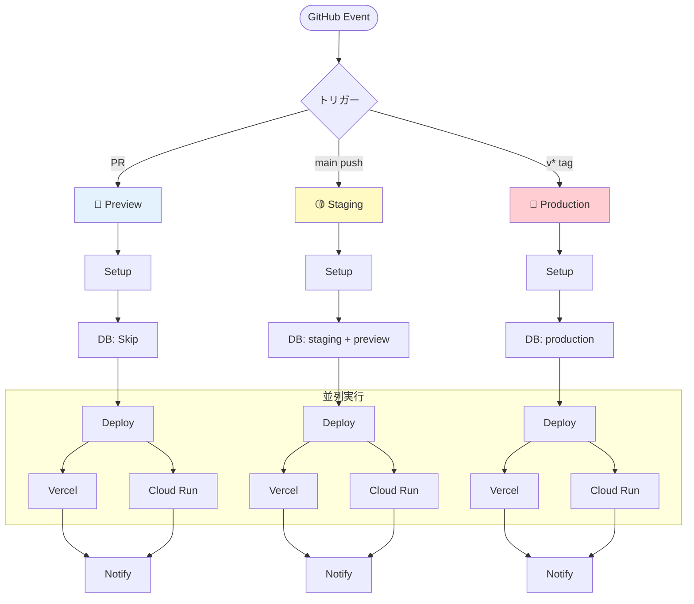

# Tumiki デプロイメントワークフロー

## 📊 全体フロー


```mermaid
graph TB
    Start([GitHub Event]) --> Trigger{トリガー}

    Trigger -->|PR| Preview[🔵 Preview]
    Trigger -->|main push| Staging[🟡 Staging]
    Trigger -->|v* tag| Production[🔴 Production]

    Preview --> PSetup[Setup]
    Staging --> SSetup[Setup]
    Production --> PrSetup[Setup]

    PSetup --> PSkip[DB: Skip]
    SSetup --> SMigrate[DB: staging + preview]
    PrSetup --> PrMigrate[DB: production]

    PSkip --> PDeploy[Deploy]
    SMigrate --> SDeploy[Deploy]
    PrMigrate --> PrDeploy[Deploy]

    subgraph "並列実行"
        PDeploy --> PVercel[Vercel]
        PDeploy --> PCR[Cloud Run]

        SDeploy --> SVercel[Vercel]
        SDeploy --> SCR[Cloud Run]

        PrDeploy --> PrVercel[Vercel]
        PrDeploy --> PrCR[Cloud Run]
    end

    PVercel --> PNotify[Notify]
    PCR --> PNotify
    SVercel --> SNotify[Notify]
    SCR --> SNotify
    PrVercel --> PrNotify[Notify]
    PrCR --> PrNotify

    style Preview fill:#e3f2fd
    style Staging fill:#fff9c4
    style Production fill:#ffcdd2
```

## 🔄 デプロイフロー

### トリガー → 環境判定

| トリガー | 環境 | DB Migration |
|---------|------|-------------|
| PR作成/更新 | Preview | なし |
| main push | Staging | staging + preview DB |
| v* tag | Production | production DB |

### ジョブの流れ

1. **Setup**: 環境を判定（preview/staging/production）
2. **Migrate DB**: データベースマイグレーション（previewはスキップ）
3. **Deploy**: Vercel と Cloud Run に並列デプロイ
4. **Notify**: 結果をSlackに通知

## 🎯 各環境の詳細

### 🔵 Preview環境
- **目的**: PR確認・コードレビュー
- **DB**: なし（Cloud RunはstagingのDBを参照）
- **デプロイ先**: Vercel（一時URL）、Cloud Run（staging環境）

### 🟡 Staging環境
- **目的**: 統合テスト・QA
- **DB**: staging DB + preview DB の両方をマイグレート
- **デプロイ先**: Vercel（staging）、Cloud Run（staging）

### 🔴 Production環境
- **目的**: 本番リリース
- **DB**: production DB のみマイグレート
- **デプロイ先**: Vercel（production）、Cloud Run（production）

## 📦 デプロイ処理の詳細

### Vercel
1. パッケージビルド（db, utils, tsup-config）
2. `vercel deploy [--prod]` 実行
3. デプロイURLを抽出・出力

**実装**: `.github/actions/deploy-vercel/action.yml` (46行)

### Cloud Run
1. GCP認証 & Docker設定
2. Dockerイメージビルド & プッシュ
3. Cloud Runデプロイ（環境変数、Secrets、VPC設定）
4. ヘルスチェック（最大5回リトライ）

**実装**: `.github/actions/deploy-cloudrun/action.yml` (175行)

**セキュリティ**:
- Secret Manager: DATABASE_URL, REDIS_URL等
- VPC Connector経由でプライベートDB接続
- サービスアカウント権限管理

## 🛠️ ローカルデプロイ

### Vercel
```bash
vercel login
vercel deploy --prod
```

### Cloud Run
```bash
# ビルド & プッシュ
docker build -t asia-northeast1-docker.pkg.dev/$PROJECT/tumiki/mcp-proxy:latest \
  -f apps/mcp-proxy/Dockerfile .
docker push asia-northeast1-docker.pkg.dev/$PROJECT/tumiki/mcp-proxy:latest

# デプロイ
gcloud run deploy tumiki-mcp-proxy-production \
  --image=asia-northeast1-docker.pkg.dev/$PROJECT/tumiki/mcp-proxy:latest \
  --region=asia-northeast1
```

## 🔍 トラブルシューティング

### 確認手順
1. GitHub Actionsのログを確認
2. 失敗したジョブを特定
3. エラーメッセージを確認

### チェックリスト
- [ ] GitHub Secretsが正しく設定されているか
- [ ] GCPサービスアカウントの権限が適切か
- [ ] Vercel Tokenが有効か
- [ ] データベース接続情報が正しいか
- [ ] Dockerイメージのビルドが成功しているか

## 📚 関連ドキュメント

- [deploy-vercel action](../actions/deploy-vercel/action.yml)
- [deploy-cloudrun action](../actions/deploy-cloudrun/action.yml)
- [Cloud Run デプロイメントガイド](../../docs/cloudrun-mcp-proxy-deployment.md)
- [MCP Proxy README](../../apps/mcp-proxy/README.md)

## ✨ 特徴

- **シンプル**: 各アクション46-175行、scripts/不要
- **並列**: Vercel と Cloud Run が同時実行
- **安全**: DBマイグレーション後にデプロイ
- **可視化**: Slack通知で即座に結果確認
