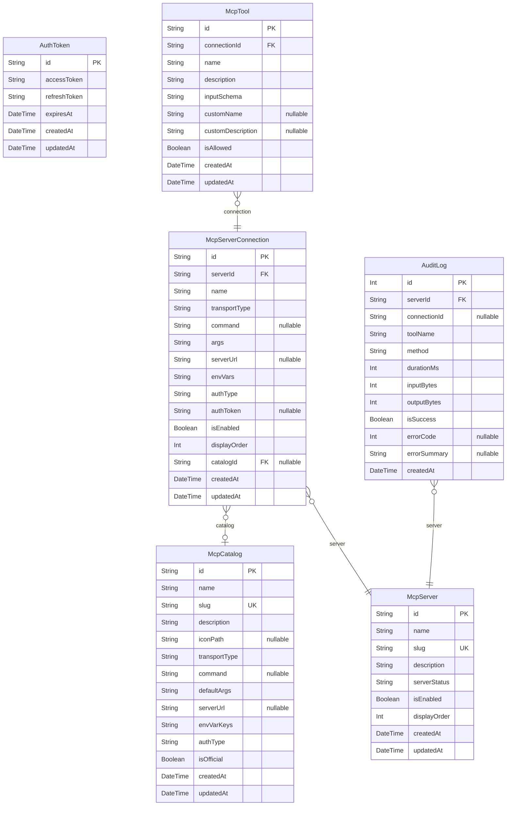

# Desktop DB Schema

> Generated by [`prisma-markdown`](https://github.com/samchon/prisma-markdown)

- [default](#default)

## default

### `AuthToken`

**Properties**

- `id`:
- `accessToken`:
- `refreshToken`:
- `expiresAt`:
- `createdAt`:
- `updatedAt`:

### `McpCatalog`

**Properties**

- `id`:
- `name`:
- `slug`:
- `description`:
- `iconPath`:
- `transportType`:
- `command`:
- `defaultArgs`:
- `serverUrl`:
- `envVarKeys`:
- `authType`:
- `isOfficial`:
- `createdAt`:
- `updatedAt`:

### `McpServer`

**Properties**

- `id`:
- `name`:
- `slug`:
- `description`:
- `serverStatus`:
- `isEnabled`:
- `displayOrder`:
- `createdAt`:
- `updatedAt`:

### `McpServerConnection`

**Properties**

- `id`:
- `serverId`:
- `name`:
- `transportType`:
- `command`:
- `args`:
- `serverUrl`:
- `envVars`:
- `authType`:
- `authToken`:
- `isEnabled`:
- `displayOrder`:
- `catalogId`:
- `createdAt`:
- `updatedAt`:

### `McpTool`

**Properties**

- `id`:
- `connectionId`:
- `name`:
- `description`:
- `inputSchema`:
- `customName`:
- `customDescription`:
- `isAllowed`:
- `createdAt`:
- `updatedAt`:

### `AuditLog`

**Properties**

- `id`:
- `serverId`:
- `connectionId`:
- `toolName`:
- `method`:
- `durationMs`:
- `inputBytes`:
- `outputBytes`:
- `isSuccess`:
- `errorCode`:
- `errorSummary`:
- `createdAt`:
