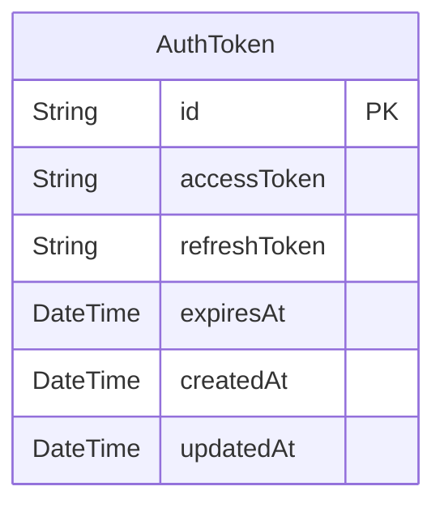
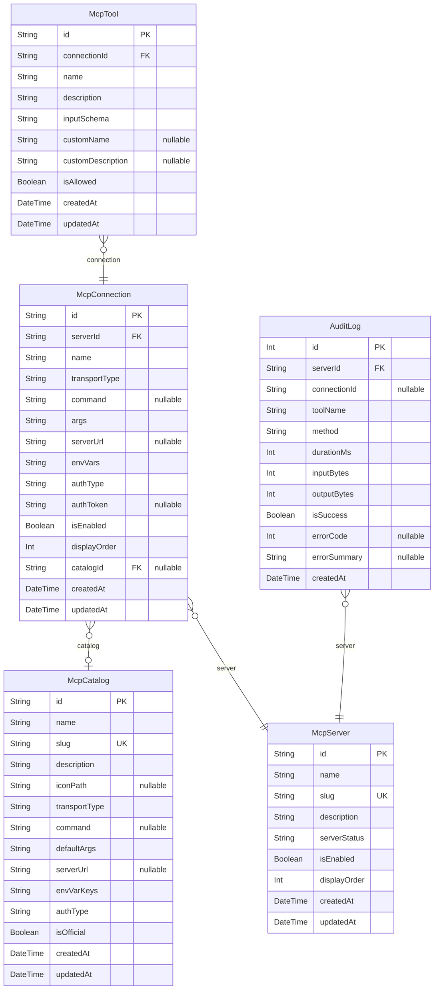

# Desktop DB Schema

> Generated by [`prisma-markdown`](https://github.com/samchon/prisma-markdown)

- [Auth](#auth)
- [McpServer](#mcpserver)

## Auth

### `AuthToken`

認証トークン

**Properties**

- `id`:
- `accessToken`: アクセストークン
- `refreshToken`: リフレッシュトークン
- `expiresAt`: トークンの有効期限
- `createdAt`:
- `updatedAt`:

## McpServer

### `McpCatalog`

MCPカタログ（プリセットMCPサーバーのテンプレート）

**Properties**

- `id`:
- `name`: カタログ表示名
- `slug`: URL識別子（小文字・ハイフン区切り）
- `description`: カタログ説明
- `iconPath`: アイコンパス
- `transportType`: トランスポートタイプ: "stdio" | "sse" | "streamable_http"
- `command`: STDIO用デフォルトコマンド
- `defaultArgs`: STDIO用デフォルト引数（JSON配列文字列）
- `serverUrl`: SSE/Streamable HTTP用デフォルトURL
- `envVarKeys`: 必要な環境変数キー名（JSON配列文字列）
- `authType`: 認証タイプ: "none" | "bearer" | "api_key" | "oauth"
- `isOfficial`: 公式カタログフラグ
- `createdAt`:
- `updatedAt`:

### `McpServer`

MCPサーバー（仮想・統合サーバー = Proxyエンドポイント）
1つ以上のMcpConnectionを束ねて1つのMCPサーバーとして公開する

**Properties**

- `id`:
- `name`: サーバー表示名
- `slug`: URL識別子（小文字・ハイフン区切り）
- `description`: サーバー説明
- `serverStatus`: サーバー状態: "running" | "stopped" | "error" | "pending"
- `isEnabled`: 有効/無効フラグ（トグル用）
- `displayOrder`: 一覧画面での表示順序
- `createdAt`:
- `updatedAt`:

### `McpConnection`

MCP接続（個別のMCPサーバーへの接続設定）
SaaS側の McpServerTemplateInstance + McpConfig に対応

**Properties**

- `id`:
- `serverId`: 所属するMcpServerのID
- `name`: 接続表示名
- `transportType`: トランスポートタイプ: "stdio" | "sse" | "streamable_http"
- `command`: STDIO用コマンド（例: "npx", "uvx", "node"）
- `args`: STDIO用引数（JSON配列文字列）
- `serverUrl`: SSE/Streamable HTTP接続先URL
- `envVars`: 環境変数（JSON object文字列）
- `authType`: 認証タイプ: "none" | "bearer" | "api_key" | "oauth"
- `authToken`: 認証トークン/APIキー
- `isEnabled`: 有効/無効フラグ
- `displayOrder`: 統合サーバー内での表示順序
- `catalogId`: カタログ参照（カタログから登録した場合）
- `createdAt`:
- `updatedAt`:

### `McpTool`

MCPツール（接続が提供するツールの定義・権限管理）

**Properties**

- `id`:
- `connectionId`: 対象MCP接続ID
- `name`: ツール名（大元のMCPから取得、ルーティングに使用）
- `description`: ツール説明（大元のMCPから取得）
- `inputSchema`: 入力スキーマ（JSON Schema文字列）
- `customName`: カスタム表示名（nullなら元のnameを使用）
- `customDescription`: カスタム説明（nullなら元のdescriptionを使用）
- `isAllowed`: ツールの使用を許可するか
- `createdAt`:
- `updatedAt`:

### `AuditLog`

監査ログ（MCPツール呼び出しの記録）
7日以上のレコードは自動削除対象

**Properties**

- `id`:
- `serverId`: 対象MCPサーバーID
- `connectionId`: 対象MCP接続ID（接続削除後もログ保持のためリレーション未定義）
- `toolName`: 実行されたツール名
- `method`: MCPメソッド（例: "tools/call", "resources/read"）
- `durationMs`: 実行時間（ミリ秒）
- `inputBytes`: 入力データサイズ（バイト）
- `outputBytes`: 出力データサイズ（バイト）
- `isSuccess`: 成功/失敗フラグ
- `errorCode`: MCPエラーコード（エラー時のみ）
- `errorSummary`: エラーメッセージ要約
- `createdAt`:
