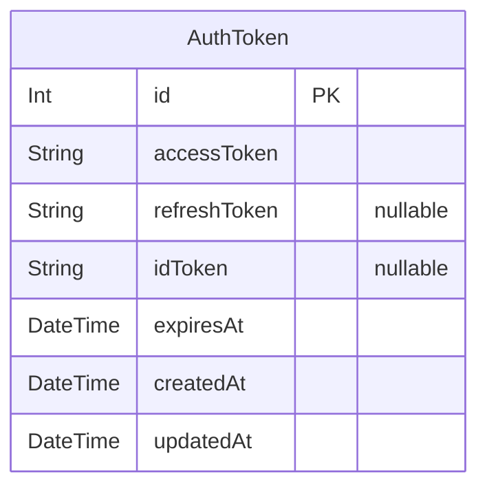
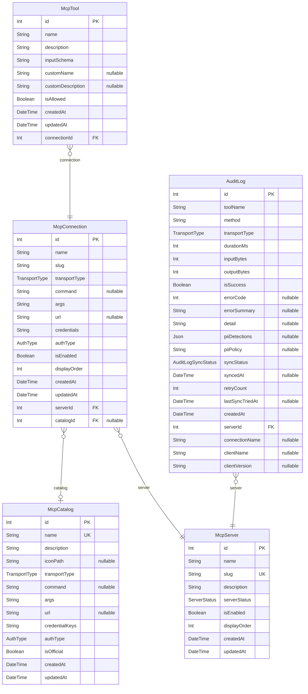
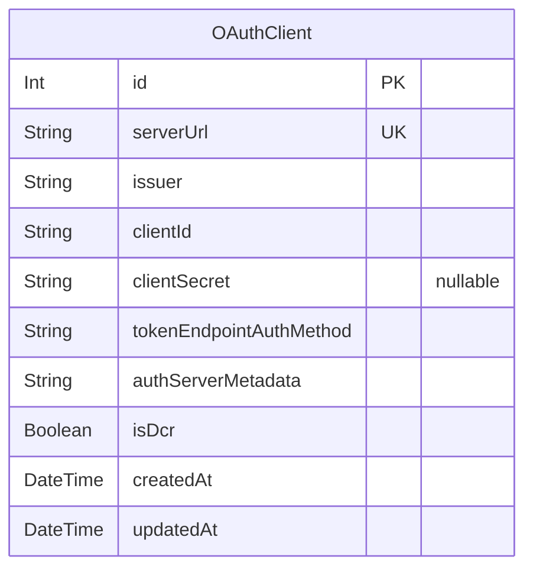

# Desktop DB Schema
> Generated by [`prisma-markdown`](https://github.com/samchon/prisma-markdown)

- [Auth](#auth)
- [McpServer](#mcpserver)
- [OAuth](#oauth)

## Auth

### `AuthToken`
認証トークン

**Properties**
  - `id`: 
  - `accessToken`: 暗号化されたアクセストークン
  - `refreshToken`: 暗号化されたリフレッシュトークン（jackson OIDC IdP は返さないため nullable）
  - `idToken`: 暗号化されたIDトークン（OIDCログアウト用）
  - `expiresAt`: トークンの有効期限
  - `createdAt`: 
  - `updatedAt`: 

## McpServer

### `McpCatalog`
MCPカタログ（プリセットMCPサーバーのテンプレート）

**Properties**
  - `id`: 
  - `name`: カタログ表示名
  - `description`: カタログ説明
  - `iconPath`: アイコンパス
  - `transportType`: トランスポートタイプ
  - `command`: STDIO用コマンド
  - `args`: STDIO用引数（JSON配列文字列）
  - `url`: SSE/Streamable HTTP用URL
  - `credentialKeys`: 必要な設定キー名（STDIO: 環境変数キー / SSE・Streamable HTTP: ヘッダー名、JSON配列文字列）
  - `authType`: 認証タイプ
  - `isOfficial`: 公式カタログフラグ
  - `createdAt`: 
  - `updatedAt`: 

### `McpConnection`
MCP接続（個別のMCPサーバーへの接続設定）

**Properties**
  - `id`: 
  - `name`: 接続表示名
  - `slug`: URL識別子（小文字・ハイフン区切り）
  - `transportType`: トランスポートタイプ
  - `command`: STDIO用コマンド（例: "npx", "uvx", "node"）
  - `args`: STDIO用引数（JSON配列文字列）
  - `url`: SSE/Streamable HTTP用URL
  - `credentials`: 接続設定値（STDIO: 環境変数 / SSE・Streamable HTTP: HTTPヘッダー）
  - `authType`: 認証タイプ
  - `isEnabled`: 有効/無効フラグ
  - `displayOrder`: 統合サーバー内での表示順序
  - `createdAt`: 
  - `updatedAt`: 
  - `serverId`: 所属するMcpServer
  - `catalogId`: カタログ参照（カタログから登録した場合）

### `McpTool`
MCPツール（接続が提供するツールの定義・権限管理）

**Properties**
  - `id`: 
  - `name`: ツール名（大元のMCPから取得、ルーティングに使用）
  - `description`: ツール説明（大元のMCPから取得）
  - `inputSchema`: 入力スキーマ（JSON Schema文字列）
  - `customName`: カスタム表示名（nullなら元のnameを使用）
  - `customDescription`: カスタム説明（nullなら元のdescriptionを使用）
  - `isAllowed`: ツールの使用を許可するか
  - `createdAt`: 
  - `updatedAt`: 
  - `connectionId`: 対象MCP接続

### `McpServer`
MCPサーバー（仮想・統合サーバー = Proxyエンドポイント）
1つ以上のMcpConnectionを束ねて1つのMCPサーバーとして公開する

**Properties**
  - `id`: 
  - `name`: サーバー表示名
  - `slug`: URL識別子（小文字・ハイフン区切り）
  - `description`: サーバー説明
  - `serverStatus`: サーバー状態
  - `isEnabled`: 有効/無効フラグ（トグル用）
  - `displayOrder`: 一覧画面での表示順序
  - `createdAt`: 
  - `updatedAt`: 

### `AuditLog`
監査ログ（MCPツール呼び出しの記録）
7日以上のレコードは自動削除対象

**Properties**
  - `id`: 
  - `toolName`: 実行されたツール名
  - `method`: MCPメソッド（例: "tools/call", "resources/read"）
  - `transportType`: リクエスト時のトランスポートタイプ
  - `durationMs`: 実行時間（ミリ秒）
  - `inputBytes`: 入力データサイズ（バイト）
  - `outputBytes`: 出力データサイズ（バイト）
  - `isSuccess`: 成功/失敗フラグ
  - `errorCode`: MCPエラーコード（エラー時のみ）
  - `errorSummary`: エラーメッセージ要約
  - `detail`: 操作の補足情報（例: 引数の概要やリソースパス等）
  - `piiDetections`
    > PII マスキング検出記録 { summary: { TYPE: { count, tokens } }, maskedArgs: {...} }
    > summary は type 別の件数とマスク後トークン、maskedArgs は upstream に渡された args 全体
    > null の場合はフィルタ無効 or 検出なし
  - `piiPolicy`
    > 検出時に適用したマスキングポリシー（mask / detect-only / block）
    > null の場合はフィルタ無効
  - `syncStatus`: 管理サーバーへの同期状態
  - `syncedAt`: 管理サーバーへの同期完了日時
  - `retryCount`: 管理サーバーへの同期試行回数
  - `lastSyncTriedAt`: 最後の同期試行日時
  - `createdAt`: 
  - `serverId`: 対象MCPサーバー
  - `connectionName`: 対象MCP接続名（接続削除後もログで識別可能にするため名前で保持）
  - `clientName`: AIクライアント名（例: "claude-code", "cursor"）
  - `clientVersion`: AIクライアントバージョン

## OAuth

### `OAuthClient`
OAuthクライアント登録キャッシュ（DCR結果）
MCP OAuth認証時のDynamic Client Registration結果をキャッシュし、再登録を回避する

**Properties**
  - `id`: 
  - `serverUrl`: MCPサーバーURL（正規化済み、認可サーバー特定用）
  - `issuer`: OAuth Authorization Server issuer URL
  - `clientId`: DCRで取得したクライアントID（暗号化済み）
  - `clientSecret`: DCRで取得したクライアントシークレット（暗号化済み、パブリッククライアントの場合null）
  - `tokenEndpointAuthMethod`: トークンエンドポイントの認証方式
  - `authServerMetadata`: Authorization Server Metadata（JSON文字列）
  - `isDcr`: DCRで自動登録されたクライアントかどうか（falseの場合はユーザー手動入力）
  - `createdAt`: 
  - `updatedAt`: 