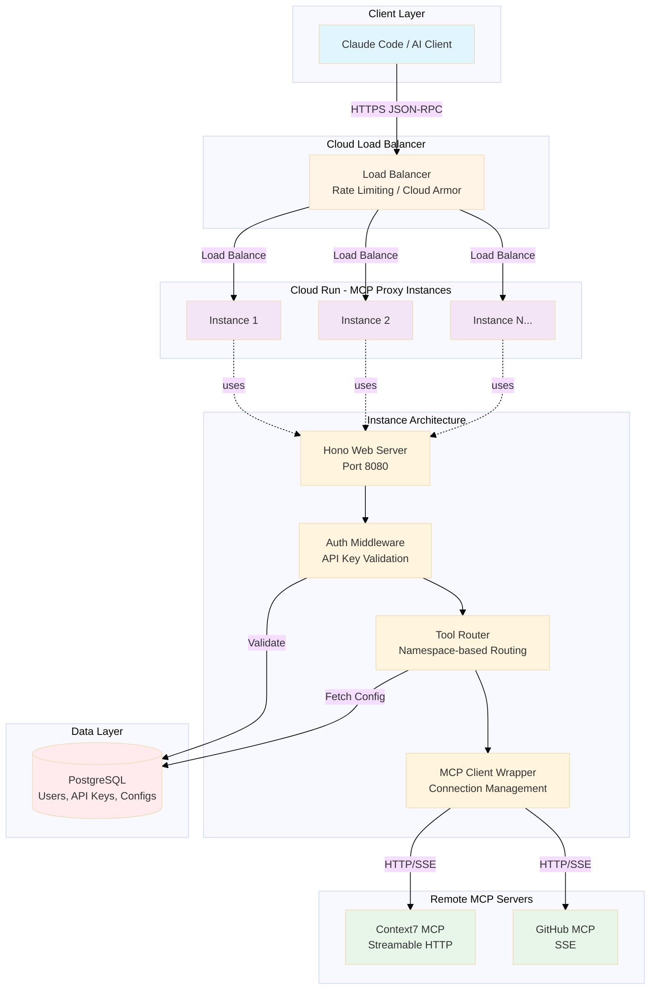
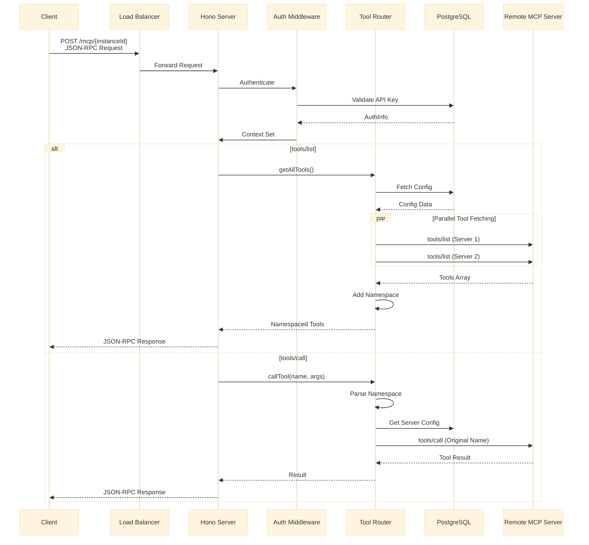

# MCP Proxy System Architecture

## 目次

1. [概要](#概要)
2. [システムアーキテクチャ](#システムアーキテクチャ)
3. [コンポーネント構成](#コンポーネント構成)
4. [データフロー](#データフロー)
5. [認証・認可](#認証認可)
6. [キャッシュ戦略](#キャッシュ戦略)
7. [デプロイ構成](#デプロイ構成)
8. [セキュリティ](#セキュリティ)
9. [パフォーマンス最適化](#パフォーマンス最適化)
10. [監視とログ](#監視とログ)

---

## 概要

MCP Proxyは、複数のリモートMCPサーバーを統合し、単一のHTTPエンドポイントで公開するプロキシサーバーです。Google Cloud Run上でのデプロイを想定したステートレス設計により、水平スケーリングとスケールtoゼロを実現します。

### 主要な設計原則

- **完全ステートレス**: 接続プールなし、水平スケーリング対応
- **マルチトランスポート**: Streamable HTTP, SSE（STDIOは未サポート）
- **名前空間ルーティング**: 複数MCPサーバーの統合管理
- **設定取得**: キャッシュ無効化中のためDBから直接取得
- **APIキー認証**: データベースベースの認証・認可

---

## システムアーキテクチャ



### アーキテクチャの特性

| 特性                 | 説明                                        |
| -------------------- | ------------------------------------------- |
| **ステートレス**     | リクエストごとに接続作成・破棄              |
| **自動スケーリング** | Cloud Runによる水平スケール、スケールtoゼロ |
| **高可用性**         | マルチリージョン配置可能                    |
| **挙動の単純性**     | 設定は毎回DBから取得し、整合性を優先        |

---

## コンポーネント構成

### 1. Webサーバー層 (Hono)

**責務**: HTTPリクエストの受付とルーティング

**主要エンドポイント**:

- `GET /health` - ヘルスチェック
- `POST /mcp/:mcpServerId` - JSON-RPC 2.0処理

**特徴**: 軽量(50KB)、高速、CORS対応

### 2. 認証ミドルウェア

**責務**: APIキーの検証とユーザー識別

**フロー**: API Key検証 → DB照会 → Context設定 → ハンドラ継続

### 3. ツールルーター

**責務**: 名前空間ベースのツールルーティング

**名前空間システム**: `context7.resolve-library-id` → `resolve-library-id`

**主要メソッド**:

- `getAllTools()` - 全MCPサーバーのツールリスト
- `getToolsByNamespace()` - 特定名前空間のツール
- `callTool()` - ツール実行

### 4. MCP クライアント

**責務**: リモートMCPサーバーへの接続管理

**サポートトランスポート**:

| トランスポート      | 用途               | 特徴                     |
| ------------------- | ------------------ | ------------------------ |
| **Streamable HTTP** | リモートMCP (推奨) | 低レイテンシ、双方向通信 |
| **SSE**             | レガシー対応       | 広い互換性               |
| **Stdio**           | 現在未サポート     | 設定時はエラー           |

**接続方式**: 設定された `transportType` をそのまま使用（HTTP→SSE自動フォールバックは未実装）

### 5. 設定マネージャー

**責務**: MCPサーバー設定の取得と管理

**クエリ最適化**: 5階層ネスト → 2クエリ分割により50-66%高速化

---

## データフロー

### リクエストフロー全体



### initialize ハンドシェイク

MCPプロトコルの初期化フロー:

```json
// Request
{
  "jsonrpc": "2.0",
  "id": 1,
  "method": "initialize",
  "params": {
    "protocolVersion": "2024-11-05",
    "capabilities": {},
    "clientInfo": {
      "name": "my-client",
      "version": "1.0.0"
    }
  }
}

// Response
{
  "jsonrpc": "2.0",
  "id": 1,
  "result": {
    "protocolVersion": "2024-11-05",
    "capabilities": { "tools": {} },
    "serverInfo": {
      "name": "Tumiki MCP Proxy",
      "version": "0.1.0"
    }
  }
}
```

---

## 認証・認可

### APIキー形式

```text
Format: tumiki_{env}_{random}
Example: tumiki_live_abc123def456...

env:
- live: 本番環境
- test: テスト環境
```

### 認証フロー

リクエスト → API Key抽出 → DB検証 → Context設定 → ハンドラ継続 (失敗時: 401)

### AuthInfo構造

```typescript
type AuthInfo = {
  organizationId: string; // マルチテナント管理
  mcpServerInstanceId: string; // ユーザー固有のインスタンス
  apiKeyId: string; // APIキーID
  apiKey: string; // 元のAPIキー
};
```

---

## デプロイ構成

### Google Cloud Run 基本スペック

| 項目             | 値                                              |
| ---------------- | ----------------------------------------------- |
| **リージョン**   | us-central1, asia-northeast1 (マルチリージョン) |
| **並行処理**     | 80 requests/instance                            |
| **スケーリング** | Min: 0, Max: 100 (スケールtoゼロ対応)           |
| **リソース**     | 1 vCPU, 512Mi Memory                            |
| **タイムアウト** | 60秒                                            |

### 主要環境変数

- `DATABASE_URL` - PostgreSQL接続文字列

---

## セキュリティ

### 多層防御

**Layer 1 (Network)**: Cloud Armor DDoS保護、Rate Limiting
**Layer 2 (認証)**: API Key検証、DB認可
**Layer 3 (データ)**: TLS 1.3
**Layer 4 (アプリ)**: 入力検証、JSON-RPC検証

### セキュリティ実装

1. **APIキー管理**
   - データベースでの一元管理
   - `isActive`フラグでの即時無効化
   - API Key rotation サポート

2. **データ暗号化**
   - **転送中**: TLS 1.3
   - **保存時**: DBのセキュリティ機構に依存（Redis暗号化キャッシュは現在未使用）

3. **入力検証**
   - JSON-RPC 2.0スキーマ検証
   - Zodスキーマによる型安全性
   - パラメータサニタイゼーション

4. **レート制限**
   - Cloud Armor (L7 DDoS Protection)
   - API Gateway (Optional)

5. **監査ログ**
   - 全APIリクエストの構造化ログ
   - Cloud Logging自動連携
   - BigQuery長期保存

---

## パフォーマンス最適化

| 領域               | 実装                     | 効果                   |
| ------------------ | ------------------------ | ---------------------- |
| **DBクエリ**       | 5階層→2階層クエリ        | 50-66%高速化           |
| **設定取得**       | 毎回DBから直接取得       | 実装単純化・整合性優先 |
| **並列処理**       | Promise.all()            | ツールリスト取得3倍速  |
| **トランスポート** | HTTP Streamable優先      | レイテンシ削減         |
| **接続管理**       | リクエストごと作成・破棄 | メモリ使用量削減       |

---

## 監視とログ

### 構造化ログ

**レベル**: debug, info, warn, error
**フォーマット**: JSON形式（severity, timestamp, message, context）
**連携**: Cloud Logging自動連携、BigQuery長期保存

### 監視対象

**リクエスト**: Request Count, Response Time (p50, p95, p99), Error Rate
**リソース**: CPU/メモリ使用率、インスタンス数
**外部依存**: DB接続数、Remote MCPレスポンスタイム
**ビジネス**: API Key使用状況、ツール実行回数、Namespace別分布

---

## まとめ

MCP Proxyは、Cloud Runのサーバーレス環境に最適化された、スケーラブルでセキュアなMCPサーバー統合プラットフォームです。

### 主要な設計原則

1. **ステートレス**: インスタンス間で状態共有なし
2. **単純性**: 設定をDBから直接取得し、整合性を優先
3. **セキュア**: 多層防御とデータ暗号化
4. **スケーラブル**: 水平スケーリングとオートスケール
5. **監視可能**: 構造化ログとメトリクス
