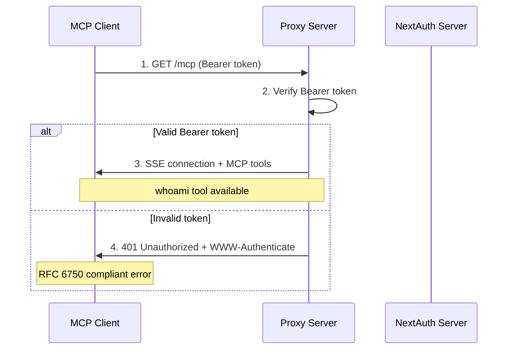
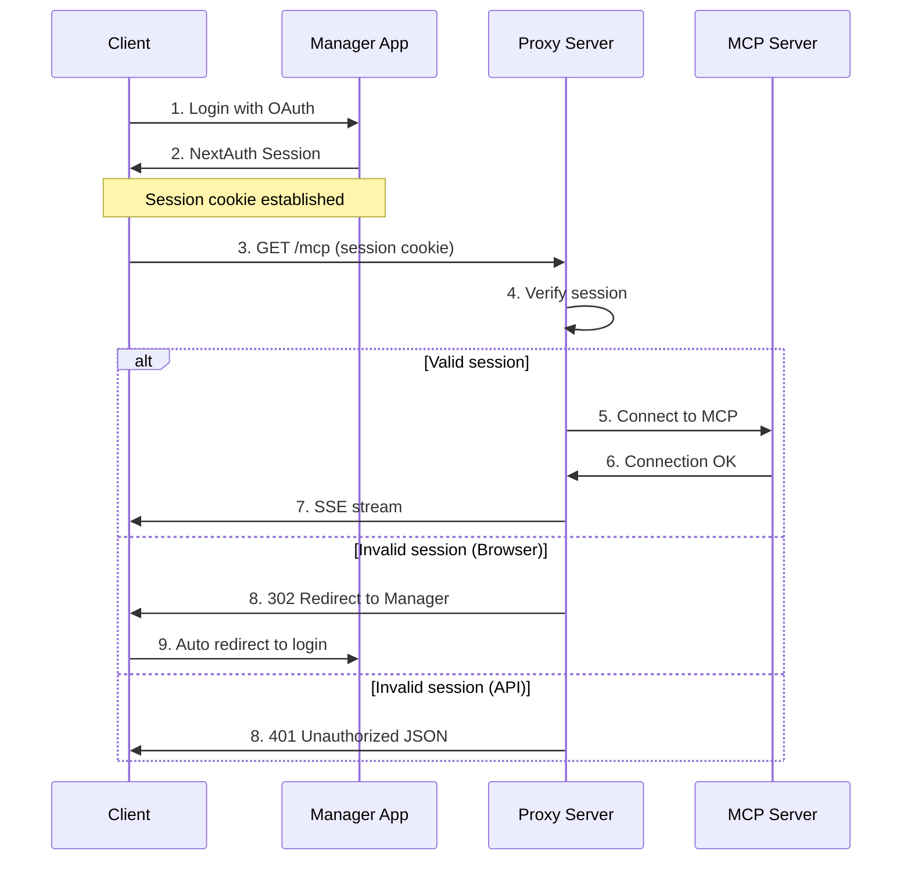
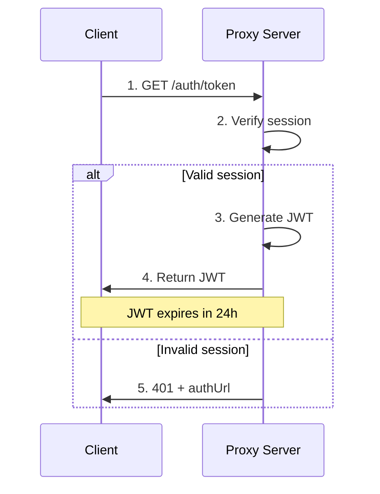
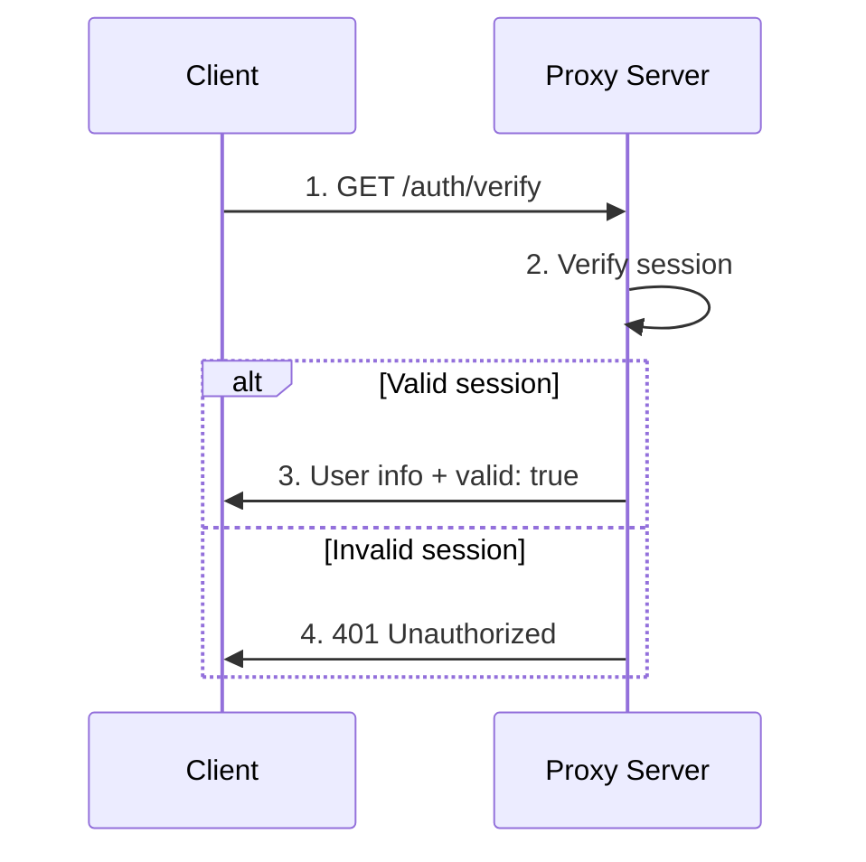
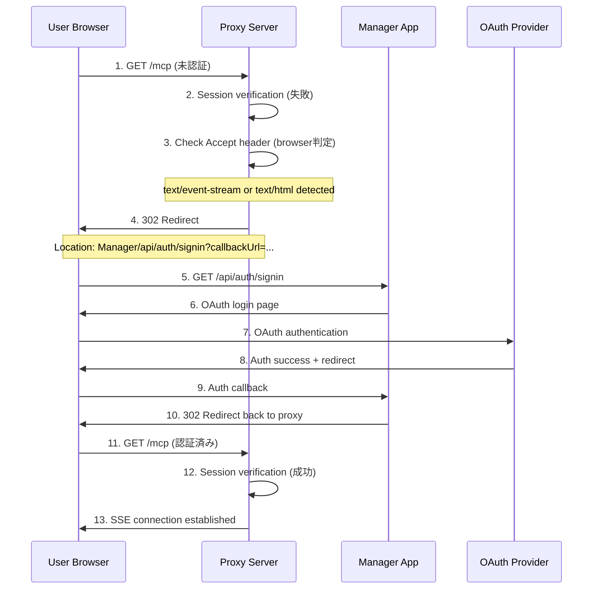

# Tumiki MCP Proxy Server

NextAuth認証機能付きMCP（Model Context Protocol）プロキシサーバー

## 概要

このプロキシサーバーは、NextAuth認証を統合したMCPサーバーへのプロキシ機能を提供します。Managerアプリケーションで認証されたユーザーが、同一セッションを使用してMCPサービスにアクセスできるようになります。

## 特徴

- **🆕 MCP準拠認証**: Model Context Protocol標準の認証仕様に完全対応
- NextAuth認証連携によるセキュアなアクセス制御
- **OAuth 2.1/OpenID Connect対応**: Bearer token認証とセッション認証のハイブリッド
- **🆕 自動リダイレクト機能**: 未認証時に自動的にManagerアプリへリダイレクト
- **whoamiツール**: MCP標準のユーザー情報取得ツール
- SSE（Server-Sent Events）を使用したリアルタイム通信
- JWT認証トークンの発行・検証
- ブラウザ/API呼び出しの自動判別機能
- Express.jsベースの高性能アーキテクチャ
- 型安全なTypeScript実装

## 認証フロー

MCP Proxy Serverは以下の認証方式をサポートしています：

1. **MCP準拠Bearer Token認証** (推奨)
2. **NextAuthセッション認証** (ブラウザ用)
3. **ハイブリッド認証** (自動判別)

### 1. MCP準拠Bearer Token認証フロー 🆕



### 2. 基本認証フロー（セッションベース）



### 2. JWT取得フロー



### 3. セッション検証フロー



### 3. 自動リダイレクトフロー 🆕

未認証ユーザーが直接MCPエンドポイントにアクセスした場合の自動リダイレクト機能：



#### リダイレクト判定ロジック

プロキシサーバーは以下の条件でブラウザからのアクセスと判定し、リダイレクトを実行します：

| 条件 | 判定基準 |
|------|----------|
| SSE接続 | `Accept: text/event-stream` |
| HTML期待 | `Accept: text/html` |
| ブラウザ | `User-Agent` に `Mozilla` が含まれる |

**API呼び出しの場合**は通常の401 JSONレスポンスを返します。

## エンドポイント

### MCP準拠認証エンドポイント 🆕

#### `GET /auth/userinfo` 🔐

OAuth 2.0 UserInfo Response準拠のユーザー情報エンドポイント。

**認証**: Bearer Token必須

**レスポンス**:

```json
{
  "sub": "user_id",
  "email": "user@example.com",
  "name": "User Name",
  "role": "USER",
  "iss": "http://localhost:3000",
  "aud": "mcp-proxy-server",
  "iat": 1640995200,
  "scope": "openid profile email"
}
```

#### `GET /auth/introspect` 🔐

RFC 7662 OAuth 2.0 Token Introspection準拠のトークン検証エンドポイント。

**認証**: Bearer Token必須

**レスポンス**:

```json
{
  "active": true,
  "scope": "openid profile email",
  "client_id": "mcp-proxy-server",
  "sub": "user_id",
  "iss": "http://localhost:3000",
  "exp": 1640995200,
  "iat": 1640991600,
  "token_type": "Bearer"
}
```

### 従来認証エンドポイント（後方互換性）

#### `GET /auth/token`

NextAuthセッションを検証し、JWTトークンを発行します。

**認証**: NextAuthセッション必須

**レスポンス**:

```json
{
  "success": true,
  "token": "eyJhbGciOiJIUzI1NiIsInR5cCI6IkpXVCJ9...",
  "user": {
    "id": "user_id",
    "email": "user@example.com",
    "name": "User Name",
    "role": "USER"
  },
  "expiresIn": "24h"
}
```

**ヘッダー**:

- `X-Auth-Token`: 発行されたJWTトークン

#### `GET /auth/verify`

NextAuthセッションまたはJWTトークンを検証し、ユーザー情報を返却します。

**認証**: NextAuthセッション必須

**レスポンス**:

```json
{
  "success": true,
  "valid": true,
  "user": {
    "id": "user_id",
    "email": "user@example.com",
    "name": "User Name",
    "role": "USER"
  }
}
```

### MCPエンドポイントとツール

#### `GET /mcp` 🔐

MCPサーバーとのSSE接続を確立するメインエンドポイントです。

**認証**: NextAuthセッション必須  
**自動リダイレクト**: 未認証時はManagerアプリへ自動リダイレクト

**レスポンス**:
- **認証済み**: Server-Sent Eventsストリーム
- **未認証（ブラウザ）**: `302 Redirect` to Manager App
- **未認証（API）**: `401 Unauthorized` JSON

**使用例**:

```javascript
// セッションCookieを含むリクエスト
const eventSource = new EventSource("/mcp", {
  withCredentials: true,
});

eventSource.onmessage = (event) => {
  console.log("MCP Response:", event.data);
};
```

#### `whoami` ツール 🆕

MCP準拠の認証情報取得ツール。接続中のユーザー情報を返します。

**使用例（MCP Client）**:

```json
{
  "method": "tools/call",
  "params": {
    "name": "whoami",
    "arguments": {}
  }
}
```

**レスポンス**:

```json
{
  "content": [
    {
      "type": "text",
      "text": "{\n  \"authenticated\": true,\n  \"user\": {\n    \"id\": \"user_id\",\n    \"email\": \"user@example.com\",\n    \"name\": \"User Name\",\n    \"role\": \"USER\"\n  },\n  \"message\": \"You are successfully authenticated with NextAuth\"\n}"
    }
  ]
}
```

#### `POST /messages`

MCPサーバーへのメッセージ送信を行います。

**認証**: アクティブなSSEセッション必須

**パラメーター**:

- `sessionId` (query): SSEセッションID

**リクエストボディ**: JSON-RPC形式のMCPメッセージ

### 🆕 リダイレクト関連エンドポイント

#### `GET /callback`

認証後のコールバック処理を行います。Managerアプリでの認証完了後、元のURLに安全にリダイレクトします。

**認証**: 不要  
**パラメータ**: 
- `returnUrl` (optional): リダイレクト先URL

**動作例**:
```bash
# 認証後、元のURLにリダイレクト
GET /callback?returnUrl=http%3A//localhost%3A8080/mcp
→ 302 Redirect to http://localhost:8080/mcp

# パラメータなしの場合
GET /callback
→ 302 Redirect to /mcp
```

#### `GET /success`

認証成功時に表示するページです。認証完了の確認と自動リダイレクトを提供します。

**認証**: 不要  
**機能**: 
- ✅ 認証成功メッセージ表示
- 3秒後に自動的に `/mcp` にリダイレクト
- 手動リダイレクトボタン提供

## 認証設定

### 環境変数

```bash
# NextAuth設定
AUTH_SECRET="your-auth-secret"
MANAGER_URL="http://localhost:3000"

# データベース接続
DATABASE_URL="postgresql://..."
```

### CORS設定

プロキシサーバーは以下のCORS設定を使用しています：

```typescript
// Manager アプリからのアクセスを許可
app.use((req, res, next) => {
  const origin = process.env.MANAGER_URL || "http://localhost:3000";
  res.header("Access-Control-Allow-Origin", origin);
  res.header("Access-Control-Allow-Credentials", "true");
  res.header(
    "Access-Control-Allow-Headers",
    "Origin, X-Requested-With, Content-Type, Accept, Authorization, Cookie, api-key",
  );
  res.header("Access-Control-Allow-Methods", "GET, POST, PUT, DELETE, OPTIONS");
  next();
});
```

## 型定義

### 認証関連の型

```typescript
interface AuthUser {
  id: string;
  email?: string;
  name?: string;
  role?: string;
}

interface AuthenticatedRequest extends Request {
  user: AuthUser;
}

interface AuthenticatedWithJWTRequest extends AuthenticatedRequest {
  jwt: string;
}
```

## セキュリティ機能

1. **NextAuth統合**: Manager アプリと同一の認証システム使用
2. **セッション検証**: 全エンドポイントでNextAuthセッション必須
3. **JWT暗号化**: HS256アルゴリズムを使用したJWT生成
4. **CORS制御**: 特定のオリジンからのみアクセス許可
5. **型安全性**: TypeScriptによる型安全な実装

## エラーハンドリング

### 401 Unauthorized

```json
{
  "error": "Unauthorized",
  "message": "No valid session found. Please authenticate first.",
  "authUrl": "http://localhost:3000/api/auth/signin"
}
```

### 500 Internal Server Error

```json
{
  "error": "Internal server error",
  "message": "Failed to generate authentication token"
}
```

## 🚀 実際の使用例

### ブラウザから直接アクセス

```bash
# 1. 未認証状態で /mcp にアクセス
curl -v http://localhost:8080/mcp

# レスポンス: 302 Found
# Location: http://localhost:3000/api/auth/signin?callbackUrl=...

# 2. ブラウザで自動的にManagerアプリの認証ページに移動
# 3. OAuth認証完了後、自動的に /mcp に戻る
# 4. SSE接続が確立される
```

### プログラムからのアクセス

```javascript
// 認証済みセッションでのSSE接続
const eventSource = new EventSource('http://localhost:8080/mcp', {
  withCredentials: true
});

eventSource.onopen = () => {
  console.log('✅ MCP接続確立');
};

eventSource.onmessage = (event) => {
  const mcpResponse = JSON.parse(event.data);
  console.log('📨 MCPレスポンス:', mcpResponse);
};

eventSource.onerror = (error) => {
  console.error('❌ 接続エラー:', error);
};
```

### JWT取得と使用

```javascript
// JWT取得
const response = await fetch('/auth/token', {
  credentials: 'include'
});
const { token, user } = await response.json();

console.log('🔐 JWT取得:', token);
console.log('👤 ユーザー情報:', user);

// JWTを使用した外部API呼び出し
const apiResponse = await fetch('/external-api', {
  headers: {
    'Authorization': `Bearer ${token}`
  }
});
```

## 開発・運用

### 起動方法

```bash
# 開発環境
pnpm dev

# ビルド
pnpm build

# 本番起動
pnpm start
```

### 型チェック

```bash
pnpm typecheck
```

### ポート設定

デフォルトポート: `8080`

## 技術スタック

- **フレームワーク**: Express.js
- **認証**: NextAuth.js + MCP OAuth 2.1
- **型システム**: TypeScript
- **通信**: Server-Sent Events (SSE)
- **JWT**: jose
- **MCP SDK**: @modelcontextprotocol/sdk v1.13.0
- **その他**:
  - @tumiki/auth (共通認証パッケージ)
  - OAuth 2.1/OpenID Connect準拠認証
  - RFC 6750 Bearer Token認証
  - RFC 7662 Token Introspection
  - zod

## 🔧 トラブルシューティング

### よくある問題と解決方法

#### ❌ 401 Unauthorized エラー

**症状**: `/mcp` にアクセスすると401エラーが発生

**原因と解決方法**:

| 原因 | 確認方法 | 解決方法 |
|------|----------|----------|
| Managerアプリで未ログイン | ブラウザで `localhost:3000` を確認 | Managerアプリでログイン |
| セッションCookie期限切れ | DevToolsでCookieを確認 | 再ログイン |
| 異なるドメインからアクセス | URLのホスト部分を確認 | 同一ドメインからアクセス |
| CORS設定問題 | ブラウザのConsoleエラー確認 | `MANAGER_URL` 環境変数を確認 |

#### 🔄 リダイレクトが無限ループする

**症状**: 認証ページとプロキシサーバー間で無限リダイレクト

**解決方法**:
```bash
# 1. セッション確認
curl -I -H "Cookie: next-auth.session-token=..." http://localhost:8080/auth/verify

# 2. AUTH_SECRET確認
echo $AUTH_SECRET

# 3. データベース接続確認
psql $DATABASE_URL -c "SELECT * FROM users LIMIT 1;"
```

#### 🔌 SSE接続が切断される

**症状**: MCP接続が頻繁に切断される

**解決方法**:
```javascript
// 自動再接続機能付きSSE
function createRobustSSE(url) {
  let eventSource;
  let reconnectInterval = 1000;
  
  function connect() {
    eventSource = new EventSource(url, { withCredentials: true });
    
    eventSource.onopen = () => {
      console.log('✅ 接続確立');
      reconnectInterval = 1000; // リセット
    };
    
    eventSource.onerror = () => {
      console.log('🔄 再接続中...');
      eventSource.close();
      setTimeout(connect, reconnectInterval);
      reconnectInterval = Math.min(reconnectInterval * 2, 30000); // 最大30秒
    };
  }
  
  connect();
  return eventSource;
}
```

#### 🐛 デバッグモード

開発時は以下の環境変数でデバッグ情報を有効化：

```bash
# ログレベル設定
DEBUG=tumiki:*
NODE_ENV=development

# 詳細なエラー情報
VERBOSE_ERRORS=true
```
