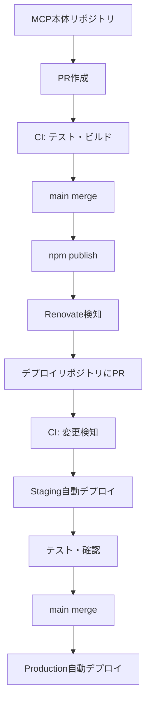

# MCPサーバーのマイクロサービス化アーキテクチャ設計

## 📋 目次

1. [概要](#概要)
2. [アーキテクチャ戦略](#アーキテクチャ戦略)
3. [共通ライブラリ設計（mcp-core）](#共通ライブラリ設計mcp-core)
4. [独立MCPサーバー設計](#独立mcpサーバー設計)
5. [Cloudflare Workers対応](#cloudflare-workers対応)
6. [CI/CD戦略](#cicd戦略)
7. [軽量化戦略](#軽量化戦略)
8. [OSS公開戦略](#oss公開戦略)
9. [移行ロードマップ](#移行ロードマップ)

---

## 概要

### 目標

- ✅ 各MCPサーバーをOSSとして独立したリポジトリで公開
- ✅ 共通ロジックは再利用可能なnpmパッケージとして提供
- ✅ Cloudflare WorkersでリモートMCPとしてデプロイ
- ✅ IaCで簡単にデプロイできる仕組み
- ✅ 各サービスを軽量（<1MB）に保つ

### 設計原則

- **1 Repository = 1 Purpose**: Unix哲学に基づく明確な責務分離
- **DRY（Don't Repeat Yourself）**: 共通ロジックはnpmパッケージ化
- **軽量性**: 依存関係を最小化、Tree-shakingで最適化
- **自動化**: CI/CDで開発からデプロイまで自動化

---

## アーキテクチャ戦略

### ハイブリッドアプローチ

#### 独立リポジトリ + デプロイ統合管理

```text
# パブリックリポジトリ（OSS）
GitHub Organization: @your-org

├── mcp-core/                  # 共通ライブラリ（Public）
│   └── packages/
│       ├── result/           # @mcp-core/result
│       ├── transports/       # @mcp-core/transports (stdio + HTTP)
│       └── types/            # @mcp-core/types
│
├── mcp-youtube/               # YouTube MCP（Public）
│   ├── src/
│   │   ├── tools/            # MCP tools定義
│   │   ├── stdio.ts          # Stdio transport entry
│   │   └── http.ts           # HTTP transport entry
│   └── package.json
│       dependencies:
│         "@mcp-core/result": "^1.0.0"
│         "@mcp-core/transports": "^1.0.0"
│
├── mcp-spotify/               # Spotify MCP（Public）
└── mcp-github/                # GitHub MCP（Public）

# プライベートリポジトリ（デプロイ管理）
@your-private-org/mcp-workers-deploy/

├── services/
│   ├── youtube/              # YouTube Workers wrapper
│   │   ├── src/index.ts      # Workers entrypoint
│   │   └── wrangler.toml
│   ├── spotify/              # Spotify Workers wrapper
│   └── github/               # GitHub Workers wrapper
│
├── .github/workflows/
│   └── deploy.yml            # 統合デプロイCI/CD
│
└── package.json
    dependencies:
      "mcp-youtube": "^1.0.0"
      "mcp-spotify": "^1.0.0"
```

### アーキテクチャの利点

**パブリック/プライベート分離:**

| 要素                 | パブリック（OSS）            | プライベート（デプロイ）          |
| -------------------- | ---------------------------- | --------------------------------- |
| **責務**             | MCPサーバーロジック          | デプロイ設定・機密情報            |
| **公開範囲**         | 全世界に公開                 | 組織内のみ                        |
| **含まれるもの**     | ツール定義、ビジネスロジック | Wrangler設定、シークレット、CI/CD |
| **ライセンス**       | OSS（TBD）                   | プロプライエタリ                  |
| **コントリビュート** | コミュニティ可能             | チーム内のみ                      |

**デュアルトランスポート対応:**

| トランスポート | 用途                        | エントリーポイント |
| -------------- | --------------------------- | ------------------ |
| **stdio**      | ローカル開発、CLIツール     | `stdio.ts`         |
| **HTTP**       | Cloudflare Workers、Web統合 | `http.ts`          |

**従来の問題と解決策:**

| 課題                       | 従来のアプローチ      | 新アーキテクチャ ✅                 |
| -------------------------- | --------------------- | ----------------------------------- |
| 機密情報の漏洩リスク       | ⚠️ 同一リポジトリ内   | ✅ プライベートリポジトリで分離     |
| デプロイ設定の複雑性       | ⚠️ 各リポジトリで管理 | ✅ 統合デプロイリポジトリで一元管理 |
| トランスポート層の重複実装 | ⚠️ 各MCPで独自実装    | ✅ 共通ライブラリで提供             |
| OSS貢献のハードル          | ⚠️ デプロイ設定が複雑 | ✅ ビジネスロジックのみに集中可能   |
| ローカル開発とWorkers両立  | ⚠️ 別々の実装が必要   | ✅ デュアルトランスポートで自動対応 |

---

## 共通ライブラリ設計（mcp-core）

### リポジトリ構造

```text
mcp-core/
├── packages/
│   ├── result/                      # @mcp-core/result
│   │   ├── src/
│   │   │   ├── result.ts           # Result型定義
│   │   │   └── index.ts
│   │   └── package.json
│   │
│   ├── transports/                  # @mcp-core/transports
│   │   ├── src/
│   │   │   ├── stdio.ts            # Stdio Transport
│   │   │   ├── http.ts             # HTTP Transport (Hono)
│   │   │   ├── server.ts           # 共通Server wrapper
│   │   │   └── index.ts
│   │   └── package.json
│   │
│   └── types/                       # @mcp-core/types
│       ├── src/
│       │   ├── errors.ts           # 共通エラー定義
│       │   └── index.ts
│       └── package.json
│
├── pnpm-workspace.yaml
├── package.json
└── .github/workflows/
        └── publish.yml              # npm自動公開
```

### パッケージ仕様

#### @mcp-core/result

型安全なResult型パターンを提供。`ok()`, `err()`, `isOk()`, `isErr()`ヘルパー関数を含む。

#### @mcp-core/transports

**目的**: Stdio + HTTP のデュアルトランスポート実装

**主要機能:**

- `createStdioServer()`: ローカル開発・CLI用（StdioServerTransport）
- `createHttpServer()`: Workers用（Hono + HTTP）
- 共通のServer設定インターフェース

**使用例:**

```typescript
// stdio.ts - ローカル開発用
import { createStdioServer } from "@mcp-core/transports";
import { tools } from "./tools";

createStdioServer({
  name: "youtube-mcp",
  version: "1.0.0",
  tools,
  handleToolRequest: async (name, args) => {
    /* ... */
  },
});

// http.ts - Workers用
import { createHttpServer } from "@mcp-core/transports";
import { tools } from "./tools";

export default createHttpServer({
  name: "youtube-mcp",
  version: "1.0.0",
  tools,
  handleToolRequest: async (name, args) => {
    /* ... */
  },
});
```

#### @mcp-core/types

共通エラークラス（ValidationError, NetworkError, ConfigurationError）と型定義を提供。

### 依存関係更新フロー


**自動化ツール:**

- Renovate または Dependabot
- `@mcp-core/*` の更新を自動検出
- 各リポジトリに自動PRを作成

---

## パブリックMCPサーバー設計（mcp-youtube例）

### リポジトリ構造

```text
mcp-youtube/ (Public Repository)
├── src/
│   ├── stdio.ts                    # Stdio entrypoint
│   ├── http.ts                     # HTTP entrypoint (export用)
│   ├── tools/
│   │   ├── videos.ts               # 動画ツール定義
│   │   ├── channels.ts             # チャンネルツール
│   │   └── index.ts                # ツール集約
│   ├── api/
│   │   └── youtube.ts              # YouTube API実装
│   └── types.ts                    # YouTube特化型定義
│
├── tests/                          # 単体テスト
├── package.json
├── tsconfig.json
├── README.md                       # 使い方・貢献方法
└── .github/workflows/
    ├── ci.yml                      # テスト・ビルド
    └── publish.yml                 # npm自動公開
```

**package.json:**

```json
{
  "name": "mcp-youtube",
  "version": "1.0.0",
  "bin": {
    "mcp-youtube": "./dist/stdio.js"
  },
  "main": "./dist/http.js",
  "exports": {
    ".": "./dist/http.js",
    "./stdio": "./dist/stdio.js"
  },
  "dependencies": {
    "@mcp-core/result": "^1.0.0",
    "@mcp-core/transports": "^1.0.0",
    "@mcp-core/types": "^1.0.0"
  }
}
```

---

## プライベートデプロイリポジトリ設計

### リポジトリ構造

```text
mcp-workers-deploy/ (Private Repository)
├── services/
│   ├── youtube/
│   │   ├── src/
│   │   │   └── index.ts           # Workers wrapper
│   │   └── wrangler.toml          # デプロイ設定
│   ├── spotify/
│   └── github/
│
├── .github/workflows/
│   └── deploy.yml                 # 統合デプロイCI/CD
│
└── package.json
    dependencies:
      "mcp-youtube": "^1.0.0"
      "mcp-spotify": "^1.0.0"
```

### Workers Wrapper（services/youtube/src/index.ts）

```typescript
import mcpYoutube from "mcp-youtube"; // HTTP entrypoint

export default mcpYoutube;
```

### wrangler.toml（services/youtube/wrangler.toml）

```toml
name = "mcp-youtube"
main = "src/index.ts"
compatibility_date = "2024-01-01"

[env.staging]
name = "mcp-youtube-staging"

[env.production]
name = "mcp-youtube"
```

---

## デュアルトランスポート実装

### トランスポート層の違い

| 項目      | Stdio（ローカル）    | HTTP（Workers）         |
| --------- | -------------------- | ----------------------- |
| Transport | StdioServerTransport | HTTP + Hono             |
| 環境変数  | process.env          | Wrangler env/secrets    |
| 実行環境  | Node.js              | V8 isolate              |
| ビルド    | tsc                  | esbuild（バンドル必須） |
| 配布方法  | npm bin              | npm main export         |
| 用途      | CLI、ローカル開発    | Workers、Web統合        |

### 実装パターン

**パブリックMCPサーバー側（mcp-youtube）:**

```typescript
// src/stdio.ts - CLI用
import { createStdioServer } from "@mcp-core/transports";
import { tools } from "./tools";

createStdioServer({ name: "youtube-mcp", tools, handleToolRequest });

// src/http.ts - Workers用export
import { createHttpServer } from "@mcp-core/transports";
import { tools } from "./tools";

export default createHttpServer({
  name: "youtube-mcp",
  tools,
  handleToolRequest,
});
```

**プライベートデプロイ側（mcp-workers-deploy）:**

```typescript
// services/youtube/src/index.ts
import mcpYoutube from "mcp-youtube"; // HTTPサーバーをimport
export default mcpYoutube; // そのままexport
```

### 環境変数管理

```bash
# プライベートリポジトリでシークレット設定
wrangler secret put YOUTUBE_API_KEY --env production
```

---

## CI/CD戦略

### パブリックリポジトリ（MCP本体）のCI/CD

**責務**: テスト・ビルド・npm公開のみ（デプロイなし）

```yaml
# .github/workflows/ci.yml (mcp-youtube等)
name: CI

on:
  push:
    branches: [main]
  pull_request:

jobs:
  test-and-build:
    runs-on: ubuntu-latest
    steps:
      - uses: actions/checkout@v4
      - uses: pnpm/action-setup@v4
        with:
          version: 10
      - uses: actions/setup-node@v4
        with:
          node-version: 22
          cache: "pnpm"

      - run: pnpm install
      - run: pnpm typecheck
      - run: pnpm test
      - run: pnpm build

      - name: Check bundle size
        run: |
          SIZE=$(stat -f%z dist/http.js)
          if [ $SIZE -gt 1048576 ]; then
            echo "Bundle size exceeds 1MB"
            exit 1
          fi

  publish-npm:
    needs: test-and-build
    if: github.ref == 'refs/heads/main'
    runs-on: ubuntu-latest
    steps:
      - uses: actions/checkout@v4
      - uses: pnpm/action-setup@v4
      - uses: actions/setup-node@v4
        with:
          node-version: 22
          registry-url: "https://registry.npmjs.org"

      - run: pnpm install
      - run: pnpm build
      - run: pnpm publish --no-git-checks
        env:
          NODE_AUTH_TOKEN: ${{ secrets.NPM_TOKEN }}
```

### プライベートリポジトリ（デプロイ管理）のCI/CD

**責務**: 依存関係の更新検知とWorkers自動デプロイ

```yaml
# .github/workflows/deploy.yml (mcp-workers-deploy)
name: Deploy MCP Services

on:
  push:
    branches: [main]
  pull_request:
  workflow_dispatch:

jobs:
  detect-changes:
    runs-on: ubuntu-latest
    outputs:
      youtube: ${{ steps.changes.outputs.youtube }}
      spotify: ${{ steps.changes.outputs.spotify }}
      github: ${{ steps.changes.outputs.github }}
    steps:
      - uses: actions/checkout@v4
        with:
          fetch-depth: 2

      - name: Detect service changes
        id: changes
        run: |
          # package.jsonまたはservices/配下の変更を検知
          if git diff --name-only HEAD~1 | grep -E "services/youtube/|package.json"; then
            echo "youtube=true" >> $GITHUB_OUTPUT
          fi
          if git diff --name-only HEAD~1 | grep -E "services/spotify/|package.json"; then
            echo "spotify=true" >> $GITHUB_OUTPUT
          fi

  deploy-youtube:
    needs: detect-changes
    if: needs.detect-changes.outputs.youtube == 'true'
    runs-on: ubuntu-latest
    defaults:
      run:
        working-directory: services/youtube
    steps:
      - uses: actions/checkout@v4
      - uses: pnpm/action-setup@v4
      - uses: actions/setup-node@v4

      - run: pnpm install
      - run: pnpm build

      - name: Deploy to Cloudflare Workers
        uses: cloudflare/wrangler-action@v3
        with:
          apiToken: ${{ secrets.CLOUDFLARE_API_TOKEN }}
          accountId: ${{ secrets.CLOUDFLARE_ACCOUNT_ID }}
          workingDirectory: services/youtube
          command: deploy --env ${{ github.ref == 'refs/heads/main' && 'production' || 'staging' }}

  deploy-spotify:
    needs: detect-changes
    if: needs.detect-changes.outputs.spotify == 'true'
    runs-on: ubuntu-latest
    defaults:
      run:
        working-directory: services/spotify
    steps:
      - uses: actions/checkout@v4
      - uses: pnpm/action-setup@v4
      - uses: actions/setup-node@v4

      - run: pnpm install
      - run: pnpm build

      - name: Deploy to Cloudflare Workers
        uses: cloudflare/wrangler-action@v3
        with:
          apiToken: ${{ secrets.CLOUDFLARE_API_TOKEN }}
          accountId: ${{ secrets.CLOUDFLARE_ACCOUNT_ID }}
          workingDirectory: services/spotify
          command: deploy --env ${{ github.ref == 'refs/heads/main' && 'production' || 'staging' }}
```

### デプロイフロー全体像



**フロー説明:**

1. **パブリックリポジトリ**: MCP本体の開発・テスト・npm公開
2. **Renovate/Dependabot**: 依存関係更新を自動検知しPR作成
3. **プライベートリポジトリ**: 変更されたサービスのみを自動デプロイ
4. **環境分離**: PR → Staging、main merge → Production

**環境URL例:**

- **Staging**: `https://mcp-youtube-staging.your-domain.workers.dev`
- **Production**: `https://mcp-youtube.your-domain.workers.dev`

### Renovate設定（プライベートリポジトリ）

```json
{
  "extends": ["config:base"],
  "packageRules": [
    {
      "matchPackagePatterns": ["^mcp-"],
      "automerge": false,
      "groupName": "MCP Services",
      "reviewers": ["team:backend"]
    }
  ]
}
```

**自動化の利点:**

- ✅ npm公開とデプロイの完全分離
- ✅ 変更されたサービスのみデプロイ（効率化）
- ✅ 機密情報はプライベートリポジトリで管理
- ✅ 依存関係更新の自動検知とPR作成

---

## 軽量化戦略

### 依存関係の最小化

**原則:**

- ✅ 必要最小限のライブラリのみ
- ✅ ユーティリティ系は自作を検討
- ✅ Tree-shaking可能なライブラリを優先

**依存関係例（mcp-youtube）:**

```json
{
  "dependencies": {
    "@mcp-core/result": "^1.0.0", // ~2KB
    "@mcp-core/workers": "^1.0.0", // ~10KB
    "@mcp-core/types": "^1.0.0", // ~1KB
    "googleapis": "^...", // YouTube API
    "hono": "^4.0.0", // ~50KB（軽量）
    "zod": "^3.23.0" // バリデーション
  }
}
```

### Tree-shaking最適化

**esbuild設定:**

```javascript
await build({
  entryPoints: ["src/index.ts"],
  bundle: true,
  minify: true,
  treeShaking: true, // 未使用コード削除
  target: "es2022",
  format: "esm", // ESM必須（Tree-shaking）
  outfile: "dist/index.js",
  external: [], // すべてバンドル
  splitting: false, // Workers用
  metafile: true, // バンドル分析用
});
```

**バンドル分析:**

```bash
# バンドルサイズ詳細分析
pnpm esbuild-visualizer dist/meta.json
```

### サイズ目標

| パッケージ        | 目標サイズ | 実測 |
| ----------------- | ---------- | ---- |
| @mcp-core/result  | < 5KB      | -    |
| @mcp-core/workers | < 20KB     | -    |
| @mcp-core/types   | < 5KB      | -    |
| **mcp-youtube**   | **< 1MB**  | -    |

---

## OSS公開戦略

### npm公開設定

**package.json:**

```json
{
  "name": "mcp-youtube",
  "version": "1.0.0",
  "repository": {
    "type": "git",
    "url": "https://github.com/your-org/mcp-youtube.git"
  },
  "bugs": {
    "url": "https://github.com/your-org/mcp-youtube/issues"
  },
  "homepage": "https://github.com/your-org/mcp-youtube#readme",
  "keywords": [
    "mcp",
    "mcp-server",
    "youtube",
    "cloudflare-workers",
    "model-context-protocol"
  ],
  "publishConfig": {
    "access": "public"
  },
  "files": ["dist", "wrangler.toml", "README.md"]
}
```

### README.md構成

````markdown
# mcp-youtube

YouTube MCP Server for Cloudflare Workers

## Features

- 🎥 YouTube video information retrieval
- 📺 Channel management
- 📋 Playlist operations
- 💬 Comment access
- 📝 Transcript/subtitle retrieval

## Quick Start

### 1. Install

\`\`\`bash
npm install mcp-youtube

# or

pnpm add mcp-youtube
\`\`\`

### 2. Deploy to Cloudflare Workers

\`\`\`bash

# Clone repository

git clone https://github.com/your-org/mcp-youtube.git
cd mcp-youtube

# Install dependencies

pnpm install

# Set up secrets

wrangler secret put YOUTUBE_API_KEY

# Deploy

pnpm deploy
\`\`\`

### 3. Use as MCP Server

\`\`\`json
{
"mcpServers": {
"youtube": {
"url": "https://mcp-youtube.your-domain.workers.dev/mcp"
}
}
}
\`\`\`

## Development

\`\`\`bash

# Local development

pnpm dev

# Run tests

pnpm test

# Type check

pnpm typecheck
\`\`\`

## API Documentation

### Tools

#### youtube_get_video

Get video information by video ID.

**Parameters:**

- `videoId` (string, required): YouTube video ID

**Example:**
\`\`\`json
{
"videoId": "dQw4w9WgXcQ"
}
\`\`\`

[... other tools ...]

## Configuration

### Environment Variables

- `YOUTUBE_API_KEY`: YouTube Data API v3 key (required)

## Contributing

See [CONTRIBUTING.md](CONTRIBUTING.md)

## License

TBD - ライセンスは後で決定
\`\`\`

### CONTRIBUTING.md

```markdown
# Contributing to mcp-youtube

## Development Setup

1. Fork the repository
2. Clone your fork: `git clone https://github.com/your-username/mcp-youtube.git`
3. Install dependencies: `pnpm install`
4. Create a branch: `git checkout -b feature/your-feature`

## Development Workflow

1. Make your changes
2. Run tests: `pnpm test`
3. Type check: `pnpm typecheck`
4. Build: `pnpm build`
5. Commit with conventional commits: `git commit -m "feat: add new feature"`
6. Push and create a PR

## Code Style

- Use TypeScript strict mode
- Follow ESLint rules
- Write tests for new features
- Update documentation

## Testing

- Write unit tests with Vitest
- Aim for 100% coverage on business logic
- Test error cases

## Pull Request Process

1. Update README.md with any new features
2. Ensure all tests pass
3. Update CHANGELOG.md
4. Request review from maintainers
```
````

---

## 移行ロードマップ

### フェーズ1: 基盤構築（1-2週間）

**タスク:**

1. **mcp-coreリポジトリ作成**
   - [ ] GitHub organizationまたはユーザーアカウント準備
   - [ ] mcp-coreリポジトリ作成
   - [ ] pnpm workspace + Turborepo設定
   - [ ] ESLint/Prettier/TypeScript設定

2. **共通ライブラリ開発**
   - [ ] @mcp-core/result実装
     - Result型定義
     - ヘルパー関数（ok, err, isOk, isErr）
     - テスト作成
   - [ ] @mcp-core/types実装
     - エラークラス定義
     - 共通型定義
     - テスト作成
   - [ ] @mcp-core/workers実装
     - createMCPServer関数
     - Hono統合アダプター
     - HTTP Transport実装
     - テスト作成

3. **CI/CD構築（mcp-core用）**
   - [ ] GitHub Actions: CI（テスト・ビルド）
   - [ ] GitHub Actions: npm自動公開
   - [ ] npm organizationアカウント設定

4. **npm公開**
   - [ ] @mcp-core/result v1.0.0公開
   - [ ] @mcp-core/types v1.0.0公開
   - [ ] @mcp-core/workers v1.0.0公開

**完了条件:**

- ✅ 3つの共通ライブラリがnpmに公開されている
- ✅ テストカバレッジ100%
- ✅ CI/CDが正常動作

---

### フェーズ2: mcp-youtube移行（1-2週間）

**タスク:**

1. **リポジトリ作成**
   - [ ] mcp-youtubeリポジトリ作成
   - [ ] 基本ファイル構成セットアップ
   - [ ] 既存コードから移植準備

2. **Workers対応変換**
   - [ ] StdioServerTransport → HTTP/Hono変換
   - [ ] 環境変数アクセスをWrangler env対応
   - [ ] tools/定義をWorkers形式に変換
   - [ ] api/実装を調整

3. **ビルド設定**
   - [ ] esbuild設定作成
   - [ ] wrangler.toml作成（staging/production）
   - [ ] package.json scripts整備

4. **テスト実装**
   - [ ] 既存テストの移植
   - [ ] Workers環境用テスト追加
   - [ ] カバレッジ100%達成

5. **ローカルテスト**
   - [ ] wrangler dev で動作確認
   - [ ] 各ツールの動作検証
   - [ ] エラーハンドリング確認

**完了条件:**

- ✅ ローカルでwrangler dev正常動作
- ✅ 全ツールが期待通り動作
- ✅ テストカバレッジ100%
- ✅ バンドルサイズ < 1MB

---

### フェーズ3: CI/CD構築（1週間）

**タスク:**

1. **GitHub Actions作成**
   - [ ] ci.yml（テスト・ビルド・型チェック）
   - [ ] deploy.yml（Cloudflare Workers自動デプロイ）
   - [ ] バンドルサイズチェック追加

2. **Cloudflare設定**
   - [ ] Cloudflare Workers アカウント準備
   - [ ] API Token発行
   - [ ] GitHub Secrets設定
     - CLOUDFLARE_API_TOKEN
     - CLOUDFLARE_ACCOUNT_ID

3. **環境構築**
   - [ ] Staging環境セットアップ
   - [ ] Production環境セットアップ
   - [ ] Wrangler secretsの設定（YOUTUBE_API_KEY）

4. **デプロイテスト**
   - [ ] PR作成 → Staging自動デプロイ確認
   - [ ] main merge → Production自動デプロイ確認
   - [ ] 各環境での動作検証

**完了条件:**

- ✅ CI/CDパイプラインが正常動作
- ✅ Staging/Production環境が稼働
- ✅ 自動デプロイが成功

---

### フェーズ4: ドキュメント・OSS準備（1週間）

**タスク:**

1. **ドキュメント作成**
   - [ ] README.md（機能・使い方・デプロイ方法）
   - [ ] CONTRIBUTING.md
   - [ ] LICENSE（内容は後で検討）
   - [ ] CHANGELOG.md
   - [ ] API Documentation

2. **npm公開準備**
   - [ ] package.json整備
   - [ ] npmパッケージ公開設定
   - [ ] バージョニング戦略決定

3. **品質チェック**
   - [ ] コードレビュー
   - [ ] セキュリティチェック
   - [ ] パフォーマンステスト
   - [ ] ドキュメントレビュー

**完了条件:**

- ✅ 包括的なドキュメント完成
- ✅ OSS公開準備完了
- ✅ 品質基準クリア

---

### フェーズ5: 公開・展開（継続的）

**タスク:**

1. **npm公開**
   - [ ] mcp-youtube v1.0.0公開
   - [ ] npm registryでの確認

2. **アナウンス**
   - [ ] GitHub Releases作成
   - [ ] Twitter/SNSでの告知
   - [ ] MCPコミュニティへの共有
   - [ ] ブログ記事作成（任意）

3. **他サービス展開**
   - [ ] mcp-spotify準備
   - [ ] mcp-github準備
   - [ ] 各サービスを同様のフローで展開

4. **継続的改善**
   - [ ] Issueへの対応
   - [ ] プルリクエストレビュー
   - [ ] 依存関係の更新（Renovate）
   - [ ] パフォーマンス最適化

**完了条件:**

- ✅ mcp-youtube公開・運用開始
- ✅ コミュニティフィードバック収集
- ✅ 他サービスの段階的展開

---

## まとめ

### アーキテクチャの利点

✅ **明確な責務分離**: 各MCPサーバーが独立したリポジトリ
✅ **共通ロジックの再利用**: npmパッケージで効率的に管理
✅ **軽量性**: 各サービス < 1MB、必要最小限の依存関係
✅ **自動化**: CI/CDで開発からデプロイまで自動化
✅ **OSSフレンドリー**: 発見しやすく、貢献しやすい構造
✅ **スケーラブル**: 新しいMCPサーバーを簡単に追加可能

### 推奨される次のステップ

1. **mcp-coreの開発開始** - 共通ライブラリから着手
2. **mcp-youtubeのWorkers対応** - パイロットプロジェクトとして検証
3. **CI/CD構築** - 自動化基盤の整備
4. **OSS公開** - コミュニティからのフィードバック収集
5. **他サービス展開** - 成功パターンの横展開

このアーキテクチャにより、保守性・拡張性・軽量性を兼ね備えたマイクロサービス基盤が構築できます。
