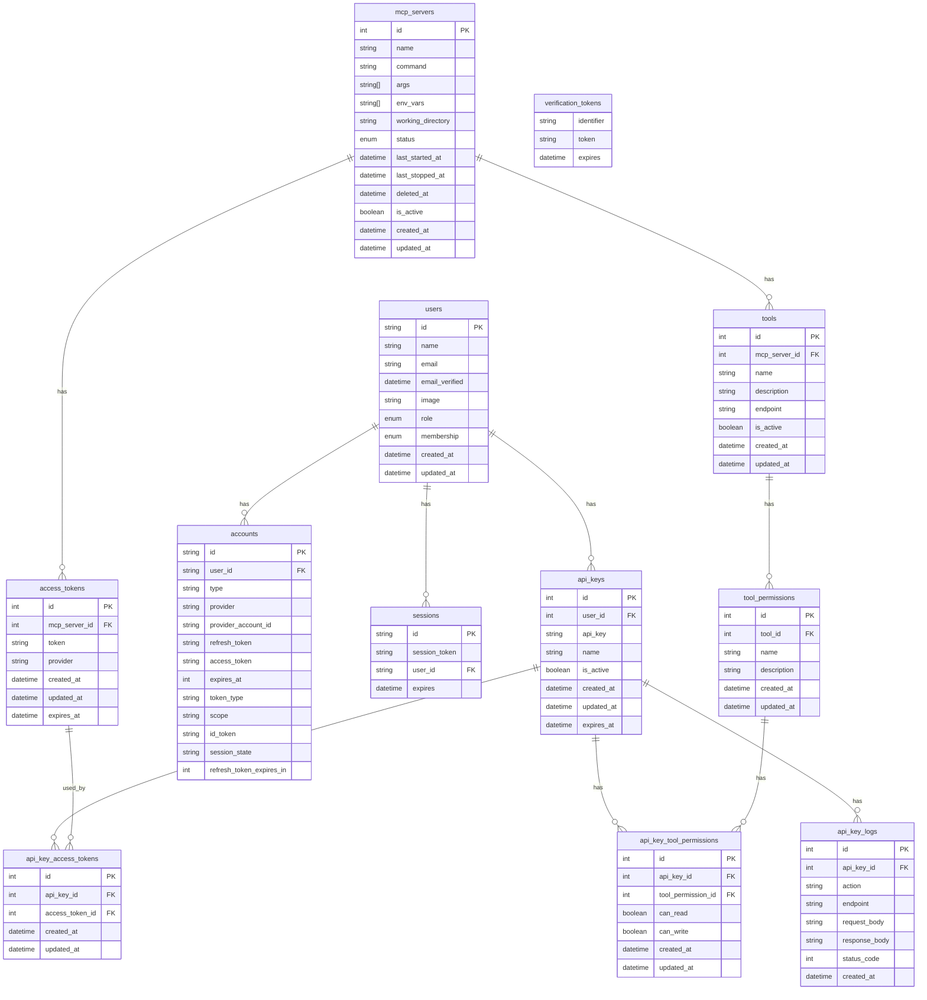

# データベース構造

## 列挙型

### Role
- ADMIN: システム管理者
- SERVER_MANAGER: サーバー管理者
- USER: ユーザー
- VIEWER: 閲覧者

### MembershipType
- FREE: 無料
- PREMIUM: 有料

### ServerStatus
- ACTIVE: 稼働中
- INACTIVE: 停止中
- DELETED: 論理削除
