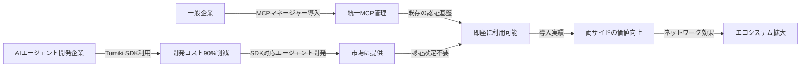

# Tumiki事業概要 - 開発AI向け整理版

## 🎯 事業の核心

### 解決する問題

**MCPサーバー統合の複雑性**を解決し、AIエージェントと企業システムの連携を簡単・安全にする

### ビジネスモデル

**両面プラットフォーム**：AIエージェント開発企業と一般企業をつなぐエコシステム

---

## 🔧 Product 1: Tumiki SDK（AIエージェント開発企業向け）

### ターゲット

- AIエージェント開発企業（10-100名規模）
- システムインテグレーター
- フリーランス開発者

### 核心価値

```javascript
// Before: 複雑な個別実装
await authenticateSalesforce(credentials);
await handleOAuthFlow();
await manageTokenRefresh();
await implementErrorHandling();

// After: シンプルなワンライン
const result = await tumiki.call("salesforce", "getLeads", params, companyId);
```

### 主要機能

1. **統一API**: 全MCPサーバーの共通インターフェース
2. **認証自動化**: OAuth/APIキーの完全自動処理
3. **エラーハンドリング**: 包括的な例外処理・リトライ
4. **開発支援**: モック環境・デバッグツール・ドキュメント

### 料金体系

- 基本プラン: 月額¥30,000（10,000 API calls、10社まで）
- 成長プラン: 月額¥100,000（100,000 API calls、100社まで）
- エンタープライズ: 月額¥300,000〜

---

## 🏢 Product 2: Tumiki MCPマネージャー（一般企業向け）

### ターゲット

- IT/DX先進企業（100-1000名規模）
- AIスタートアップ・テック企業
- 先進的な士業事務所

### 核心価値

```
企業の課題:
❌ 社員がバラバラにMCPを利用
❌ 認証情報の管理が煩雑
❌ セキュリティ・権限管理が困難

解決後:
✅ 統一されたMCP管理プラットフォーム
✅ 部署別・ユーザー別権限制御
✅ 包括的な監査ログ・レポート
✅ Tumiki SDK対応エージェントの即座導入
```

### 主要機能

1. **統一ダッシュボード**: 全サービス接続状況の可視化
2. **権限管理**: 部署・役職別のアクセス制御
3. **セキュリティ**: SOC2/ISO27001準拠、監査ログ
4. **エージェント管理**: 新しいAIエージェントの簡単導入

### 料金体系

- スタンダード: 月額¥50,000（10サービス、50名まで）
- プロフェッショナル: 月額¥150,000（50サービス、200名まで）
- エンタープライズ: 月額¥400,000〜

---

## 🔄 相互作用による価値創造

### エコシステムの仕組み



### 成功シナリオ

1. **企業がMCPマネージャー導入** → 認証基盤整備
2. **開発企業がSDK採用** → 統合コスト削減
3. **SDK対応エージェント増加** → 企業の選択肢拡大
4. **導入企業増加** → 開発企業の市場拡大
5. **ネットワーク効果で加速成長**

---

## 📊 市場戦略・KPI

### 初期戦略（両利きアプローチ）

**単体価値**を先に提供し、段階的にエコシステムを構築

#### Phase 1（0-6ヶ月）: 単体価値での足がかり

- **MCPマネージャー**: 既存MCP利用企業の管理強化
- **SDK**: MCP統合に苦労している開発企業の工数削減

#### Phase 2（6-12ヶ月）: 戦略的パートナーシップ

- 大手SIer、有力AIエージェント企業との連携
- 技術コミュニティでの存在感構築

#### Phase 3（12-24ヶ月）: 自然拡散の仕組み化

- プロダクト内バイラル機能
- データ・インサイト活用

### 目標KPI

#### 12ヶ月目標

- **MCPマネージャー**: 200社導入
- **SDK**: 100社導入、500個のエージェント
- **売上**: 月次¥100M
- **APIコール**: 月間1000万回

---

## 🛠 技術アーキテクチャ（開発用）

### SDK仕様

```javascript
// 初期化
import TumikiSDK from "@tumiki/sdk";
const tumiki = new TumikiSDK({
  apiKey: "tk_dev_xxx",
  environment: "production",
});

// 認証状況確認
const authStatus = await tumiki.getAuthStatus(companyId);

// APIコール
const result = await tumiki.call({
  companyId: "comp_123",
  service: "salesforce",
  method: "getLeads",
  params: { limit: 100 },
});

// バッチ処理
const results = await tumiki.batch(
  [
    { service: "salesforce", method: "getLeads" },
    { service: "notion", method: "createPage", data: leadData },
  ],
  { companyId: "comp_123" },
);
```

### React コンポーネント

```jsx
import { TumikiAuthPanel } from "@tumiki/react";

<TumikiAuthPanel
  companyId="comp_123"
  requiredServices={["salesforce", "notion"]}
  onAuthComplete={(services) => {
    console.log("認証完了:", services);
  }}
/>;
```

### 対応予定API

- **CRM**: Salesforce、HubSpot
- **ドキュメント**: Notion、Confluence、Google Workspace
- **会計**: freee、マネーフォワード、弥生
- **その他**: Slack、Teams、GitHub等

---

## 🚀 開発ロードマップ

### MVP（3ヶ月）

- 基本API統合（Salesforce、Notion、freee）
- 統一認証・エラーハンドリング
- 基本ダッシュボード・ドキュメント

### V1.0（6ヶ月）

- 10+主要API統合
- 企業向け設定UI
- セキュリティ・コンプライアンス機能
- エージェントマーケットプレイス

### V2.0（12ヶ月）

- AI最適化・自動化機能
- 高度な分析・インサイト
- エコシステム統合・連携機能

---

## 💡 開発時の重要ポイント

### 技術的重点事項

1. **セキュリティファースト**: エンタープライズグレードの要件対応
2. **スケーラビリティ**: 大量API呼び出しへの対応
3. **開発者体験**: 直感的なAPI設計・充実したドキュメント
4. **エラーハンドリング**: 包括的な例外処理・自動リトライ

### ビジネス的重点事項

1. **両面価値**: 単体でも価値のある機能設計
2. **ネットワーク効果**: エコシステム拡大の仕組み化
3. **差別化**: 技術的優位性の確立・維持
4. **市場教育**: MCP活用のベストプラクティス普及

---

この事業は**技術的複雑性を抽象化**し、**AIエージェントと企業システムの連携を民主化**することで、新しい市場を創造するプラットフォームビジネスです。
