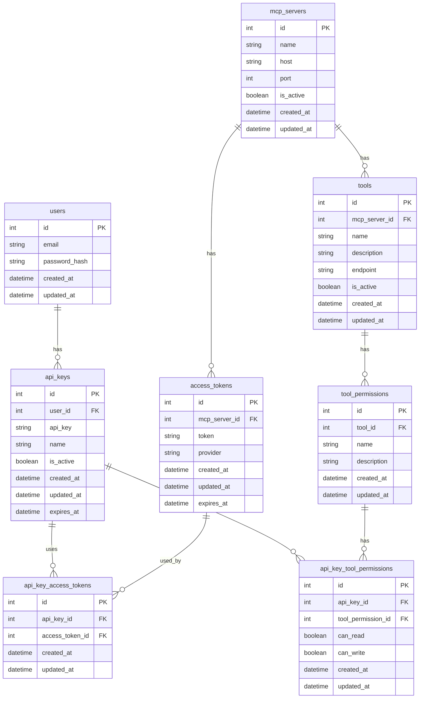

1. 会員登録しているユーザごとに、api key を発行する
2. APIキー ごとに、mcp server proxy に接続してAPIを呼び出す時のアクセストークンを切り替える

- tool を動的に増やしたり減らしたりする検証をする必要あり
- session 管理のみ、外部にすることで、サーバーレスでも問題なさそうなので、vercel への移行を検討する
  - next auth 側の session を利用するか要検討

- 各種toolの増減による権限管理をした API キーを発行する。このAPIキーを使うと、どのユーザでも同一のアクセストークンで、API呼び出し可能

## データベース構造

