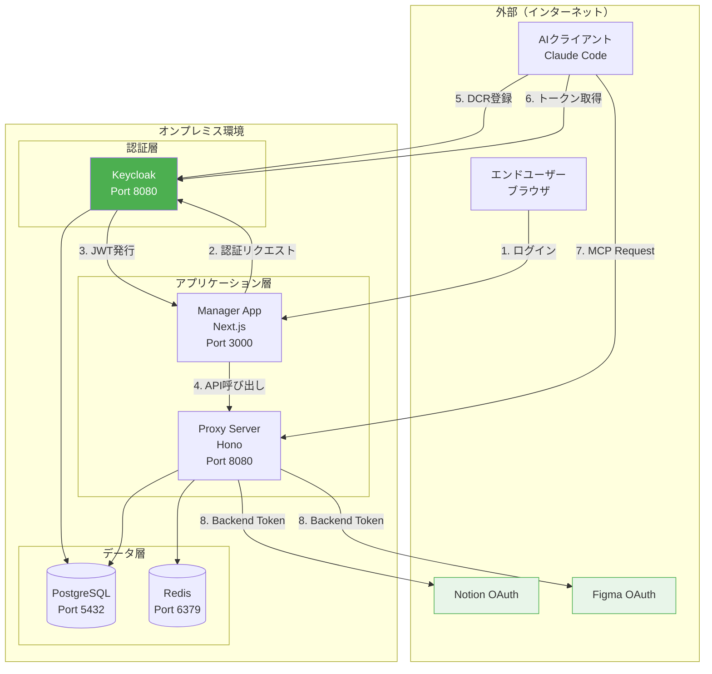
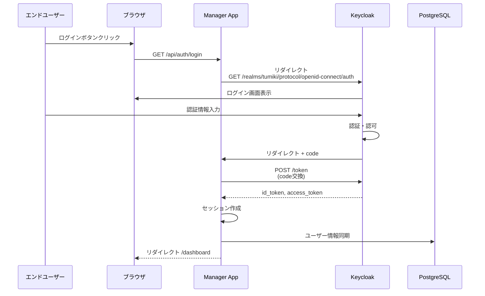
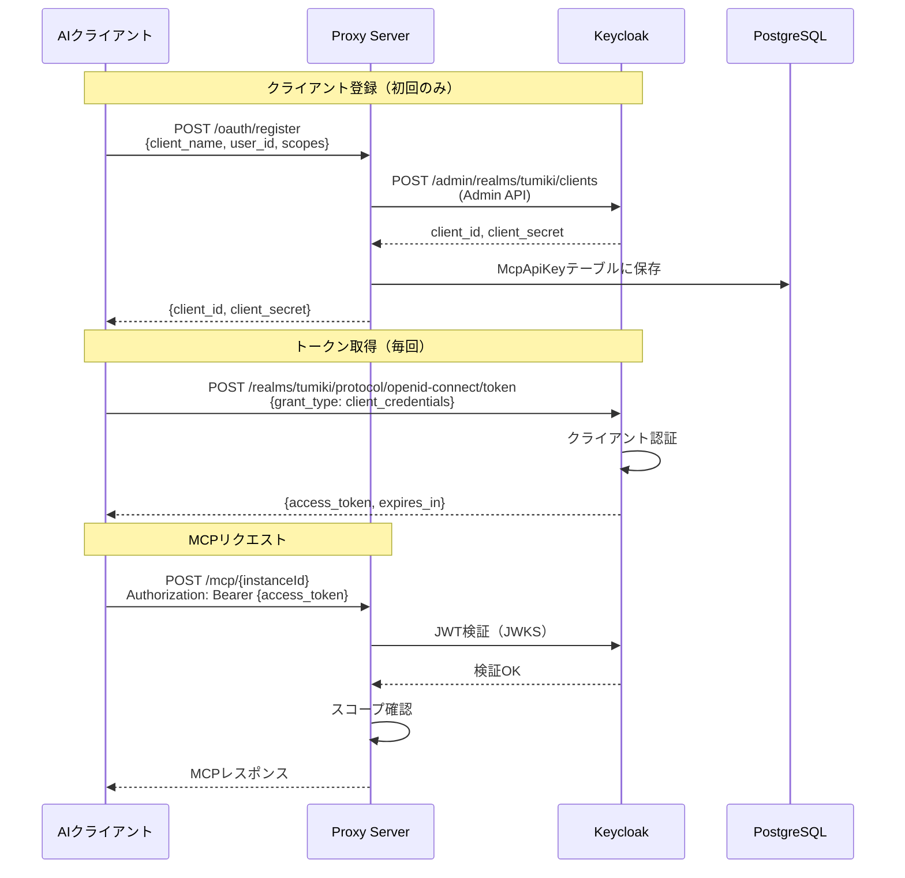

# Keycloakオンプレミス実装計画書

## 概要

TumikiプラットフォームのOAuth認証基盤をAuth0からKeycloakに移行し、オンプレミス環境で完結する認証システムを構築します。NotionやFigmaなどの外部MCPサーバーへのOAuth認証は各サービスの公式DCRを継続使用し、Tumikiプラットフォームへのアクセス認証のみをKeycloak化します。

### 移行の目的

1. **オンプレミス化**: 外部インターネット接続なしでTumiki認証を完結
2. **コスト最適化**: Auth0の月額費用削減
3. **自律性向上**: 認証基盤の完全なコントロール
4. **カスタマイズ性**: 組織固有の要件に柔軟に対応

### 設計方針

- **第1層（Tumiki認証）**: Keycloakで実装 ← **本実装計画の対象**
- **第2層（Backend MCP認証）**: 各サービスのOAuthを継続使用（変更なし）
- **最小限の変更**: 既存アーキテクチャを可能な限り維持
- **段階的移行**: 開発環境→ステージング→本番の順で移行

---

## 現状分析

### Auth0の使用箇所

#### 1. Manager App（Next.js）

- **ファイル**: `apps/manager/src/app/api/auth/[auth0]/route.ts`
- **用途**: ユーザーログイン・ログアウト
- **パッケージ**: `@auth0/nextjs-auth0`
- **環境変数**:
  - `AUTH0_SECRET`
  - `AUTH0_BASE_URL`
  - `AUTH0_ISSUER_BASE_URL`
  - `AUTH0_CLIENT_ID`
  - `AUTH0_CLIENT_SECRET`

#### 2. Auth0 Post-Login Action Webhook

- **ファイル**: `apps/manager/src/app/api/auth/sync-user/route.ts`
- **用途**: ログイン時のユーザー情報同期
- **環境変数**: `AUTH0_WEBHOOK_SECRET`
- **フロー**: Auth0 → Webhook → Prisma (User作成/更新)

#### 3. AIクライアント認証（未実装）

- **設計**: Outlineドキュメント「二層OAuth認証アーキテクチャ」に記載
- **用途**: Claude CodeなどのAIクライアントがTumikiにアクセス
- **未実装の機能**:
  - `/oauth/register` - AIクライアント登録
  - `/oauth/token` - トークン発行
  - DCR (Dynamic Client Registration)
  - スコープベースアクセス制御

### 外部MCPサーバー認証（変更なし）

以下は**Keycloak移行の対象外**です：

- Notion OAuth (https://api.notion.com/v1/oauth/authorize)
- Figma OAuth (https://www.figma.com/oauth)
- Google OAuth (https://accounts.google.com/o/oauth2/v2/auth)
- その他の外部MCPサーバーのOAuth

これらは各サービスの公式OAuth Serverを継続使用します。

---

## アーキテクチャ設計

### システム構成図



### 認証フロー

#### パターンA: エンドユーザーログイン（Manager App）



#### パターンB: AIクライアント認証（Proxy Server）



---

## Keycloak環境構築

### インフラ構成

#### オプション1: Docker Compose（開発・小規模環境）

```yaml
# docker/keycloak/compose.yaml
version: "3.8"

services:
  keycloak:
    image: quay.io/keycloak/keycloak:26.0
    container_name: tumiki-keycloak
    environment:
      # 管理者設定
      KEYCLOAK_ADMIN: admin
      KEYCLOAK_ADMIN_PASSWORD: ${KEYCLOAK_ADMIN_PASSWORD}

      # データベース設定
      KC_DB: postgres
      KC_DB_URL: jdbc:postgresql://db:5432/keycloak
      KC_DB_USERNAME: keycloak
      KC_DB_PASSWORD: ${KEYCLOAK_DB_PASSWORD}

      # ホスト設定
      KC_HOSTNAME: keycloak.tumiki.local
      KC_HOSTNAME_STRICT: false
      KC_HTTP_ENABLED: true
      KC_PROXY_HEADERS: xforwarded

      # ログレベル
      KC_LOG_LEVEL: INFO
    command:
      - start-dev
    ports:
      - "8443:8080"
    volumes:
      - keycloak-data:/opt/keycloak/data
    depends_on:
      - db
    networks:
      - tumiki-network

  db:
    image: postgres:16-alpine
    container_name: tumiki-keycloak-db
    environment:
      POSTGRES_DB: keycloak
      POSTGRES_USER: keycloak
      POSTGRES_PASSWORD: ${KEYCLOAK_DB_PASSWORD}
    volumes:
      - keycloak-db-data:/var/lib/postgresql/data
    networks:
      - tumiki-network

volumes:
  keycloak-data:
  keycloak-db-data:

networks:
  tumiki-network:
    driver: bridge
```

### Keycloak初期設定

#### 1. Realm作成

```bash
# Keycloak Admin CLIを使用
/opt/keycloak/bin/kcadm.sh config credentials \
  --server http://localhost:8080 \
  --realm master \
  --user admin \
  --password ${KEYCLOAK_ADMIN_PASSWORD}

# Tumiki Realmを作成
/opt/keycloak/bin/kcadm.sh create realms \
  -s realm=tumiki \
  -s enabled=true \
  -s displayName="Tumiki Platform" \
  -s sslRequired=EXTERNAL \
  -s registrationAllowed=false \
  -s resetPasswordAllowed=true \
  -s rememberMe=true
```

#### 2. クライアント作成（Manager App用）

```json
{
  "clientId": "tumiki-manager",
  "name": "Tumiki Manager Application",
  "description": "Next.js Manager Application",
  "rootUrl": "https://manager.tumiki.cloud",
  "adminUrl": "https://manager.tumiki.cloud",
  "baseUrl": "https://manager.tumiki.cloud",
  "enabled": true,
  "clientAuthenticatorType": "client-secret",
  "redirectUris": [
    "https://manager.tumiki.cloud/*",
    "https://local.tumiki.cloud:3000/*"
  ],
  "webOrigins": [
    "https://manager.tumiki.cloud",
    "https://local.tumiki.cloud:3000"
  ],
  "protocol": "openid-connect",
  "publicClient": false,
  "standardFlowEnabled": true,
  "implicitFlowEnabled": false,
  "directAccessGrantsEnabled": false,
  "serviceAccountsEnabled": false,
  "authorizationServicesEnabled": false,
  "attributes": {
    "pkce.code.challenge.method": "S256"
  }
}
```

#### 3. クライアントスコープ設定

```bash
# MCPアクセススコープを作成
/opt/keycloak/bin/kcadm.sh create client-scopes \
  -r tumiki \
  -s name=mcp:access:notion \
  -s description="Access to Notion MCP Server" \
  -s protocol=openid-connect

/opt/keycloak/bin/kcadm.sh create client-scopes \
  -r tumiki \
  -s name=mcp:access:figma \
  -s description="Access to Figma MCP Server" \
  -s protocol=openid-connect

/opt/keycloak/bin/kcadm.sh create client-scopes \
  -r tumiki \
  -s name=mcp:read \
  -s description="Read-only access to MCP resources" \
  -s protocol=openid-connect

/opt/keycloak/bin/kcadm.sh create client-scopes \
  -r tumiki \
  -s name=mcp:write \
  -s description="Write access to MCP resources" \
  -s protocol=openid-connect
```

#### 4. ロール設定

```bash
# Realmロールを作成
/opt/keycloak/bin/kcadm.sh create roles \
  -r tumiki \
  -s name=admin \
  -s description="Administrator role"

/opt/keycloak/bin/kcadm.sh create roles \
  -r tumiki \
  -s name=user \
  -s description="Regular user role"

/opt/keycloak/bin/kcadm.sh create roles \
  -r tumiki \
  -s name=viewer \
  -s description="Read-only user role"
```

---

## 実装詳細

### 1. Manager App（Next.js）の変更

#### 1.1 パッケージ移行

```diff
// apps/manager/package.json
{
  "dependencies": {
-   "@auth0/nextjs-auth0": "^3.5.0",
+   "next-auth": "^5.0.0",
+   "@auth/core": "^0.37.0"
  }
}
```

#### 1.2 認証設定ファイル作成

```typescript
// apps/manager/src/lib/auth.config.ts
import type { NextAuthConfig } from "next-auth";
import Keycloak from "next-auth/providers/keycloak";

export const authConfig = {
  providers: [
    Keycloak({
      clientId: process.env.KEYCLOAK_CLIENT_ID!,
      clientSecret: process.env.KEYCLOAK_CLIENT_SECRET!,
      issuer: process.env.KEYCLOAK_ISSUER!, // https://keycloak.tumiki.local/realms/tumiki
      authorization: {
        params: {
          scope: "openid email profile",
        },
      },
    }),
  ],
  callbacks: {
    async jwt({ token, account, profile }) {
      // 初回ログイン時
      if (account && profile) {
        token.accessToken = account.access_token;
        token.idToken = account.id_token;
        token.refreshToken = account.refresh_token;
        token.expiresAt = account.expires_at;

        // Keycloakのユーザー情報を保存
        token.sub = profile.sub;
        token.email = profile.email;
        token.name = profile.name;
        token.picture = profile.picture;
        token.roles = profile.realm_access?.roles || [];
      }

      // トークンの有効期限確認
      if (Date.now() < (token.expiresAt as number) * 1000) {
        return token;
      }

      // リフレッシュトークンで更新
      return await refreshAccessToken(token);
    },

    async session({ session, token }) {
      // セッションにKeycloak情報を追加
      session.user = {
        ...session.user,
        id: token.sub as string,
        roles: token.roles as string[],
      };
      session.accessToken = token.accessToken as string;
      session.error = token.error as string | undefined;

      return session;
    },

    async signIn({ user, account, profile }) {
      // Keycloakログイン後、Prismaにユーザー情報を同期
      if (account?.provider === "keycloak" && profile) {
        await syncUserFromKeycloak({
          keycloakId: profile.sub!,
          email: profile.email!,
          name: profile.name!,
          image: profile.picture,
        });
      }
      return true;
    },
  },
  pages: {
    signIn: "/auth/signin",
    error: "/auth/error",
  },
  session: {
    strategy: "jwt",
    maxAge: 24 * 60 * 60, // 24 hours
  },
  debug: process.env.NODE_ENV === "development",
} satisfies NextAuthConfig;

// リフレッシュトークン処理
async function refreshAccessToken(token: JWT) {
  try {
    const response = await fetch(
      `${process.env.KEYCLOAK_ISSUER}/protocol/openid-connect/token`,
      {
        method: "POST",
        headers: {
          "Content-Type": "application/x-www-form-urlencoded",
        },
        body: new URLSearchParams({
          client_id: process.env.KEYCLOAK_CLIENT_ID!,
          client_secret: process.env.KEYCLOAK_CLIENT_SECRET!,
          grant_type: "refresh_token",
          refresh_token: token.refreshToken as string,
        }),
      },
    );

    const refreshedTokens = await response.json();

    if (!response.ok) {
      throw refreshedTokens;
    }

    return {
      ...token,
      accessToken: refreshedTokens.access_token,
      expiresAt: Math.floor(Date.now() / 1000) + refreshedTokens.expires_in,
      refreshToken: refreshedTokens.refresh_token ?? token.refreshToken,
    };
  } catch (error) {
    console.error("Error refreshing access token:", error);
    return {
      ...token,
      error: "RefreshAccessTokenError",
    };
  }
}

// Keycloakユーザー情報をPrismaに同期
async function syncUserFromKeycloak(params: {
  keycloakId: string;
  email: string;
  name: string;
  image?: string;
}) {
  const { db } = await import("@tumiki/db");

  return await db.user.upsert({
    where: { keycloakId: params.keycloakId },
    update: {
      email: params.email,
      name: params.name,
      image: params.image,
    },
    create: {
      keycloakId: params.keycloakId,
      email: params.email,
      name: params.name,
      image: params.image,
      role: "user",
    },
  });
}
```

#### 1.3 API Routeの更新

```typescript
// apps/manager/src/app/api/auth/[...nextauth]/route.ts
import NextAuth from "next-auth";
import { authConfig } from "@/lib/auth.config";

const handler = NextAuth(authConfig);

export { handler as GET, handler as POST };
```

#### 1.4 Auth0 Webhook削除

```bash
# 以下のファイルを削除
rm apps/manager/src/app/api/auth/sync-user/route.ts
```

理由: NextAuthの`signIn`コールバックでユーザー同期を実行するため、別途Webhookは不要。

### 2. Proxy Server（Hono）の実装

#### 2.1 OAuth認証ミドルウェア作成

```typescript
// apps/proxyServer/src/middleware/keycloakAuth.ts
import type { Context, Next } from "hono";
import { createRemoteJWKSet, jwtVerify } from "jose";
import { HTTPException } from "hono/http-exception";

const KEYCLOAK_ISSUER = process.env.KEYCLOAK_ISSUER!;
const JWKS_URI = `${KEYCLOAK_ISSUER}/protocol/openid-connect/certs`;
const JWKS = createRemoteJWKSet(new URL(JWKS_URI));

export type AuthContext = {
  userId: string;
  clientId: string;
  scopes: string[];
};

export const keycloakAuthMiddleware = async (c: Context, next: Next) => {
  const authHeader = c.req.header("Authorization");

  if (!authHeader?.startsWith("Bearer ")) {
    throw new HTTPException(401, {
      message: "Missing or invalid Authorization header",
    });
  }

  const token = authHeader.replace("Bearer ", "");

  try {
    // JWT検証（Keycloak JWKS使用）
    const { payload } = await jwtVerify(token, JWKS, {
      issuer: KEYCLOAK_ISSUER,
      audience: "tumiki-proxy", // Keycloakクライアント設定で指定
    });

    // スコープ抽出
    const scopes = (payload.scope as string)?.split(" ") || [];

    // コンテキストに認証情報を保存
    c.set("auth", {
      userId: payload.sub!,
      clientId: payload.azp as string,
      scopes,
    } as AuthContext);

    await next();
  } catch (error) {
    console.error("JWT verification failed:", error);
    throw new HTTPException(401, {
      message: "Invalid or expired token",
    });
  }
};

// スコープ検証ミドルウェア
export const requireScope = (requiredScope: string) => {
  return async (c: Context, next: Next) => {
    const auth = c.get("auth") as AuthContext;

    if (!auth) {
      throw new HTTPException(401, { message: "Unauthorized" });
    }

    // ワイルドカードチェック
    if (auth.scopes.includes("mcp:access:*")) {
      await next();
      return;
    }

    // 完全一致チェック
    if (!auth.scopes.includes(requiredScope)) {
      throw new HTTPException(403, {
        message: `Insufficient scope. Required: ${requiredScope}`,
      });
    }

    await next();
  };
};
```

#### 2.2 OAuth Endpointsの実装

```typescript
// apps/proxyServer/src/routes/oauth.ts
import { Hono } from "hono";
import { z } from "zod";
import { zValidator } from "@hono/zod-validator";
import { randomBytes } from "crypto";
import { hash } from "bcrypt";
import { db } from "@tumiki/db";

const oauth = new Hono();

// クライアント登録スキーマ
const registerSchema = z.object({
  client_name: z.string().min(1).max(255),
  user_id: z.string().min(1),
  requested_scopes: z.array(z.string()).min(1),
});

// POST /oauth/register - クライアント登録
oauth.post("/register", zValidator("json", registerSchema), async (c) => {
  const { client_name, user_id, requested_scopes } = c.req.valid("json");

  try {
    // 1. Keycloak Admin APIでクライアント作成
    const keycloakClient = await createKeycloakClient({
      clientName: client_name,
      scopes: requested_scopes,
    });

    // 2. TumikiデータベースにAPIキー保存
    const apiKey = `tumiki_live_${randomBytes(32).toString("hex")}`;
    const apiKeyHash = await hash(keycloakClient.clientSecret, 10);

    const mcpApiKey = await db.mcpApiKey.create({
      data: {
        name: client_name,
        apiKey, // client_idとして使用
        apiKeyHash, // client_secretのハッシュ
        scopes: requested_scopes,
        userId: user_id,
        isActive: true,
        // Keycloak client_idをメタデータとして保存
        metadata: {
          keycloakClientId: keycloakClient.clientId,
        },
      },
    });

    return c.json({
      client_id: apiKey,
      client_secret: keycloakClient.clientSecret,
      client_name: client_name,
      scopes: requested_scopes,
      expires_at: null, // クライアントは無期限
    });
  } catch (error) {
    console.error("Client registration failed:", error);
    return c.json(
      {
        error: "server_error",
        error_description: "Failed to register client",
      },
      500,
    );
  }
});

// Keycloak Admin APIを使用してクライアント作成
async function createKeycloakClient(params: {
  clientName: string;
  scopes: string[];
}) {
  const adminToken = await getKeycloakAdminToken();

  const response = await fetch(
    `${process.env.KEYCLOAK_ISSUER}/admin/realms/tumiki/clients`,
    {
      method: "POST",
      headers: {
        "Content-Type": "application/json",
        Authorization: `Bearer ${adminToken}`,
      },
      body: JSON.stringify({
        clientId: `tumiki_client_${randomBytes(16).toString("hex")}`,
        name: params.clientName,
        enabled: true,
        clientAuthenticatorType: "client-secret",
        standardFlowEnabled: false,
        implicitFlowEnabled: false,
        directAccessGrantsEnabled: false,
        serviceAccountsEnabled: true, // M2M認証を有効化
        publicClient: false,
        protocol: "openid-connect",
        defaultClientScopes: params.scopes,
        attributes: {
          "access.token.lifespan": "86400", // 24 hours
        },
      }),
    },
  );

  if (!response.ok) {
    const error = await response.text();
    throw new Error(`Keycloak client creation failed: ${error}`);
  }

  // client_secretを取得
  const locationHeader = response.headers.get("Location");
  const clientUuid = locationHeader?.split("/").pop();

  const secretResponse = await fetch(
    `${process.env.KEYCLOAK_ISSUER}/admin/realms/tumiki/clients/${clientUuid}/client-secret`,
    {
      headers: {
        Authorization: `Bearer ${adminToken}`,
      },
    },
  );

  const secretData = await secretResponse.json();

  return {
    clientId: clientUuid!,
    clientSecret: secretData.value,
  };
}

// Keycloak管理者トークン取得
async function getKeycloakAdminToken() {
  const response = await fetch(
    `${process.env.KEYCLOAK_ISSUER}/protocol/openid-connect/token`,
    {
      method: "POST",
      headers: {
        "Content-Type": "application/x-www-form-urlencoded",
      },
      body: new URLSearchParams({
        client_id: process.env.KEYCLOAK_ADMIN_CLIENT_ID!,
        client_secret: process.env.KEYCLOAK_ADMIN_CLIENT_SECRET!,
        grant_type: "client_credentials",
      }),
    },
  );

  const data = await response.json();
  return data.access_token;
}

export default oauth;
```

#### 2.3 MCPプロキシハンドラーの更新

```typescript
// apps/proxyServer/src/routes/mcp.ts
import { Hono } from "hono";
import {
  keycloakAuthMiddleware,
  requireScope,
} from "../middleware/keycloakAuth";
import type { AuthContext } from "../middleware/keycloakAuth";

const mcp = new Hono();

// MCPリクエスト処理
mcp.post("/:userMcpServerInstanceId", keycloakAuthMiddleware, async (c) => {
  const instanceId = c.req.param("userMcpServerInstanceId");
  const auth = c.get("auth") as AuthContext;

  // インスタンス情報を取得
  const instance = await getMcpServerInstance(instanceId);

  if (!instance) {
    return c.json({ error: "MCP server not found" }, 404);
  }

  // スコープ検証
  const requiredScope = `mcp:access:${instance.mcpServer.name}`;
  if (
    !auth.scopes.includes(requiredScope) &&
    !auth.scopes.includes("mcp:access:*")
  ) {
    return c.json(
      {
        error: "insufficient_scope",
        error_description: `Required scope: ${requiredScope}`,
      },
      403,
    );
  }

  // Backend MCPサーバーへリクエスト転送
  // ここは既存の実装を使用（変更なし）
  const response = await forwardToBackendMcp(instance, c.req);

  return c.json(response);
});

export default mcp;
```

### 3. データベーススキーマ更新

```prisma
// packages/db/prisma/schema/auth.prisma

model User {
  id        String   @id @default(cuid())

  // Keycloak連携用フィールド追加
  keycloakId String?  @unique

  email     String   @unique
  name      String
  image     String?
  role      String   @default("user")

  // 既存のリレーションは維持
  // ...

  createdAt DateTime @default(now())
  updatedAt DateTime @updatedAt

  @@index([keycloakId])
}

model McpApiKey {
  id   String @id @default(cuid())
  name String

  // Keycloakクライアント情報
  apiKey     String  @unique /// @encrypted (Keycloak client_idとして使用)
  apiKeyHash String? @unique // Keycloak client_secretのハッシュ

  // スコープ情報
  scopes String[] @default([])

  // メタデータ（Keycloak client_id保存）
  metadata Json?

  // 状態
  isActive   Boolean   @default(true)
  lastUsedAt DateTime?
  expiresAt  DateTime?

  // リレーション
  userMcpServerInstanceId String?
  userId                  String
  user                    User   @relation(fields: [userId], references: [id], onDelete: Cascade)

  createdAt DateTime @default(now())
  updatedAt DateTime @updatedAt

  @@index([userId])
  @@index([apiKey])
}
```

### 4. 環境変数設定

```bash
# .env.example に追加

# ==========================================
# Keycloak Configuration
# ==========================================
# Keycloak サーバーURL
KEYCLOAK_ISSUER="https://keycloak.tumiki.local/realms/tumiki"

# Manager App用クライアント認証情報
KEYCLOAK_CLIENT_ID="tumiki-manager"
KEYCLOAK_CLIENT_SECRET="your-keycloak-client-secret"

# Proxy Server用管理者クライアント（DCR実行用）
KEYCLOAK_ADMIN_CLIENT_ID="tumiki-admin"
KEYCLOAK_ADMIN_CLIENT_SECRET="your-admin-client-secret"

# Keycloak管理者認証情報（初期設定用）
KEYCLOAK_ADMIN_USERNAME="admin"
KEYCLOAK_ADMIN_PASSWORD="your-admin-password"

# ==========================================
# 削除する環境変数（Auth0関連）
# ==========================================
# AUTH0_SECRET（削除）
# AUTH0_BASE_URL（削除）
# AUTH0_ISSUER_BASE_URL（削除）
# AUTH0_CLIENT_ID（削除）
# AUTH0_CLIENT_SECRET（削除）
# AUTH0_WEBHOOK_SECRET（削除）
```

---

## マイグレーション計画

### Phase 1: 開発環境構築（Week 1）

#### タスク1.1: Keycloak環境セットアップ

- [ ] Docker Composeファイル作成
- [ ] Keycloakコンテナ起動
- [ ] Realm作成（tumiki）
- [ ] クライアント作成（tumiki-manager, tumiki-admin）
- [ ] スコープ設定
- [ ] ロール設定
- [ ] テストユーザー作成

#### タスク1.2: Manager App移行

- [ ] next-authパッケージインストール
- [ ] 認証設定ファイル作成（`lib/auth.config.ts`）
- [ ] API Route更新（`api/auth/[...nextauth]/route.ts`）
- [ ] Auth0 Webhook削除
- [ ] ユーザー同期ロジック実装
- [ ] セッション管理テスト

#### タスク1.3: データベーススキーマ更新

- [ ] `User`テーブルに`keycloakId`追加
- [ ] `McpApiKey`テーブルに`scopes`追加
- [ ] マイグレーション実行
- [ ] 既存データの移行スクリプト作成

### Phase 2: Proxy Server実装（Week 2）

#### タスク2.1: OAuth Middleware実装

- [ ] JWT検証ミドルウェア作成
- [ ] スコープ検証ミドルウェア作成
- [ ] エラーハンドリング実装
- [ ] ユニットテスト作成

#### タスク2.2: OAuth Endpoints実装

- [ ] `/oauth/register` エンドポイント実装
- [ ] Keycloak Admin API連携
- [ ] クライアント登録処理実装
- [ ] E2Eテスト作成

#### タスク2.3: MCPプロキシ更新

- [ ] 認証ミドルウェア統合
- [ ] スコープベースアクセス制御
- [ ] 統合テスト実行

### Phase 3: テスト・検証（Week 3）

#### タスク3.1: 単体テスト

- [ ] 認証ミドルウェアのテスト
- [ ] OAuth Endpointsのテスト
- [ ] ユーザー同期のテスト
- [ ] カバレッジ100%達成

#### タスク3.2: 統合テスト

- [ ] Manager Appログインフロー
- [ ] AIクライアント登録フロー
- [ ] MCPリクエストフロー
- [ ] トークンリフレッシュフロー

#### タスク3.3: セキュリティテスト

- [ ] JWT改ざん検証
- [ ] スコープ検証
- [ ] トークン期限切れ処理
- [ ] CSRF対策確認

### Phase 4: ステージング環境デプロイ（Week 4）

#### タスク4.1: インフラ構築

- [ ] Kubernetes環境にKeycloakデプロイ
- [ ] PostgreSQL設定
- [ ] SSL証明書設定
- [ ] DNS設定

#### タスク4.2: アプリケーションデプロイ

- [ ] Manager App更新デプロイ
- [ ] Proxy Server更新デプロイ
- [ ] 環境変数設定
- [ ] ヘルスチェック確認

#### タスク4.3: 動作確認

- [ ] エンドユーザーログインテスト
- [ ] AIクライアント認証テスト
- [ ] MCPサーバー連携テスト
- [ ] パフォーマンステスト

### Phase 5: 本番環境移行（Week 5-6）

#### タスク5.1: データ移行

- [ ] 既存ユーザーのKeycloak移行スクリプト実行
- [ ] APIキーの移行
- [ ] データ整合性確認

#### タスク5.2: 段階的ロールアウト

- [ ] Blue-Greenデプロイメント準備
- [ ] カナリアリリース（5%のトラフィック）
- [ ] 監視・メトリクス確認
- [ ] 100%トラフィック切り替え

#### タスク5.3: Auth0廃止

- [ ] Auth0 Post-Login Action無効化
- [ ] Auth0テナント削除（猶予期間後）
- [ ] 環境変数クリーンアップ
- [ ] ドキュメント更新

---

## 運用・監視

### ログ設計

```typescript
// apps/proxyServer/src/utils/logger.ts
import pino from "pino";

export const logger = pino({
  level: process.env.LOG_LEVEL || "info",
  transport: {
    target: "pino-pretty",
    options: {
      colorize: true,
      translateTime: "HH:MM:ss Z",
      ignore: "pid,hostname",
    },
  },
});

// 認証ログ
export const logAuth = {
  success: (userId: string, clientId: string, scopes: string[]) => {
    logger.info({
      event: "auth_success",
      userId,
      clientId,
      scopes,
    });
  },
  failure: (reason: string, clientId?: string) => {
    logger.warn({
      event: "auth_failure",
      reason,
      clientId,
    });
  },
  tokenRefresh: (userId: string) => {
    logger.info({
      event: "token_refresh",
      userId,
    });
  },
};
```

### メトリクス

```typescript
// apps/proxyServer/src/utils/metrics.ts
import { Registry, Counter, Histogram } from "prom-client";

const register = new Registry();

// 認証リクエスト数
export const authRequestsTotal = new Counter({
  name: "auth_requests_total",
  help: "Total number of authentication requests",
  labelNames: ["status", "provider"],
  registers: [register],
});

// 認証レイテンシ
export const authDuration = new Histogram({
  name: "auth_duration_seconds",
  help: "Authentication duration in seconds",
  labelNames: ["provider"],
  registers: [register],
});

// メトリクスエンドポイント
export const metricsHandler = async () => {
  return new Response(await register.metrics(), {
    headers: {
      "Content-Type": register.contentType,
    },
  });
};
```

### アラート設定

```yaml
# k8s/monitoring/prometheus-rules.yaml
apiVersion: monitoring.coreos.com/v1
kind: PrometheusRule
metadata:
  name: keycloak-alerts
  namespace: tumiki
spec:
  groups:
    - name: keycloak
      interval: 30s
      rules:
        - alert: HighAuthFailureRate
          expr: |
            (
              sum(rate(auth_requests_total{status="failure"}[5m]))
              /
              sum(rate(auth_requests_total[5m]))
            ) > 0.1
          for: 5m
          labels:
            severity: warning
          annotations:
            summary: "High authentication failure rate"
            description: "Authentication failure rate is {{ $value | humanizePercentage }}"

        - alert: KeycloakDown
          expr: up{job="keycloak"} == 0
          for: 1m
          labels:
            severity: critical
          annotations:
            summary: "Keycloak is down"
            description: "Keycloak instance has been down for more than 1 minute"

        - alert: SlowAuthResponse
          expr: |
            histogram_quantile(0.95,
              sum(rate(auth_duration_seconds_bucket[5m])) by (le)
            ) > 2
          for: 5m
          labels:
            severity: warning
          annotations:
            summary: "Slow authentication response time"
            description: "95th percentile auth latency is {{ $value }}s"
```

---

## セキュリティ考慮事項

### 1. トークン管理

- **Access Token有効期限**: 24時間（`access.token.lifespan`）
- **Refresh Token有効期限**: 30日（`sso.session.max.lifespan`）
- **Client Secret強度**: 最低32文字のランダム文字列
- **保存方式**: bcryptハッシュ（cost factor: 10）

### 2. 通信暗号化

- **TLS 1.3使用**: Keycloak ↔ Application間
- **証明書管理**: Let's Encrypt自動更新
- **内部通信**: 可能であればmTLS使用

### 3. アクセス制御

- **最小権限の原則**: 必要最小限のスコープのみ付与
- **ロールベース制御**: admin, user, viewerの3段階
- **IPホワイトリスト**: 管理画面へのアクセス制限

### 4. 監査ログ

- **全認証イベント記録**: 成功・失敗両方
- **トークン発行ログ**: client_id, user_id, scopes
- **長期保存**: 90日間のログ保持

---

## トラブルシューティング

### 問題1: JWT検証エラー

**症状**: `Invalid or expired token`エラー

**原因**:

1. Keycloakの公開鍵が取得できない
2. トークンの`iss`クレームが不一致
3. トークンの有効期限切れ

**解決策**:

```bash
# JWKSエンドポイント確認
curl https://keycloak.tumiki.local/realms/tumiki/protocol/openid-connect/certs

# トークンのデコード確認
echo "YOUR_JWT_TOKEN" | cut -d. -f2 | base64 -d | jq
```

### 問題2: スコープ不足エラー

**症状**: `Insufficient scope`エラー

**原因**: クライアントに必要なスコープが付与されていない

**解決策**:

```bash
# Keycloak Admin CLIでスコープ確認
/opt/keycloak/bin/kcadm.sh get clients/{client-uuid}/default-client-scopes \
  -r tumiki

# スコープ追加
/opt/keycloak/bin/kcadm.sh update clients/{client-uuid} \
  -r tumiki \
  -s 'defaultClientScopes=["mcp:access:notion"]'
```

### 問題3: ユーザー同期失敗

**症状**: Keycloakログイン後、Prismaにユーザーが作成されない

**原因**: `signIn`コールバックのエラー

**解決策**:

```typescript
// デバッグログ追加
async signIn({ user, account, profile }) {
  console.log("SignIn callback:", { user, account, profile });

  try {
    await syncUserFromKeycloak({...});
  } catch (error) {
    console.error("User sync failed:", error);
    // エラーをthrowせず、ログインは継続
  }

  return true;
}
```

---

## 完了条件

- [ ] Keycloak環境が正常に稼働
- [ ] Manager Appでログイン・ログアウトが正常動作
- [ ] AIクライアントがDCR経由で登録可能
- [ ] MCPリクエストがスコープ検証を通過
- [ ] 全単体テストがpass（カバレッジ100%）
- [ ] 全統合テストがpass
- [ ] セキュリティテストがpass
- [ ] パフォーマンステストがpass（Auth0比で±10%以内）
- [ ] ドキュメント更新完了
- [ ] 本番環境デプロイ完了
- [ ] Auth0依存完全削除

---

## 関連ドキュメント

### Tumiki内部ドキュメント

- [JWT認証 設計改善実装計画](./jwt-authentication-improvement-plan.md) - JWT認証のハードコード値削除と権限管理の実装計画
- [JWT Claims設計仕様書](./jwt-claims-design.md) - Keycloak JWTトークンの構造設計とProtocol Mapper設定
- [Tumiki 権限管理アーキテクチャ](../permission-management.md) - ハイブリッド権限管理アーキテクチャの全体像

### 認証関連ドキュメント

- [二層OAuth認証実装計画](../two-tier-oauth-implementation-plan.md) - 配信機能のOAuth設計
- [MCP準拠認証設計](../mcp-compliant-auth-design.md) - MCP標準に準拠した認証設計

---

## 参考資料

### Keycloak公式ドキュメント

- [Server Administration Guide](https://www.keycloak.org/docs/latest/server_admin/)
- [Securing Applications and Services Guide](https://www.keycloak.org/docs/latest/securing_apps/)
- [Admin REST API](https://www.keycloak.org/docs-api/latest/rest-api/)

### NextAuth.js

- [Keycloak Provider](https://next-auth.js.org/providers/keycloak)
- [JWT Callbacks](https://next-auth.js.org/configuration/callbacks#jwt-callback)

### OAuth 2.0 / OIDC

- [RFC 6749: OAuth 2.0 Authorization Framework](https://tools.ietf.org/html/rfc6749)
- [RFC 7591: OAuth 2.0 Dynamic Client Registration](https://tools.ietf.org/html/rfc7591)
- [OpenID Connect Core 1.0](https://openid.net/specs/openid-connect-core-1_0.html)

### その他

- [jose (JWT library)](https://github.com/panva/jose)
- [Hono Web Framework](https://hono.dev/)
- [Prisma ORM](https://www.prisma.io/)
