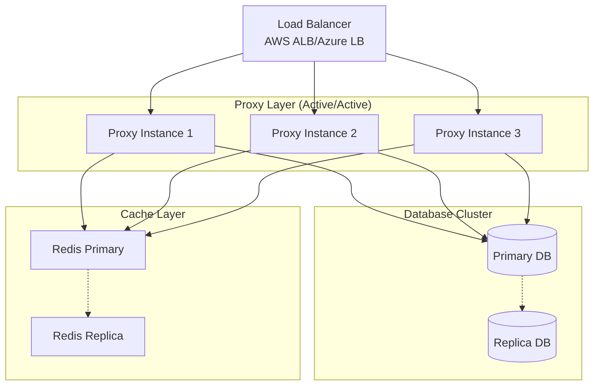
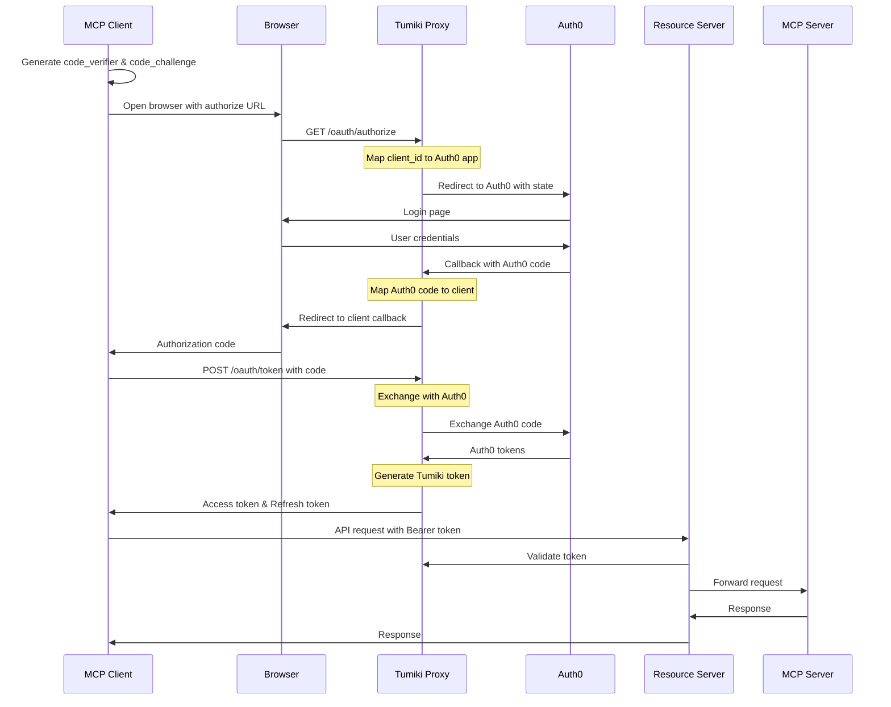

# MCP仕様準拠認証システム設計書

## 1. 概要

### 1.1 背景と目的

Tumikiプラットフォームは、Model Context Protocol (MCP) 仕様に準拠した認証システムを実装することで、MCP Inspectorを含むサードパーティのMCPクライアントとのシームレスな統合を実現します。

**重要な制約**: Auth0の無料プランでは最大10クライアントまでしか作成できないため、TumikiがOAuthプロキシとして機能し、独自のクライアント管理層を実装します。

### 1.2 設計原則

- **MCP仕様準拠**: [MCP Authorization Specification](https://modelcontextprotocol.io/specification/2025-06-18/basic/authorization) に完全準拠
- **OAuth 2.1準拠**: 最新のOAuth 2.1仕様（RFC 9126）に基づく実装、Implicit Flow廃止
- **セキュリティファースト**: PKCE必須、15分の短期間トークン、Rate Limiting、nonce実装
- **開発者体験**: Dynamic Client Registrationによる簡単な統合
- **高可用性**: 冗長化構成、障害対策、サーキットブレーカー実装

### 1.3 対象読者

- Tumiki開発チーム
- MCPクライアント開発者
- セキュリティ監査担当者

## 2. アーキテクチャ

### 2.1 全体構成

```
┌─────────────────────────────────────────────────────────────┐
│                      Tumiki Platform                         │
│                                                              │
│  ┌──────────────┐  ┌──────────────┐  ┌──────────────┐     │
│  │    Auth0     │  │ Tumiki OAuth │  │   Database   │     │
│  │  (1-2 Apps)  │◄─┤    Proxy     │◄─┤  (OAuth DB)  │     │
│  └──────────────┘  └──────────────┘  └──────────────┘     │
│         ▲                 ▲                                 │
│         │                 │                                 │
│  ┌──────┼─────────────────┼────────────────────────┐       │
│  │      │  OAuth Proxy Layer                       │       │
│  │      │  - Client Management                     │       │
│  │      │  - Token Management                      │       │
│  │      │  - Authorization Proxy                   │       │
│  └──────┼─────────────────┼────────────────────────┘       │
└─────────┼─────────────────┼─────────────────────────────────┘
          │                 │
┌─────────┼─────────────────┼─────────────────────────────────┐
│         ▼                 ▼        MCP Components           │
│  ┌──────────────┐  ┌──────────────┐  ┌──────────────┐     │
│  │MCP Client   │  │  Resource    │  │MCP Server    │     │
│  │(Inspector)  │──┤   Server     │──┤Instance      │     │
│  └─────────────┘  └──────────────┘  └──────────────┘     │
└─────────────────────────────────────────────────────────────┘
```

### 2.2 コンポーネント説明

| コンポーネント       | 責務                               | 実装技術                  |
| -------------------- | ---------------------------------- | ------------------------- |
| Auth0                | ユーザー認証のみ（1-2クライアント）| Auth0 SaaS                |
| Tumiki OAuth Proxy   | クライアント管理、トークン発行     | Express.js + TypeScript   |
| OAuth Database       | クライアント情報、トークン永続化   | PostgreSQL + Prisma       |
| Resource Server      | API Gateway, Token検証             | Express.js + JWT          |
| MCP Client           | MCPプロトコルクライアント          | MCP Inspector等           |
| MCP Server Instance  | 実際のMCPサーバー                  | 各種MCP実装               |

### 2.3 高可用性構成

#### 2.3.1 冗長化アーキテクチャ



#### 2.3.2 ヘルスチェックエンドポイント

**エンドポイント**: `GET /health`

```json
{
  "status": "healthy",
  "timestamp": "2025-01-10T00:00:00Z",
  "services": {
    "database": "healthy",
    "auth0": "healthy",
    "cache": "healthy"
  },
  "metrics": {
    "response_time_ms": 12,
    "active_connections": 45,
    "error_rate": 0.01
  }
}
```

#### 2.3.3 フェイルオーバー戦略

- **プライマリー障害**: 自動フェイルオーバー（RTO: 30秒）
- **AZ障害**: マルチAZ展開による自動復旧
- **リージョン障害**: DRサイトへの手動切り替え（RTO: 1時間）

## 3. Discovery Endpoints

### 3.1 OAuth Protected Resource Metadata

**エンドポイント**: `GET /.well-known/oauth-protected-resource`

```json
{
  "resource": "https://server.tumiki.cloud/mcp/{instance_id}",
  "authorization_servers": ["https://auth.tumiki.cloud"],
  "bearer_methods_supported": ["header"],
  "resource_documentation": "https://docs.tumiki.cloud/mcp",
  "resource_signing_alg_values_supported": ["RS256"],
  "scopes_supported": ["mcp:read", "mcp:write", "mcp:admin"]
}
```

### 3.2 OAuth Authorization Server Metadata

**エンドポイント**: `GET /.well-known/oauth-authorization-server`

```json
{
  "issuer": "https://auth.tumiki.cloud",
  "authorization_endpoint": "https://auth.tumiki.cloud/oauth/authorize",
  "token_endpoint": "https://auth.tumiki.cloud/oauth/token",
  "registration_endpoint": "https://auth.tumiki.cloud/oauth/register",
  "jwks_uri": "https://auth.tumiki.cloud/.well-known/jwks.json",
  "response_types_supported": ["code"],  // OAuth 2.1準拠: Implicit Flow廃止のためtokenレスポンスタイプはサポートしない
  "grant_types_supported": [
    "authorization_code",
    "client_credentials",
    "refresh_token"
  ],
  "token_endpoint_auth_methods_supported": [
    "client_secret_post",
    "client_secret_basic",
    "none"
  ],
  "code_challenge_methods_supported": ["S256"],  // PKCE S256のみサポート（plainメソッドは非対応）
  "resource_indicators_supported": true,
  "revocation_endpoint": "https://auth.tumiki.cloud/oauth/revoke",
  "introspection_endpoint": "https://auth.tumiki.cloud/oauth/introspect"
}
```

## 4. Dynamic Client Registration (DCR)

### 4.1 仕様

RFC 7591準拠のDynamic Client Registrationを実装し、MCPクライアントが自動的に登録できるようにします。

**重要**: Auth0の制限により、Tumikiが独自にクライアント管理を行います。実際のAuth0アプリケーションは1-2個のみ作成し、すべてのクライアントで共有します。

### 4.2 Registration Endpoint

**エンドポイント**: `POST /oauth/register`

**リクエスト例**:

```json
{
  "client_name": "MCP Inspector",
  "client_uri": "https://github.com/modelcontextprotocol/inspector",
  "redirect_uris": ["http://localhost:6274/oauth/callback"],
  "grant_types": ["authorization_code", "client_credentials", "refresh_token"],
  "response_types": ["code"],
  "scope": "mcp:read mcp:write",
  "token_endpoint_auth_method": "client_secret_post",

  // Tumiki拡張フィールド（オプション）
  "metadata": {
    "mcp_version": "2025-06-18",
    "client_type": "inspector",
    "environment": "development",
    "user_id": "user_xxx",  // 必須: Tumikiユーザー識別子
    "mcp_server_instance_id": "instance_xxx"  // 必須: MCPサーバーインスタンス識別子
  }
}
```

**レスポンス例**:

```json
{
  "client_id": "client_2a3b4c5d6e7f8g9h",
  "client_secret": "secret_9h8g7f6e5d4c3b2a1",
  "client_id_issued_at": 1704067200,
  "client_secret_expires_at": 0,
  "client_name": "MCP Inspector",
  "redirect_uris": ["http://localhost:6274/oauth/callback"],
  "grant_types": ["authorization_code", "client_credentials", "refresh_token"],
  "response_types": ["code"],
  "scope": "mcp:read mcp:write",
  "token_endpoint_auth_method": "client_secret_post",

  // 追加情報
  "registration_access_token": "reg_token_xxx",
  "registration_client_uri": "https://auth.tumiki.cloud/oauth/register/client_2a3b4c5d6e7f8g9h"
}
```

### 4.3 Registration Management

登録されたクライアントの管理エンドポイント：

- **GET** `/oauth/register/{client_id}` - クライアント情報取得
- **PUT** `/oauth/register/{client_id}` - クライアント情報更新
- **DELETE** `/oauth/register/{client_id}` - クライアント削除

## 5. 認証フロー

### 5.1 Authorization Code Flow with PKCE

#### 5.1.1 フロー概要



#### 5.1.2 Authorization Request

**エンドポイント**: `GET /oauth/authorize`

**パラメータ**:

```
https://auth.tumiki.cloud/oauth/authorize?
  response_type=code&
  client_id=client_2a3b4c5d6e7f8g9h&
  redirect_uri=http://localhost:6274/callback&
  scope=mcp:read mcp:write&
  state=abc123&
  nonce=n-0S6_WzA2Mj&
  code_challenge=E9Melhoa2OwvFrEMTJguCHaoeK1t8URWbuGJSstw-cM&
  code_challenge_method=S256&
  resource=https://server.tumiki.cloud/mcp/cmcy0egw80005o0215bs2g7rr
```

**重要**: `resource`パラメータは**必須**です（MCP仕様準拠）。

#### 5.1.3 Token Exchange

**エンドポイント**: `POST /oauth/token`

**リクエスト**:

```json
{
  "grant_type": "authorization_code",
  "code": "auth_code_xxx",
  "client_id": "client_2a3b4c5d6e7f8g9h",
  "client_secret": "secret_9h8g7f6e5d4c3b2a1",
  "redirect_uri": "http://localhost:6274/callback",
  "code_verifier": "dBjftJeZ4CVP-mB92K27uhbUJU1p1r_wW1gFWFOEjXk",
  "resource": "https://server.tumiki.cloud/mcp/cmcy0egw80005o0215bs2g7rr"
}
```

**レスポンス**:

```json
{
  "access_token": "eyJhbGciOiJSUzI1NiIsInR5cCI6IkpXVCJ9...",
  "token_type": "Bearer",
  "expires_in": 900,  // 15分
  "refresh_token": "refresh_token_xxx",
  "scope": "mcp:read mcp:write",
  "resource": "https://server.tumiki.cloud/mcp/cmcy0egw80005o0215bs2g7rr"
}
```

### 5.2 Client Credentials Flow

#### 5.2.1 フロー概要

サービス間認証に使用。ユーザーの介在なしにトークンを取得。

#### 5.2.2 Token Request

**エンドポイント**: `POST /oauth/token`

**リクエスト**:

```json
{
  "grant_type": "client_credentials",
  "client_id": "client_2a3b4c5d6e7f8g9h",
  "client_secret": "secret_9h8g7f6e5d4c3b2a1",
  "scope": "mcp:read mcp:write",
  "resource": "https://server.tumiki.cloud/mcp/cmcy0egw80005o0215bs2g7rr"
}
```

**レスポンス**:

```json
{
  "access_token": "eyJhbGciOiJSUzI1NiIsInR5cCI6IkpXVCJ9...",
  "token_type": "Bearer",
  "expires_in": 900,  // 15分
  "scope": "mcp:read mcp:write",
  "resource": "https://server.tumiki.cloud/mcp/cmcy0egw80005o0215bs2g7rr"
}
```

### 5.3 Refresh Token Flow

**エンドポイント**: `POST /oauth/token`

**リクエスト**:

```json
{
  "grant_type": "refresh_token",
  "refresh_token": "refresh_token_xxx",
  "client_id": "client_2a3b4c5d6e7f8g9h",
  "client_secret": "secret_9h8g7f6e5d4c3b2a1"
}
```

## 6. Resource Parameter実装

### 6.1 仕様

RFC 8707 (Resource Indicators for OAuth 2.0) に準拠し、`resource`パラメータを実装します。

### 6.2 Resource識別子の形式

```
https://server.tumiki.cloud/mcp/{instance_id}
```

- `{instance_id}`: MCPサーバーインスタンスの一意識別子
- HTTPSスキーム必須
- 正規化されたURI形式

### 6.3 検証ロジック

```typescript
class ResourceValidator {
  validateResource(
    requestedResource: string,
    tokenResources: string[],
  ): boolean {
    // 1. 正規化
    const normalized = this.normalizeUri(requestedResource);

    // 2. トークンのリソースリストと照合
    if (!tokenResources.includes(normalized)) {
      return false;
    }

    // 3. インスタンスの存在確認
    const instanceId = this.extractInstanceId(normalized);
    if (!this.instanceExists(instanceId)) {
      return false;
    }

    return true;
  }

  normalizeUri(uri: string): string {
    const url = new URL(uri);
    // ポート番号の正規化、パスの正規化等
    return url.toString();
  }
}
```

### 6.4 リダイレクトURI検証ルール

#### 6.4.1 本番環境

- **完全一致検証**: 登録されたリダイレクトURIと完全一致する必要あり
- **HTTPSスキーム必須**: `https://` スキームのみ許可
- **カスタムスキーム許可**: モバイルアプリ用（`myapp://callback`）

#### 6.4.2 開発環境

```typescript
const developmentHosts = ['localhost', '127.0.0.1', '[::1]'];

export const validateRedirectUri = (
  registeredUri: string,
  requestedUri: string,
  environment: string
): boolean => {
  const registered = new URL(registeredUri);
  const requested = new URL(requestedUri);
  
  if (environment === 'development') {
    // 開発環境ではlocalhostのHTTPを許可
    if (developmentHosts.includes(requested.hostname)) {
      // ポート番号の柔軟な対応
      return registered.hostname === requested.hostname &&
             registered.pathname === requested.pathname;
    }
  }
  
  // 本番環境は完全一致
  return registeredUri === requestedUri;
};
```

#### 6.4.3 セキュリティ考慮事項

- **オープンリダイレクト攻撃対策**: ワイルドカード不許可
- **サブドメイン攻撃対策**: サブドメインの部分一致不許可
- **ポート番号の厳格な検証**: 本番環境ではポート番号も完全一致

## 7. トークン管理

### 7.1 JWTトークン構造

```json
{
  "header": {
    "alg": "RS256",
    "typ": "JWT",
    "kid": "key_id_xxx"
  },
  "payload": {
    "iss": "https://auth.tumiki.cloud",
    "sub": "user_id or client_id",
    "aud": "https://server.tumiki.cloud/mcp",
    "exp": 1704070800,
    "iat": 1704067200,
    "scope": "mcp:read mcp:write",
    "resources": ["https://server.tumiki.cloud/mcp/cmcy0egw80005o0215bs2g7rr"],
    "client_id": "client_2a3b4c5d6e7f8g9h",
    "azp": "client_2a3b4c5d6e7f8g9h"
  }
}
```

### 7.2 トークン検証

```typescript
export const validateToken = async (
  token: string,
  requestedResource: string,
  requiredScope: string,
  publicKey: string
): Promise<Claims> => {
  // 1. JWT署名検証
  const decoded = jwt.verify(token, publicKey);

  // 2. 有効期限確認
  if (decoded.exp < Date.now() / 1000) {
    throw new Error("Token expired");
  }

  // 3. Audience検証
  if (!decoded.aud.includes("https://server.tumiki.cloud/mcp")) {
    throw new Error("Invalid audience");
  }

  // 4. Resource検証
  if (!decoded.resources?.includes(requestedResource)) {
    throw new Error("Token not valid for requested resource");
  }

  // 5. Scope検証
  const hasRequiredScope = (tokenScope: string, required: string): boolean => {
    const scopes = tokenScope.split(' ');
    return scopes.includes(required);
  };
  
  if (!hasRequiredScope(decoded.scope, requiredScope)) {
    throw new Error("Insufficient scope");
  }

  return decoded;
};
```

### 7.3 トークンライフサイクル

| トークンタイプ     | 有効期限 | 更新方法          |
| ------------------ | -------- | ----------------- |
| Access Token       | 15分     | Refresh Token使用 |
| Refresh Token      | 30日     | 再認証必要        |
| Registration Token | 無期限   | -                 |

## 8. API保護実装

### 8.1 Bearer Token認証

```typescript
export const sendWWWAuthenticate = (
  res: Response,
  error?: string
): void => {
  const challenges = [
    'Bearer realm="MCP"',
    'as_uri="https://auth.tumiki.cloud"',
    'resource="https://server.tumiki.cloud/mcp"',
  ];

  if (error) {
    challenges.push(`error="${error}"`);
  }

  res
    .status(401)
    .header("WWW-Authenticate", challenges.join(", "))
    .json({
      error: "unauthorized",
      error_description: error || "Authentication required",
    });
};

export const authenticateMCPRequest = async (
  req: Request,
  res: Response,
  next: NextFunction
): Promise<void> => {
  // 1. Bearerトークン抽出
  const authHeader = req.headers.authorization;
  if (!authHeader?.startsWith("Bearer ")) {
    return sendWWWAuthenticate(res);
  }

  const token = authHeader.substring(7);

  // 2. トークン検証
  try {
    const claims = await validateToken(
      token,
      `https://server.tumiki.cloud/mcp/${req.params.instanceId}`,
      'mcp:read',
      process.env.JWT_PUBLIC_KEY!
    );

    req.auth = claims;
    next();
  } catch (error) {
    return sendWWWAuthenticate(res, error.message);
  }
};
```

### 8.2 スコープベースの認可

```typescript
const SCOPE_PERMISSIONS = {
  "mcp:read": ["GET"],
  "mcp:write": ["POST", "PUT", "PATCH"],
  "mcp:delete": ["DELETE"],
  "mcp:admin": ["GET", "POST", "PUT", "PATCH", "DELETE"],
};

function authorizeScope(scopes: string[], method: string): boolean {
  for (const scope of scopes) {
    const allowedMethods = SCOPE_PERMISSIONS[scope];
    if (allowedMethods?.includes(method)) {
      return true;
    }
  }
  return false;
}
```

## 9. セキュリティ考慮事項

### 9.1 PKCE (Proof Key for Code Exchange)

Authorization Code Flowでは**必須**実装（OAuth 2.1準拠）：

```typescript
export const generateCodeVerifier = (): string => {
  return base64url(crypto.randomBytes(32));
};

export const generateCodeChallenge = (verifier: string): string => {
  return base64url(crypto.createHash("sha256").update(verifier).digest());
};

export const validatePKCE = (verifier: string, challenge: string): boolean => {
  const expectedChallenge = generateCodeChallenge(verifier);
  return crypto.timingSafeEqual(
    Buffer.from(expectedChallenge),
    Buffer.from(challenge),
  );
};
```

### 9.2 Rate Limiting

```typescript
const rateLimits = {
  "/oauth/register": {
    windowMs: 15 * 60 * 1000, // 15分
    max: 5, // 最大5回
  },
  "/oauth/token": {
    windowMs: 15 * 60 * 1000,
    max: 20,
  },
  "/mcp/*": {
    windowMs: 1 * 60 * 1000, // 1分
    max: 100,
  },
};
```

### 9.3 セキュリティヘッダー

```typescript
app.use((req, res, next) => {
  res.setHeader("X-Content-Type-Options", "nosniff");
  res.setHeader("X-Frame-Options", "DENY");
  res.setHeader("X-XSS-Protection", "1; mode=block");
  res.setHeader(
    "Strict-Transport-Security",
    "max-age=31536000; includeSubDomains",
  );
  res.setHeader("Content-Security-Policy", "default-src 'self'");
  next();
});
```

### 9.4 監査ログ

```typescript
interface AuditLog {
  timestamp: Date;
  event_type:
    | "client_registered"
    | "token_issued"
    | "token_refreshed"
    | "access_denied";
  client_id?: string;
  user_id?: string;
  resource?: string;
  ip_address: string;
  user_agent: string;
  result: "success" | "failure";
  error_code?: string;
}

const checkAnomalies = async (event: AuditLog): Promise<void> => {
  // 異常検知ロジック
  const recentFailures = await db.auditLog.count({
    where: {
      client_id: event.client_id,
      result: "failure",
      timestamp: { gte: new Date(Date.now() - 600000) } // 過去10分
    }
  });
  
  if (recentFailures > 5) {
    // アラート送信
    await sendAlert({
      type: 'anomaly_detected',
      client_id: event.client_id,
      failure_count: recentFailures
    });
  }
};

export const logAuditEvent = async (event: AuditLog): Promise<void> => {
  // データベースに保存
  await db.auditLog.create({ data: event });

  // 異常検知
  if (event.result === "failure") {
    await checkAnomalies(event);
  }
};
```

### 9.5 暗号化キー管理

#### 9.5.1 推奨KMSソリューション

| KMSプロバイダー | 特徴 | 使用例 |
| --- | --- | --- |
| AWS KMS | AWSネイティブ統合、FIPS 140-2 Level 2 | `aws kms encrypt --key-id alias/tumiki-oauth` |
| Azure Key Vault | Azureネイティブ統合、HSMサポート | `az keyvault secret set --vault-name tumiki-kv` |
| HashiCorp Vault | マルチクラウド対応、動的シークレット | `vault kv put secret/oauth/keys` |
| Google Cloud KMS | GCPネイティブ統合、グローバル展開 | `gcloud kms encrypt --key tumiki-key` |

#### 9.5.2 キーローテーション戦略

```typescript
const rotationSchedule = {
  masterKey: 365 * 24 * 60 * 60 * 1000,  // 1年
  dataEncryptionKey: 90 * 24 * 60 * 60 * 1000,  // 90日
  signingKey: 180 * 24 * 60 * 60 * 1000,  // 6ヶ月
};

export const rotateKeys = async (
  kms: KMSClient,
  reencryptData: (key: DataKey) => Promise<void>,
  archiveOldKey: () => Promise<void>
): Promise<void> => {
  // 1. 新しいキーを生成
  const newKey = await kms.generateDataKey();
  
  // 2. 既存データを再暗号化
  await reencryptData(newKey);
  
  // 3. 古いキーをアーカイブ
  await archiveOldKey();
  
  // 4. 監査ログに記録
  await logAuditEvent({
    timestamp: new Date(),
    event_type: 'key_rotation',
    result: 'success',
    ip_address: '0.0.0.0',
    user_agent: 'system'
  });
};

export const getRotationSchedule = () => rotationSchedule;
```

#### 9.5.3 暗号化実装例

```typescript
export const encrypt = async (
  plaintext: string,
  kms: KMSClient
): Promise<string> => {
  // IVを生成
  const iv = crypto.randomBytes(16);
  
  // 1. KMSからデータ暗号化キーを取得
  const { Plaintext: dataKey, CiphertextBlob: encryptedDataKey } = 
    await kms.generateDataKey({
      KeyId: process.env.KMS_KEY_ID,
      KeySpec: 'AES_256'
    });

  // 2. データをAES-256-GCMで暗号化
  const cipher = crypto.createCipheriv('aes-256-gcm', dataKey, iv);
  const encrypted = Buffer.concat([
    cipher.update(plaintext, 'utf8'),
    cipher.final()
  ]);
  const authTag = cipher.getAuthTag();

  // 3. 暗号化データキーと暗号文を結合
  return Buffer.concat([
    Buffer.from([encryptedDataKey.length]),  // キー長
    encryptedDataKey,
    authTag,
    iv,
    encrypted
  ]).toString('base64');
};

export const decrypt = async (
  ciphertext: string,
  kms: KMSClient
): Promise<string> => {
  const buffer = Buffer.from(ciphertext, 'base64');
  let offset = 0;
  
  // データを分解
  const keyLength = buffer[offset++];
  const encryptedDataKey = buffer.slice(offset, offset + keyLength);
  offset += keyLength;
  const authTag = buffer.slice(offset, offset + 16);
  offset += 16;
  const iv = buffer.slice(offset, offset + 16);
  offset += 16;
  const encrypted = buffer.slice(offset);
  
  // 1. 暗号化データキーをKMSで復号
  const { Plaintext: dataKey } = await kms.decrypt({
    CiphertextBlob: encryptedDataKey
  });

  // 2. AES-256-GCMで復号
  const decipher = crypto.createDecipheriv('aes-256-gcm', dataKey, iv);
  decipher.setAuthTag(authTag);
  
  return decipher.update(encrypted) + decipher.final('utf8');
};
```

### 9.6 パスワードハッシュアルゴリズム

#### 9.6.1 Argon2idへの移行推奨

```typescript
// 現在: bcrypt
import bcrypt from 'bcrypt';
const hash = await bcrypt.hash(password, 10);

// 推奨: Argon2id
import argon2 from 'argon2';
const hash = await argon2.hash(password, {
  type: argon2.argon2id,
  memoryCost: 2 ** 16,  // 64 MB
  timeCost: 3,
  parallelism: 1,
});
```

**移行計画**:
1. 新規クライアント: Argon2idを使用
2. 既存クライアント: 次回パスワード更新時にArgon2idへ移行
3. 並行サポート期間: 6ヶ月

## 10. エラーハンドリング

### 10.1 OAuth エラーレスポンス

```json
{
  "error": "invalid_request",
  "error_description": "The resource parameter is required",
  "error_uri": "https://docs.tumiki.cloud/errors/oauth#invalid_request"
}
```

### 10.2 エラーコード一覧

| エラーコード              | 説明                          | HTTPステータス |
| ------------------------- | ----------------------------- | -------------- |
| invalid_request           | リクエストパラメータ不正      | 400            |
| unauthorized_client       | クライアント認証失敗          | 401            |
| access_denied             | アクセス拒否                  | 403            |
| unsupported_response_type | サポートされないresponse_type | 400            |
| invalid_scope             | 無効なスコープ                | 400            |
| server_error              | サーバーエラー                | 500            |
| temporarily_unavailable   | 一時的に利用不可              | 503            |

## 11. データベース設計

### 11.1 OAuthクライアント管理

```prisma
// OAuthクライアント情報
model OAuthClient {
  id                    String   @id @default(cuid())
  clientId              String   @unique  // Tumiki生成のクライアントID
  clientSecretHash      String            // bcryptハッシュ化されたシークレット（将来的にArgon2idへ移行推奨）
  clientName            String
  clientUri             String?
  redirectUris          String[]          // 許可されたリダイレクトURI
  grantTypes            String[]          // 許可されたグラントタイプ
  responseTypes         String[]          // 許可されたレスポンスタイプ
  scope                 String            // 許可されたスコープ
  tokenEndpointAuthMethod String          // トークンエンドポイント認証方法
  
  // 関連情報
  userId                String            // Tumikiユーザー
  mcpServerInstanceId   String            // MCPサーバーインスタンス
  organizationId        String?           // 組織ID（マルチテナント対応）
  
  // メタデータ
  metadata              Json?             // 追加のクライアント情報
  
  // 管理情報
  isActive              Boolean  @default(true)
  createdAt             DateTime @default(now())
  updatedAt             DateTime @updatedAt
  lastUsedAt            DateTime?
  expiresAt             DateTime?         // クライアント有効期限
  
  // リレーション
  user                  User     @relation(fields: [userId], references: [id])
  mcpServerInstance     UserMcpServerInstance @relation(fields: [mcpServerInstanceId], references: [id])
  organization          Organization? @relation(fields: [organizationId], references: [id])
  authorizationCodes    OAuthAuthorizationCode[]
  tokens                OAuthToken[]
  
  @@index([userId])
  @@index([mcpServerInstanceId])
  @@index([organizationId])
}

// OAuth認可コード
model OAuthAuthorizationCode {
  id                    String   @id @default(cuid())
  code                  String   @unique  // 認可コード
  clientId              String            // OAuthClient.id
  userId                String            // 認証されたユーザー
  redirectUri           String            // 使用されたリダイレクトURI
  scope                 String            // 許可されたスコープ
  state                 String?           // stateパラメータ
  nonce                 String?           // nonceパラメータ（OpenID Connect対応）
  codeChallenge         String?           // PKCE code_challenge
  codeChallengeMethod   String?           // PKCE method (S256)
  
  // Auth0マッピング
  auth0Code             String?           // Auth0から取得した実際のコード
  
  // 有効期限
  expiresAt             DateTime          // 10分後
  usedAt                DateTime?         // 使用済みタイムスタンプ
  
  createdAt             DateTime @default(now())
  
  // リレーション
  client                OAuthClient @relation(fields: [clientId], references: [id])
  
  @@index([clientId])
  @@index([userId])
  @@index([expiresAt])
}

// OAuthトークン
model OAuthToken {
  id                    String   @id @default(cuid())
  tokenType             String            // "access" | "refresh"
  token                 String   @unique  // トークン値（JWTまたはopaque）
  clientId              String            // OAuthClient.id
  userId                String?           // ユーザーID（client_credentialsの場合null）
  scope                 String            // トークンのスコープ
  resource              String[]          // リソース識別子（RFC 8707）
  
  // Auth0マッピング
  auth0AccessToken      String? @db.Text @encrypted  // Auth0の実際のトークン（暗号化）
  auth0RefreshToken     String? @db.Text @encrypted  // Auth0のリフレッシュトークン（暗号化）
  
  // 有効期限
  expiresAt             DateTime          // トークン有効期限
  
  // 管理情報
  createdAt             DateTime @default(now())
  lastUsedAt            DateTime?
  revokedAt             DateTime?         // 取り消し日時
  
  // リレーション
  client                OAuthClient @relation(fields: [clientId], references: [id])
  
  @@index([clientId])
  @@index([userId])
  @@index([expiresAt])
  @@index([tokenType])
}
```

### 11.2 既存テーブルとの統合

既存の`McpApiKey`テーブルは後方互換性のために保持し、新しいOAuthクライアントは`OAuthClient`テーブルで管理します。

## 12. 実装計画

### 12.1 フェーズ1: データベース準備（1週間）

- [ ] OAuthClient, OAuthAuthorizationCode, OAuthTokenテーブル作成
- [ ] Prisma暗号化フィールドの設定
- [ ] 既存McpApiKeyテーブルとの統合ロジック
- [ ] マイグレーションスクリプト作成

### 12.2 フェーズ2: OAuthプロキシ層実装（2週間）

- [ ] クライアント管理サービス
  - [ ] クライアント登録API（DCR）
  - [ ] クライアント認証ロジック
  - [ ] クライアント情報管理API
- [ ] 認可プロキシ
  - [ ] `/oauth/authorize`エンドポイント改修
  - [ ] Auth0へのリクエストプロキシ
  - [ ] stateパラメータでのクライアントマッピング
- [ ] トークンプロキシ
  - [ ] `/oauth/token`エンドポイント改修
  - [ ] Auth0トークン交換とTumikiトークン生成
  - [ ] トークン永続化とキャッシュ

### 12.3 フェーズ3: Discovery & Metadata（1週間）

- [ ] Discovery Endpoints実装
  - [ ] `/.well-known/oauth-protected-resource`
  - [ ] `/.well-known/oauth-authorization-server`
- [ ] JWKS エンドポイント
- [ ] トークンイントロスペクション

### 12.4 フェーズ4: 認証フロー完全実装（1週間）

- [ ] Authorization Code Flow + PKCE（プロキシ経由）
- [ ] Client Credentials Flow（直接実装）
- [ ] Refresh Token Flow（ハイブリッド）
- [ ] Resource Parameter検証
- [ ] スコープベース認可

### 12.5 フェーズ5: セキュリティ & 監視（1週間）

- [ ] Rate Limiting実装
- [ ] 異常検知システム
- [ ] セキュリティヘッダー
- [ ] ペネトレーションテスト

### 12.6 フェーズ6: 運用準備（1週間）

- [ ] ドキュメント整備
- [ ] SDKサンプル作成
- [ ] 監視・アラート設定
- [ ] 本番環境デプロイ

## 13. プロキシアーキテクチャの詳細

### 13.1 クライアントIDマッピング

```typescript
// Tumikiクライアント → Auth0アプリケーションのマッピング
export const mapToAuth0Client = async (
  tumikiClientId: string
): Promise<Auth0Credentials> => {
  // すべてのTumikiクライアントは1つのAuth0アプリを共有
  const AUTH0_SHARED_CLIENT_ID = process.env.AUTH0_CLIENT_ID!;
  const AUTH0_SHARED_CLIENT_SECRET = process.env.AUTH0_CLIENT_SECRET!;
  
  // クライアント検証
  const client = await db.oAuthClient.findUnique({
    where: { clientId: tumikiClientId, isActive: true }
  });
  
  if (!client) {
    throw new Error('Invalid client_id');
  }
  
  // 同じAuth0クライアントを返す
  return {
    clientId: AUTH0_SHARED_CLIENT_ID,
    clientSecret: AUTH0_SHARED_CLIENT_SECRET
  };
};
```

### 13.2 トークン生成戦略

```typescript
export const verifyAuth0Token = async (
  auth0Token: string,
  jwksUri: string
): Promise<Auth0Claims> => {
  // JWKSから公開鍵を取得して検証
  const jwksClient = jwks({ jwksUri });
  const getKey = (header: any, callback: any) => {
    jwksClient.getSigningKey(header.kid, (err, key) => {
      const signingKey = key?.getPublicKey();
      callback(err, signingKey);
    });
  };
  
  return new Promise((resolve, reject) => {
    jwt.verify(auth0Token, getKey, (err, decoded) => {
      if (err) reject(err);
      else resolve(decoded as Auth0Claims);
    });
  });
};

export const generateTumikiToken = async (
  auth0Token: string,
  clientId: string,
  privateKey: string
): Promise<string> => {
  // Auth0トークンを検証
  const auth0Claims = await verifyAuth0Token(
    auth0Token,
    'https://auth.tumiki.cloud/.well-known/jwks.json'
  );
  
  // Tumiki独自のJWTを生成
  const tumikiToken = jwt.sign({
    iss: 'https://auth.tumiki.cloud',
    sub: auth0Claims.sub,  // Auth0のユーザーID
    aud: 'https://server.tumiki.cloud/mcp',
    client_id: clientId,   // TumikiのクライアントID
    scope: 'mcp:read mcp:write',
    auth0_token_id: auth0Claims.jti,  // Auth0トークンへの参照
    exp: Math.floor(Date.now() / 1000) + 900  // 15分
  }, privateKey);
  
  // トークンをDBに保存
  await db.oAuthToken.create({
    data: {
      token: tumikiToken,
      tokenType: 'access',
      clientId: clientId,
      userId: auth0Claims.sub,
      auth0AccessToken: auth0Token,  // 暗号化されて保存
      expiresAt: new Date(Date.now() + 900000)  // 15分
    }
  });
  
  return tumikiToken;
};
```

### 13.3 セッション管理

```typescript
// 認可コードのマッピングを管理
// メモリストアをクロージャーで管理
const createAuthorizationSessionStore = () => {
  const sessions = new Map<string, SessionData>();
  
  const createSession = (
    auth0Code: string,
    clientId: string,
    redirectUri: string
  ): string => {
    const tumikiCode = crypto.randomBytes(32).toString('hex');
    
    sessions.set(tumikiCode, {
      auth0Code,
      clientId,
      redirectUri,
      createdAt: Date.now(),
      expiresAt: Date.now() + 600000  // 10分
    });
    
    // 期限切れセッションのクリーンアップ
    cleanupExpiredSessions(sessions);
    
    return tumikiCode;
  };
  
  const exchangeCode = async (tumikiCode: string): Promise<SessionData> => {
    const session = sessions.get(tumikiCode);
    
    if (!session || session.expiresAt < Date.now()) {
      throw new Error('Invalid or expired authorization code');
    }
    
    sessions.delete(tumikiCode);
    return session;
  };
  
  return { createSession, exchangeCode };
};

const cleanupExpiredSessions = (sessions: Map<string, SessionData>): void => {
  const now = Date.now();
  for (const [code, session] of sessions.entries()) {
    if (session.expiresAt < now) {
      sessions.delete(code);
    }
  }
};

// シングルトンインスタンス
export const authSessionStore = createAuthorizationSessionStore();
```

### 13.4 障害対策

#### 13.4.1 サーキットブレーカー実装

```typescript
// サーキットブレーカー設定
type CircuitBreakerConfig = {
  failureThreshold: number;     // 失敗回数閾値
  successThreshold: number;      // 成功回数閾値（HALF_OPEN→CLOSEDへの復帰）
  timeout: number;               // オープン状態維持時間（ミリ秒）
  failureRateThreshold: number;  // 失敗率閾値
};

type CircuitBreakerState = {
  state: 'CLOSED' | 'OPEN' | 'HALF_OPEN';
  failureCount: number;
  successCount: number;
  lastFailureTime?: Date;
};

// サーキットブレーカーの作成（クロージャパターン）
const createCircuitBreaker = (config: CircuitBreakerConfig = {
  failureThreshold: 5,
  successThreshold: 3,
  timeout: 30000,
  failureRateThreshold: 0.5,
}) => {
  // プライベート状態
  const state: CircuitBreakerState = {
    state: 'CLOSED',
    failureCount: 0,
    successCount: 0,
    lastFailureTime: undefined,
  };

  const onSuccess = (): void => {
    state.failureCount = 0;
    
    if (state.state === 'HALF_OPEN') {
      state.successCount++;
      if (state.successCount >= config.successThreshold) {
        state.state = 'CLOSED';
      }
    }
  };

  const onFailure = (): void => {
    state.failureCount++;
    state.lastFailureTime = new Date();
    
    if (state.failureCount >= config.failureThreshold) {
      state.state = 'OPEN';
    }
  };

  const execute = async <T>(fn: () => Promise<T>): Promise<T> => {
    if (state.state === 'OPEN') {
      if (Date.now() - state.lastFailureTime!.getTime() > config.timeout) {
        state.state = 'HALF_OPEN';
        state.successCount = 0;
      } else {
        throw new Error('Circuit breaker is OPEN');
      }
    }

    try {
      const result = await fn();
      onSuccess();
      return result;
    } catch (error) {
      onFailure();
      throw error;
    }
  };

  return {
    execute,
    getState: () => ({ ...state }),
  };
};

// シングルトンインスタンス
export const circuitBreaker = createCircuitBreaker();
```

#### 13.4.2 キャッシュ戦略

```typescript
// キャッシュ設定
export const cacheConfig = {
  jwks: 24 * 60 * 60 * 1000,        // JWKSキャッシュ: 24時間
  tokenValidation: 5 * 60 * 1000,    // トークン検証結果: 5分
  userInfo: 15 * 60 * 1000,          // ユーザー情報: 15分
  clientInfo: 60 * 60 * 1000,        // クライアント情報: 1時間
};

// スタンバイキャッシュの取得
const getStandbyCache = async <T>(key: string): Promise<T | null> => {
  // 期限切れでも最後の有効なキャッシュを返す
  const expired = await redis.get(`standby:${key}`);
  return expired ? JSON.parse(expired) : null;
};

// キャッシュ付きデータ取得
export const getWithCache = async <T>(
  key: string,
  fetcher: () => Promise<T>,
  ttl: number
): Promise<T> => {
  // Redisからキャッシュ取得
  const cached = await redis.get(key);
  if (cached) {
    return JSON.parse(cached);
  }

  // Auth0障害時のフォールバック
  try {
    const data = await fetcher();
    await redis.setex(key, ttl / 1000, JSON.stringify(data));
    return data;
  } catch (error) {
    // スタンバイキャッシュから取得
    const standbyCache = await getStandbyCache(key);
    if (standbyCache) {
      return standbyCache;
    }
    throw error;
  }
};
```

#### 13.4.3 Auth0障害時のフォールバック

```typescript
// Auth0フォールバック認証
export const authenticateUserWithFallback = async (
  credentials: Credentials,
  auth0: Auth0Client,
  auditLog: AuditLogger
): Promise<AuthResult> => {
  return circuitBreaker.execute(async () => {
    try {
      // プライマリ: Auth0認証
      return await auth0.authenticate(credentials);
    } catch (error) {
      // フォールバック: キャッシュされた認証情報を使用
      const cachedAuth = await getWithCache(
        `auth:${credentials.username}`,
        () => auth0.authenticate(credentials),
        cacheConfig.userInfo
      );
      
      if (cachedAuth) {
        // 降格モードでの動作をログに記録
        await auditLog.record({
          event: 'auth0_fallback',
          mode: 'degraded',
          timestamp: new Date()
        });
        return cachedAuth;
      }
      
      throw error;
    }
  });
};
```

#### 13.4.4 モニタリングとアラート

```typescript
// ヘルスステータス型定義
type HealthStatus = {
  healthy: boolean;
  timestamp: Date;
  services: {
    database: 'healthy' | 'unhealthy';
    auth0: 'healthy' | 'unhealthy';
    cache: 'healthy' | 'unhealthy';
    proxy: 'healthy' | 'unhealthy';
  };
  metrics: {
    responseTime: number;
    errorRate: number;
    activeConnections: number;
  };
};

// アラート送信
const sendAlert = async (
  status: HealthStatus,
  alertManager: AlertManager
): Promise<void> => {
  // PagerDuty/Slack/Email通知
  await alertManager.send({
    severity: 'critical',
    message: 'Service degradation detected',
    details: status
  });
};

// ヘルスチェック実行
export const checkHealth = async (
  checkDatabase: () => Promise<void>,
  checkAuth0: () => Promise<void>,
  checkCache: () => Promise<void>,
  checkProxyInstances: () => Promise<void>,
  measureResponseTime: () => Promise<number>,
  calculateErrorRate: () => Promise<number>,
  countActiveConnections: () => Promise<number>,
  alertManager: AlertManager
): Promise<HealthStatus> => {
  const checks = await Promise.allSettled([
    checkDatabase(),
    checkAuth0(),
    checkCache(),
    checkProxyInstances()
  ]);

  const status: HealthStatus = {
    healthy: checks.every(c => c.status === 'fulfilled'),
    timestamp: new Date(),
    services: {
      database: checks[0].status === 'fulfilled' ? 'healthy' : 'unhealthy',
      auth0: checks[1].status === 'fulfilled' ? 'healthy' : 'unhealthy',
      cache: checks[2].status === 'fulfilled' ? 'healthy' : 'unhealthy',
      proxy: checks[3].status === 'fulfilled' ? 'healthy' : 'unhealthy',
    },
    metrics: {
      responseTime: await measureResponseTime(),
      errorRate: await calculateErrorRate(),
      activeConnections: await countActiveConnections()
    }
  };

  // アラート送信
  if (!status.healthy) {
    await sendAlert(status, alertManager);
  }

  return status;
};
```

## 14. テスト戦略

### 14.1 単体テスト

```typescript
describe("OAuth Token Validator", () => {
  it("should validate resource parameter", async () => {
    const token = generateTestToken({
      resources: ["https://server.tumiki.cloud/mcp/test123"],
    });

    const result = await validator.validate(
      token,
      "https://server.tumiki.cloud/mcp/test123",
    );

    expect(result).toBeTruthy();
  });

  it("should reject token for different resource", async () => {
    const token = generateTestToken({
      resources: ["https://server.tumiki.cloud/mcp/test123"],
    });

    await expect(
      validator.validate(token, "https://server.tumiki.cloud/mcp/different"),
    ).rejects.toThrow("Token not valid for requested resource");
  });
});
```

### 14.2 統合テスト

```typescript
describe("OAuth Flow Integration", () => {
  it("should complete authorization code flow", async () => {
    // 1. クライアント登録
    const client = await registerClient();

    // 2. 認可コード取得
    const code = await authorize(client.client_id);

    // 3. トークン交換
    const token = await exchangeToken(code, client);

    // 4. APIアクセス
    const response = await fetch("/mcp/test123", {
      headers: {
        Authorization: `Bearer ${token.access_token}`,
      },
    });

    expect(response.status).toBe(200);
  });
});
```

### 14.3 セキュリティテスト

- SQLインジェクション
- XSS攻撃
- CSRF攻撃
- トークンリプレイ攻撃
- Rate Limiting回避
- 権限昇格攻撃

## 15. 移行計画

### 15.1 既存システムからの移行

1. **並行稼働期間**: 既存の認証システムと新システムを並行稼働
2. **段階的移行**: クライアントを段階的に新システムへ移行
3. **ロールバック計画**: 問題発生時の切り戻し手順
4. **既存APIキーの継続利用**: 新規はOAuth、既存はAPIキー認証を維持

## 16. 運用・監視

### 16.1 メトリクス

```typescript
const metrics = {
  // プロキシ層メトリクス
  "proxy.client.created": 0,           // 新規クライアント作成数
  "proxy.auth0.requests": 0,           // Auth0へのリクエスト数
  "proxy.token.generated": 0,          // Tumikiトークン生成数
  "proxy.mapping.success": 0,          // マッピング成功数
  "proxy.mapping.failure": 0,          // マッピング失敗数
  
  // 既存メトリクス
  "oauth.registration.success": 0,
  "oauth.registration.failure": 0,
  "oauth.token.issued": 0,
  "oauth.token.refreshed": 0,
  "oauth.token.revoked": 0,
  "oauth.auth.success": 0,
  "oauth.auth.failure": 0,
  "api.request.count": 0,
  "api.request.duration": [],
};
```

```typescript
const metrics = {
  "oauth.registration.success": 0,
  "oauth.registration.failure": 0,
  "oauth.token.issued": 0,
  "oauth.token.refreshed": 0,
  "oauth.token.revoked": 0,
  "oauth.auth.success": 0,
  "oauth.auth.failure": 0,
  "api.request.count": 0,
  "api.request.duration": [],
};
```

### 16.2 アラート設定

| メトリクス       | 閾値      | アクション    |
| ---------------- | --------- | ------------- |
| エラー率         | > 5%      | PagerDuty通知 |
| レスポンス時間   | > 1秒     | Slack通知     |
| トークン発行失敗 | > 10回/分 | 調査開始      |
| Auth0 API制限    | > 80%     | 緊急対応      |
| クライアント作成 | > 100/日  | キャパシティ確認 |

| メトリクス       | 閾値      | アクション    |
| ---------------- | --------- | ------------- |
| エラー率         | > 5%      | PagerDuty通知 |
| レスポンス時間   | > 1秒     | Slack通知     |
| トークン発行失敗 | > 10回/分 | 調査開始      |

### 16.3 ログ分析

```typescript
// Elasticsearch/Kibanaでの分析例
{
  "query": {
    "bool": {
      "must": [
        { "term": { "event_type": "access_denied" } },
        { "range": { "timestamp": { "gte": "now-1h" } } }
      ]
    }
  },
  "aggs": {
    "by_client": {
      "terms": { "field": "client_id" }
    }
  }
}
```

## 17. 参考資料

### 17.1 仕様書

- [MCP Authorization Specification](https://modelcontextprotocol.io/specification/2025-06-18/basic/authorization)
- [RFC 6749 - OAuth 2.0](https://datatracker.ietf.org/doc/html/rfc6749)
- [RFC 7591 - Dynamic Client Registration](https://datatracker.ietf.org/doc/html/rfc7591)
- [RFC 7636 - PKCE](https://datatracker.ietf.org/doc/html/rfc7636)
- [RFC 8707 - Resource Indicators](https://datatracker.ietf.org/doc/html/rfc8707)
- [RFC 9126 - OAuth 2.1](https://datatracker.ietf.org/doc/html/draft-ietf-oauth-v2-1)

### 17.2 実装例

- [Auth0 Documentation](https://auth0.com/docs)
- [Keycloak Documentation](https://www.keycloak.org/documentation)
- [Spring Security OAuth](https://spring.io/projects/spring-security-oauth)

## 付録A: クライアント実装例

### A.1 MCP Inspector設定

```json
{
  "mcpServers": {
    "tumiki-server": {
      "url": "https://server.tumiki.cloud/mcp/cmcy0egw80005o0215bs2g7rr",
      "transport": {
        "type": "http",
        "oauth": {
          "type": "oauth2",
          "discovery_url": "https://server.tumiki.cloud/.well-known/oauth-protected-resource",
          "registration": {
            "endpoint": "https://auth.tumiki.cloud/oauth/register",
            "client_name": "MCP Inspector",
            "scope": "mcp:read mcp:write"
          },
          "authorization": {
            "endpoint": "https://auth.tumiki.cloud/oauth/authorize",
            "response_type": "code",
            "pkce": true
          },
          "token": {
            "endpoint": "https://auth.tumiki.cloud/oauth/token"
          }
        }
      }
    }
  }
}
```

### A.2 Node.js クライアント実装

```typescript
import { MCPClient } from "@modelcontextprotocol/client";
import { OAuthTransport } from "./oauth-transport";

class TumikiMCPClient {
  private client: MCPClient;
  private transport: OAuthTransport;

  async connect(instanceId: string) {
    // 1. Discovery
    const metadata = await this.discover(instanceId);

    // 2. Client Registration (初回のみ)
    const client = await this.registerClient(metadata.registration_endpoint);

    // 3. OAuth認証
    const token = await this.authenticate(client, instanceId);

    // 4. MCP接続
    this.transport = new OAuthTransport({
      url: `https://server.tumiki.cloud/mcp/${instanceId}`,
      token: token.access_token,
      refreshToken: token.refresh_token,
    });

    this.client = new MCPClient(this.transport);
    await this.client.connect();
  }

  private async discover(instanceId: string): Promise<Metadata> {
    const response = await fetch(
      "https://server.tumiki.cloud/.well-known/oauth-protected-resource",
    );
    return response.json();
  }

  private async registerClient(endpoint: string): Promise<ClientCredentials> {
    const response = await fetch(endpoint, {
      method: "POST",
      headers: { "Content-Type": "application/json" },
      body: JSON.stringify({
        client_name: "My MCP Client",
        redirect_uris: ["http://localhost:3000/callback"],
        grant_types: ["authorization_code", "refresh_token"],
        response_types: ["code"],
        scope: "mcp:read mcp:write",
      }),
    });

    return response.json();
  }

  private async authenticate(
    client: ClientCredentials,
    instanceId: string,
  ): Promise<TokenResponse> {
    // PKCE準備
    const codeVerifier = this.generateCodeVerifier();
    const codeChallenge = await this.generateCodeChallenge(codeVerifier);

    // ブラウザで認可
    const code = await this.authorizeInBrowser({
      client_id: client.client_id,
      redirect_uri: "http://localhost:3000/callback",
      code_challenge: codeChallenge,
      resource: `https://server.tumiki.cloud/mcp/${instanceId}`,
    });

    // トークン交換
    const response = await fetch("https://auth.tumiki.cloud/oauth/token", {
      method: "POST",
      headers: { "Content-Type": "application/json" },
      body: JSON.stringify({
        grant_type: "authorization_code",
        code: code,
        client_id: client.client_id,
        client_secret: client.client_secret,
        redirect_uri: "http://localhost:3000/callback",
        code_verifier: codeVerifier,
        resource: `https://server.tumiki.cloud/mcp/${instanceId}`,
      }),
    });

    return response.json();
  }
}
```

## 付録B: トラブルシューティング

### B.1 よくあるエラーと対処法

| エラー               | 原因                     | 対処法                 |
| -------------------- | ------------------------ | ---------------------- |
| `invalid_resource`   | リソースパラメータが不正 | 正しい形式のURIを指定  |
| `invalid_client`     | クライアント認証失敗     | client_id/secretを確認 |
| `invalid_grant`      | 認可コードが無効         | コードの有効期限確認   |
| `insufficient_scope` | スコープ不足             | 必要なスコープを要求   |

### B.2 デバッグ方法

```bash
# トークンの内容確認
echo $ACCESS_TOKEN | cut -d. -f2 | base64 -d | jq

# Discovery確認
curl https://server.tumiki.cloud/.well-known/oauth-protected-resource | jq

# トークン検証
curl -H "Authorization: Bearer $ACCESS_TOKEN" \
     https://server.tumiki.cloud/mcp/test123 -v
```

---

**ドキュメントバージョン**: 2.0.0  
**最終更新日**: 2025年1月  
**作成者**: Tumiki Development Team  
**更新内容**: OAuthプロキシアーキテクチャを追加し、Auth0の10クライアント制限を回避する設計に更新  
**レビュー承認者**: [承認者名]
