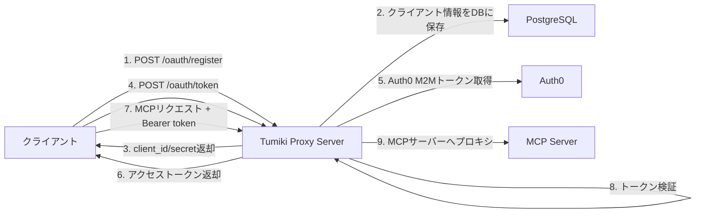

# 最もシンプルな実装プラン：Auth0 + 簡易DCRラッパー

## 概要

Auth0の単一M2Mアプリケーションを維持しつつ、最小限のDCR（Dynamic Client Registration）風APIを実装する計画です。

## なぜこれが最もシンプルか

1. **既存のAuth0設定を変更不要** - 現在の認証基盤をそのまま活用
2. **最小限のコード追加（200行程度）** - 必要最小限の実装のみ
3. **セキュリティはAuth0に依存** - 認証の複雑な部分はAuth0が担当
4. **段階的な拡張が可能** - 将来的により高度な実装への移行が容易

## アーキテクチャ概要



## 実装内容

### 1. シンプルなクライアント登録API（1ファイル）

**ファイル:** `apps/proxyServer/src/routes/oauth/simpleRegister.ts`

**エンドポイント:**
- `POST /oauth/register` - クライアント登録

**機能:**
- client_idとclient_secretの生成
- DBへの保存（既存のUserMcpServerInstanceテーブルを活用）
- 登録情報の返却

**実装例（約50行）:**
```typescript
import { db } from "@tumiki/db/tcp";
import { generateId, generateSecret, encrypt } from "../../utils/crypto.js";

export const handleSimpleRegister = async (req: Request, res: Response): Promise<void> => {
  try {
    // リクエストボディから必要な情報を取得
    const { name, redirect_uris, scope } = req.body;
    
    // クライアント認証情報の生成
    const clientId = generateId();
    const clientSecret = generateSecret();
    
    // DBに保存
    const instance = await db.userMcpServerInstance.create({
      data: {
        name: name || "OAuth Client",
        clientId,
        clientSecret: encrypt(clientSecret),
        authType: 'OAUTH',
        // 既存のフィールドも適切に設定
        userId: req.authInfo?.userId, // 認証済みユーザーのID
        mcpServerConfigId: "default", // デフォルト設定を使用
      }
    });
    
    // レスポンス返却
    res.json({
      client_id: clientId,
      client_secret: clientSecret,
      client_name: name,
      redirect_uris,
      scope,
      grant_types: ["client_credentials"],
      token_endpoint_auth_method: "client_secret_post"
    });
  } catch (error) {
    res.status(500).json({ error: "Registration failed" });
  }
};
```

### 2. トークン取得プロキシ（1ファイル）

**ファイル:** `apps/proxyServer/src/routes/oauth/simpleToken.ts`

**エンドポイント:**
- `POST /oauth/token` - トークン発行

**機能:**
- クライアント認証（client_credentials grant type）
- Auth0 M2Mトークンの取得
- トークンの返却

**実装例（約50行）:**
```typescript
import { db } from "@tumiki/db/tcp";
import { decrypt } from "../../utils/crypto.js";
import { getAuth0M2MToken } from "../../utils/auth0.js";

export const handleSimpleToken = async (req: Request, res: Response): Promise<void> => {
  try {
    const { grant_type, client_id, client_secret } = req.body;
    
    // grant_typeの検証
    if (grant_type !== "client_credentials") {
      return res.status(400).json({ 
        error: "unsupported_grant_type",
        error_description: "Only client_credentials is supported" 
      });
    }
    
    // クライアント認証
    const instance = await db.userMcpServerInstance.findUnique({
      where: { clientId: client_id }
    });
    
    if (!instance || decrypt(instance.clientSecret) !== client_secret) {
      return res.status(401).json({ 
        error: "invalid_client",
        error_description: "Client authentication failed" 
      });
    }
    
    // Auth0 M2Mトークン取得
    const auth0Token = await getAuth0M2MToken();
    
    // レスポンス返却
    res.json({
      access_token: auth0Token,
      token_type: "Bearer",
      expires_in: 86400,
      scope: "mcp:access"
    });
  } catch (error) {
    res.status(500).json({ error: "server_error" });
  }
};
```

### 3. 既存テーブルの活用

**変更対象:** `packages/db/prisma/schema/userMcpServer.prisma`

**追加フィールド:**
```prisma
model UserMcpServerInstance {
  // 既存のフィールド
  id                  String    @id @default(cuid())
  userId              String
  mcpServerConfigId   String
  authType            AuthType  @default(API_KEY)
  // ... 他の既存フィールド
  
  // DCR用の追加フィールド
  clientId            String?   @unique
  clientSecret        String?   // 暗号化して保存
  
  // インデックス
  @@index([clientId])
}
```

### 4. Auth0ヘルパー関数

**ファイル:** `apps/proxyServer/src/utils/auth0.ts`

```typescript
export const getAuth0M2MToken = async (): Promise<string> => {
  const response = await fetch(`https://${process.env.AUTH0_M2M_DOMAIN}/oauth/token`, {
    method: 'POST',
    headers: { 'Content-Type': 'application/json' },
    body: JSON.stringify({
      client_id: process.env.AUTH0_M2M_CLIENT_ID,
      client_secret: process.env.AUTH0_M2M_CLIENT_SECRET,
      audience: `https://${process.env.AUTH0_DOMAIN}/api`,
      grant_type: 'client_credentials'
    })
  });
  
  const data = await response.json();
  return data.access_token;
};
```

## 実装ステップ（2日で完了可能）

### Day 1: 基本実装

#### 1. DBマイグレーション（30分）
- UserMcpServerInstanceテーブルに`clientId`と`clientSecret`フィールドを追加
- マイグレーション実行：`pnpm db:migrate`

#### 2. ユーティリティ関数の準備（1時間）
- 暗号化/復号化関数の実装または既存のものを活用
- ID/Secret生成関数の実装
- Auth0トークン取得関数の実装

#### 3. 登録API実装（2時間）
- `simpleRegister.ts`の実装
- 入力検証の追加
- エラーハンドリングの実装

#### 4. トークンプロキシ実装（2時間）
- `simpleToken.ts`の実装
- クライアント認証ロジック
- Auth0連携の実装

### Day 2: 統合とテスト

#### 1. 既存認証ミドルウェアの調整（1時間）
- `integratedAuthMiddleware`にclientIdベースの認証を追加
- OAuthトークンの検証ロジック確認

#### 2. エンドポイント登録（30分）
```typescript
// apps/proxyServer/src/index.ts に追加
import { handleSimpleRegister } from "./routes/oauth/simpleRegister.js";
import { handleSimpleToken } from "./routes/oauth/simpleToken.js";

app.post('/oauth/register', handleSimpleRegister);
app.post('/oauth/token', handleSimpleToken);
```

#### 3. テスト作成（2時間）
- 登録フローのテスト
- トークン取得フローのテスト
- エンドツーエンドテスト

#### 4. ドキュメント更新（30分）
- APIドキュメントの作成
- 使用例の追加

## セキュリティ考慮事項

### 必須のセキュリティ対策
1. **client_secretの暗号化保存**
   - Prismaの暗号化機能を使用
   - 環境変数で暗号化キーを管理

2. **レート制限**
   - 登録エンドポイントに制限を設定
   - トークンエンドポイントにも制限を適用

3. **入力検証**
   - すべての入力パラメータを検証
   - SQLインジェクション対策

### オプションのセキュリティ強化
1. **登録時の認証**
   - 初期は認証済みユーザーのみ登録可能に
   - 管理者承認フローの追加

2. **クライアント情報の定期更新**
   - client_secretの定期的なローテーション
   - 使用されていないクライアントの自動削除

## メリット

1. **実装が超シンプル**
   - 200行以下のコード追加で実現
   - 複雑なOAuth2フローの実装不要

2. **既存システムへの影響最小**
   - Auth0設定の変更不要
   - 既存の認証フローに影響なし

3. **Auth0の課金増加なし**
   - 1つのM2Mアプリケーションのまま
   - クライアント数による課金増加なし

4. **段階的拡張可能**
   - 必要に応じて機能追加が容易
   - 将来的に本格的なDCR実装への移行も可能

## デメリットと対策

| デメリット | 対策 |
|----------|------|
| 完全なOAuth2準拠ではない | 必要最小限の機能に絞ることで実装をシンプル化 |
| スケーラビリティの制限 | 問題が発生したら本格実装に移行 |
| カスタマイズ性の制限 | 基本的なユースケースに焦点を当てる |

## 次のステップ（オプション）

必要に応じて以下の機能を追加可能：

### Phase 1: 基本的な管理機能
- `GET /oauth/clients/{client_id}` - クライアント情報取得
- `PUT /oauth/clients/{client_id}` - クライアント情報更新
- `DELETE /oauth/clients/{client_id}` - クライアント削除

### Phase 2: セキュリティ強化
- 管理画面での承認フロー
- クライアントごとのスコープ管理
- アクセストークンのリフレッシュ機能

### Phase 3: 高度な機能
- 複数のgrant_typeサポート
- JWKSエンドポイントの実装
- トークンイントロスペクション

## 必要な環境変数

```env
# Auth0設定（既存）
AUTH0_DOMAIN=your-auth0-domain.com
AUTH0_M2M_DOMAIN=your-tenant.auth0.com
AUTH0_M2M_CLIENT_ID=your-m2m-client-id
AUTH0_M2M_CLIENT_SECRET=your-m2m-client-secret

# 暗号化キー（新規追加）
ENCRYPTION_KEY=your-32-character-encryption-key
```

## テスト方法

### 1. クライアント登録
```bash
curl -X POST http://localhost:8080/oauth/register \
  -H "Content-Type: application/json" \
  -d '{
    "name": "Test Client",
    "redirect_uris": ["http://localhost:3000/callback"],
    "scope": "mcp:access"
  }'
```

### 2. トークン取得
```bash
curl -X POST http://localhost:8080/oauth/token \
  -H "Content-Type: application/json" \
  -d '{
    "grant_type": "client_credentials",
    "client_id": "返却されたclient_id",
    "client_secret": "返却されたclient_secret"
  }'
```

### 3. MCPエンドポイントへのアクセス
```bash
curl -X POST http://localhost:8080/mcp/{mcp_server_instance_id} \
  -H "Authorization: Bearer 取得したトークン" \
  -H "Content-Type: application/json" \
  -d '{"jsonrpc":"2.0","method":"tools/list","id":1}'
```

## まとめ

この実装プランは、最小限の労力で動的クライアント登録機能を実現します。Auth0の堅牢な認証基盤を活用しながら、必要な柔軟性を提供し、将来的な拡張にも対応可能な設計となっています。