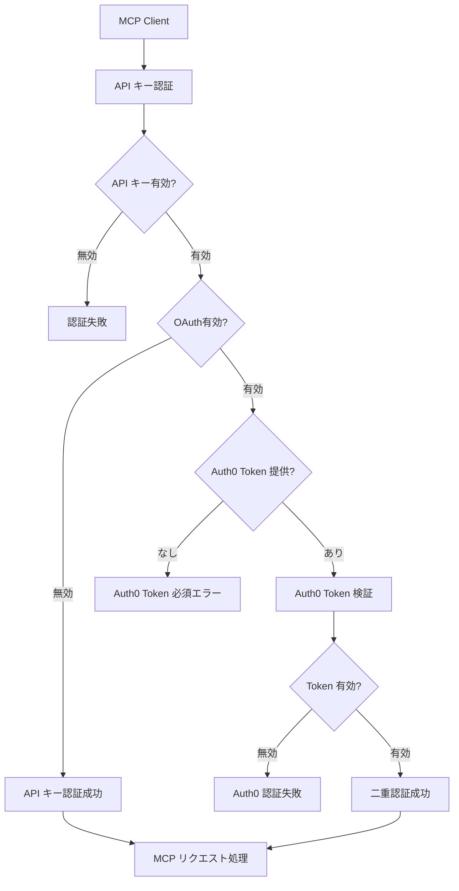

# Auth0 MCP 認証統合設計書

## 概要

Tumiki ProxyServer に Auth0 を使用した OAuth 2.1 認証機能を追加し、既存の API キー認証と併用可能な統合認証システムを構築します。

## 背景と課題

### 現状の認証システム
- **API キー認証**: 現在 `validateApiKey` 関数を使用
- **課題**: 
  - API キーの管理が煩雑
  - セキュリティレベルが限定的
  - ユーザー管理機能が不足

### 目標
- OAuth 2.1 標準に準拠した認証システム
- **重要**: API キー認証を最初に実行し、MCP インスタンスの OAuth 設定に応じて Auth0 認証を適用
- MCP サーバーの認証メタデータ対応
- スケーラブルなユーザー管理

## アーキテクチャ設計

### 1. 認証フロー



### 2. 認証メタデータエンドポイント

MCP OAuth 2.1 仕様に従い、認証サーバーメタデータを提供：

```
GET /mcp/.well-known/mcp_auth_metadata
```

レスポンス例：
```json
{
  "authorization_endpoint": "https://your-domain.auth0.com/authorize",
  "token_endpoint": "https://your-domain.auth0.com/oauth/token",
  "jwks_uri": "https://your-domain.auth0.com/.well-known/jwks.json",
  "issuer": "https://your-domain.auth0.com/",
  "supported_grant_types": ["authorization_code", "client_credentials"],
  "supported_response_types": ["code"],
  "supported_scopes": ["openid", "profile", "email"]
}
```

### 3. 統合認証システム

#### 3.1 認証コンテキスト

```typescript
interface AuthContext {
  type: 'api-key' | 'auth0-dual';  // auth0-dual は API キー + Auth0 の二重認証
  userId: string;
  email?: string;
  name?: string;
  scopes?: string[];
  userMcpServerInstance?: UserMcpServerInstance;
  // 二重認証の場合の追加情報
  auth0Info?: {
    sub: string;
    email?: string;
    name?: string;
    scopes?: string[];
  };
}
```

#### 3.2 認証結果

```typescript
interface AuthResult {
  valid: boolean;
  error?: string;
  context?: AuthContext;
  requiresApiKey?: boolean;  // Auth0 認証成功後に API キーが必要かどうか
}
```

## 実装仕様

### 1. 環境変数設定

```bash
# Auth0 設定
AUTH0_DOMAIN=your-domain.auth0.com
AUTH0_CLIENT_ID=your-client-id
AUTH0_CLIENT_SECRET=your-client-secret
AUTH0_AUDIENCE=https://your-api-identifier
AUTH0_SCOPE=openid profile email

# 既存の API キー認証も継続使用
DATABASE_URL=...
```

### 2. ファイル構成

```
apps/proxyServer/src/
├── lib/
│   ├── auth0.ts          # Auth0 認証実装
│   ├── auth.ts           # 統合認証システム
│   ├── types.ts          # 認証関連型定義
│   └── validateApiKey.ts # 既存 API キー認証
├── routes/
│   ├── auth.ts           # 認証関連エンドポイント
│   └── mcp.ts           # MCP エンドポイント（認証統合）
└── middleware/
    └── auth.ts           # 認証ミドルウェア
```

### 3. 主要コンポーネント

#### 3.1 Auth0 認証サービス (`lib/auth0.ts`)

```typescript
export class Auth0Service {
  private jwksClient: JwksClient;
  private domain: string;
  private audience: string;

  constructor(config: Auth0Config) {
    this.domain = config.domain;
    this.audience = config.audience;
    this.jwksClient = new JwksClient({
      jwksUri: `https://${config.domain}/.well-known/jwks.json`
    });
  }

  async verifyToken(token: string): Promise<AuthInfo | null> {
    // JWT トークン検証ロジック
  }

  getMetadata(): AuthMetadata {
    // 認証メタデータを返す
  }
}
```

#### 3.2 統合認証システム (`lib/auth.ts`)

```typescript
export const authenticate = async (
  authHeader: string | undefined,
  apiKey?: string,
): Promise<AuthResult> => {
  // Auth0 + API キー の二重認証を試行
  if (authHeader?.startsWith('Bearer ') && apiKey) {
    const token = authHeader.substring(7);
    const authInfo = await auth0Service.verifyToken(token);
    
    if (authInfo) {
      // Auth0 認証成功後、API キー認証も実行
      const validation = await validateApiKey(apiKey);
      if (validation.valid) {
        return {
          valid: true,
          context: {
            type: 'auth0-dual',
            userId: validation.userMcpServerInstance.userId,
            userMcpServerInstance: validation.userMcpServerInstance,
            auth0Info: {
              sub: authInfo.userId,
              email: authInfo.email,
              name: authInfo.name,
              scopes: authInfo.scopes,
            },
          },
        };
      }
    }
  }

  // API キー単独認証を試行
  if (apiKey && !authHeader?.startsWith('Bearer ')) {
    const validation = await validateApiKey(apiKey);
    if (validation.valid) {
      return {
        valid: true,
        context: {
          type: 'api-key',
          userId: validation.userMcpServerInstance.userId,
          userMcpServerInstance: validation.userMcpServerInstance,
        },
      };
    }
  }

  // Auth0 のみの場合はエラー（API キーが必要）
  if (authHeader?.startsWith('Bearer ') && !apiKey) {
    return { 
      valid: false, 
      error: 'API key required when using Auth0 authentication',
      requiresApiKey: true
    };
  }

  return { valid: false, error: 'Invalid credentials' };
};
```

#### 3.3 認証ミドルウェア (`middleware/auth.ts`)

```typescript
export const createAuthMiddleware = () => {
  return async (req: Request, res: Response, next: NextFunction) => {
    const authHeader = req.headers.authorization;
    const apiKey = req.headers['api-key'] || req.headers['x-api-key'];
    
    const authResult = await authenticate(authHeader, apiKey);
    
    if (!authResult.valid) {
      let errorResponse;
      
      if (authResult.requiresApiKey === false) {
        // OAuth有効だがAuth0トークンが不足
        errorResponse = {
          error: authResult.error || 'Auth0 token required',
          code: 'AUTH0_TOKEN_REQUIRED',
          message: 'Auth0 token is required for this MCP server instance',
        };
      } else {
        // 一般的な認証エラー
        errorResponse = {
          error: authResult.error || 'Authentication failed',
          code: 'UNAUTHORIZED',
        };
      }
      
      return res.status(401).json(errorResponse);
    }

    // Auth0 ログインできればOK（スコープチェックなし）
    req.authContext = authResult.context;
    next();
  };
};
```

### 4. エンドポイント統合

#### 4.1 認証メタデータエンドポイント

```typescript
// routes/auth.ts
app.get('/mcp/.well-known/mcp_auth_metadata', (req, res) => {
  const metadata = auth0Service.getMetadata();
  res.json(metadata);
});
```

#### 4.2 MCP エンドポイント更新

```typescript
// routes/mcp.ts
app.use('/mcp', createAuthMiddleware());
app.post('/mcp', handleMCPRequest);
```

### 5. データベース統合

#### 5.1 Auth0 ユーザー管理

Auth0 の `sub` フィールドを使ってユーザーを識別し、既存の `User` テーブルとリンク：

```sql
-- Auth0 sub を既存 User テーブルに追加
ALTER TABLE "User" ADD COLUMN "auth0Sub" VARCHAR(255) UNIQUE;

-- インデックス作成
CREATE INDEX "User_auth0Sub_idx" ON "User"("auth0Sub");
```

#### 5.2 ユーザー同期

Auth0 から初回ログイン時に自動的にユーザー情報を同期：

```typescript
const syncAuth0User = async (authInfo: AuthInfo): Promise<User> => {
  return await db.user.upsert({
    where: { auth0Sub: authInfo.userId },
    update: {
      name: authInfo.name,
      email: authInfo.email,
    },
    create: {
      auth0Sub: authInfo.userId,
      name: authInfo.name,
      email: authInfo.email,
      role: 'USER',
    },
  });
};
```

## 移行戦略

### フェーズ 1: 基盤構築
1. Auth0 認証ライブラリの実装
2. 二重認証システムの構築
3. 認証メタデータエンドポイントの追加

### フェーズ 2: 統合テスト
1. 既存 API キー単独認証との互換性確認
2. Auth0 + API キー 二重認証フローのテスト
3. スコープベースアクセス制御のテスト
4. エラーハンドリング（API キー不足時など）のテスト

### フェーズ 3: 本番展開
1. 環境変数設定
2. データベースマイグレーション
3. 段階的ロールアウト（既存 API キー認証は継続）

## セキュリティ考慮事項

### 1. トークン検証
- JWT signature の厳密な検証
- トークンの有効期限チェック
- 発行者（issuer）の検証

### 2. スコープ管理
- 最小権限の原則
- リソース別スコープ定義
- 動的スコープ検証

### 3. エラーハンドリング
- 認証エラー情報の適切な制限
- ログ記録とモニタリング
- レート制限の実装

## 運用・監視

### 1. メトリクス
- 認証成功/失敗率
- 認証方式別の使用状況
- レスポンス時間

### 2. ログ
- 認証試行の記録
- エラーログの構造化
- セキュリティイベントの追跡

### 3. アラート
- 異常な認証パターンの検出
- 認証エラー率の監視
- トークン検証失敗の追跡

## 今後の拡張

### 1. 追加認証方式
- GitHub OAuth
- Google OAuth
- SAML 2.0

### 2. 高度なセキュリティ機能
- デバイス認証
- 多要素認証
- 条件付きアクセス

### 3. パフォーマンス最適化
- トークンキャッシュ
- JWKS キャッシュ
- 非同期認証処理

---

## 参考資料

- [MCP OAuth 2.1 Authentication](https://cloud.flect.co.jp/entry/2025/05/07/100000)
- [Auth0 Documentation](https://auth0.com/docs)
- [OAuth 2.1 Specification](https://datatracker.ietf.org/doc/html/draft-ietf-oauth-v2-1)
- [JWT Best Practices](https://datatracker.ietf.org/doc/html/rfc8725)