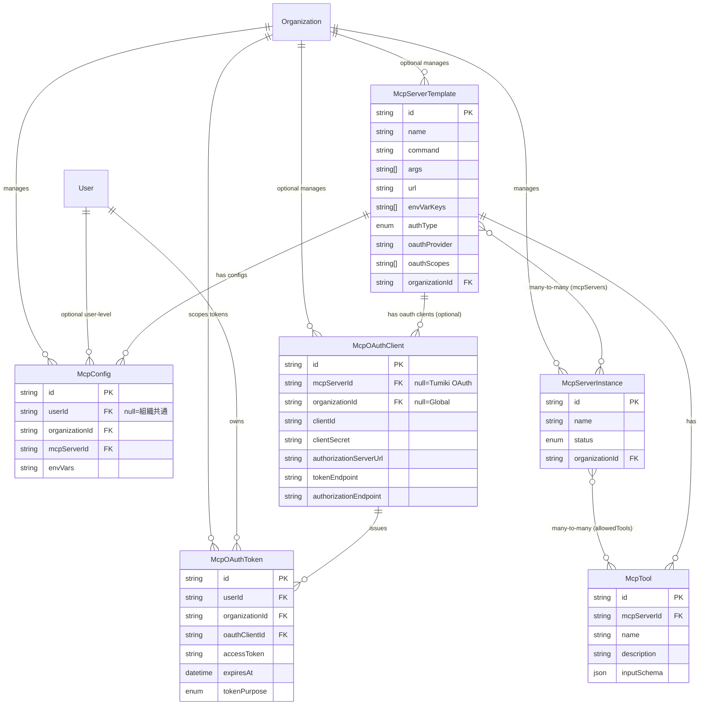

# MCPサーバーDB設計

## 基本概念

**McpServerTemplate（テンプレート）** と **McpServerInstance（実行インスタンス）** の関係は、クラスとインスタンスのような関係：

- **McpServerTemplate**: 接続情報や認証方式の「設計図」（実体なし）
- **McpServerInstance**: 実際に稼働する「インスタンス」
- 1つまたは複数の McpServerTemplate から McpServerInstance を作成可能

## テーブル一覧

| テーブル名            | 用途                                                                                                                                         |
| --------------------- | -------------------------------------------------------------------------------------------------------------------------------------------- |
| **McpServerTemplate** | MCPサーバーテンプレート（GitHub、Slack等の接続情報・認証設定） ※ `organizationId = null` の場合はアプリ提供のグローバル共通テンプレート   |
| **McpConfig**         | APIキー等の認証情報（組織レベル/ユーザーレベル） ※ `userId = null` で組織共通設定、`userId` 設定済みでユーザー個別設定                    |
| **McpTool**           | 各MCPサーバーが提供するツール一覧                                                                                                            |
| **McpServerInstance** | 実際に稼働するインスタンス（1つまたは複数のMcpServerTemplateから作成） ※ `allowedTools[]` で許可ツールを管理（Prisma暗黙的多対多）        |
| **McpOAuthClient**    | OAuthクライアント情報（DCRで動的取得、Authorization Server情報含む） ※ Tumiki自体のOAuth（第1層）と外部MCPサーバー用（第2層）の両方を管理 |
| **McpOAuthToken**     | ユーザー×組織ごとのOAuthトークン（組織分離、二層認証対応）                                                                                   |

---

## このDB設計で実現できること

### ✅ 1. 個別MCPサーバーの登録と利用

- ユーザーはGUIから様々な認証方式のMCPサーバーを登録
  - **認証なし**: `AuthType.NONE`
  - **APIキー認証**: `AuthType.API_KEY` → `McpConfig.envVars` に保存
  - **OAuth認証**: `AuthType.OAUTH` → `McpOAuthClient` + `McpOAuthToken` で管理
- 登録したサーバーを `McpServerInstance` として即座に利用可能

### ✅ 2. 複数MCPサーバーテンプレートの統合インスタンス作成

- `McpServerInstance.mcpServers[]` で複数のテンプレートから1つのインスタンスを作成
- **例**: GitHub MCP + Slack MCP + Notion MCP のテンプレートから統合インスタンスを生成
- 統合されたツール群を一括管理・利用可能

### ✅ 3. 細かいツール権限制御（ホワイトリスト方式）

**権限管理（シンプル）**:

- `McpServerInstance.allowedTools[]` で許可ツールを管理（Prisma暗黙的多対多）
- リストに含まれる = 許可、含まれない = 拒否
- **例1**: GitHub MCPの「リポジトリ作成」のみ許可 → 1つのツールIDを配列に追加
- **例2**: Slack MCPの3つのツールを許可 → 3つのツールIDを配列に追加
- **例3**: 全ツール拒否 → 空配列

**アクセスと整合性**:

- Prismaのリレーションで簡単に取得可能: `instance.allowedTools`
- 外部キー制約でツールとの整合性を保証
- **整合性保証**: 許可するツールは、インスタンスに紐づくMCPサーバーのツールのみ（アプリケーションレベルで検証）

### ✅ 4. MCPサーバーの公開・共有

- **プライベート**: 作成者のみ利用（`visibility = PRIVATE`）
- **組織内共有**: 同じ組織内で共有（`visibility = ORGANIZATION`）
- **全体公開**: すべてのユーザーに公開（`visibility = PUBLIC`）
- 公開されたサーバーへのアクセス制御:
  - **APIキー認証**: `McpServerInstance.apiKeys[]` で発行
  - **OAuth認証**: `McpOAuthClient` で組織ごとのクライアント設定

### ✅ 5. 柔軟な認証情報管理（組織共通 or ユーザー個別）

- **組織共通設定**（`userId = null`）: チーム全体で共有するAPIキー
- **ユーザー個別設定**（`userId` 設定済み）: ユーザーごとの個人APIキー
- **優先順位**: ユーザー個別設定 > 組織共通設定（個別設定があればそれを優先）
- **ユースケース例**:
  - 組織共通: 管理者が組織全体のGitHub APIキーを設定
  - ユーザー個別: メンバーが自分専用のGitHub APIキーで上書き
- **メリット**:
  - フォールバック機能（個別設定なし→組織設定を自動利用）
  - セキュリティ: ユーザーごとに異なる権限レベルのAPIキーを使用可能

### ✅ 6. 二層OAuth認証

**第1層: AIクライアント → Tumiki**:

- `McpOAuthClient`（`mcpServerId = null`）: Tumiki自体のOAuthクライアント
- `McpOAuthToken`（`TokenPurpose.TUMIKI_CLIENT`）: ユーザーのTumikiアクセストークン
- Claude Desktopなどがこのトークンを使ってTumikiにアクセス

**第2層: Tumiki → 外部MCPサーバー**:

- `McpOAuthClient`（`mcpServerId` 設定済み）: 組織×MCPサーバーごとのOAuthクライアント
- `McpOAuthToken`（`TokenPurpose.BACKEND_MCP`）: 外部サービス（GitHub等）のアクセストークン
- TumikiがこのトークンでMCPサーバーにアクセス

### ✅ 7. グローバル共通テンプレートと組織専用テンプレート

- `McpServerTemplate.organizationId` が null = アプリ提供のグローバル共通テンプレート
- `McpServerTemplate.organizationId` が設定済み = ユーザー作成の組織専用テンプレート
- 同じグローバルテンプレートでも組織ごとに異なる OAuth クライアントを設定可能

### ✅ 8. 個人組織による統一的な設計

- **すべてのユーザーは必ず組織に所属**
  - 個人ユーザー: `Organization.isPersonal = true`、`maxMembers = 1`
  - チーム組織: `Organization.isPersonal = false`、`maxMembers` は任意
- **設計のメリット**:
  - ユーザーレベル/組織レベルの区別不要
  - すべてのリソースを組織で統一管理
  - 個人→チーム移行時もデータ構造の変更不要
- **実装**: 新規ユーザー登録時に個人組織を自動作成

### ✅ 9. 組織ごとのOAuthトークン分離

- **原則**: トークンは組織ごとに発行、**組織横断で使い回さない**
- **個人組織の場合**:
  - ユーザーAが個人組織でGitHub OAuth認証 → トークンA（個人組織専用）
- **チーム組織の場合**:
  - 同じユーザーAが組織Xに参加してGitHub OAuth認証 → トークンB（組織X専用、別トークン）
  - 組織Xのメンバー各自が自分のOAuthアカウントでトークンを発行
- **セキュリティ**:
  - 組織から退出 → その組織のトークンのみ無効化
  - 組織ごとに異なる権限スコープを設定可能
  - 組織間のデータ漏洩リスクなし
- **一意性制約**: `@@unique([userId, organizationId, oauthClientId, tokenPurpose])`
- **整合性保証**: McpOAuthTokenの`organizationId`は、参照する`McpOAuthClient`の`organizationId`と一致する必要がある（アプリケーションレベルで検証）

### ✅ 10. McpConfig の優先順位とフォールバック

- **設定の取得ロジック**:
  1. ユーザー個別設定（`userId` 設定済み）があればそれを使用
  2. なければ組織共通設定（`userId = null`）を使用
  3. どちらもなければエラー

## ER図

