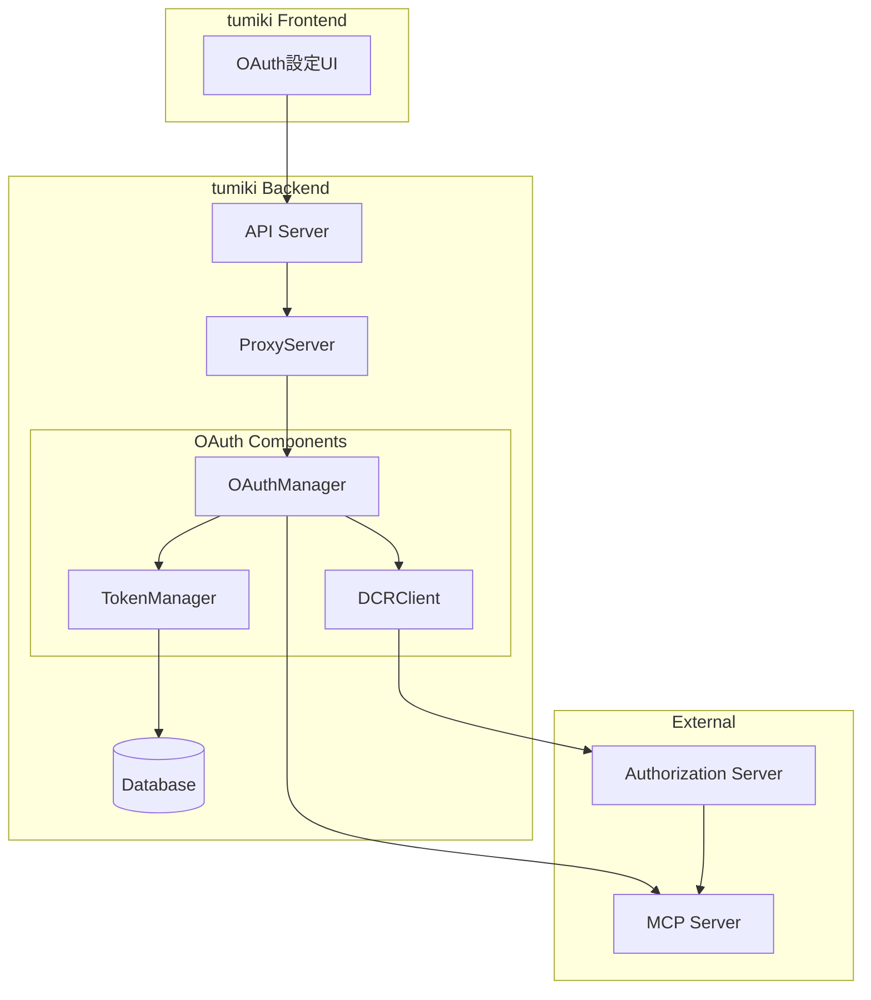
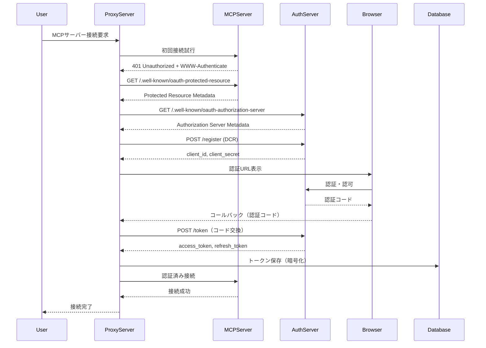
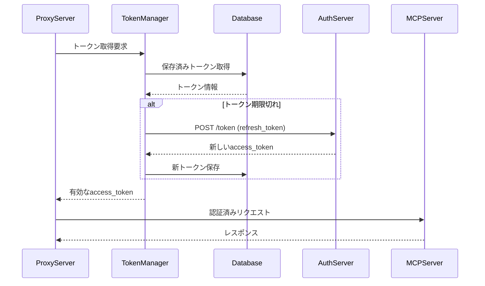

# MCP OAuth認証実装設計書

## 1. 概要

本設計書は、tumikiプロジェクトにおけるMCP (Model Context Protocol) のOAuth認証対応実装について記載します。MCP仕様に準拠し、Dynamic Client Registration (DCR) を活用した自動認証フローを実現します。

## 2. 背景と目的

### 2.1 背景

- MCPサーバーへの接続において、多くの商用APIサービス（Atlassian、Notion、Google等）がOAuth認証を要求
- 手動でのクライアント登録は運用負荷が高く、ユーザビリティを損なう
- MCP仕様はDynamic Client Registrationをサポートし、自動化された認証フローを推奨

### 2.2 目的

- OAuth認証が必要なMCPサーバーへのシームレスな接続
- Dynamic Client Registrationによる自動クライアント登録
- トークン管理の自動化（取得、リフレッシュ、永続化）
- ユーザー介入を最小限に抑えた認証フロー

## 3. MCP認証仕様

### 3.1 準拠する仕様

- **OAuth 2.1** (Draft Specification)
- **RFC 8414**: OAuth 2.0 Authorization Server Metadata
- **RFC 7591**: OAuth 2.0 Dynamic Client Registration Protocol
- **RFC 9728**: OAuth 2.0 Protected Resource Metadata
- **RFC 7636**: Proof Key for Code Exchange (PKCE)
- **RFC 8707**: Resource Indicators for OAuth 2.0

### 3.2 MCPの認証要件

1. **Protected Resource Metadata (必須)**
   - MCPサーバーはRFC 9728に準拠したメタデータを提供
   - `/.well-known/oauth-protected-resource`エンドポイント

2. **Authorization Server Discovery (必須)**
   - RFC 8414またはOpenID Connect Discovery 1.0をサポート
   - `/.well-known/oauth-authorization-server`エンドポイント

3. **Dynamic Client Registration (推奨)**
   - RFC 7591に準拠した自動クライアント登録
   - `/register`エンドポイント

4. **セキュリティ要件**
   - PKCE必須（全クライアント）
   - state パラメータの使用と検証
   - トークンのaudience検証

## 4. アーキテクチャ設計

### 4.1 システム構成



### 4.2 認証フロー

#### 4.2.1 初回認証フロー



#### 4.2.2 トークンリフレッシュフロー



### 4.3 データモデル

#### 4.3.1 OAuthClient テーブル

```prisma
model OAuthClient {
  id                String   @id @default(cuid())
  mcpServerId       String
  mcpServer         McpServer @relation(fields: [mcpServerId], references: [id])

  // DCRで取得した情報
  clientId          String   /// @encrypted
  clientSecret      String?  /// @encrypted
  registrationAccessToken String? /// @encrypted
  registrationClientUri String?

  // Authorization Server情報
  authorizationServerUrl String
  tokenEndpoint     String
  authorizationEndpoint String
  registrationEndpoint String?
  jwksUri          String?

  // メタデータ
  scopes           String[]
  grantTypes       String[]
  responseTypes    String[]

  createdAt        DateTime @default(now())
  updatedAt        DateTime @updatedAt

  @@unique([mcpServerId, clientId])
}
```

#### 4.3.2 OAuthToken テーブル

```prisma
model OAuthToken {
  id               String   @id @default(cuid())
  userMcpConfigId  String
  userMcpConfig    UserMcpServerConfig @relation(fields: [userMcpConfigId], references: [id])

  // トークン情報
  accessToken      String   /// @encrypted
  refreshToken     String?  /// @encrypted
  idToken         String?  /// @encrypted

  // トークンメタデータ
  tokenType       String   @default("Bearer")
  scope           String?
  expiresAt       DateTime

  // セッション情報
  state           String?  /// @encrypted
  nonce           String?  /// @encrypted
  codeVerifier    String?  /// @encrypted

  createdAt       DateTime @default(now())
  updatedAt       DateTime @updatedAt

  @@unique([userMcpConfigId])
}
```

## 5. 実装詳細

### 5.1 OAuthManager

**責務:**

- OAuth認証フロー全体の制御
- DCRクライアントとトークンマネージャーの調整
- エラーハンドリングとリトライロジック

**主要メソッド:**

- `authenticate(mcpServerId: string, userId: string): Promise<string>`
- `refreshToken(tokenId: string): Promise<string>`
- `revokeToken(tokenId: string): Promise<void>`

### 5.2 DCRClient

**責務:**

- Dynamic Client Registrationの実行
- Authorization Server Metadataの取得
- Protected Resource Metadataの取得

**主要メソッド:**

- `discoverAuthServer(mcpServerUrl: string): Promise<AuthServerMetadata>`
- `registerClient(authServerUrl: string, metadata: ClientMetadata): Promise<ClientCredentials>`
- `updateClient(registrationUrl: string, accessToken: string, metadata: ClientMetadata): Promise<void>`

### 5.3 TokenManager

**責務:**

- トークンの永続化と暗号化
- トークンの有効期限管理
- リフレッシュトークンによる更新

**主要メソッド:**

- `saveToken(token: TokenData): Promise<void>`
- `getValidToken(configId: string): Promise<string>`
- `refreshIfNeeded(tokenId: string): Promise<string>`

### 5.4 PKCE実装

```typescript
// PKCEチャレンジ生成
const generatePKCE = () => {
  const codeVerifier = crypto.randomBytes(96).toString("base64url");
  const codeChallenge = crypto
    .createHash("sha256")
    .update(codeVerifier)
    .digest("base64url");

  return { codeVerifier, codeChallenge };
};
```

## 6. セキュリティ考慮事項

### 6.1 トークン保護

- **暗号化**: すべてのトークンはAES-256-GCMで暗号化して保存
- **アクセス制御**: 組織単位でトークンを分離
- **最小権限**: 必要最小限のスコープのみ要求

### 6.2 通信セキュリティ

- **HTTPS必須**: すべての通信はHTTPS経由
- **PKCE必須**: 認証コード横取り攻撃を防止
- **State検証**: CSRF攻撃を防止

### 6.3 エラーハンドリング

- **トークン無効化**: エラー時は即座にトークンを無効化
- **ログサニタイゼーション**: 機密情報をログに出力しない
- **レート制限**: 認証試行回数を制限

## 7. エラー処理

### 7.1 エラーコード体系

| エラーコード | 説明               | 対処法                 |
| ------------ | ------------------ | ---------------------- |
| AUTH_001     | DCR失敗            | 手動でクライアント登録 |
| AUTH_002     | トークン取得失敗   | 再認証を実行           |
| AUTH_003     | リフレッシュ失敗   | 再認証を実行           |
| AUTH_004     | メタデータ取得失敗 | MCPサーバー設定を確認  |
| AUTH_005     | PKCE検証失敗       | 認証フローを再実行     |

### 7.2 リトライ戦略

- **指数バックオフ**: 2, 4, 8, 16秒の間隔でリトライ
- **最大リトライ回数**: 4回
- **サーキットブレーカー**: 連続失敗時は一時的に無効化

## 8. テスト計画

### 8.1 単体テスト

- OAuthManagerの各メソッド
- DCRClientのメタデータ取得とクライアント登録
- TokenManagerのトークン管理機能
- PKCE生成と検証

### 8.2 統合テスト

- 完全な認証フロー（モックサーバー使用）
- トークンリフレッシュフロー
- エラーケースの処理
- 複数MCPサーバーの同時接続

### 8.3 E2Eテスト

- 実際のMCPサーバーへの接続（テスト環境）
- ブラウザベースの認証フロー
- トークン期限切れのシミュレーション

## 9. 実装スケジュール

### Phase 1: 基盤実装（1週目）

- [ ] データベーススキーマの作成
- [ ] OAuthManager基本実装
- [ ] DCRClient実装

### Phase 2: 認証フロー実装（2週目）

- [ ] 初回認証フロー
- [ ] トークンリフレッシュ
- [ ] エラーハンドリング

### Phase 3: UI実装（3週目）

- [ ] OAuth設定画面
- [ ] 認証状態表示
- [ ] 再認証機能

### Phase 4: テストと改善（4週目）

- [ ] 単体テスト作成
- [ ] 統合テスト実装
- [ ] パフォーマンス最適化

## 10. 今後の拡張

### 10.1 短期的拡張

- 複数OAuthプロバイダーの同時サポート
- トークンローテーション機能
- 認証情報のインポート/エクスポート

### 10.2 長期的拡張

- SAML対応
- WebAuthn統合
- マルチファクタ認証サポート
- 認証プロキシサービス化

## 11. 参考資料

- [MCP Authorization Specification](https://modelcontextprotocol.io/specification/draft/basic/authorization)
- [OAuth 2.1 Draft](https://datatracker.ietf.org/doc/html/draft-ietf-oauth-v2-1)
- [RFC 7591: Dynamic Client Registration](https://tools.ietf.org/html/rfc7591)
- [RFC 9728: Protected Resource Metadata](https://tools.ietf.org/html/rfc9728)
- [RFC 8414: Authorization Server Metadata](https://tools.ietf.org/html/rfc8414)

## 12. 付録

### 12.1 用語集

| 用語 | 説明                                                   |
| ---- | ------------------------------------------------------ |
| DCR  | Dynamic Client Registration - 動的クライアント登録     |
| PKCE | Proof Key for Code Exchange - 認証コード横取り攻撃対策 |
| MCP  | Model Context Protocol - AIモデル接続プロトコル        |
| JWT  | JSON Web Token - トークン形式                          |
| JWKS | JSON Web Key Set - 公開鍵セット                        |

### 12.2 設定例

```typescript
// MCPサーバー設定例
const mcpServerConfig = {
  name: "Atlassian MCP",
  transportType: "STREAMABLE_HTTPS",
  authType: "OAUTH",
  oauthProvider: "atlassian",
  oauthScopes: [
    "read:jira-work",
    "write:jira-work",
    "read:confluence-content.all",
  ],
  url: "https://mcp.atlassian.com/v1/sse",
};

// OAuth設定例
const oauthConfig = {
  authorizationEndpoint: "https://auth.atlassian.com/authorize",
  tokenEndpoint: "https://auth.atlassian.com/oauth/token",
  registrationEndpoint: "https://auth.atlassian.com/oauth/register",
  responseTypes: ["code"],
  grantTypes: ["authorization_code", "refresh_token"],
  codeChallengeMethod: "S256",
};
```

---

_最終更新日: 2025年1月23日_
_作成者: tumiki開発チーム_
