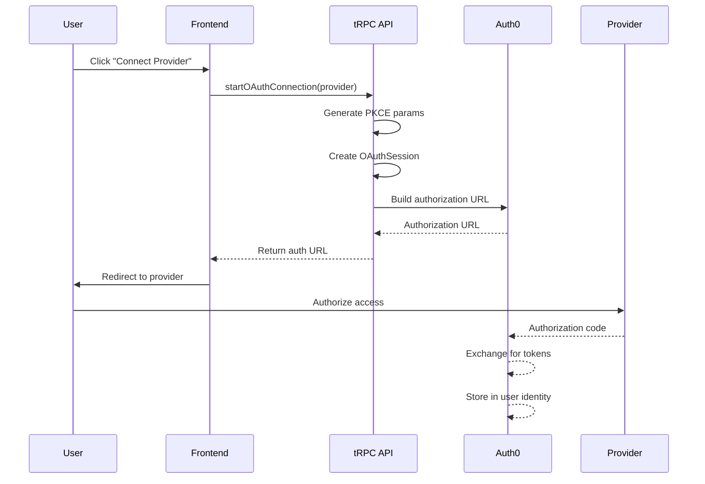
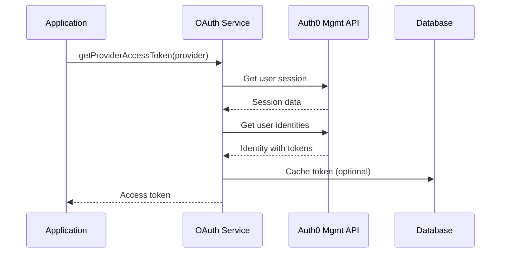

# OAuth Access Token Management Documentation

## Overview

The OAuth access token feature enables secure integration with third-party services through OAuth 2.0 authentication. This system manages OAuth client registration, token lifecycle, and secure token storage for multiple providers including Google, GitHub, Slack, Notion, LinkedIn, Figma, and Discord.

## Architecture

### Core Components

```
┌─────────────────────────────────────────────────────────┐
│                     Auth0 (Identity Provider)            │
│  ┌─────────────┐  ┌──────────────┐  ┌──────────────┐   │
│  │ Google OAuth│  │ GitHub OAuth │  │ Slack OAuth  │   │
│  └─────────────┘  └──────────────┘  └──────────────┘   │
└─────────────────────────────────────────────────────────┘
                              │
                              ▼
┌─────────────────────────────────────────────────────────┐
│                    Tumiki OAuth Layer                    │
│                                                          │
│  ┌──────────────────────────────────────────────────┐  │
│  │              packages/auth/src/oauth.ts          │  │
│  │  • getUserIdentityProviderTokens()               │  │
│  │  • getProviderAccessToken()                      │  │
│  │  • checkOAuthConnection()                        │  │
│  │  • startOAuthFlow()                             │  │
│  └──────────────────────────────────────────────────┘  │
│                                                          │
│  ┌──────────────────────────────────────────────────┐  │
│  │         Database Layer (Prisma Models)           │  │
│  │  • OAuthClient - Client registration data        │  │
│  │  • OAuthToken - User access/refresh tokens       │  │
│  │  • OAuthSession - Temp auth flow state          │  │
│  └──────────────────────────────────────────────────┘  │
└─────────────────────────────────────────────────────────┘
                              │
                              ▼
┌─────────────────────────────────────────────────────────┐
│                      tRPC API Layer                      │
│           apps/manager/src/server/api/routers/oauth      │
│  ┌──────────────────────────────────────────────────┐  │
│  │  • startOAuthConnection - Initiate OAuth flow    │  │
│  │  • getProviderAccessToken - Retrieve token       │  │
│  │  • getConnectionStatus - Check connection        │  │
│  │  • saveTokenToEnvVars - Persist to env vars     │  │
│  └──────────────────────────────────────────────────┘  │
└─────────────────────────────────────────────────────────┘
```

### Database Schema

#### OAuthClient Model

Stores OAuth client information obtained through Dynamic Client Registration (DCR).

```typescript
model OAuthClient {
  id                      String   // Unique identifier
  mcpServerId            String   // Related MCP server
  clientId               String   // @encrypted - DCR client ID
  clientSecret           String?  // @encrypted - Client secret
  registrationAccessToken String?  // @encrypted - Registration token
  authorizationServerUrl String   // Auth server URL
  tokenEndpoint          String   // Token exchange endpoint
  authorizationEndpoint  String   // Authorization endpoint
  scopes                 String[] // Requested scopes
  grantTypes            String[] // Supported grant types
  redirectUris          String[] // Configured redirect URIs
}
```

#### OAuthToken Model

Manages user-specific OAuth tokens with encryption and lifecycle management.

```typescript
model OAuthToken {
  id               String    // Unique identifier
  userMcpConfigId  String    // User's MCP configuration
  oauthClientId    String    // Related OAuth client
  accessToken      String    // @encrypted - Access token
  refreshToken     String?   // @encrypted - Refresh token
  idToken         String?    // @encrypted - ID token (OIDC)
  tokenType       String    // Token type (Bearer)
  expiresAt       DateTime? // Access token expiry
  isValid         Boolean   // Token validity status
  refreshCount    Int       // Refresh attempt counter
}
```

#### OAuthSession Model

Temporary storage for OAuth authorization flow state with PKCE support.

```typescript
model OAuthSession {
  id                  String   // Unique identifier
  sessionId          String   // Session identifier
  userId             String   // User performing auth
  mcpServerId        String   // Target MCP server
  codeVerifier       String   // @encrypted - PKCE verifier
  codeChallenge      String   // PKCE challenge
  state              String   // @encrypted - OAuth state
  nonce              String?  // @encrypted - OIDC nonce
  requestedScopes    String[] // Requested permissions
  status             String   // Flow status
  expiresAt          DateTime // Session expiry
}
```

## Authentication Flow

### 1. Initiate OAuth Connection



### 2. Token Retrieval Flow



## Security Features

### Token Encryption

All sensitive tokens are encrypted at the field level using Prisma's encryption extension:

- Access tokens
- Refresh tokens
- ID tokens
- Client secrets
- Registration tokens
- PKCE verifiers
- OAuth state parameters

### PKCE Implementation

Proof Key for Code Exchange (PKCE) is implemented for all OAuth flows:

```typescript
// PKCE generation
const codeVerifier = crypto.randomBytes(32).toString("base64url");
const codeChallenge = crypto
  .createHash("sha256")
  .update(codeVerifier)
  .digest("base64url");
const codeChallengeMethod = "S256";
```

### Session Security

- Session expiry enforcement (configurable timeout)
- State parameter validation to prevent CSRF attacks
- Nonce validation for OIDC flows
- Secure session storage with encryption

## API Reference

### tRPC Endpoints

#### startOAuthConnection

Initiates OAuth authorization flow for a provider.

```typescript
// Input
{
  provider: OAuthProvider; // "google" | "github" | "slack" | etc.
  returnTo?: string;       // Optional return URL after auth
}

// Output
{
  authUrl: string;        // Authorization URL to redirect user
  sessionId: string;      // Session identifier for tracking
}
```

#### getProviderAccessToken

Retrieves the access token for an authenticated provider.

```typescript
// Input
{
  provider: OAuthProvider; // Provider to get token for
}

// Output
{
  token: string | null; // Access token or null if not connected
}
```

#### getConnectionStatus

Checks if a provider is connected for the current user.

```typescript
// Input
{
  provider: OAuthProvider; // Provider to check
}

// Output
{
  connected: boolean;     // Connection status
  expiresAt?: Date;      // Token expiry if connected
}
```

#### saveTokenToEnvVars

Persists OAuth tokens to environment variables for MCP server usage.

```typescript
// Input
{
  provider: OAuthProvider;  // Provider
  envVarName: string;       // Environment variable name
  mcpServerId: string;      // Target MCP server
}

// Output
{
  success: boolean;        // Operation status
  message?: string;        // Error message if failed
}
```

### OAuth Service Functions

#### getUserIdentityProviderTokens

Core function to retrieve tokens from Auth0 user identities.

```typescript
async function getUserIdentityProviderTokens(
  userId: string,
  provider: OAuthProvider,
): Promise<string | null>;
```

#### getProviderAccessToken

High-level function to get provider access token with session validation.

```typescript
async function getProviderAccessToken(
  provider: OAuthProvider,
  request?: NextRequest,
): Promise<string | null>;
```

#### checkOAuthConnection

Verifies if a provider is connected for the current session.

```typescript
async function checkOAuthConnection(
  provider: OAuthProvider,
  request?: NextRequest,
): Promise<boolean>;
```

#### startOAuthFlow

Initiates OAuth authorization flow with Auth0.

```typescript
async function startOAuthFlow(
  provider: OAuthProvider,
  scopes: string[],
  returnTo?: string,
): Promise<{ authUrl: string }>;
```

## Provider Configuration

### Supported Providers

| Provider | Connection Name    | Default Scopes       | Use Case                    |
| -------- | ------------------ | -------------------- | --------------------------- |
| Google   | google-oauth2      | openid profile email | Google services integration |
| GitHub   | github             | read:user repo       | Code repository access      |
| Slack    | sign-in-with-slack | identity.basic       | Team messaging              |
| Notion   | Notion             | read_content         | Documentation access        |
| LinkedIn | linkedin           | r_liteprofile        | Professional network        |
| Figma    | figma              | file_read            | Design file access          |
| Discord  | discord            | identify             | Community integration       |

### Provider-Specific Configuration

Each provider requires configuration in Auth0:

1. Create social connection in Auth0 Dashboard
2. Configure OAuth app in provider's developer console
3. Set redirect URI: `https://[auth0-domain]/login/callback`
4. Configure required scopes in Auth0 connection settings

## Error Handling

### Error Codes

```typescript
enum OAuthErrorCode {
  UNAUTHORIZED = "UNAUTHORIZED", // No valid session
  NO_ACCESS_TOKEN = "NO_ACCESS_TOKEN", // Provider not connected
  CONNECTION_FAILED = "CONNECTION_FAILED", // Network/API failure
  INVALID_PROVIDER = "INVALID_PROVIDER", // Unsupported provider
  TOKEN_EXPIRED = "TOKEN_EXPIRED", // Access token expired
  REFRESH_FAILED = "REFRESH_FAILED", // Token refresh failed
  UNKNOWN_ERROR = "UNKNOWN_ERROR", // Unexpected error
}
```

### Error Response Format

```typescript
class OAuthError extends Error {
  name: "OAuthError";
  code: OAuthErrorCode;
  provider?: OAuthProvider;
  originalError?: unknown;
}
```

## Integration Guide

### Frontend Integration

```typescript
// Connect a provider
const connectProvider = async (provider: OAuthProvider) => {
  const { authUrl } = await trpc.oauth.startOAuthConnection.mutate({
    provider,
    returnTo: window.location.href,
  });
  window.location.href = authUrl;
};

// Check connection status
const { data: status } = trpc.oauth.getConnectionStatus.useQuery({
  provider: "github",
});

// Use access token
const { data: token } = trpc.oauth.getProviderAccessToken.useQuery({
  provider: "github",
});
```

### MCP Server Integration

```typescript
// In MCP server environment variable configuration
const setupOAuthToken = async (mcpServerId: string) => {
  await trpc.oauth.saveTokenToEnvVars.mutate({
    provider: "github",
    envVarName: "GITHUB_TOKEN",
    mcpServerId,
  });
};
```

## Token Lifecycle Management

### Token Refresh Strategy

1. Check token expiry before use
2. If expired and refresh token exists, attempt refresh
3. If refresh fails, mark token invalid and require re-authentication
4. Track refresh count to prevent infinite loops

### Token Invalidation

Tokens are invalidated when:

- Manual disconnection by user
- Refresh failure after max attempts
- Provider revokes access
- Security breach detection

## Monitoring and Debugging

### Logging Points

- OAuth flow initiation
- Token retrieval attempts
- Token refresh operations
- Error occurrences with context

### Metrics to Track

- Connection success rate per provider
- Token refresh frequency
- Average token lifetime
- Error rate by error code

## Best Practices

### Security

1. Always use PKCE for OAuth flows
2. Encrypt all sensitive data at rest
3. Implement token rotation
4. Monitor for suspicious token usage patterns
5. Set appropriate token expiry times

### Performance

1. Cache tokens appropriately
2. Implement exponential backoff for retries
3. Use connection pooling for database access
4. Batch token operations when possible

### User Experience

1. Provide clear connection status indicators
2. Handle expired tokens gracefully
3. Offer easy reconnection options
4. Show meaningful error messages

## Migration and Upgrades

### Adding New Providers

1. Add provider to `OAUTH_PROVIDERS` constant
2. Configure Auth0 social connection
3. Add provider-specific connection mapping
4. Test authorization flow end-to-end
5. Update documentation

### Schema Migrations

Use Prisma migrations for schema changes:

```bash
cd packages/db
pnpm db:migrate:dev --name add_oauth_feature
pnpm db:push
```

## Troubleshooting

### Common Issues

| Issue             | Cause                  | Solution                |
| ----------------- | ---------------------- | ----------------------- |
| Token not found   | Provider not connected | Initiate OAuth flow     |
| Token expired     | Natural expiry         | Implement refresh logic |
| Connection failed | Network/API issues     | Check Auth0 status      |
| Invalid provider  | Typo or unsupported    | Verify provider name    |
| PKCE mismatch     | Session expired        | Restart OAuth flow      |

### Debug Commands

```bash
# Check OAuth session status
pnpm db:studio
# Query OAuthSession table

# Verify Auth0 configuration
curl https://[auth0-domain]/.well-known/openid-configuration

# Test token retrieval
curl -X GET http://localhost:3000/api/trpc/oauth.getProviderAccessToken
```
