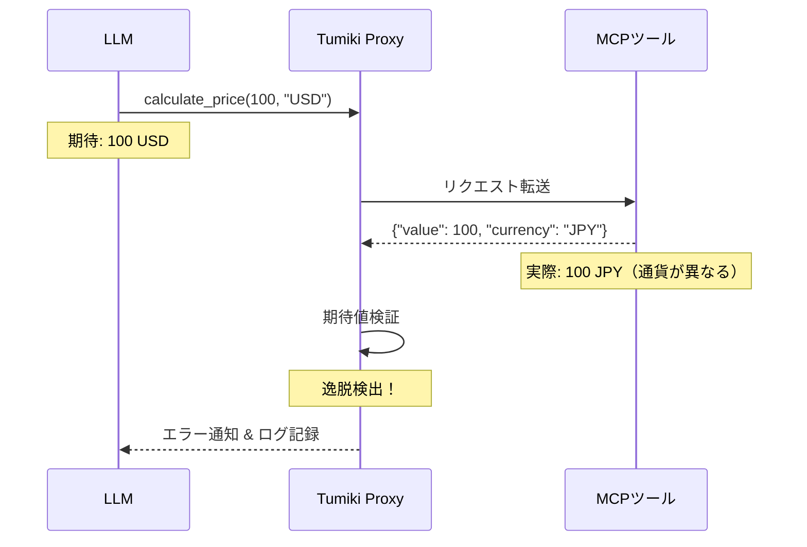
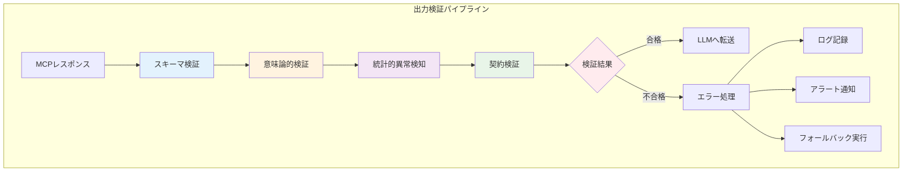
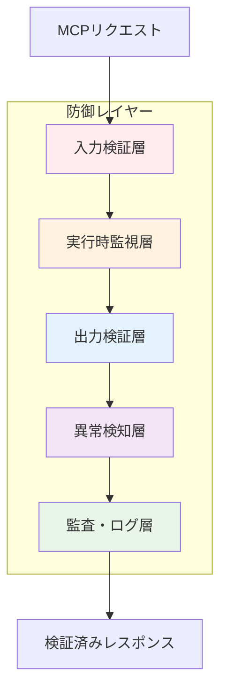

# MCP入力出力期待値逸脱リスクへの対応

## 概要

MCPツールの入力出力が期待値から逸脱するリスクは、LLMのハルシネーションと同様に重要なセキュリティリスクです。本文書では、Tumiki Proxy Serverにおけるこのリスクへの体系的な対応方法を提案します。

## 新たに識別されたMCP脅威カテゴリ

### MCPツール出力逸脱攻撃（MCP Tool Output Deviation Attacks）

MCPツールがLLMの期待する出力から意図的または非意図的に逸脱する攻撃パターン：

#### 攻撃パターンの分類

| 攻撃タイプ               | 説明                                       | 検知難易度 | 影響度 |
| ------------------------ | ------------------------------------------ | ---------- | ------ |
| **サイレント逸脱**       | 正常に見えるが微妙に異なる結果を返す       | 高         | 中〜高 |
| **累積的ドリフト**       | 時間経過とともに徐々に期待値から外れていく | 極高       | 高     |
| **コンテキスト依存逸脱** | 特定の入力パターンでのみ異常な出力         | 高         | 中     |
| **型変換エラー**         | データ型の暗黙的変換による意図しない動作   | 中         | 低〜中 |

#### 具体的な攻撃シナリオ



### MCPインターフェースハルシネーション（MCP Interface Hallucination）

MCPツールの仕様とLLMの理解のミスマッチを悪用した脅威：

#### ミスマッチの種類

| ミスマッチタイプ     | 原因                                       | リスクレベル | 対策優先度 |
| -------------------- | ------------------------------------------ | ------------ | ---------- |
| **パラメータ誤解釈** | LLMが誤ったパラメータ形式で呼び出し        | 中           | 高         |
| **機能範囲誤認**     | ツールの能力を超えた使用による予期せぬ動作 | 高           | 高         |
| **バージョン差異**   | APIバージョンの違いによる挙動の不一致      | 中           | 中         |
| **暗黙的前提条件**   | 文書化されていない前提条件の違反           | 高           | 極高       |

## Tumiki Proxy Serverでの検証実装

### MCPツール出力検証システム



### 検証レイヤーの詳細

#### 1. スキーマ検証と改ざん防止

- **実装技術**: Zodによる型検証 + SHA-256ハッシュ検証
- **検出対象**: MCP規格からの逸脱、ツール定義の不正な変更
- **対応方法**:
  - MCP仕様に準拠したZodスキーマを定義（JSON-RPC 2.0形式）
  - MCPツールのレスポンスが規格に準拠しているか型安全に検証
  - 型の不一致、必須フィールドの欠落、予期しないプロパティを検出
  - ツール定義のSHA-256ハッシュを定期的に検証し、改ざんを検知
  - MCP特有のエラーコード（-32600〜-32603）の適切な処理
  - 違反時は構造化されたエラーメッセージを返し、LLMに詳細を提供

#### 2. 意味論的検証とコンテンツセキュリティ

- **実装技術**: 期待値マッチング + パターン分析
- **検出対象**: 論理的な不整合、プロンプトインジェクション、機密情報漏洩
- **対応方法**:
  - ビジネスルールエンジンで業務ロジックの妥当性を検証
  - 例: 価格計算では負の値を拒否、通貨コードの一致を確認
  - 日付の論理的整合性（開始日 < 終了日）を検証
  - 数値範囲の妥当性（0-100%の範囲など）をチェック
  - プロンプトインジェクションパターンの検出（「無視して」「代わりに」等）
  - PII（個人識別情報）の自動検出とマスキング
  - APIキー、パスワード等のシークレット情報のブロック
  - コンテキストに応じた条件付き検証（ユーザーロールによる制限など）

#### 3. 統計的異常検知とフロー分析

- **実装技術**: ベースライン比較 + ツール連鎖分析
- **検出対象**: 異常な出力パターン、危険なツール実行順序
- **対応方法**:
  - 過去の正常な出力データから統計的ベースラインを構築
  - 移動平均、標準偏差を用いて正常範囲を動的に設定
  - 時系列異常検知アルゴリズムで傾向を分析
  - ツール実行の依存関係グラフを構築し、危険な組み合わせを検出
  - 読み取り→外部送信、権限昇格→データアクセス等のリスクパターンを識別
  - 出力値が統計的に有意に逸脱した場合にアラート
  - 季節性や周期性を考慮した異常判定

#### 4. 契約検証とポリシー適用

- **実装技術**: Pre/Post条件チェック + カスタムガードレール
- **検出対象**: API契約違反、組織ポリシー違反
- **対応方法**:
  - Design by Contract原則に基づく事前条件・事後条件の定義
  - 事前条件: 入力パラメータの妥当性、システム状態の確認
  - 事後条件: 出力が満たすべき不変条件の検証
  - 承認済みMCPサーバーとツールのホワイトリスト管理
  - ロールベースのツールアクセス制御（RBAC）
  - 時間帯、場所、デバイスに基づく動的制限
  - YAMLベースのカスタムポリシー定義と評価
  - 副作用の検証（状態変更が期待通りか）
  - 契約違反時の自動ロールバック機構

## リスク評価マトリックス

### 脅威の定量的評価

| MCP脅威カテゴリ                         | 影響度 | 発生確率 | 検知困難度 | 総合リスクスコア |
| --------------------------------------- | ------ | -------- | ---------- | ---------------- |
| **MCP出力逸脱攻撃**                     | 高     | 高       | 中         | 8.0              |
| **MCPインターフェースハルシネーション** | 中     | 高       | 高         | 7.5              |
| **サイレント逸脱**                      | 極高   | 中       | 極高       | 8.8              |
| **累積的ドリフト**                      | 高     | 中       | 極高       | 8.3              |
| **パラメータ誤解釈**                    | 中     | 高       | 低         | 6.5              |

### リスクスコア算出方法

```text
総合リスクスコア = (影響度 × 0.4) + (発生確率 × 0.3) + (検知困難度 × 0.3)

各要素のスコア:
- 極高: 10
- 高: 8
- 中: 5
- 低: 3
```

## 防御戦略

### 多層防御アプローチ



### 実装優先順位

1. **即時対応（Priority 1）**
   - JSON Schema検証の実装
   - 基本的な意味論的検証
   - エラーログの強化

2. **短期対応（Priority 2）**
   - 統計的異常検知の導入
   - 契約ベース検証の実装
   - アラート機能の追加

3. **中期対応（Priority 3）**
   - 機械学習ベースの異常検知
   - 自動修復機能
   - 予測的防御機能

## 監視とアラート

### 主要メトリクス

| メトリクス         | 閾値   | アラートレベル | 対応アクション     |
| ------------------ | ------ | -------------- | ------------------ |
| **逸脱率**         | >5%    | Warning        | 手動レビュー       |
| **異常スコア**     | >0.8   | Critical       | 自動ブロック       |
| **検証失敗率**     | >10%   | Error          | MCPツール無効化    |
| **レスポンス時間** | >500ms | Warning        | パフォーマンス調査 |

### ダッシュボード例

```text
┌─────────────────────────────────────────┐
│        MCP出力検証ダッシュボード          │
├─────────────────────────────────────────┤
│ 📊 24時間統計                           │
│ ├─ 総リクエスト: 125,432               │
│ ├─ 検証成功: 124,891 (99.57%)          │
│ ├─ 逸脱検出: 541 (0.43%)               │
│ └─ ブロック: 23 (0.02%)                │
├─────────────────────────────────────────┤
│ ⚠️ アクティブアラート                    │
│ ├─ [WARN] tool_xyz 逸脱率上昇中         │
│ └─ [INFO] 新規MCPツール検出             │
├─────────────────────────────────────────┤
│ 📈 トレンド                              │
│ └─ 過去7日間の逸脱率: ↓ 12%改善        │
└─────────────────────────────────────────┘
```

## 今後の拡張提案

### 技術的課題と解決策

| 課題                                 | 現状           | 提案される解決策          | 期待効果         |
| ------------------------------------ | -------------- | ------------------------- | ---------------- |
| **リアルタイム検証のオーバーヘッド** | レイテンシ増加 | 非同期検証 + キャッシング | 応答時間30%改善  |
| **偽陽性の削減**                     | 誤検知率3%     | コンテキスト認識型検証    | 誤検知率<1%      |
| **新規MCPツールへの対応**            | 手動設定必要   | 自動学習型プロファイル    | 自動適応率95%    |
| **大規模環境でのスケーラビリティ**   | 単一検証ノード | 分散検証アーキテクチャ    | 10倍スループット |

## まとめ

MCPツールの入力出力期待値からの逸脱は、Tumiki Proxy Serverの統合セキュリティフレームワークにおいて重要な対象領域です。本提案により：

1. **体系的なリスク分類**: MCPハルシネーションリスクを明確に定義
2. **包括的な検証システム**: 多層防御による堅牢な検証パイプライン
3. **実装可能な対策**: 段階的に導入可能な具体的な実装方法
4. **継続的な改善**: 監視・アラート・自動修復による進化型防御

これらの対策により、LLMとMCPツール間の期待値ミスマッチを効果的に検出・防御し、より安全なMCP生態系の実現に貢献できます。
