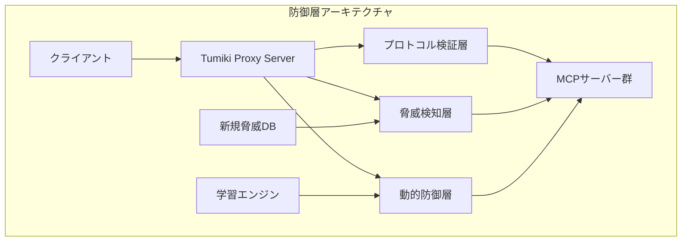
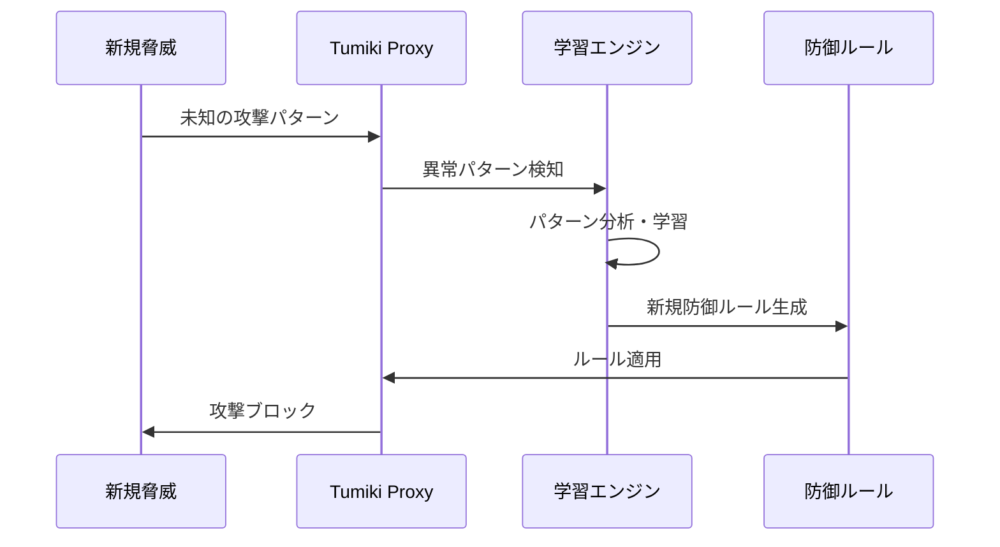
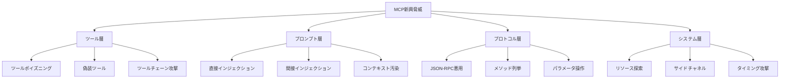

# MCP脆弱性タイプの拡張性と対応戦略

## MCP脆弱性の包括的分類

### HTTP通信基盤由来の既存脆弱性

MCPはHTTPプロトコル上で動作するため、**従来のWeb アプリケーション脆弱性がそのまま適用されます**：

#### 通信レベルの脅威

- **Man-in-the-Middle攻撃**: HTTPS未使用時の通信傍受・改ざん
- **CSRF（Cross-Site Request Forgery）**: 不正なMCPリクエストの送信
- **HTTPヘッダーインジェクション**: 悪意のあるヘッダー情報の挿入
- **SSL/TLS脆弱性**: 暗号化通信の弱点を突く攻撃

#### 認証・セッション関連

- **セッションハイジャック**: MCPセッションの不正取得
- **認証バイパス**: 認証機構の回避
- **ブルートフォース攻撃**: APIキーやトークンの総当たり攻撃

### MCP特有の新興脆弱性

**ご指摘いただいた通り、MCPの未成熟性により特有の脆弱性が存在します**：

#### ツールポイズニング（Tool Poisoning）

- 悪意のあるMCPツールの登録・実行
- 正常なツールの動作を模倣した偽装ツール
- ツールレスポンスの汚染による誤情報注入

#### プロンプトインジェクション攻撃

- MCPツール経由での不正なプロンプト注入
- システムプロンプトの書き換え・迂回
- 間接的なプロンプト操作による権限昇格

#### MCP プロトコル特有の脅威

- **JSON-RPC悪用**: 不正なメソッド呼び出しやパラメータ操作
- **ツールディスカバリー攻撃**: 利用可能ツールの不正探索
- **リソース列挙攻撃**: MCPサーバーが公開するリソースの網羅的取得

## リバースプロキシアーキテクチャの戦略的優位性

### 将来の脆弱性への予防的対応

**Tumiki Proxy Serverのリバースプロキシアーキテクチャは、未知の脆弱性に対しても有効な防御機構を提供します**：

**プロキシ配置による防御効果**：

| 防御層 | 対応可能な脅威 | 新規脅威への適応性 |
|--------|---------------|-------------------|
| **プロトコル検証** | HTTP/MCP規格違反、不正フォーマット | ★★★★★（規格準拠チェック） |
| **動的脅威検知** | 既知・未知攻撃パターン | ★★★★☆（機械学習による適応） |
| **行動分析** | 異常なアクセスパターン | ★★★★★（統計的異常検知） |
| **コンテンツフィルタリング** | データ漏洩、コード注入 | ★★★☆☆（パターンマッチング拡張） |

### 新規脆弱性への迅速対応体制

#### 1. ゼロデイ脆弱性対応

- **緊急パッチ配信**: プロキシ経由での即座の防御ルール適用
- **一時的遮断**: 危険な通信パターンの即座ブロック
- **段階的復旧**: 安全性確認後の段階的サービス復旧

#### 2. 脅威インテリジェンス統合

- **外部脅威DB連携**: CVE、OWASP等との自動同期
- **コミュニティ脅威報告**: 研究者・実装者からの脅威情報収集
- **AIベース脅威予測**: パターン学習による新規脅威の予兆検知

#### 3. 適応型防御機構

## 結論

**リバースプロキシアーキテクチャにより、MCPエコシステムに新たな脅威が発見されても、中央集権的かつ迅速な対応が可能となり、すべてのMCPクライアントに対して一定水準のセキュリティを即座に提供できます。**

これは従来の各クライアント個別対応では不可能な、**生態系レベルでのセキュリティ担保**を実現する革新的なアプローチです。

---

## 付録：脆弱性分類マトリクス

### 既存HTTP脆弱性のMCP適用

| 脆弱性カテゴリ | HTTP一般 | MCP特有の影響 | Tumiki対策 |
|--------------|----------|--------------|------------|
| **認証・認可** | OAuth/JWT悪用 | MCPツール権限昇格 | 統合認証管理 |
| **セッション管理** | Cookie改ざん | MCPセッション固定 | セッション隔離 |
| **入力検証** | SQLインジェクション | JSON-RPC改ざん | 入力サニタイゼーション |
| **暗号化** | SSL/TLS脆弱性 | MCP通信傍受 | TLS 1.3強制 |
| **DoS攻撃** | リソース枯渇 | MCPサーバー過負荷 | レート制限・負荷分散 |

**用語説明**:
- *OAuth/JWT*: 認証・認可のための標準プロトコルとトークン形式
- *SQLインジェクション*: データベースへの不正なSQL文の注入攻撃
- *DoS攻撃*: Denial of Service（サービス拒否攻撃）、システムを利用不能にする攻撃
- *サニタイゼーション*: 入力データから危険な要素を除去・無害化する処理

### MCP新興脅威の詳細分析

---

*本文書は、MCPセキュリティにおける包括的な脆弱性対応戦略を示すものであり、Tumiki Proxy Serverの継続的な進化により、MCPエコシステム全体のセキュリティ向上に貢献することを目的としています。*
