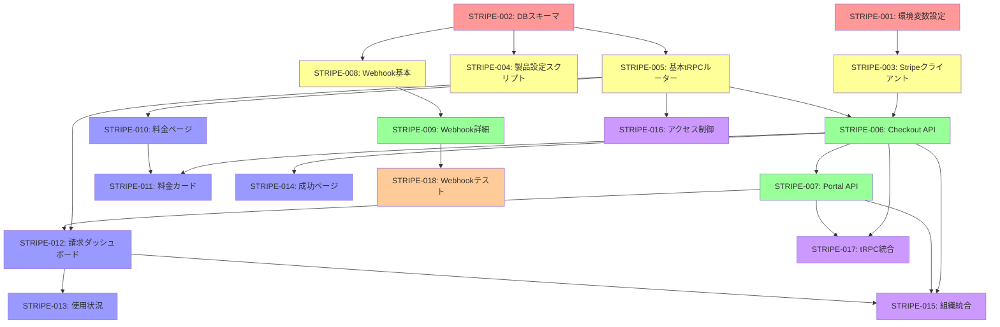

# Tumiki Manager - Stripe統合実装計画

## 概要

Tumiki ManagerにStripe Checkoutを使用した月額課金機能を実装します。個人向けプロプラン、チームプラン、エンタープライズプランの3つのプランを提供し、安全で使いやすい支払いフローを構築します。

## 実装チケット一覧

### 🔴 必須前提チケット（最初に実行）

#### STRIPE-001: 環境変数とStripeアカウント設定

**依存関係**: なし  
**内容**:

- Stripeアカウントの作成/設定
- 環境変数の追加（STRIPE_SECRET_KEY、STRIPE_WEBHOOK_SECRET、NEXT_PUBLIC_STRIPE_PUBLISHABLE_KEY）
- Stripe CLIのインストールと設定（開発環境用）

#### STRIPE-002: データベーススキーマ設計

**依存関係**: なし  
**内容**:

- `packages/db/prisma/schema/subscription.prisma`の作成
- Plan、Subscription、StripeWebhookEventモデルの定義
- 既存のUser、Organizationモデルへのstripeカスタマーフィールド追加
- Prismaマイグレーションの作成と実行

### 🟡 バックエンド基盤チケット（STRIPE-001, 002完了後に並列実行可能）

#### STRIPE-003: Stripeクライアント設定

**依存関係**: STRIPE-001  
**内容**:

- `apps/manager/src/lib/stripe.ts`の作成
- Stripeクライアントの初期化
- プラン定数（PLANS）の定義

#### STRIPE-004: Stripe製品初期設定スクリプト

**依存関係**: STRIPE-002, STRIPE-003  
**内容**:

- `scripts/setup-stripe-products.ts`の作成
- 3つのプラン（個人、チーム、エンタープライズ）のStripe製品作成
- データベースへのプラン情報の保存

#### STRIPE-005: 基本的なサブスクリプションtRPCルーター

**依存関係**: STRIPE-002  
**内容**:

- `apps/manager/src/server/api/routers/subscription/index.ts`の作成
- getCurrentSubscription（現在のサブスクリプション取得）
- getAvailablePlans（利用可能なプラン一覧取得）

### 🟢 コア機能チケット（基盤チケット完了後）

#### STRIPE-006: Stripe Checkout tRPCルーター

**依存関係**: STRIPE-003, STRIPE-005  
**内容**:

- `apps/manager/src/server/api/routers/stripe/index.ts`の作成
- createCheckoutSession（Checkoutセッション作成）
- confirmCheckoutSession（支払い確認）
- 権限チェックロジック（組織の管理者のみ購入可能）

#### STRIPE-007: Customer Portal統合

**依存関係**: STRIPE-006  
**内容**:

- createCustomerPortalSession（Customer Portalセッション作成）
- 個人/組織の切り替えロジック

#### STRIPE-008: Webhook基本処理

**依存関係**: STRIPE-002  
**内容**:

- `apps/manager/src/app/api/webhooks/stripe/route.ts`の作成
- Webhook署名検証
- 冪等性チェック（StripeWebhookEvent）
- イベントタイプごとの処理スタブ

#### STRIPE-009: Webhook詳細処理実装

**依存関係**: STRIPE-008  
**内容**:

- checkout.session.completed処理
- customer.subscription.created/updated処理
- customer.subscription.deleted処理
- invoice.payment_succeeded/failed処理

### 🔵 フロントエンドチケット（並列実行可能、ただし対応するバックエンドAPI完了後）

#### STRIPE-010: 料金ページ基本実装

**依存関係**: STRIPE-005  
**内容**:

- `apps/manager/src/app/(lp)/pricing/page.tsx`の更新
- プラン一覧の表示
- 基本的なレイアウトとスタイリング

#### STRIPE-011: 料金カードコンポーネント

**依存関係**: STRIPE-006, STRIPE-010  
**内容**:

- `apps/manager/src/app/(lp)/pricing/_components/PricingCard.tsx`の作成
- Stripe Checkout統合
- ログイン状態のチェックとリダイレクト

#### STRIPE-012: 請求管理ダッシュボード

**依存関係**: STRIPE-005, STRIPE-007  
**内容**:

- `apps/manager/src/app/(auth)/billing/page.tsx`の作成
- 現在のプラン表示
- Customer Portalへのリンク

#### STRIPE-013: 使用状況表示コンポーネント

**依存関係**: STRIPE-012  
**内容**:

- getUsageStats tRPCメソッドの実装（バックエンド）
- 使用状況の視覚化（プログレスバー）
- 制限に近づいた際の警告表示

#### STRIPE-014: 支払い成功ページ

**依存関係**: STRIPE-006  
**内容**:

- `apps/manager/src/app/(auth)/billing/success/page.tsx`の作成
- Checkoutセッションの確認
- 成功/エラー表示

### 🟣 統合・拡張チケット

#### STRIPE-015: 組織向け機能統合

**依存関係**: STRIPE-006, STRIPE-007, STRIPE-012  
**内容**:

- 組織セレクターとの統合
- 組織向けプラン購入フロー
- 組織メンバー数制限の実装

#### STRIPE-016: 機能アクセス制御

**依存関係**: STRIPE-005  
**内容**:

- checkFeatureAccess tRPCメソッドの実装
- プランに基づく機能制限
- UI要素の条件付き表示

#### STRIPE-017: tRPCルーターの統合

**依存関係**: STRIPE-006, STRIPE-007  
**内容**:

- `apps/manager/src/server/api/root.ts`への統合
- stripeRouter、subscriptionRouterの追加

### 🟠 テスト・品質保証チケット

#### STRIPE-018: Webhook開発環境テスト

**依存関係**: STRIPE-008, STRIPE-009  
**内容**:

- Stripe CLIを使用したWebhookテスト環境の構築
- 各Webhookイベントのテストケース作成

#### STRIPE-019: エラーハンドリング強化

**依存関係**: すべてのコア機能チケット  
**内容**:

- 支払い失敗時の処理
- ネットワークエラー対応
- ユーザーフレンドリーなエラーメッセージ

#### STRIPE-020: セキュリティレビュー

**依存関係**: すべてのチケット  
**内容**:

- 権限チェックの確認
- Webhook署名検証の確認
- 機密情報の取り扱い確認

### 📊 実装順序の推奨フロー



## 詳細実装内容

### 1. データベース設計

#### 1.1 Prismaスキーマの拡張

`packages/db/prisma/schema/subscription.prisma`を新規作成:

```prisma
model Plan {
  id            String         @id @default(cuid())
  name          String
  description   String?
  stripePriceId String         @unique
  amount        Int
  currency      String         @default("jpy")
  interval      String         @default("month")
  features      Json
  limits        Json
  type          PlanType
  isActive      Boolean        @default(true)

  createdAt     DateTime       @default(now())
  updatedAt     DateTime       @updatedAt

  subscriptions Subscription[]
}

model Subscription {
  id                     String             @id @default(cuid())
  userId                 String?
  organizationId         String?
  stripeSubscriptionId   String             @unique
  stripeCustomerId       String
  stripePriceId          String
  stripeCurrentPeriodEnd DateTime

  status                 SubscriptionStatus @default(incomplete)
  planId                 String

  createdAt             DateTime           @default(now())
  updatedAt             DateTime           @updatedAt

  user                  User?              @relation(fields: [userId], references: [id])
  organization          Organization?      @relation(fields: [organizationId], references: [id])
  plan                  Plan               @relation(fields: [planId], references: [id])

  @@index([userId])
  @@index([organizationId])
  @@index([status])
}

model StripeWebhookEvent {
  id              String   @id @default(cuid())
  stripeEventId   String   @unique
  type            String
  data            Json
  processedAt     DateTime @default(now())

  @@index([type])
  @@index([processedAt])
}

enum PlanType {
  INDIVIDUAL
  TEAM
  ENTERPRISE
}

enum SubscriptionStatus {
  incomplete
  incomplete_expired
  trialing
  active
  past_due
  canceled
  unpaid
}
```

`packages/db/prisma/schema/organization.prisma`に以下を追加:

```prisma
model Organization {
  // 既存のフィールド...

  stripeCustomerId String?         @unique
  subscription     Subscription?
}
```

`packages/db/prisma/schema/auth.prisma`に以下を追加:

```prisma
model User {
  // 既存のフィールド...

  stripeCustomerId String?         @unique
  subscription     Subscription?
}
```

#### 1.2 環境変数の追加

`.env`に以下を追加:

```bash
# Stripe
STRIPE_SECRET_KEY=sk_test_...
STRIPE_WEBHOOK_SECRET=whsec_...
NEXT_PUBLIC_STRIPE_PUBLISHABLE_KEY=pk_test_...
```

### 2. バックエンド実装

#### 2.1 Stripeクライアントの設定

`apps/manager/src/lib/stripe.ts`:

```typescript
import Stripe from "stripe";

export const stripe = new Stripe(process.env.STRIPE_SECRET_KEY!, {
  apiVersion: "2024-11-20.acacia",
  typescript: true,
});

export const PLANS = {
  INDIVIDUAL: {
    name: "プロプラン",
    description: "個人向けの高機能プラン",
    amount: 1980,
    features: [
      "無制限のMCPサーバー",
      "優先サポート",
      "APIアクセス",
      "高度な分析機能",
      "カスタムMCPサーバー作成",
    ],
    limits: {
      mcpServers: -1,
      apiCalls: 100000,
      customServers: 10,
    },
  },
  TEAM: {
    name: "チームプラン",
    description: "チーム向けのコラボレーション機能付きプラン",
    amount: 4980,
    features: [
      "プロプランの全機能",
      "チームメンバー5名まで",
      "チーム管理機能",
      "アクティビティログ",
      "共有MCPサーバー",
      "ロールベースアクセス制御",
    ],
    limits: {
      mcpServers: -1,
      apiCalls: 500000,
      teamMembers: 5,
      customServers: 50,
    },
  },
  ENTERPRISE: {
    name: "エンタープライズプラン",
    description: "大規模チーム向けのカスタマイズ可能なプラン",
    amount: 19800,
    features: [
      "チームプランの全機能",
      "無制限のチームメンバー",
      "SSO/SAML",
      "SLA保証",
      "専任サポート",
      "カスタム契約",
      "オンプレミス対応",
    ],
    limits: {
      mcpServers: -1,
      apiCalls: -1,
      teamMembers: -1,
      customServers: -1,
    },
  },
} as const;
```

#### 2.2 tRPCルーターの実装

`apps/manager/src/server/api/routers/stripe/index.ts`:

```typescript
import { z } from "zod";
import { createTRPCRouter, protectedProcedure } from "@/server/api/trpc";
import { TRPCError } from "@trpc/server";
import { stripe } from "@/lib/stripe";
import type { PlanType } from "@tumiki/db";

export const stripeRouter = createTRPCRouter({
  createCheckoutSession: protectedProcedure
    .input(
      z.object({
        priceId: z.string(),
        planType: z.enum(["INDIVIDUAL", "TEAM", "ENTERPRISE"]),
        organizationId: z.string().optional(),
      }),
    )
    .mutation(async ({ ctx, input }) => {
      const { user } = ctx;
      const { priceId, planType, organizationId } = input;

      // 組織プランの場合、権限をチェック
      if (planType !== "INDIVIDUAL" && organizationId) {
        const hasPermission = await ctx.db.organizationMember.findFirst({
          where: {
            organizationId,
            userId: user.id,
            role: { name: { in: ["owner", "admin"] } },
          },
        });

        if (!hasPermission) {
          throw new TRPCError({
            code: "FORBIDDEN",
            message: "組織の管理者のみがプランを購入できます",
          });
        }
      }

      // 既存のサブスクリプションをチェック
      const existingSubscription = await ctx.db.subscription.findFirst({
        where: {
          OR: [{ userId: user.id }, organizationId ? { organizationId } : {}],
          status: { in: ["active", "trialing"] },
        },
      });

      if (existingSubscription) {
        throw new TRPCError({
          code: "CONFLICT",
          message: "既にアクティブなサブスクリプションがあります",
        });
      }

      // Stripeカスタマーを作成または取得
      let stripeCustomerId: string;

      if (planType === "INDIVIDUAL") {
        if (!user.stripeCustomerId) {
          const customer = await stripe.customers.create({
            email: user.email!,
            name: user.name || undefined,
            metadata: {
              userId: user.id,
              planType,
            },
          });
          stripeCustomerId = customer.id;

          await ctx.db.user.update({
            where: { id: user.id },
            data: { stripeCustomerId },
          });
        } else {
          stripeCustomerId = user.stripeCustomerId;
        }
      } else if (organizationId) {
        const org = await ctx.db.organization.findUnique({
          where: { id: organizationId },
        });

        if (!org) {
          throw new TRPCError({
            code: "NOT_FOUND",
            message: "組織が見つかりません",
          });
        }

        if (!org.stripeCustomerId) {
          const customer = await stripe.customers.create({
            email: user.email!,
            name: org.name,
            metadata: {
              organizationId: org.id,
              planType,
            },
          });
          stripeCustomerId = customer.id;

          await ctx.db.organization.update({
            where: { id: org.id },
            data: { stripeCustomerId },
          });
        } else {
          stripeCustomerId = org.stripeCustomerId;
        }
      } else {
        throw new TRPCError({
          code: "BAD_REQUEST",
          message: "組織IDが必要です",
        });
      }

      // Checkout Sessionを作成
      const session = await stripe.checkout.sessions.create({
        customer: stripeCustomerId,
        payment_method_types: ["card"],
        line_items: [
          {
            price: priceId,
            quantity: 1,
          },
        ],
        mode: "subscription",
        allow_promotion_codes: true,
        billing_address_collection: "required",
        success_url: `${process.env.NEXT_PUBLIC_APP_URL}/billing/success?session_id={CHECKOUT_SESSION_ID}`,
        cancel_url: `${process.env.NEXT_PUBLIC_APP_URL}/pricing`,
        metadata: {
          userId: user.id,
          organizationId: organizationId || "",
          planType,
        },
        subscription_data: {
          metadata: {
            userId: user.id,
            organizationId: organizationId || "",
            planType,
          },
        },
      });

      return { sessionId: session.id, url: session.url };
    }),

  createCustomerPortalSession: protectedProcedure
    .input(
      z.object({
        organizationId: z.string().optional(),
      }),
    )
    .mutation(async ({ ctx, input }) => {
      const { user } = ctx;
      let stripeCustomerId: string | null = null;

      if (input.organizationId) {
        const org = await ctx.db.organization.findUnique({
          where: { id: input.organizationId },
          select: { stripeCustomerId: true },
        });

        const hasPermission = await ctx.db.organizationMember.findFirst({
          where: {
            organizationId: input.organizationId,
            userId: user.id,
            role: { name: { in: ["owner", "admin"] } },
          },
        });

        if (!hasPermission) {
          throw new TRPCError({
            code: "FORBIDDEN",
            message: "組織の管理者のみがアクセスできます",
          });
        }

        stripeCustomerId = org?.stripeCustomerId || null;
      } else {
        stripeCustomerId = user.stripeCustomerId;
      }

      if (!stripeCustomerId) {
        throw new TRPCError({
          code: "NOT_FOUND",
          message: "カスタマー情報が見つかりません",
        });
      }

      const session = await stripe.billingPortal.sessions.create({
        customer: stripeCustomerId,
        return_url: `${process.env.NEXT_PUBLIC_APP_URL}/billing`,
      });

      return { url: session.url };
    }),

  confirmCheckoutSession: protectedProcedure
    .input(
      z.object({
        sessionId: z.string(),
      }),
    )
    .query(async ({ ctx, input }) => {
      const session = await stripe.checkout.sessions.retrieve(input.sessionId, {
        expand: ["subscription", "customer"],
      });

      if (!session.subscription || typeof session.subscription === "string") {
        throw new TRPCError({
          code: "NOT_FOUND",
          message: "サブスクリプション情報が見つかりません",
        });
      }

      return {
        success: session.payment_status === "paid",
        customerEmail: session.customer_details?.email,
        subscriptionId: session.subscription.id,
      };
    }),
});
```

`apps/manager/src/server/api/routers/subscription/index.ts`:

```typescript
import { createTRPCRouter, protectedProcedure } from "@/server/api/trpc";
import { z } from "zod";

export const subscriptionRouter = createTRPCRouter({
  getCurrentSubscription: protectedProcedure
    .input(
      z
        .object({
          organizationId: z.string().optional(),
        })
        .optional(),
    )
    .query(async ({ ctx, input }) => {
      const where = input?.organizationId
        ? { organizationId: input.organizationId }
        : { userId: ctx.user.id };

      const subscription = await ctx.db.subscription.findFirst({
        where: {
          ...where,
          status: { in: ["active", "trialing", "past_due"] },
        },
        include: {
          plan: true,
          organization: true,
        },
      });

      return subscription;
    }),

  getAvailablePlans: protectedProcedure.query(async ({ ctx }) => {
    const plans = await ctx.db.plan.findMany({
      where: { isActive: true },
      orderBy: { amount: "asc" },
    });

    // 現在のサブスクリプションを取得
    const currentSubscriptions = await ctx.db.subscription.findMany({
      where: {
        OR: [
          { userId: ctx.user.id },
          {
            organization: {
              members: {
                some: { userId: ctx.user.id },
              },
            },
          },
        ],
        status: { in: ["active", "trialing"] },
      },
    });

    return plans.map((plan) => ({
      ...plan,
      isCurrent: currentSubscriptions.some((sub) => sub.planId === plan.id),
    }));
  }),

  getUsageStats: protectedProcedure
    .input(
      z.object({
        organizationId: z.string().optional(),
      }),
    )
    .query(async ({ ctx, input }) => {
      const subscription = await ctx.db.subscription.findFirst({
        where: input.organizationId
          ? { organizationId: input.organizationId }
          : { userId: ctx.user.id },
        include: { plan: true },
      });

      if (!subscription) {
        return null;
      }

      const limits = subscription.plan.limits as any;

      // MCPサーバー数を取得
      const mcpServerCount = await ctx.db.userMcpServerInstance.count({
        where: input.organizationId
          ? {
              user: {
                organizationMembers: {
                  some: { organizationId: input.organizationId },
                },
              },
            }
          : { userId: ctx.user.id },
      });

      // カスタムサーバー数を取得
      const customServerCount = await ctx.db.userMcpServerInstance.count({
        where: {
          ...(input.organizationId
            ? {
                user: {
                  organizationMembers: {
                    some: { organizationId: input.organizationId },
                  },
                },
              }
            : { userId: ctx.user.id }),
          isOfficial: false,
        },
      });

      // APIコール数を取得（今月分）
      const startOfMonth = new Date();
      startOfMonth.setDate(1);
      startOfMonth.setHours(0, 0, 0, 0);

      const apiCallCount = await ctx.db.mcpRequestLog.count({
        where: {
          ...(input.organizationId
            ? {
                userMcpServerInstance: {
                  user: {
                    organizationMembers: {
                      some: { organizationId: input.organizationId },
                    },
                  },
                },
              }
            : { userMcpServerInstance: { userId: ctx.user.id } }),
          timestamp: { gte: startOfMonth },
        },
      });

      const teamMemberCount = input.organizationId
        ? await ctx.db.organizationMember.count({
            where: { organizationId: input.organizationId },
          })
        : undefined;

      return {
        mcpServers: {
          used: mcpServerCount,
          limit: limits.mcpServers,
        },
        customServers: {
          used: customServerCount,
          limit: limits.customServers,
        },
        apiCalls: {
          used: apiCallCount,
          limit: limits.apiCalls,
        },
        teamMembers:
          teamMemberCount !== undefined
            ? {
                used: teamMemberCount,
                limit: limits.teamMembers || 1,
              }
            : undefined,
      };
    }),

  checkFeatureAccess: protectedProcedure
    .input(
      z.object({
        feature: z.string(),
        organizationId: z.string().optional(),
      }),
    )
    .query(async ({ ctx, input }) => {
      const subscription = await ctx.db.subscription.findFirst({
        where: {
          ...(input.organizationId
            ? { organizationId: input.organizationId }
            : { userId: ctx.user.id }),
          status: { in: ["active", "trialing"] },
        },
        include: { plan: true },
      });

      if (!subscription) {
        return { hasAccess: false, reason: "no_subscription" };
      }

      const features = subscription.plan.features as string[];
      const hasAccess = features.includes(input.feature);

      return {
        hasAccess,
        reason: hasAccess ? null : "feature_not_in_plan",
        planName: subscription.plan.name,
      };
    }),
});
```

#### 2.3 Webhook実装

`apps/manager/src/app/api/webhooks/stripe/route.ts`:

```typescript
import { headers } from "next/headers";
import { NextResponse } from "next/server";
import { stripe } from "@/lib/stripe";
import { db } from "@tumiki/db";
import type { Stripe } from "stripe";

export async function POST(req: Request) {
  const body = await req.text();
  const signature = headers().get("stripe-signature") as string;

  let event: Stripe.Event;

  try {
    event = stripe.webhooks.constructEvent(
      body,
      signature,
      process.env.STRIPE_WEBHOOK_SECRET!,
    );
  } catch (err) {
    return NextResponse.json(
      {
        error: `Webhook Error: ${err instanceof Error ? err.message : "Unknown error"}`,
      },
      { status: 400 },
    );
  }

  // 冪等性チェック
  const existingEvent = await db.stripeWebhookEvent.findUnique({
    where: { stripeEventId: event.id },
  });

  if (existingEvent) {
    return NextResponse.json({ received: true });
  }

  try {
    // イベントを記録
    await db.stripeWebhookEvent.create({
      data: {
        stripeEventId: event.id,
        type: event.type,
        data: event.data as any,
      },
    });

    switch (event.type) {
      case "checkout.session.completed": {
        const session = event.data.object as Stripe.Checkout.Session;
        await handleCheckoutSessionCompleted(session);
        break;
      }

      case "customer.subscription.created":
      case "customer.subscription.updated": {
        const subscription = event.data.object as Stripe.Subscription;
        await handleSubscriptionChange(subscription);
        break;
      }

      case "customer.subscription.deleted": {
        const subscription = event.data.object as Stripe.Subscription;
        await handleSubscriptionDeleted(subscription);
        break;
      }

      case "invoice.payment_succeeded": {
        const invoice = event.data.object as Stripe.Invoice;
        await handleInvoicePaymentSucceeded(invoice);
        break;
      }

      case "invoice.payment_failed": {
        const invoice = event.data.object as Stripe.Invoice;
        await handleInvoicePaymentFailed(invoice);
        break;
      }

      default:
        console.log(`Unhandled event type: ${event.type}`);
    }
  } catch (error) {
    console.error("Webhook handler error:", error);
    return NextResponse.json(
      { error: "Webhook handler failed" },
      { status: 500 },
    );
  }

  return NextResponse.json({ received: true });
}

async function handleCheckoutSessionCompleted(
  session: Stripe.Checkout.Session,
) {
  if (!session.subscription || typeof session.subscription === "string") {
    return;
  }

  const metadata = session.metadata!;
  const subscription = await stripe.subscriptions.retrieve(
    session.subscription,
  );

  const plan = await db.plan.findUnique({
    where: { stripePriceId: subscription.items.data[0].price.id },
  });

  if (!plan) {
    throw new Error("プランが見つかりません");
  }

  await db.subscription.create({
    data: {
      stripeSubscriptionId: subscription.id,
      stripeCustomerId: session.customer as string,
      stripePriceId: subscription.items.data[0].price.id,
      stripeCurrentPeriodEnd: new Date(subscription.current_period_end * 1000),
      status: subscription.status as any,
      planId: plan.id,
      userId: metadata.planType === "INDIVIDUAL" ? metadata.userId : null,
      organizationId: metadata.organizationId || null,
    },
  });
}

async function handleSubscriptionChange(subscription: Stripe.Subscription) {
  const dbSubscription = await db.subscription.findUnique({
    where: { stripeSubscriptionId: subscription.id },
  });

  if (!dbSubscription) {
    return;
  }

  const plan = await db.plan.findUnique({
    where: { stripePriceId: subscription.items.data[0].price.id },
  });

  if (!plan) {
    return;
  }

  await db.subscription.update({
    where: { id: dbSubscription.id },
    data: {
      status: subscription.status as any,
      stripePriceId: subscription.items.data[0].price.id,
      stripeCurrentPeriodEnd: new Date(subscription.current_period_end * 1000),
      planId: plan.id,
    },
  });
}

async function handleSubscriptionDeleted(subscription: Stripe.Subscription) {
  await db.subscription.update({
    where: { stripeSubscriptionId: subscription.id },
    data: { status: "canceled" },
  });
}

async function handleInvoicePaymentSucceeded(invoice: Stripe.Invoice) {
  if (!invoice.subscription) return;

  await db.subscription.update({
    where: { stripeSubscriptionId: invoice.subscription as string },
    data: {
      status: "active",
      stripeCurrentPeriodEnd: new Date(invoice.period_end * 1000),
    },
  });
}

async function handleInvoicePaymentFailed(invoice: Stripe.Invoice) {
  if (!invoice.subscription) return;

  await db.subscription.update({
    where: { stripeSubscriptionId: invoice.subscription as string },
    data: { status: "past_due" },
  });

  // TODO: メール通知を送信
}
```

### 3. フロントエンド実装

#### 3.1 料金ページ

`apps/manager/src/app/(lp)/pricing/page.tsx`を更新:

```typescript
import { api } from '@/trpc/server';
import { PricingCard } from './_components/PricingCard';
import { Header } from '../_components/Header';
import { Footer } from '../_components/Footer';

export default async function PricingPage() {
  const plans = await api.subscription.getAvailablePlans();

  return (
    <>
      <Header />
      <main className="min-h-screen bg-gradient-to-b from-white to-gray-50">
        <div className="mx-auto max-w-7xl px-6 py-24">
          <div className="mx-auto max-w-4xl text-center">
            <h1 className="text-4xl font-bold tracking-tight text-gray-900">
              シンプルで透明性の高い料金プラン
            </h1>
            <p className="mt-6 text-lg text-gray-600">
              あなたのニーズに合わせて最適なプランをお選びください
            </p>
          </div>

          <div className="mt-16 grid grid-cols-1 gap-8 md:grid-cols-3">
            {plans.map((plan) => (
              <PricingCard key={plan.id} plan={plan} />
            ))}
          </div>

          <div className="mt-16 text-center">
            <h2 className="text-2xl font-semibold text-gray-900">
              すべてのプランに含まれる機能
            </h2>
            <div className="mt-8 grid grid-cols-1 gap-4 sm:grid-cols-2 lg:grid-cols-4">
              <div className="rounded-lg bg-white p-6 shadow-sm">
                <h3 className="font-semibold">24/7 サポート</h3>
                <p className="mt-2 text-sm text-gray-600">
                  いつでもお問い合わせいただけます
                </p>
              </div>
              <div className="rounded-lg bg-white p-6 shadow-sm">
                <h3 className="font-semibold">SSL暗号化</h3>
                <p className="mt-2 text-sm text-gray-600">
                  エンタープライズグレードのセキュリティ
                </p>
              </div>
              <div className="rounded-lg bg-white p-6 shadow-sm">
                <h3 className="font-semibold">定期バックアップ</h3>
                <p className="mt-2 text-sm text-gray-600">
                  データの安全性を確保
                </p>
              </div>
              <div className="rounded-lg bg-white p-6 shadow-sm">
                <h3 className="font-semibold">99.9% 稼働率</h3>
                <p className="mt-2 text-sm text-gray-600">
                  高い可用性を保証
                </p>
              </div>
            </div>
          </div>
        </div>
      </main>
      <Footer />
    </>
  );
}
```

`apps/manager/src/app/(lp)/pricing/_components/PricingCard.tsx`:

```typescript
'use client';

import { useState } from 'react';
import { useRouter } from 'next/navigation';
import { api } from '@/trpc/react';
import { loadStripe } from '@stripe/stripe-js';
import { Button } from '@/components/ui/button';
import { Card } from '@/components/ui/card';
import { Check } from 'lucide-react';
import { useAuth } from '@clerk/nextjs';
import type { Plan } from '@tumiki/db';

const stripePromise = loadStripe(process.env.NEXT_PUBLIC_STRIPE_PUBLISHABLE_KEY!);

interface PricingCardProps {
  plan: Plan & { isCurrent?: boolean };
}

export const PricingCard = ({ plan }: PricingCardProps) => {
  const [loading, setLoading] = useState(false);
  const router = useRouter();
  const { isSignedIn } = useAuth();
  const createCheckoutSession = api.stripe.createCheckoutSession.useMutation();

  const handleSubscribe = async () => {
    if (!isSignedIn) {
      router.push('/sign-in?redirect_url=/pricing');
      return;
    }

    if (plan.isCurrent) return;

    setLoading(true);
    try {
      const { sessionId } = await createCheckoutSession.mutateAsync({
        priceId: plan.stripePriceId,
        planType: plan.type,
      });

      const stripe = await stripePromise;
      if (!stripe) throw new Error('Stripe failed to load');

      const { error } = await stripe.redirectToCheckout({ sessionId });
      if (error) {
        console.error('Stripe redirect error:', error);
      }
    } catch (error) {
      console.error('Subscription error:', error);
    } finally {
      setLoading(false);
    }
  };

  const features = plan.features as string[];

  return (
    <Card className={`relative p-8 ${plan.type === 'TEAM' ? 'border-blue-500 shadow-lg' : ''}`}>
      {plan.type === 'TEAM' && (
        <div className="absolute -top-4 left-1/2 -translate-x-1/2 rounded-full bg-blue-500 px-4 py-1 text-sm font-semibold text-white">
          人気プラン
        </div>
      )}

      <div className="mb-8">
        <h3 className="text-2xl font-bold">{plan.name}</h3>
        <p className="mt-2 text-gray-600">{plan.description}</p>
        <div className="mt-6">
          <span className="text-4xl font-bold">¥{plan.amount.toLocaleString()}</span>
          <span className="text-gray-600">/月</span>
        </div>
      </div>

      <ul className="mb-8 space-y-4">
        {features.map((feature, i) => (
          <li key={i} className="flex items-start">
            <Check className="mr-3 h-5 w-5 shrink-0 text-green-500" />
            <span className="text-gray-700">{feature}</span>
          </li>
        ))}
      </ul>

      <Button
        onClick={handleSubscribe}
        disabled={loading || plan.isCurrent}
        className="w-full"
        variant={plan.type === 'TEAM' ? 'default' : 'outline'}
        size="lg"
      >
        {plan.isCurrent ? '現在のプラン' :
         plan.type === 'ENTERPRISE' ? 'お問い合わせ' : '今すぐ始める'}
      </Button>
    </Card>
  );
};
```

#### 3.2 請求管理ページ

`apps/manager/src/app/(auth)/billing/page.tsx`:

```typescript
'use client';

import { useState } from 'react';
import { api } from '@/trpc/react';
import { Button } from '@/components/ui/button';
import { Card } from '@/components/ui/card';
import { Progress } from '@/components/ui/progress';
import { formatDistanceToNow } from 'date-fns';
import { ja } from 'date-fns/locale';
import { CreditCard, TrendingUp, Users, Server } from 'lucide-react';

export default function BillingPage() {
  const [loading, setLoading] = useState(false);
  const { data: subscription } = api.subscription.getCurrentSubscription.useQuery();
  const { data: usage } = api.subscription.getUsageStats.useQuery({});
  const createPortalSession = api.stripe.createCustomerPortalSession.useMutation();

  const handleManageSubscription = async () => {
    setLoading(true);
    try {
      const { url } = await createPortalSession.mutateAsync({});
      window.location.href = url;
    } catch (error) {
      console.error('Portal session error:', error);
    } finally {
      setLoading(false);
    }
  };

  if (!subscription) {
    return (
      <div className="mx-auto max-w-4xl p-6">
        <h1 className="mb-8 text-3xl font-bold">請求と使用状況</h1>
        <Card className="p-6">
          <div className="text-center">
            <CreditCard className="mx-auto h-12 w-12 text-gray-400" />
            <p className="mt-4 text-gray-600">現在、有効なサブスクリプションがありません。</p>
            <Button
              className="mt-4"
              onClick={() => window.location.href = '/pricing'}
            >
              プランを選択
            </Button>
          </div>
        </Card>
      </div>
    );
  }

  const limits = subscription.plan.limits as any;

  return (
    <div className="mx-auto max-w-6xl p-6">
      <h1 className="mb-8 text-3xl font-bold">請求と使用状況</h1>

      <div className="grid gap-6 md:grid-cols-2">
        {/* 現在のプラン */}
        <Card className="p-6">
          <div className="mb-4 flex items-center justify-between">
            <h2 className="text-xl font-semibold">現在のプラン</h2>
            <span className={`rounded-full px-3 py-1 text-sm font-medium ${
              subscription.status === 'active' ? 'bg-green-100 text-green-800' :
              subscription.status === 'past_due' ? 'bg-red-100 text-red-800' :
              'bg-gray-100 text-gray-800'
            }`}>
              {subscription.status === 'active' ? 'アクティブ' :
               subscription.status === 'past_due' ? '支払い遅延' :
               subscription.status}
            </span>
          </div>

          <div className="mb-4">
            <div className="text-2xl font-bold">{subscription.plan.name}</div>
            <div className="text-gray-600">
              ¥{subscription.plan.amount.toLocaleString()}/月
            </div>
          </div>

          <div className="mb-6 text-sm text-gray-600">
            次回請求日: {formatDistanceToNow(
              new Date(subscription.stripeCurrentPeriodEnd),
              { addSuffix: true, locale: ja }
            )}
          </div>

          <Button
            onClick={handleManageSubscription}
            disabled={loading}
            className="w-full"
          >
            支払い方法とプランを管理
          </Button>
        </Card>

        {/* クイックアクション */}
        <Card className="p-6">
          <h2 className="mb-4 text-xl font-semibold">クイックアクション</h2>
          <div className="space-y-3">
            <Button
              variant="outline"
              className="w-full justify-start"
              onClick={() => window.location.href = '/pricing'}
            >
              <TrendingUp className="mr-2 h-4 w-4" />
              プランをアップグレード
            </Button>
            <Button
              variant="outline"
              className="w-full justify-start"
              onClick={handleManageSubscription}
            >
              <CreditCard className="mr-2 h-4 w-4" />
              支払い履歴を確認
            </Button>
            <Button
              variant="outline"
              className="w-full justify-start"
              onClick={handleManageSubscription}
            >
              <Users className="mr-2 h-4 w-4" />
              請求先情報を更新
            </Button>
          </div>
        </Card>
      </div>

      {/* 使用状況 */}
      {usage && (
        <Card className="mt-6 p-6">
          <h2 className="mb-6 text-xl font-semibold">使用状況</h2>
          <div className="grid gap-6 md:grid-cols-2 lg:grid-cols-3">
            {/* MCPサーバー数 */}
            <div>
              <div className="mb-2 flex items-center justify-between">
                <div className="flex items-center">
                  <Server className="mr-2 h-4 w-4 text-gray-500" />
                  <span className="font-medium">MCPサーバー</span>
                </div>
                <span className="text-sm text-gray-600">
                  {usage.mcpServers.used} / {usage.mcpServers.limit === -1 ? '無制限' : usage.mcpServers.limit}
                </span>
              </div>
              <Progress
                value={usage.mcpServers.limit === -1 ? 0 :
                  (usage.mcpServers.used / usage.mcpServers.limit) * 100}
                className="h-2"
              />
            </div>

            {/* カスタムサーバー */}
            <div>
              <div className="mb-2 flex items-center justify-between">
                <span className="font-medium">カスタムサーバー</span>
                <span className="text-sm text-gray-600">
                  {usage.customServers.used} / {usage.customServers.limit === -1 ? '無制限' : usage.customServers.limit}
                </span>
              </div>
              <Progress
                value={usage.customServers.limit === -1 ? 0 :
                  (usage.customServers.used / usage.customServers.limit) * 100}
                className="h-2"
              />
            </div>

            {/* API呼び出し */}
            <div>
              <div className="mb-2 flex items-center justify-between">
                <span className="font-medium">API呼び出し（今月）</span>
                <span className="text-sm text-gray-600">
                  {usage.apiCalls.used.toLocaleString()} /
                  {usage.apiCalls.limit === -1 ? '無制限' : usage.apiCalls.limit.toLocaleString()}
                </span>
              </div>
              <Progress
                value={usage.apiCalls.limit === -1 ? 0 :
                  (usage.apiCalls.used / usage.apiCalls.limit) * 100}
                className="h-2"
              />
            </div>

            {/* チームメンバー（組織プランの場合） */}
            {usage.teamMembers && (
              <div>
                <div className="mb-2 flex items-center justify-between">
                  <div className="flex items-center">
                    <Users className="mr-2 h-4 w-4 text-gray-500" />
                    <span className="font-medium">チームメンバー</span>
                  </div>
                  <span className="text-sm text-gray-600">
                    {usage.teamMembers.used} /
                    {usage.teamMembers.limit === -1 ? '無制限' : usage.teamMembers.limit}
                  </span>
                </div>
                <Progress
                  value={usage.teamMembers.limit === -1 ? 0 :
                    (usage.teamMembers.used / usage.teamMembers.limit) * 100}
                  className="h-2"
                />
              </div>
            )}
          </div>

          {/* 使用制限に近づいている場合の警告 */}
          {Object.entries(usage).some(([key, value]: [string, any]) => {
            if (!value || typeof value !== 'object' || !('used' in value) || !('limit' in value)) return false;
            return value.limit !== -1 && value.used / value.limit > 0.8;
          }) && (
            <div className="mt-6 rounded-lg bg-yellow-50 p-4">
              <p className="text-sm text-yellow-800">
                一部のリソースが使用制限に近づいています。プランのアップグレードをご検討ください。
              </p>
            </div>
          )}
        </Card>
      )}
    </div>
  );
}
```

#### 3.3 支払い成功ページ

`apps/manager/src/app/(auth)/billing/success/page.tsx`:

```typescript
'use client';

import { useEffect, useState } from 'react';
import { useSearchParams, useRouter } from 'next/navigation';
import { api } from '@/trpc/react';
import { CheckCircle, Loader2 } from 'lucide-react';
import { Card } from '@/components/ui/card';

export default function BillingSuccessPage() {
  const searchParams = useSearchParams();
  const router = useRouter();
  const sessionId = searchParams.get('session_id');
  const [loading, setLoading] = useState(true);

  const { data, error } = api.stripe.confirmCheckoutSession.useQuery(
    { sessionId: sessionId! },
    { enabled: !!sessionId }
  );

  useEffect(() => {
    if (data || error) {
      setLoading(false);
    }
  }, [data, error]);

  useEffect(() => {
    if (data?.success) {
      const timer = setTimeout(() => {
        router.push('/billing');
      }, 5000);
      return () => clearTimeout(timer);
    }
  }, [data, router]);

  if (loading) {
    return (
      <div className="flex min-h-screen items-center justify-center">
        <Card className="p-8">
          <Loader2 className="mx-auto h-8 w-8 animate-spin text-blue-500" />
          <p className="mt-4 text-center text-gray-600">確認中...</p>
        </Card>
      </div>
    );
  }

  if (error || !data?.success) {
    return (
      <div className="flex min-h-screen items-center justify-center">
        <Card className="p-8 text-center">
          <div className="mx-auto h-16 w-16 rounded-full bg-red-100 p-3">
            <svg className="h-10 w-10 text-red-500" fill="none" viewBox="0 0 24 24" stroke="currentColor">
              <path strokeLinecap="round" strokeLinejoin="round" strokeWidth={2} d="M6 18L18 6M6 6l12 12" />
            </svg>
          </div>
          <h1 className="mt-4 text-2xl font-bold text-gray-900">エラーが発生しました</h1>
          <p className="mt-2 text-gray-600">
            支払い処理中にエラーが発生しました。サポートにお問い合わせください。
          </p>
        </Card>
      </div>
    );
  }

  return (
    <div className="flex min-h-screen items-center justify-center">
      <Card className="p-8 text-center">
        <CheckCircle className="mx-auto h-16 w-16 text-green-500" />
        <h1 className="mt-4 text-3xl font-bold">支払いが完了しました！</h1>
        <p className="mt-2 text-gray-600">
          ご利用ありがとうございます。まもなくダッシュボードに移動します。
        </p>
        <div className="mt-6">
          <p className="text-sm text-gray-500">
            確認メールを {data.customerEmail} に送信しました
          </p>
        </div>
      </Card>
    </div>
  );
}
```

### 4. セットアップスクリプト

`scripts/setup-stripe-products.ts`:

```typescript
import Stripe from "stripe";
import { PrismaClient } from "@tumiki/db";
import { PLANS } from "../apps/manager/src/lib/stripe";

const stripe = new Stripe(process.env.STRIPE_SECRET_KEY!);
const prisma = new PrismaClient();

async function setupProducts() {
  console.log("Stripeプロダクトをセットアップ中...");

  for (const [type, config] of Object.entries(PLANS)) {
    try {
      // Stripe製品を作成
      const product = await stripe.products.create({
        name: config.name,
        description: config.description,
        metadata: {
          type,
          features: JSON.stringify(config.features),
          limits: JSON.stringify(config.limits),
        },
      });

      // 価格を作成
      const price = await stripe.prices.create({
        product: product.id,
        unit_amount: config.amount,
        currency: "jpy",
        recurring: {
          interval: "month",
        },
      });

      // データベースに保存
      await prisma.plan.upsert({
        where: { type: type as any },
        update: {
          name: config.name,
          description: config.description,
          stripePriceId: price.id,
          amount: config.amount,
          features: config.features,
          limits: config.limits,
        },
        create: {
          name: config.name,
          description: config.description,
          stripePriceId: price.id,
          amount: config.amount,
          features: config.features,
          limits: config.limits,
          type: type as any,
        },
      });

      console.log(`✅ ${config.name} を作成しました`);
    } catch (error) {
      console.error(`❌ ${config.name} の作成に失敗:`, error);
    }
  }

  console.log("セットアップが完了しました");
}

setupProducts()
  .catch(console.error)
  .finally(() => prisma.$disconnect());
```

### 5. 環境変数とセキュリティ設定

#### 5.1 Stripe Webhookエンドポイントの設定

Stripeダッシュボードで以下のWebhookエンドポイントを設定:

- エンドポイントURL: `https://your-domain.com/api/webhooks/stripe`
- リッスンするイベント:
  - `checkout.session.completed`
  - `customer.subscription.created`
  - `customer.subscription.updated`
  - `customer.subscription.deleted`
  - `invoice.payment_succeeded`
  - `invoice.payment_failed`

#### 5.2 Customer Portal設定

Stripeダッシュボードで Customer Portal を有効化し、以下を設定:

- 顧客が支払い方法を更新できる
- 顧客がサブスクリプションをキャンセルできる
- 顧客が請求履歴を確認できる
- 顧客がプランを変更できる

### 6. デプロイ前チェックリスト

- [ ] 環境変数が正しく設定されている
- [ ] Stripeプロダクトがセットアップされている
- [ ] Webhookエンドポイントが設定されている
- [ ] Customer Portalが設定されている
- [ ] データベースマイグレーションが完了している
- [ ] 型チェックが通る
- [ ] リントエラーがない
- [ ] テストが通る

### 7. 今後の拡張

- メール通知機能の実装
- 使用量ベースの課金
- 年間プランの追加
- クーポン・プロモーションコード機能
- 請求書のPDF生成
- 管理者向けの売上ダッシュボード

## まとめ

この実装計画により、Tumiki ManagerにStripe Checkoutを使用した安全で使いやすい月額課金機能を追加できます。既存のアーキテクチャと統合し、組織機能やMCPサーバー管理と連携した柔軟な料金体系を実現します。
