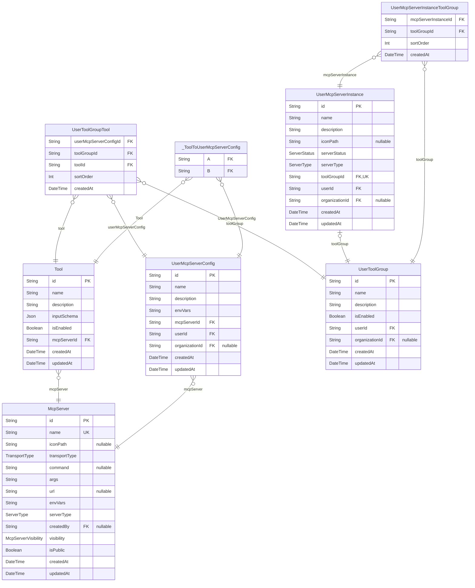
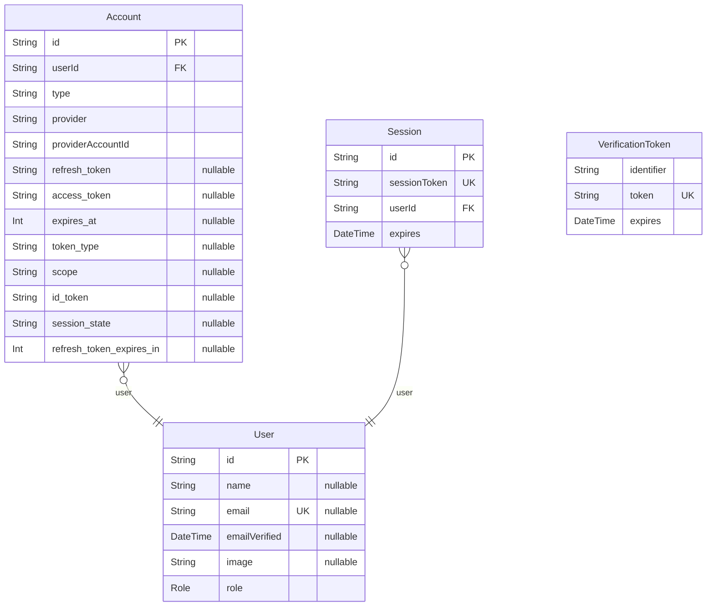
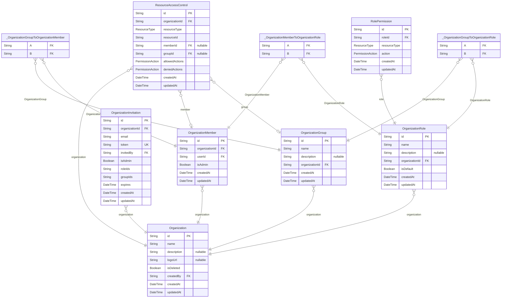
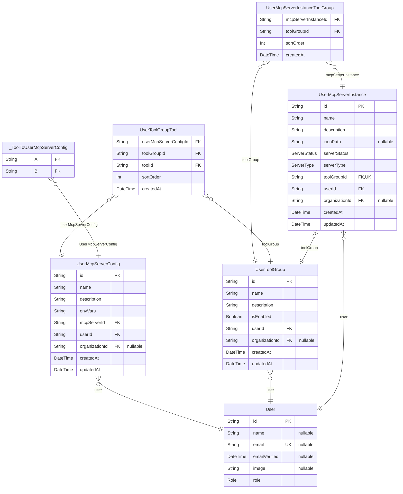
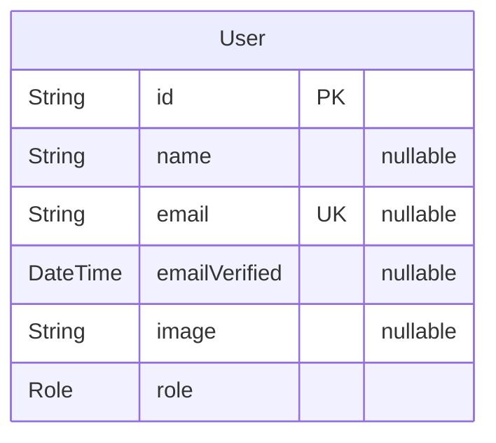
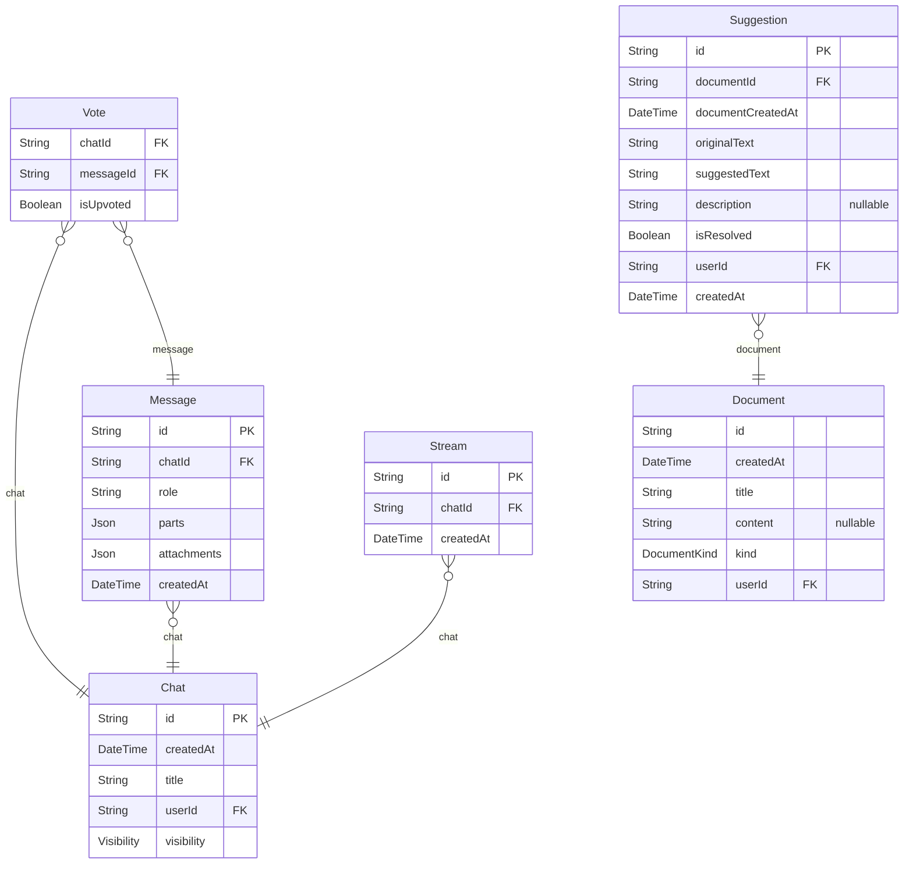

# DB Schema
> Generated by [`prisma-markdown`](https://github.com/samchon/prisma-markdown)

- [McpServer](#mcpserver)
- [NextAuth](#nextauth)
- [Organization](#organization)
- [UserMcpServer](#usermcpserver)
- [Chat](#chat)
- [default](#default)

## McpServer

### `McpServer`
MCP サーバー (github や notion などの接続する外部 MCP サーバー)
transportType に応じて接続方式を選択

**Properties**
  - `id`: 
  - `name`: MCP サーバー名
  - `iconPath`: アイコンパス
  - `transportType`: 接続タイプ（stdio, sse）
  - `command`: STDIO用のコマンド
  - `args`: STDIO用の引数
  - `url`: SSE接続用のURL
  - `envVars`
    > STDIO: 環境変数のキー配列（値はUserMcpServerConfigで管理）
    > SSE: ヘッダーのキー配列（値はUserMcpServerConfigで管理）
  - `serverType`: サーバーの種類（公式/ユーザーカスタム）
  - `createdBy`: ユーザーカスタムサーバーの作成者
  - `visibility`: ユーザーカスタムサーバーの可視性
  - `isPublic`: サーバーが公開されているか（レガシー）
  - `createdAt`: 
  - `updatedAt`: 

### `Tool`
MCP サーバーのツール一覧

**Properties**
  - `id`: 
  - `name`: ツールの名前
  - `description`: ツールの説明
  - `inputSchema`: ツールの入力スキーマ（JSON Schema形式）
  - `isEnabled`: ツールを有効にするか
  - `mcpServerId`: 
  - `createdAt`: 
  - `updatedAt`: 

### `UserMcpServerConfig`
ユーザーが利用できるMCPサーバーの設定

**Properties**
  - `id`: 
  - `name`: 設定名（例：「開発用」「本番用」「テスト用」）
  - `description`: 設定の説明
  - `envVars`: MCPサーバーの envVars を文字配列を key にしたオブジェクトを Object.stringify + 暗号化したもの
  - `mcpServerId`: MCPサーバーID
  - `userId`: ユーザーID
  - `organizationId`: 組織
  - `createdAt`: 
  - `updatedAt`: 

### `UserToolGroupTool`
ToolGroup, Toolの関連を表す中間テーブル

**Properties**
  - `userMcpServerConfigId`: UserMcpServerConfig への参照
  - `toolGroupId`: ToolGroupへの参照
  - `toolId`: Toolへの参照
  - `sortOrder`: ソート順序
  - `createdAt`: 

### `UserToolGroup`
どのツール群を利用するかを設定する
tool group 内に、同一の mcpServer の設定入れられない🤔

**Properties**
  - `id`: 
  - `name`: ツールグループ名
  - `description`: ツールグループの説明
  - `isEnabled`: ツールグループが有効かどうか
  - `userId`: ユーザーID
  - `organizationId`: 組織
  - `createdAt`: 
  - `updatedAt`: 

### `UserMcpServerInstance`
MCPサーバーとして利用するインスタンス

**Properties**
  - `id`: 
  - `name`: 稼働中のMCPサーバー名
  - `description`: サーバーの説明
  - `iconPath`: アイコンパス
  - `serverStatus`: サーバーの状態
  - `serverType`: サーバーの種類
  - `toolGroupId`
    > ツールグループ
    > UserMcpServerInstance ごとに1つの ToolGroup が存在する 1:1 関係
  - `userId`: ユーザーID
  - `organizationId`: 組織
  - `createdAt`: 
  - `updatedAt`: 

### `_ToolToUserMcpServerConfig`
Pair relationship table between [Tool](#Tool) and [UserMcpServerConfig](#UserMcpServerConfig)

**Properties**
  - `A`: 
  - `B`: 

### `UserMcpServerInstanceToolGroup`
MCPサーバーインスタンスとツールグループの関連を管理する中間テーブル

**Properties**
  - `mcpServerInstanceId`: 
  - `toolGroupId`: 
  - `sortOrder`: このMcpServerInstance内でのToolGroupの表示順序
  - `createdAt`: 

## NextAuth

### `Account`

**Properties**
  - `id`: 
  - `userId`: 
  - `type`: 認証プロバイダーの種類（oauth, oidc, email, credentials）
  - `provider`: 認証プロバイダー名（google, github, etc.）
  - `providerAccountId`: プロバイダー側のアカウントID
  - `refresh_token`: リフレッシュトークン
  - `access_token`: アクセストークン
  - `expires_at`: トークンの有効期限（Unixタイムスタンプ）
  - `token_type`: トークンの種類
  - `scope`: 認可スコープ
  - `id_token`: IDトークン
  - `session_state`: セッション状態
  - `refresh_token_expires_in`: リフレッシュトークンの有効期限（秒）

### `Session`

**Properties**
  - `id`: 
  - `sessionToken`: セッショントークン
  - `userId`: 
  - `expires`: セッションの有効期限

### `User`

**Properties**
  - `id`: 
  - `name`: ユーザー名
  - `email`: メールアドレス
  - `emailVerified`: メールアドレスの検証日時
  - `image`: プロフィール画像のURL
  - `role`: ユーザーの権限

### `VerificationToken`

**Properties**
  - `identifier`: 検証対象の識別子（メールアドレスなど）
  - `token`: 検証トークン
  - `expires`: トークンの有効期限

## Organization

### `Organization`

**Properties**
  - `id`: 
  - `name`: 組織名
  - `description`: 組織の説明
  - `logoUrl`: 組織のロゴURL
  - `isDeleted`: 論理削除フラグ
  - `createdBy`: 組織の作成者
  - `createdAt`: 
  - `updatedAt`: 

### `OrganizationMember`

**Properties**
  - `id`: 
  - `organizationId`: 
  - `userId`: 
  - `isAdmin`: このメンバーが管理者権限を持つか
  - `createdAt`: 
  - `updatedAt`: 

### `OrganizationInvitation`

**Properties**
  - `id`: 
  - `organizationId`: 
  - `email`: 招待先メールアドレス
  - `token`: 招待トークン
  - `invitedBy`: 招待者のユーザーID
  - `isAdmin`: 招待された人が管理者になるか
  - `roleIds`: 付与される予定のロールID配列
  - `groupIds`: 招待時に追加するグループID配列
  - `expires`: 招待の有効期限
  - `createdAt`: 
  - `updatedAt`: 

### `OrganizationGroup`

**Properties**
  - `id`: 
  - `name`: グループ名
  - `description`: グループの説明
  - `organizationId`: 組織ID
  - `createdAt`: 
  - `updatedAt`: 

### `OrganizationRole`
ロール定義

**Properties**
  - `id`: 
  - `name`: ロール名
  - `description`: ロールの説明
  - `organizationId`: 組織ID
  - `isDefault`: デフォルトロールか
  - `createdAt`: 
  - `updatedAt`: 

### `RolePermission`
ロールに付与された権限

**Properties**
  - `id`: 
  - `roleId`: ロールID
  - `resourceType`: リソースタイプ
  - `action`: 権限アクション
  - `createdAt`: 
  - `updatedAt`: 

### `ResourceAccessControl`
特定リソースへのアクセス制御

**Properties**
  - `id`: 
  - `organizationId`: 組織ID
  - `resourceType`: リソースタイプ
  - `resourceId`: リソースID
  - `memberId`: 対象メンバー（nullの場合はグループまたはすべてのメンバー）
  - `groupId`: 対象グループ（nullの場合はメンバー個人またはすべてのメンバー）
  - `allowedActions`: 許可されたアクション
  - `deniedActions`: 拒否されたアクション　(※許可よりも拒否が優先される)
  - `createdAt`: 
  - `updatedAt`: 

### `_OrganizationMemberToOrganizationRole`
Pair relationship table between [OrganizationMember](#OrganizationMember) and [OrganizationRole](#OrganizationRole)

**Properties**
  - `A`: 
  - `B`: 

### `_OrganizationGroupToOrganizationMember`
Pair relationship table between [OrganizationGroup](#OrganizationGroup) and [OrganizationMember](#OrganizationMember)

**Properties**
  - `A`: 
  - `B`: 

### `_OrganizationGroupToOrganizationRole`
Pair relationship table between [OrganizationGroup](#OrganizationGroup) and [OrganizationRole](#OrganizationRole)

**Properties**
  - `A`: 
  - `B`: 

## UserMcpServer

### `UserMcpServerInstanceToolGroup`
MCPサーバーインスタンスとツールグループの関連を管理する中間テーブル

**Properties**
  - `mcpServerInstanceId`: 
  - `toolGroupId`: 
  - `sortOrder`: このMcpServerInstance内でのToolGroupの表示順序
  - `createdAt`: 

### `User`

**Properties**
  - `id`: 
  - `name`: ユーザー名
  - `email`: メールアドレス
  - `emailVerified`: メールアドレスの検証日時
  - `image`: プロフィール画像のURL
  - `role`: ユーザーの権限

### `UserMcpServerConfig`
ユーザーが利用できるMCPサーバーの設定

**Properties**
  - `id`: 
  - `name`: 設定名（例：「開発用」「本番用」「テスト用」）
  - `description`: 設定の説明
  - `envVars`: MCPサーバーの envVars を文字配列を key にしたオブジェクトを Object.stringify + 暗号化したもの
  - `mcpServerId`: MCPサーバーID
  - `userId`: ユーザーID
  - `organizationId`: 組織
  - `createdAt`: 
  - `updatedAt`: 

### `UserToolGroupTool`
ToolGroup, Toolの関連を表す中間テーブル

**Properties**
  - `userMcpServerConfigId`: UserMcpServerConfig への参照
  - `toolGroupId`: ToolGroupへの参照
  - `toolId`: Toolへの参照
  - `sortOrder`: ソート順序
  - `createdAt`: 

### `UserToolGroup`
どのツール群を利用するかを設定する
tool group 内に、同一の mcpServer の設定入れられない🤔

**Properties**
  - `id`: 
  - `name`: ツールグループ名
  - `description`: ツールグループの説明
  - `isEnabled`: ツールグループが有効かどうか
  - `userId`: ユーザーID
  - `organizationId`: 組織
  - `createdAt`: 
  - `updatedAt`: 

### `UserMcpServerInstance`
MCPサーバーとして利用するインスタンス

**Properties**
  - `id`: 
  - `name`: 稼働中のMCPサーバー名
  - `description`: サーバーの説明
  - `iconPath`: アイコンパス
  - `serverStatus`: サーバーの状態
  - `serverType`: サーバーの種類
  - `toolGroupId`
    > ツールグループ
    > UserMcpServerInstance ごとに1つの ToolGroup が存在する 1:1 関係
  - `userId`: ユーザーID
  - `organizationId`: 組織
  - `createdAt`: 
  - `updatedAt`: 

### `_ToolToUserMcpServerConfig`
Pair relationship table between [Tool](#Tool) and [UserMcpServerConfig](#UserMcpServerConfig)

**Properties**
  - `A`: 
  - `B`: 

## Chat

### `User`

**Properties**
  - `id`: 
  - `name`: ユーザー名
  - `email`: メールアドレス
  - `emailVerified`: メールアドレスの検証日時
  - `image`: プロフィール画像のURL
  - `role`: ユーザーの権限

## default

### `Chat`

**Properties**
  - `id`: 
  - `createdAt`: 
  - `title`: 
  - `userId`: 
  - `visibility`: 

### `Message`

**Properties**
  - `id`: 
  - `chatId`: 
  - `role`: 
  - `parts`: 
  - `attachments`: 
  - `createdAt`: 

### `Vote`

**Properties**
  - `chatId`: 
  - `messageId`: 
  - `isUpvoted`: 

### `Document`

**Properties**
  - `id`: 
  - `createdAt`: 
  - `title`: 
  - `content`: 
  - `kind`: 
  - `userId`: 

### `Suggestion`

**Properties**
  - `id`: 
  - `documentId`: 
  - `documentCreatedAt`: 
  - `originalText`: 
  - `suggestedText`: 
  - `description`: 
  - `isResolved`: 
  - `userId`: 
  - `createdAt`: 

### `Stream`

**Properties**
  - `id`: 
  - `chatId`: 
  - `createdAt`: 