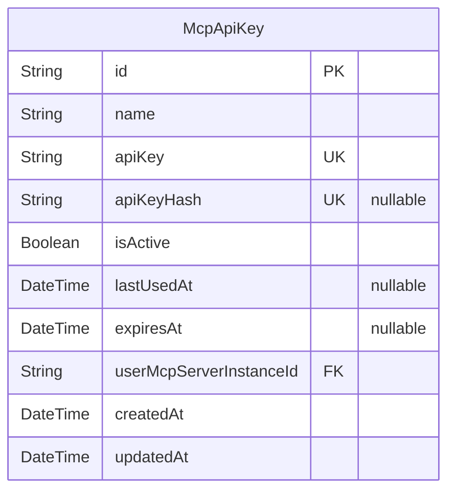
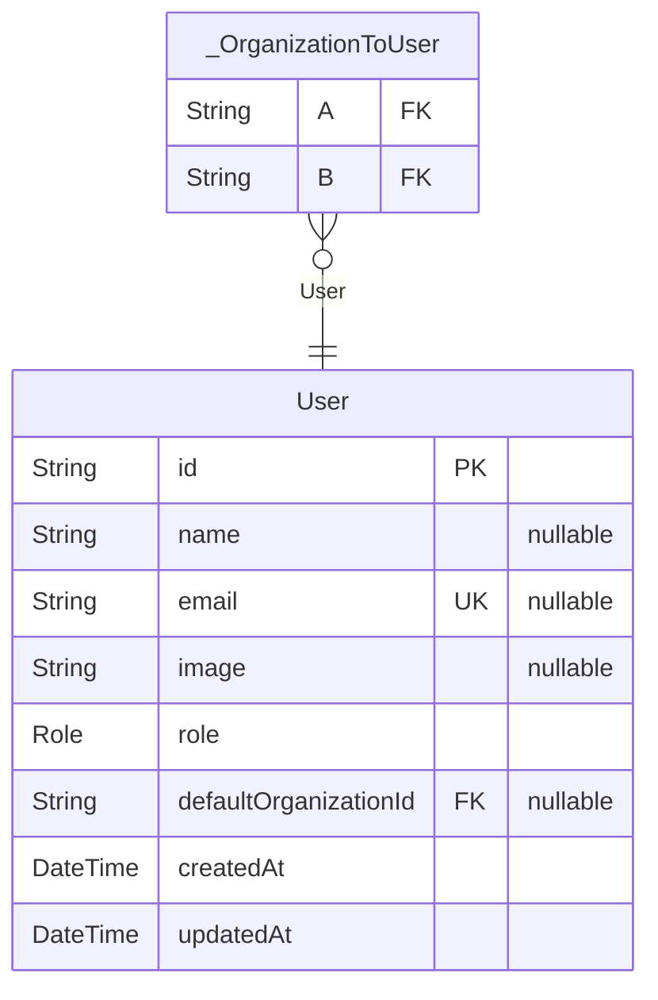
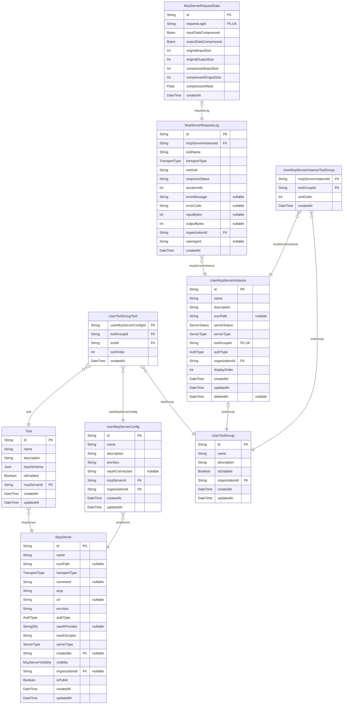
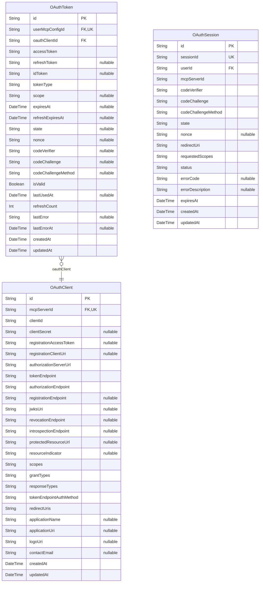
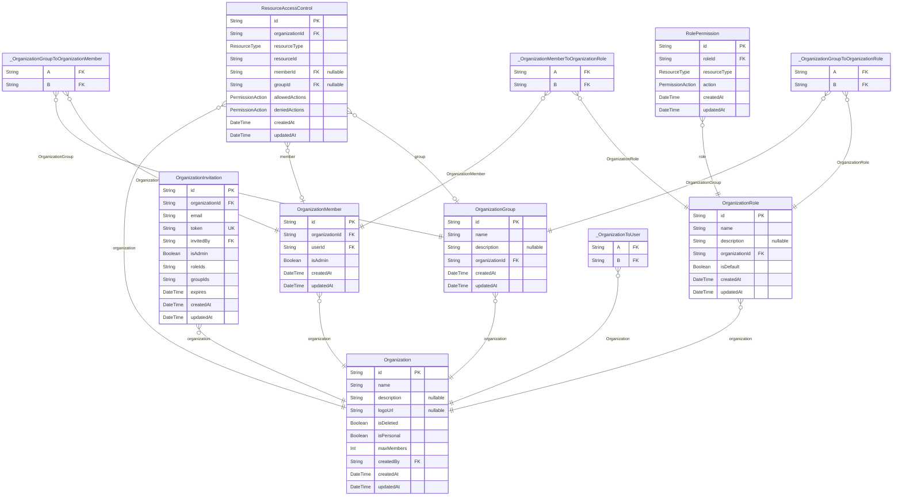
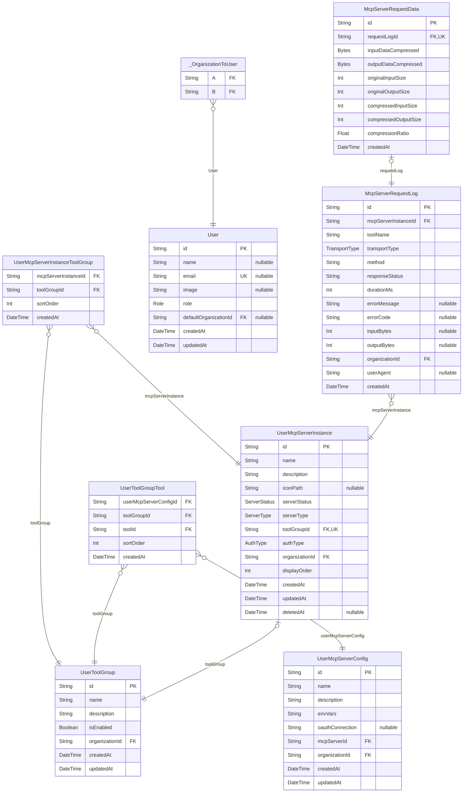

# DB Schema
> Generated by [`prisma-markdown`](https://github.com/samchon/prisma-markdown)

- [ApiKey](#apikey)
- [Auth](#auth)
- [McpServer](#mcpserver)
- [OAuth](#oauth)
- [Organization](#organization)
- [UserMcpServer](#usermcpserver)
- [Chat](#chat)
- [default](#default)

## ApiKey

### `McpApiKey`
APIキー管理テーブル

**Properties**
  - `id`: 
  - `name`: APIキー名（ユーザーが設定）
  - `apiKey`: 暗号化されたAPIキー（共通鍵暗号化）
  - `apiKeyHash`: APIキーのハッシュ値（検索用）
  - `isActive`: APIキーが有効かどうか
  - `lastUsedAt`: 最後に使用された日時
  - `expiresAt`: APIキーの有効期限
  - `userMcpServerInstanceId`: 関連するUserMcpServerInstanceのID
  - `createdAt`: 
  - `updatedAt`: 

## Auth

### `User`

**Properties**
  - `id`: Auth0のユーザーID (sub) - 主キーとして使用
  - `name`: ユーザー名
  - `email`: メールアドレス
  - `image`: プロフィール画像のURL
  - `role`: ユーザーの権限
  - `defaultOrganizationId`: デフォルトの組織ID
  - `createdAt`: 
  - `updatedAt`: 

### `_OrganizationToUser`
Pair relationship table between [Organization](#Organization) and [User](#User)

**Properties**
  - `A`: 
  - `B`: 

## McpServer

### `McpServer`
MCP サーバー (github や notion などの接続する外部 MCP サーバー)
transportType に応じて接続方式を選択

**Properties**
  - `id`: 
  - `name`: MCP サーバー名
  - `iconPath`: アイコンパス
  - `transportType`: 接続タイプ（stdio, sse）
  - `command`: STDIO用のコマン���
  - `args`: STDIO用の引数
  - `url`: SSE/Streamable HTTPS接続用のURL
  - `envVars`
    > STDIO: 環境変数のキー配列（値はUserMcpServerConfigで管理）
    > SSE/Streamable HTTPS: ヘッダーのキー配列（値はUserMcpServerConfigで管理）
  - `authType`: 認証タイプ
  - `oauthProvider`
    > OAuth プロバイダー（AuthTypeがOAUTHの場合のみ必須）
    > google, github, slack, notion, linkedin など
  - `oauthScopes`: OAuth で必要なデフォルトスコープ
  - `serverType`: サーバーの種類（公式/ユーザーカスタム）
  - `createdBy`: ユーザーカスタムサーバーの作成者
  - `visibility`: ユーザーカスタムサーバーの可視性
  - `organizationId`: 組織限定公開時の所属組織ID
  - `isPublic`: サーバーが公開されているか（レガシー）
  - `createdAt`: 
  - `updatedAt`: 

### `Tool`
MCP サーバーのツール一覧

**Properties**
  - `id`: 
  - `name`: ツールの名前
  - `description`: ツールの説明
  - `inputSchema`: ツールの入力スキーマ（JSON Schema形式）
  - `isEnabled`: ツールを有効にするか
  - `mcpServerId`: 
  - `createdAt`: 
  - `updatedAt`: 

### `UserMcpServerConfig`
ユーザーが利用できるMCPサーバーの設定

**Properties**
  - `id`: 
  - `name`: 設定名（例：「開発用」「本番用」「テスト用」）
  - `description`: 設定の説明
  - `envVars`: MCPサーバーの envVars を文字配列を key にしたオブジェクトを Object.stringify + 暗号化したもの
  - `oauthConnection`: OAuth接続のAuth0 connection名（user-specific）
  - `mcpServerId`: MCPサーバーID
  - `organizationId`: 組織
  - `createdAt`: 
  - `updatedAt`: 

### `UserToolGroupTool`
ToolGroup, Toolの関連を表す中間テーブル

**Properties**
  - `userMcpServerConfigId`: UserMcpServerConfig への参照
  - `toolGroupId`: ToolGroupへの参照
  - `toolId`: Toolへの参照
  - `sortOrder`: ソート順序
  - `createdAt`: 

### `UserToolGroup`
どのツール群を利用するかを設定する
tool group 内に、同一の mcpServer の設定入れられない🤔

**Properties**
  - `id`: 
  - `name`: ツールグループ名
  - `description`: ツールグループの説明
  - `isEnabled`: ツールグループが有効かどうか
  - `organizationId`: 組織
  - `createdAt`: 
  - `updatedAt`: 

### `UserMcpServerInstance`
MCPサーバーとして利用するインスタンス

**Properties**
  - `id`: 
  - `name`: 稼働中のMCPサーバー名
  - `description`: サーバーの説明
  - `iconPath`: アイコンパス
  - `serverStatus`: サーバーの状態
  - `serverType`: サーバーの種類
  - `toolGroupId`
    > ツールグループ
    > UserMcpServerInstance ごとに1つの ToolGroup が存在する 1:1 関係
  - `authType`: 使用する認証タイプ（API_KEY, OAUTH, BOTH）
  - `organizationId`: 組織
  - `displayOrder`: 表示順序（ユーザーごと）
  - `createdAt`: 
  - `updatedAt`: 
  - `deletedAt`: 論理削除用のタイムスタンプ

### `McpServerRequestLog`
MCPサーバーインスタンスへのリクエストログ

**Properties**
  - `id`: 
  - `mcpServerInstanceId`: MCPサーバーインスタンスID
  - `toolName`: 実行されたツール名
  - `transportType`: リクエスト時のトランスポートタイプ（SSE, STREAMABLE_HTTPS のどちらか）
  - `method`: MCPメソッド（tools/list, tools/call）
  - `responseStatus`: HTTPステータスコード
  - `durationMs`: 実行時間（ミリ秒）
  - `errorMessage`: エラーメッセージ（エラー種別のみ）
  - `errorCode`: エラーコード
  - `inputBytes`: 入力データサイズ（LLMからMCPサーバーに送信されるデータのバイト数）
  - `outputBytes`: 出力データサイズ（MCPサーバーからLLMに返すデータのバイト数）
  - `organizationId`: 組織ID
  - `userAgent`: ユーザーエージェント
  - `createdAt`: 

### `McpServerRequestData`
MCPサーバーリクエストの詳細データ（分析用）
ユーザーには表示されない内部データ

**Properties**
  - `id`: 
  - `requestLogId`: 関連するリクエストログID（1:1関係）
  - `inputDataCompressed`: リクエストの生データ（JSON文字列、gzip圧縮済み）
  - `outputDataCompressed`: レスポンスの生データ（JSON文字列、gzip圧縮済み）
  - `originalInputSize`: 圧縮前の元データサイズ
  - `originalOutputSize`: 
  - `compressedInputSize`: 圧縮後のデータサイズ
  - `compressedOutputSize`: 
  - `compressionRatio`: 圧縮率（0.0-1.0、小さいほど高圧縮）
  - `createdAt`: 

### `UserMcpServerInstanceToolGroup`
MCPサーバーインスタンスとツールグループの関連を管理する中間テーブル

**Properties**
  - `mcpServerInstanceId`: 
  - `toolGroupId`: 
  - `sortOrder`: このMcpServerInstance内でのToolGroupの表示順序
  - `createdAt`: 

## OAuth

### `OAuthClient`
OAuth クライアント情報（Dynamic Client Registration で取得）

**Properties**
  - `id`: 
  - `mcpServerId`: 関連するMCPサーバー
  - `clientId`: DCRで取得したクライアント情報
  - `clientSecret`: 
  - `registrationAccessToken`: 
  - `registrationClientUri`: 
  - `authorizationServerUrl`: Authorization Server情報
  - `tokenEndpoint`: 
  - `authorizationEndpoint`: 
  - `registrationEndpoint`: 
  - `jwksUri`: 
  - `revocationEndpoint`: 
  - `introspectionEndpoint`: 
  - `protectedResourceUrl`: Protected Resource情報
  - `resourceIndicator`: 
  - `scopes`: メタデータ
  - `grantTypes`: 
  - `responseTypes`: 
  - `tokenEndpointAuthMethod`: 
  - `redirectUris`: クライアント設定
  - `applicationName`: 
  - `applicationUri`: 
  - `logoUri`: 
  - `contactEmail`: 
  - `createdAt`: 
  - `updatedAt`: 

### `OAuthToken`
OAuth トークン情報（ユーザーごと）

**Properties**
  - `id`: 
  - `userMcpConfigId`: 関連するユーザーMCPサーバー設定
  - `oauthClientId`: 関連するOAuthクライアント
  - `accessToken`: トークン情報
  - `refreshToken`: 
  - `idToken`: 
  - `tokenType`: トークンメタデータ
  - `scope`: 
  - `expiresAt`: 
  - `refreshExpiresAt`: 
  - `state`: セッション情報（PKCE等）
  - `nonce`: 
  - `codeVerifier`: 
  - `codeChallenge`: 
  - `codeChallengeMethod`: 
  - `isValid`: トークン状態
  - `lastUsedAt`: 
  - `refreshCount`: 
  - `lastError`: エラー情報
  - `lastErrorAt`: 
  - `createdAt`: 
  - `updatedAt`: 

### `OAuthSession`
OAuth認証セッション（一時的な認証フロー管理）

**Properties**
  - `id`: 
  - `sessionId`: セッション識別子
  - `userId`: 関連するユーザー
  - `mcpServerId`: 関連するMCPサーバー
  - `codeVerifier`: PKCE情報
  - `codeChallenge`: 
  - `codeChallengeMethod`: 
  - `state`: セッション情報
  - `nonce`: 
  - `redirectUri`: 
  - `requestedScopes`: 要求されたスコープ
  - `status`: セッション状態
  - `errorCode`: エラー情報
  - `errorDescription`: 
  - `expiresAt`: タイムスタンプ
  - `createdAt`: 
  - `updatedAt`: 

## Organization

### `Organization`

**Properties**
  - `id`: 
  - `name`: 組織名
  - `description`: 組織の説明
  - `logoUrl`: 組織のロゴURL
  - `isDeleted`: 論理削除フラグ
  - `isPersonal`: 個人組織フラグ（個人ユーザー用の組織の場合true）
  - `maxMembers`: 最大メンバー数（個人組織の場合は1）
  - `createdBy`: 組織の作成者
  - `createdAt`: 
  - `updatedAt`: 

### `OrganizationMember`

**Properties**
  - `id`: 
  - `organizationId`: 
  - `userId`: 
  - `isAdmin`: このメンバーが管理者権限を持つか
  - `createdAt`: 
  - `updatedAt`: 

### `OrganizationInvitation`

**Properties**
  - `id`: 
  - `organizationId`: 
  - `email`: 招待先メールアドレス
  - `token`: 招待トークン
  - `invitedBy`: 招待者のユーザーID
  - `isAdmin`: 招待された人が管理者になるか
  - `roleIds`: 付与される予定のロールID配列
  - `groupIds`: 招待時に追加するグループID配列
  - `expires`: 招待の有効期限
  - `createdAt`: 
  - `updatedAt`: 

### `OrganizationGroup`

**Properties**
  - `id`: 
  - `name`: グループ名
  - `description`: グループの説明
  - `organizationId`: 組織ID
  - `createdAt`: 
  - `updatedAt`: 

### `OrganizationRole`
ロール定義

**Properties**
  - `id`: 
  - `name`: ロール名
  - `description`: ロールの説明
  - `organizationId`: 組織ID
  - `isDefault`: デフォルトロールか
  - `createdAt`: 
  - `updatedAt`: 

### `RolePermission`
ロールに付与された権限

**Properties**
  - `id`: 
  - `roleId`: ロールID
  - `resourceType`: リソースタイプ
  - `action`: 権限アクション
  - `createdAt`: 
  - `updatedAt`: 

### `ResourceAccessControl`
特定リソースへのアクセス制御

**Properties**
  - `id`: 
  - `organizationId`: 組織ID
  - `resourceType`: リソースタイプ
  - `resourceId`: リソースID
  - `memberId`: 対象メンバー（nullの場合はグループまたはすべてのメンバー）
  - `groupId`: 対象グループ（nullの場合はメンバー個人またはすべてのメンバー）
  - `allowedActions`: 許可されたアクション
  - `deniedActions`: 拒否されたアクション　(※許可よりも拒否が優先される)
  - `createdAt`: 
  - `updatedAt`: 

### `_OrganizationToUser`
Pair relationship table between [Organization](#Organization) and [User](#User)

**Properties**
  - `A`: 
  - `B`: 

### `_OrganizationMemberToOrganizationRole`
Pair relationship table between [OrganizationMember](#OrganizationMember) and [OrganizationRole](#OrganizationRole)

**Properties**
  - `A`: 
  - `B`: 

### `_OrganizationGroupToOrganizationMember`
Pair relationship table between [OrganizationGroup](#OrganizationGroup) and [OrganizationMember](#OrganizationMember)

**Properties**
  - `A`: 
  - `B`: 

### `_OrganizationGroupToOrganizationRole`
Pair relationship table between [OrganizationGroup](#OrganizationGroup) and [OrganizationRole](#OrganizationRole)

**Properties**
  - `A`: 
  - `B`: 

## UserMcpServer

### `UserMcpServerInstanceToolGroup`
MCPサーバーインスタンスとツールグループの関連を管理する中間テーブル

**Properties**
  - `mcpServerInstanceId`: 
  - `toolGroupId`: 
  - `sortOrder`: このMcpServerInstance内でのToolGroupの表示順序
  - `createdAt`: 

### `User`

**Properties**
  - `id`: Auth0のユーザーID (sub) - 主キーとして使用
  - `name`: ユーザー名
  - `email`: メールアドレス
  - `image`: プロフィール画像のURL
  - `role`: ユーザーの権限
  - `defaultOrganizationId`: デフォルトの組織ID
  - `createdAt`: 
  - `updatedAt`: 

### `UserMcpServerConfig`
ユーザーが利用できるMCPサーバーの設定

**Properties**
  - `id`: 
  - `name`: 設定名（例：「開発用」「本番用」「テスト用」）
  - `description`: 設定の説明
  - `envVars`: MCPサーバーの envVars を文字配列を key にしたオブジェクトを Object.stringify + 暗号化したもの
  - `oauthConnection`: OAuth接続のAuth0 connection名（user-specific）
  - `mcpServerId`: MCPサーバーID
  - `organizationId`: 組織
  - `createdAt`: 
  - `updatedAt`: 

### `UserToolGroupTool`
ToolGroup, Toolの関連を表す中間テーブル

**Properties**
  - `userMcpServerConfigId`: UserMcpServerConfig への参照
  - `toolGroupId`: ToolGroupへの参照
  - `toolId`: Toolへの参照
  - `sortOrder`: ソート順序
  - `createdAt`: 

### `UserToolGroup`
どのツール群を利用するかを設定する
tool group 内に、同一の mcpServer の設定入れられない🤔

**Properties**
  - `id`: 
  - `name`: ツールグループ名
  - `description`: ツールグループの説明
  - `isEnabled`: ツールグループが有効かどうか
  - `organizationId`: 組織
  - `createdAt`: 
  - `updatedAt`: 

### `UserMcpServerInstance`
MCPサーバーとして利用するインスタンス

**Properties**
  - `id`: 
  - `name`: 稼働中のMCPサーバー名
  - `description`: サーバーの説明
  - `iconPath`: アイコンパス
  - `serverStatus`: サーバーの状態
  - `serverType`: サーバーの種類
  - `toolGroupId`
    > ツールグループ
    > UserMcpServerInstance ごとに1つの ToolGroup が存在する 1:1 関係
  - `authType`: 使用する認証タイプ（API_KEY, OAUTH, BOTH）
  - `organizationId`: 組織
  - `displayOrder`: 表示順序（ユーザーごと）
  - `createdAt`: 
  - `updatedAt`: 
  - `deletedAt`: 論理削除用のタイムスタンプ

### `McpServerRequestLog`
MCPサーバーインスタンスへのリクエストログ

**Properties**
  - `id`: 
  - `mcpServerInstanceId`: MCPサーバーインスタンスID
  - `toolName`: 実行されたツール名
  - `transportType`: リクエスト時のトランスポートタイプ（SSE, STREAMABLE_HTTPS のどちらか）
  - `method`: MCPメソッド（tools/list, tools/call）
  - `responseStatus`: HTTPステータスコード
  - `durationMs`: 実行時間（ミリ秒）
  - `errorMessage`: エラーメッセージ（エラー種別のみ）
  - `errorCode`: エラーコード
  - `inputBytes`: 入力データサイズ（LLMからMCPサーバーに送信されるデータのバイト数）
  - `outputBytes`: 出力データサイズ（MCPサーバーからLLMに返すデータのバイト数）
  - `organizationId`: 組織ID
  - `userAgent`: ユーザーエージェント
  - `createdAt`: 

### `McpServerRequestData`
MCPサーバーリクエストの詳細データ（分析用）
ユーザーには表示されない内部データ

**Properties**
  - `id`: 
  - `requestLogId`: 関連するリクエストログID（1:1関係）
  - `inputDataCompressed`: リクエストの生データ（JSON文字列、gzip圧縮済み）
  - `outputDataCompressed`: レスポンスの生データ（JSON文字列、gzip圧縮済み）
  - `originalInputSize`: 圧縮前の元データサイズ
  - `originalOutputSize`: 
  - `compressedInputSize`: 圧縮後のデータサイズ
  - `compressedOutputSize`: 
  - `compressionRatio`: 圧縮率（0.0-1.0、小さいほど高圧縮）
  - `createdAt`: 

### `_OrganizationToUser`
Pair relationship table between [Organization](#Organization) and [User](#User)

**Properties**
  - `A`: 
  - `B`: 

## Chat

### `User`

**Properties**
  - `id`: Auth0のユーザーID (sub) - 主キーとして使用
  - `name`: ユーザー名
  - `email`: メールアドレス
  - `image`: プロフィール画像のURL
  - `role`: ユーザーの権限
  - `defaultOrganizationId`: デフォルトの組織ID
  - `createdAt`: 
  - `updatedAt`: 

### `_OrganizationToUser`
Pair relationship table between [Organization](#Organization) and [User](#User)

**Properties**
  - `A`: 
  - `B`: 

## default

### `Chat`

**Properties**
  - `id`: 
  - `createdAt`: 
  - `title`: 
  - `userId`: 
  - `visibility`: 

### `Message`

**Properties**
  - `id`: 
  - `chatId`: 
  - `role`: 
  - `parts`: 
  - `attachments`: 
  - `createdAt`: 

### `Vote`

**Properties**
  - `chatId`: 
  - `messageId`: 
  - `isUpvoted`: 

### `Document`

**Properties**
  - `id`: 
  - `createdAt`: 
  - `title`: 
  - `content`: 
  - `kind`: 
  - `userId`: 

### `Suggestion`

**Properties**
  - `id`: 
  - `documentId`: 
  - `documentCreatedAt`: 
  - `originalText`: 
  - `suggestedText`: 
  - `description`: 
  - `isResolved`: 
  - `userId`: 
  - `createdAt`: 

### `Stream`

**Properties**
  - `id`: 
  - `chatId`: 
  - `createdAt`: 

### `waiting_list`

**Properties**
  - `id`: 
  - `email`: 
  - `name`: 
  - `company`: 
  - `useCase`: 
  - `createdAt`: 