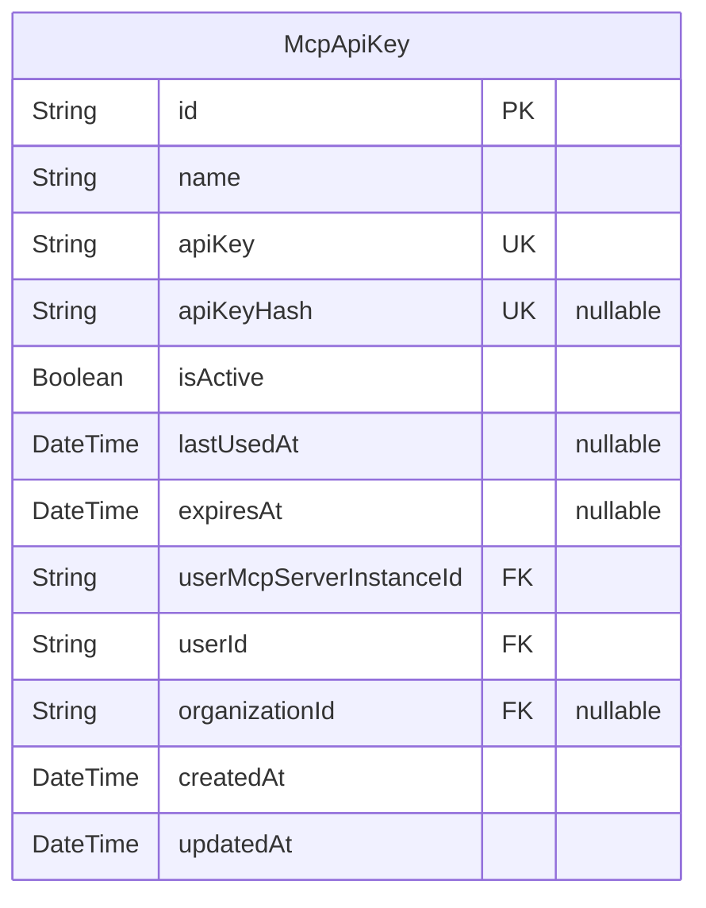
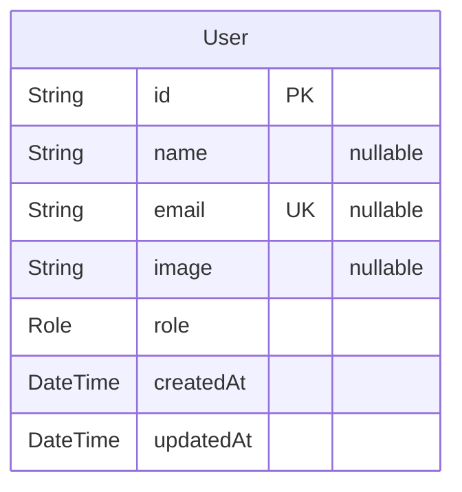
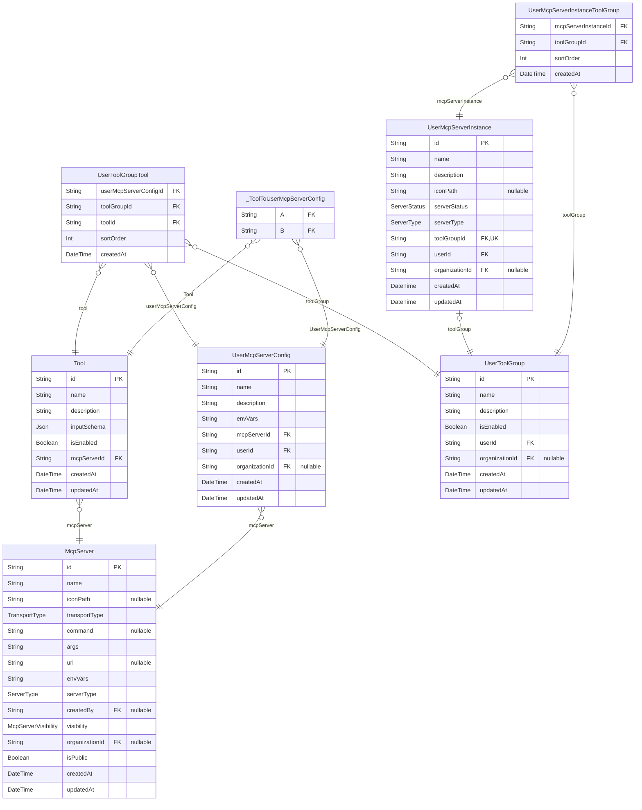
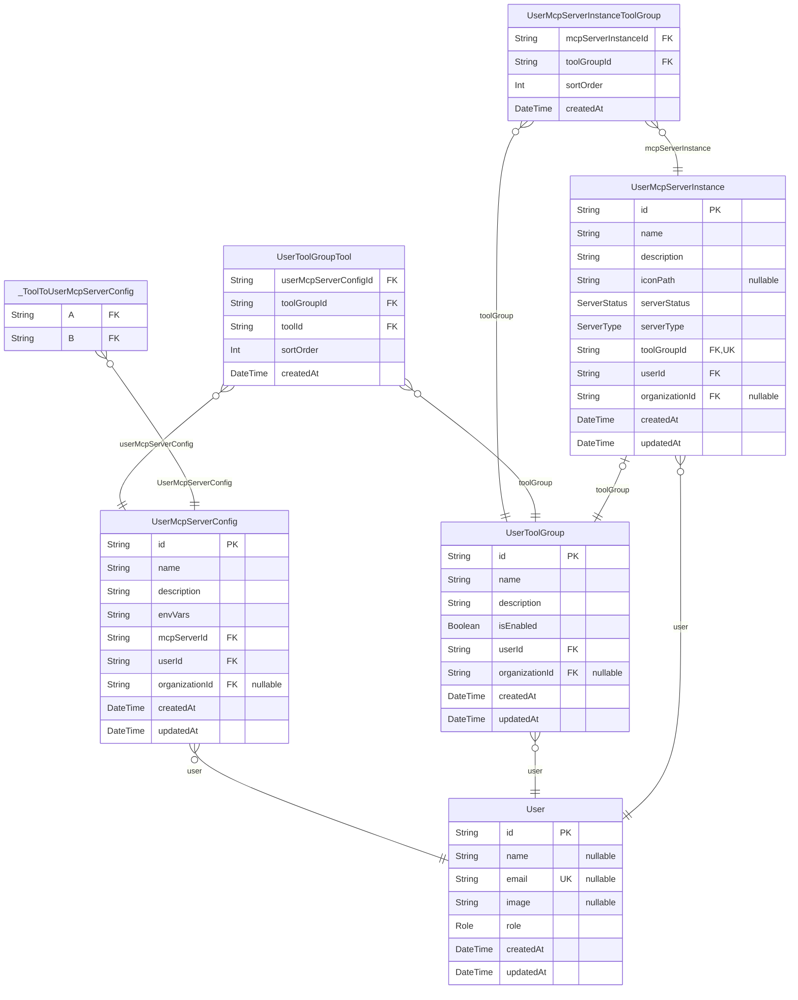

# DB Schema

> Generated by [`prisma-markdown`](https://github.com/samchon/prisma-markdown)

- [ApiKey](#apikey)
- [Auth](#auth)
- [McpServer](#mcpserver)
- [Organization](#organization)
- [UserMcpServer](#usermcpserver)
- [Chat](#chat)
- [default](#default)

## ApiKey

### `McpApiKey`

APIキー管理テーブル

**Properties**

- `id`:
- `name`: APIキー名（ユーザーが設定）
- `apiKey`: 暗号化されたAPIキー（共通鍵暗号化）
- `apiKeyHash`: APIキーのハッシュ値（検索用）
- `isActive`: APIキーが有効かどうか
- `lastUsedAt`: 最後に使用された日時
- `expiresAt`: APIキーの有効期限
- `userMcpServerInstanceId`: 関連するUserMcpServerInstanceのID
- `userId`: 作成者のユーザーID
- `organizationId`: 組織ID（マルチテナント対応）
- `createdAt`:
- `updatedAt`:

## Auth

### `User`

**Properties**

- `id`: Auth0のユーザーID (sub) - 主キーとして使用
- `name`: ユーザー名
- `email`: メールアドレス
- `image`: プロフィール画像のURL
- `role`: ユーザーの権限
- `createdAt`:
- `updatedAt`:

## McpServer

### `McpServer`

MCP サーバー (github や notion などの接続する外部 MCP サーバー)
transportType に応じて接続方式を選択

**Properties**

- `id`:
- `name`: MCP サーバー名
- `iconPath`: アイコンパス
- `transportType`: 接続タイプ（stdio, sse）
- `command`: STDIO用のコマンド
- `args`: STDIO用の引数
- `url`: SSE接続用のURL
- `envVars`
  > STDIO: 環境変数のキー配列（値はUserMcpServerConfigで管理）
  > SSE: ヘッダーのキー配列（値はUserMcpServerConfigで管理）
- `serverType`: サーバーの種類（公式/ユーザーカスタム）
- `createdBy`: ユーザーカスタムサーバーの作成者
- `visibility`: ユーザーカスタムサーバーの可視性
- `organizationId`: 組織限定公開時の所属組織ID
- `isPublic`: サーバーが公開されているか（レガシー）
- `createdAt`:
- `updatedAt`:

### `Tool`

MCP サーバーのツール一覧

**Properties**

- `id`:
- `name`: ツールの名前
- `description`: ツールの説明
- `inputSchema`: ツールの入力スキーマ（JSON Schema形式）
- `isEnabled`: ツールを有効にするか
- `mcpServerId`:
- `createdAt`:
- `updatedAt`:

### `UserMcpServerConfig`

ユーザーが利用できるMCPサーバーの設定

**Properties**

- `id`:
- `name`: 設定名（例：「開発用」「本番用」「テスト用」）
- `description`: 設定の説明
- `envVars`: MCPサーバーの envVars を文字配列を key にしたオブジェクトを Object.stringify + 暗号化したもの
- `mcpServerId`: MCPサーバーID
- `userId`: ユーザーID
- `organizationId`: 組織
- `createdAt`:
- `updatedAt`:

### `UserToolGroupTool`

ToolGroup, Toolの関連を表す中間テーブル

**Properties**

- `userMcpServerConfigId`: UserMcpServerConfig への参照
- `toolGroupId`: ToolGroupへの参照
- `toolId`: Toolへの参照
- `sortOrder`: ソート順序
- `createdAt`:

### `UserToolGroup`

どのツール群を利用するかを設定する
tool group 内に、同一の mcpServer の設定入れられない🤔

**Properties**

- `id`:
- `name`: ツールグループ名
- `description`: ツールグループの説明
- `isEnabled`: ツールグループが有効かどうか
- `userId`: ユーザーID
- `organizationId`: 組織
- `createdAt`:
- `updatedAt`:

### `UserMcpServerInstance`

MCPサーバーとして利用するインスタンス

**Properties**

- `id`:
- `name`: 稼働中のMCPサーバー名
- `description`: サーバーの説明
- `iconPath`: アイコンパス
- `serverStatus`: サーバーの状態
- `serverType`: サーバーの種類
- `toolGroupId`
  > ツールグループ
  > UserMcpServerInstance ごとに1つの ToolGroup が存在する 1:1 関係
- `userId`: ユーザーID
- `organizationId`: 組織
- `createdAt`:
- `updatedAt`:

### `_ToolToUserMcpServerConfig`

Pair relationship table between [Tool](#Tool) and [UserMcpServerConfig](#UserMcpServerConfig)

**Properties**

- `A`:
- `B`:

### `UserMcpServerInstanceToolGroup`

MCPサーバーインスタンスとツールグループの関連を管理する中間テーブル

**Properties**

- `mcpServerInstanceId`:
- `toolGroupId`:
- `sortOrder`: このMcpServerInstance内でのToolGroupの表示順序
- `createdAt`:

## Organization

### `Organization`

**Properties**

- `id`:
- `name`: 組織名
- `description`: 組織の説明
- `logoUrl`: 組織のロゴURL
- `isDeleted`: 論理削除フラグ
- `createdBy`: 組織の作成者
- `createdAt`:
- `updatedAt`:

### `OrganizationMember`

**Properties**

- `id`:
- `organizationId`:
- `userId`:
- `isAdmin`: このメンバーが管理者権限を持つか
- `createdAt`:
- `updatedAt`:

### `OrganizationInvitation`

**Properties**

- `id`:
- `organizationId`:
- `email`: 招待先メールアドレス
- `token`: 招待トークン
- `invitedBy`: 招待者のユーザーID
- `isAdmin`: 招待された人が管理者になるか
- `roleIds`: 付与される予定のロールID配列
- `groupIds`: 招待時に追加するグループID配列
- `expires`: 招待の有効期限
- `createdAt`:
- `updatedAt`:

### `OrganizationGroup`

**Properties**

- `id`:
- `name`: グループ名
- `description`: グループの説明
- `organizationId`: 組織ID
- `createdAt`:
- `updatedAt`:

### `OrganizationRole`

ロール定義

**Properties**

- `id`:
- `name`: ロール名
- `description`: ロールの説明
- `organizationId`: 組織ID
- `isDefault`: デフォルトロールか
- `createdAt`:
- `updatedAt`:

### `RolePermission`

ロールに付与された権限

**Properties**

- `id`:
- `roleId`: ロールID
- `resourceType`: リソースタイプ
- `action`: 権限アクション
- `createdAt`:
- `updatedAt`:

### `ResourceAccessControl`

特定リソースへのアクセス制御

**Properties**

- `id`:
- `organizationId`: 組織ID
- `resourceType`: リソースタイプ
- `resourceId`: リソースID
- `memberId`: 対象メンバー（nullの場合はグループまたはすべてのメンバー）
- `groupId`: 対象グループ（nullの場合はメンバー個人またはすべてのメンバー）
- `allowedActions`: 許可されたアクション
- `deniedActions`: 拒否されたアクション　(※許可よりも拒否が優先される)
- `createdAt`:
- `updatedAt`:

### `_OrganizationMemberToOrganizationRole`

Pair relationship table between [OrganizationMember](#OrganizationMember) and [OrganizationRole](#OrganizationRole)

**Properties**

- `A`:
- `B`:

### `_OrganizationGroupToOrganizationMember`

Pair relationship table between [OrganizationGroup](#OrganizationGroup) and [OrganizationMember](#OrganizationMember)

**Properties**

- `A`:
- `B`:

### `_OrganizationGroupToOrganizationRole`

Pair relationship table between [OrganizationGroup](#OrganizationGroup) and [OrganizationRole](#OrganizationRole)

**Properties**

- `A`:
- `B`:

## UserMcpServer

### `UserMcpServerInstanceToolGroup`

MCPサーバーインスタンスとツールグループの関連を管理する中間テーブル

**Properties**

- `mcpServerInstanceId`:
- `toolGroupId`:
- `sortOrder`: このMcpServerInstance内でのToolGroupの表示順序
- `createdAt`:

### `User`

**Properties**

- `id`: Auth0のユーザーID (sub) - 主キーとして使用
- `name`: ユーザー名
- `email`: メールアドレス
- `image`: プロフィール画像のURL
- `role`: ユーザーの権限
- `createdAt`:
- `updatedAt`:

### `UserMcpServerConfig`

ユーザーが利用できるMCPサーバーの設定

**Properties**

- `id`:
- `name`: 設定名（例：「開発用」「本番用」「テスト用」）
- `description`: 設定の説明
- `envVars`: MCPサーバーの envVars を文字配列を key にしたオブジェクトを Object.stringify + 暗号化したもの
- `mcpServerId`: MCPサーバーID
- `userId`: ユーザーID
- `organizationId`: 組織
- `createdAt`:
- `updatedAt`:

### `UserToolGroupTool`

ToolGroup, Toolの関連を表す中間テーブル

**Properties**

- `userMcpServerConfigId`: UserMcpServerConfig への参照
- `toolGroupId`: ToolGroupへの参照
- `toolId`: Toolへの参照
- `sortOrder`: ソート順序
- `createdAt`:

### `UserToolGroup`

どのツール群を利用するかを設定する
tool group 内に、同一の mcpServer の設定入れられない🤔

**Properties**

- `id`:
- `name`: ツールグループ名
- `description`: ツールグループの説明
- `isEnabled`: ツールグループが有効かどうか
- `userId`: ユーザーID
- `organizationId`: 組織
- `createdAt`:
- `updatedAt`:

### `UserMcpServerInstance`

MCPサーバーとして利用するインスタンス

**Properties**

- `id`:
- `name`: 稼働中のMCPサーバー名
- `description`: サーバーの説明
- `iconPath`: アイコンパス
- `serverStatus`: サーバーの状態
- `serverType`: サーバーの種類
- `toolGroupId`
  > ツールグループ
  > UserMcpServerInstance ごとに1つの ToolGroup が存在する 1:1 関係
- `userId`: ユーザーID
- `organizationId`: 組織
- `createdAt`:
- `updatedAt`:

### `_ToolToUserMcpServerConfig`

Pair relationship table between [Tool](#Tool) and [UserMcpServerConfig](#UserMcpServerConfig)

**Properties**

- `A`:
- `B`:

## Chat

### `User`

**Properties**

- `id`: Auth0のユーザーID (sub) - 主キーとして使用
- `name`: ユーザー名
- `email`: メールアドレス
- `image`: プロフィール画像のURL
- `role`: ユーザーの権限
- `createdAt`:
- `updatedAt`:

## default

### `Chat`

**Properties**

- `id`:
- `createdAt`:
- `title`:
- `userId`:
- `visibility`:

### `Message`

**Properties**

- `id`:
- `chatId`:
- `role`:
- `parts`:
- `attachments`:
- `createdAt`:

### `Vote`

**Properties**

- `chatId`:
- `messageId`:
- `isUpvoted`:

### `Document`

**Properties**

- `id`:
- `createdAt`:
- `title`:
- `content`:
- `kind`:
- `userId`:

### `Suggestion`

**Properties**

- `id`:
- `documentId`:
- `documentCreatedAt`:
- `originalText`:
- `suggestedText`:
- `description`:
- `isResolved`:
- `userId`:
- `createdAt`:

### `Stream`

**Properties**

- `id`:
- `chatId`:
- `createdAt`:

### `waiting_list`

**Properties**

- `id`:
- `email`:
- `name`:
- `company`:
- `useCase`:
- `createdAt`:
