# DB Schema
> Generated by [`prisma-markdown`](https://github.com/samchon/prisma-markdown)

- [Auth](#auth)
- [McpServer](#mcpserver)
- [Organization](#organization)
- [UserMcpServer](#usermcpserver)
- [Chat](#chat)
- [default](#default)

## Auth

### `User`

**Properties**
  - `id`: ユーザーID - 主キーとして使用
  - `name`: ユーザー名
  - `email`: メールアドレス
  - `emailVerified`: メールアドレス検証日時 (Auth.js required)
  - `image`: プロフィール画像のURL
  - `role`: ユーザーの権限
  - `defaultOrganizationSlug`: デフォルト組織のスラッグ
  - `createdAt`: 
  - `updatedAt`: 

### `Account`
Auth.js Adapter: OAuth プロバイダー連携情報

**Properties**
  - `id`: 
  - `userId`: 
  - `type`: 
  - `provider`: 
  - `providerAccountId`: 
  - `refresh_token`: 
  - `access_token`: 
  - `expires_at`: 
  - `token_type`: 
  - `scope`: 
  - `id_token`: 
  - `session_state`: 
  - `createdAt`: 
  - `updatedAt`: 

### `Session`
Auth.js Adapter: セッション情報

**Properties**
  - `id`: 
  - `sessionToken`: 
  - `userId`: 
  - `expires`: 
  - `createdAt`: 
  - `updatedAt`: 

### `VerificationToken`
Auth.js Adapter: メール検証トークン

**Properties**
  - `identifier`: 
  - `token`: 
  - `expires`: 

### `_OrganizationToUser`
Pair relationship table between [Organization](#Organization) and [User](#User)

**Properties**
  - `A`: 
  - `B`: 

## McpServer

### `McpServerTemplate`
MCP サーバーテンプレート（接続情報や認証方式の「設計図」）
organizationId = null の場合はアプ��提供のグローバル共通テンプレート
organizationId 設定済みの場合はユーザー作成の組織専用テンプレート

**Properties**
  - `id`: 
  - `name`: MCP サーバー名
  - `normalizedName`: 正規化されたサーバー名（小文字、空白をハイフンに変換）
  - `description`: MCPサーバーの説明
  - `tags`: タグ（カテゴリー分類用）
  - `iconPath`: アイコンパス
  - `transportType`: 接続タイプ（stdio, sse）
  - `command`: STDIO用のコマンド
  - `args`: STDIO用の引数
  - `url`: SSE/Streamable HTTPS接続用のURL
  - `envVarKeys`
    > STDIO: 環境変数のキー配列（値はMcpConfigで管理）
    > SSE/Streamable HTTPS: ヘッダーのキー配列（値はMcpConfigで管理）
    > Cloud Run: HTTPヘッダー名（X-DeepL-API-Keyなど）を直接指定し、同名の環境変数から値を取得
  - `authType`: 認証タイプ
  - `oauthProvider`
    > OAuth プロバイダー（AuthTypeがOAUTHの場合のみ必須）
    > google, github, slack, notion, linkedin など
  - `oauthScopes`: OAuth で必要なデフォルトスコープ
  - `useCloudRunIam`: Google Cloud Run IAM認証を使用するか
  - `createdBy`: ユーザーカスタムサーバーの作成者
  - `visibility`: ユーザーカスタムサーバーの可視性
  - `organizationId`: 組織限定公開時の所属組織ID
  - `createdAt`: 
  - `updatedAt`: 

### `McpTool`
各MCPサーバーが提供するツール一覧

**Properties**
  - `id`: 
  - `name`: ツールの名前
  - `description`: ツールの説明
  - `inputSchema`: ツールの入力スキーマ（JSON Schema形式）
  - `mcpServerTemplateId`: 
  - `createdAt`: 
  - `updatedAt`: 

### `_McpServerToMcpServerTemplate`
Pair relationship table between [McpServer](#McpServer) and [McpServerTemplate](#McpServerTemplate)

**Properties**
  - `A`: 
  - `B`: 

### `_McpServerToMcpTool`
Pair relationship table between [McpServer](#McpServer) and [McpTool](#McpTool)

**Properties**
  - `A`: 
  - `B`: 

## Organization

### `Organization`

**Properties**
  - `id`: 
  - `name`: 組織名
  - `slug`: 組織のURL識別子（不変、ユニーク）
  - `description`: 組織の説明
  - `logoUrl`: 組織のロゴURL
  - `isDeleted`: 論理削除フラグ
  - `isPersonal`: 個人組織フラグ（個人ユーザー用の組織の場合true）
  - `maxMembers`: 最大メンバー数（個人組織の場合は1）
  - `createdBy`: 組織の作成者
  - `createdAt`: 
  - `updatedAt`: 

### `OrganizationMember`

**Properties**
  - `id`: 
  - `organizationId`: 
  - `userId`: 
  - `isAdmin`: このメンバーが管理者権限を持つか
  - `createdAt`: 
  - `updatedAt`: 

### `OrganizationInvitation`

**Properties**
  - `id`: 
  - `organizationId`: 
  - `email`: 招待先メールアドレス
  - `token`: 招待トークン
  - `invitedBy`: 招待者のユーザーID
  - `isAdmin`: 招待された人が管理者になるか
  - `roleIds`: 付与される予定のロールID配列
  - `groupIds`: 招待時に追加するグループID配列
  - `expires`: 招待の有効期限
  - `createdAt`: 
  - `updatedAt`: 

### `OrganizationGroup`

**Properties**
  - `id`: 
  - `name`: グループ名
  - `description`: グループの説明
  - `organizationId`: 組織ID
  - `createdAt`: 
  - `updatedAt`: 

### `OrganizationRole`
ロール定義

**Properties**
  - `id`: 
  - `name`: ロール名
  - `description`: ロールの説明
  - `organizationId`: 組織ID
  - `isDefault`: デフォルトロールか
  - `createdAt`: 
  - `updatedAt`: 

### `RolePermission`
ロールに付与された権限

**Properties**
  - `id`: 
  - `roleId`: ロールID
  - `resourceType`: リソースタイプ
  - `action`: 権限アクション
  - `createdAt`: 
  - `updatedAt`: 

### `ResourceAccessControl`
特定リソースへのアクセス制御

**Properties**
  - `id`: 
  - `organizationId`: 組織ID
  - `resourceType`: リソースタイプ
  - `resourceId`: リソースID
  - `memberId`: 対象メンバー（nullの場合はグループまたはすべてのメンバー）
  - `groupId`: 対象グループ（nullの場合はメンバー個人またはすべてのメンバー）
  - `allowedActions`: 許可されたアクション
  - `deniedActions`: 拒否されたアクション　(※許可よりも拒否が優先される)
  - `createdAt`: 
  - `updatedAt`: 

### `_OrganizationToUser`
Pair relationship table between [Organization](#Organization) and [User](#User)

**Properties**
  - `A`: 
  - `B`: 

### `_OrganizationMemberToOrganizationRole`
Pair relationship table between [OrganizationMember](#OrganizationMember) and [OrganizationRole](#OrganizationRole)

**Properties**
  - `A`: 
  - `B`: 

### `_OrganizationGroupToOrganizationMember`
Pair relationship table between [OrganizationGroup](#OrganizationGroup) and [OrganizationMember](#OrganizationMember)

**Properties**
  - `A`: 
  - `B`: 

### `_OrganizationGroupToOrganizationRole`
Pair relationship table between [OrganizationGroup](#OrganizationGroup) and [OrganizationRole](#OrganizationRole)

**Properties**
  - `A`: 
  - `B`: 

## UserMcpServer

### `McpConfig`
APIキー等の認証情報（組織レベル/ユーザーレベル）
userId = null で組織共通設定、userId 設定済みでユーザー個別設定

**Properties**
  - `id`: 
  - `envVars`: MCPサーバーの envVars を文字配列を key にしたオブジェクトを Object.stringify + 暗号化したもの
  - `mcpServerTemplateId`: 関連するMCPサーバーテンプレート
  - `organizationId`: 組織（必須）
  - `userId`: ユーザー（nullの場合は組織共通設定、設定済みでユーザー個別設定）
  - `createdAt`: 
  - `updatedAt`: 

### `McpServer`
実際に稼働するMCPサーバー
1つまたは複数のMcpServerTemplateから作成
allowedTools[] で許可ツールを管理（Prisma暗黙的多対多）

**Properties**
  - `id`: 
  - `name`: 稼働中のMCPサーバー名
  - `description`: サーバーの説明
  - `iconPath`: アイコンパス
  - `serverStatus`: サーバーの状態
  - `serverType`: サーバーの種類
  - `authType`: 使用する認証タイプ（API_KEY, OAUTH, NONE）
  - `organizationId`: 組織
  - `displayOrder`: 表示順序（ユーザーごと）
  - `createdAt`: 
  - `updatedAt`: 
  - `deletedAt`: 論理削除用のタイムスタンプ

### `McpServerRequestLog`
MCPサーバーインスタンスへのリクエストログ

**Properties**
  - `id`: 
  - `mcpServerId`: MCPサーバーインスタンスID
  - `mcpApiKeyId`: 使用されたAPIキーID（認証タイプがAPI_KEYの場合のみ）
  - `toolName`: 実行されたツール名
  - `transportType`: リクエスト時のトランスポートタイプ（SSE, STREAMABLE_HTTPS のどちらか）
  - `method`: MCPメソッド（tools/list, tools/call）
  - `httpStatus`: HTTPステータスコード
  - `durationMs`: 実行時間（ミリ秒）
  - `inputBytes`: 入力データサイズ（LLMからMCPサーバーに送信されるデータのバイト数）
  - `outputBytes`: 出力データサイズ（MCPサーバーからLLMに返すデータのバイト数）
  - `organizationId`: 組織ID
  - `userAgent`: ユーザーエージェント
  - `gcsObjectKey`
    > GCS統合用フィールド（将来の実装に備えて追加）
    > GCSオブジェクトキー（パス）（例: logs/2025/01/17/{orgId}/{serverId}/{requestLogId}.json.gz）
  - `gcsUploadedAt`: GCSアップロード完了日時
  - `createdAt`: 

### `McpApiKey`
APIキー管理テーブル

**Properties**
  - `id`: 
  - `name`: APIキー名（ユーザーが設定）
  - `apiKey`: 暗号化されたAPIキー（client_id として使用）
  - `apiKeyHash`: APIキーをハッシュ化したもの（SHA-256、自動生成）
  - `isActive`: APIキーが有効かどうか
  - `lastUsedAt`: 最後に使用された日時
  - `expiresAt`: APIキーの有効期限
  - `scopes`: スコープ情報（例: ["mcp:access:notion", "mcp:access:figma"]）
  - `userId`: 関連するユーザー
  - `mcpServerId`: 関連するMcpServerのID
  - `createdAt`: 
  - `updatedAt`: 
  - `deletedAt`: 論理削除用のタイムスタンプ

### `McpOAuthClient`
OAuth クライアント情報（Dynamic Client Registration で取得）
mcpServerId = null の場合はTumiki自体のOAuth（第1層）
mcpServerId 設定済みの場合は外部MCPサーバー用OAuth（第2層）

**Properties**
  - `id`: 
  - `mcpServerTemplateId`: 関連するMCPサーバー（null=Tumiki OAuth、設定済み=外部MCPサーバー用）
  - `organizationId`: 組織ID (null=Global)
  - `clientId`: DCRで取得したクライアント情報
  - `clientSecret`: 
  - `registrationAccessToken`: 
  - `registrationClientUri`: 
  - `authorizationServerUrl`: Authorization ServerのベースURL（Discoveryエンドポイント導出用）
  - `redirectUris`: リダイレクトURI（DCR登録時に使用）
  - `createdAt`: 
  - `updatedAt`: 

### `McpOAuthToken`
OAuth トークン情報（ユーザー×組織ごと）
整合性保証: organizationIdは、参照するMcpOAuthClientのorganizationIdと一致する必要がある（アプリケーションレベルで検証）

**Properties**
  - `id`: 
  - `oauthClientId`: 関連するOAuthクライアント
  - `userId`: ユーザー
  - `organizationId`: 組織（トークンは組織ごとに発行、組織横断で使い回さない）
  - `accessToken`: トークン情報
  - `refreshToken`: 
  - `expiresAt`: 
  - `tokenPurpose`: トークンの用途を明確化
  - `createdAt`: 
  - `updatedAt`: 

### `_McpServerToMcpServerTemplate`
Pair relationship table between [McpServer](#McpServer) and [McpServerTemplate](#McpServerTemplate)

**Properties**
  - `A`: 
  - `B`: 

### `_McpServerToMcpTool`
Pair relationship table between [McpServer](#McpServer) and [McpTool](#McpTool)

**Properties**
  - `A`: 
  - `B`: 

### `McpServerTemplate`
MCP サーバーテンプレート（接続情報や認証方式の「設計図」）
organizationId = null の場合はアプ��提供のグローバル共通テンプレート
organizationId 設定済みの場合はユーザー作成の組織専用テンプレート

**Properties**
  - `id`: 
  - `name`: MCP サーバー名
  - `normalizedName`: 正規化されたサーバー名（小文字、空白をハイフンに変換）
  - `description`: MCPサーバーの説明
  - `tags`: タグ（カテゴリー分類用）
  - `iconPath`: アイコンパス
  - `transportType`: 接続タイプ（stdio, sse）
  - `command`: STDIO用のコマンド
  - `args`: STDIO用の引数
  - `url`: SSE/Streamable HTTPS接続用のURL
  - `envVarKeys`
    > STDIO: 環境変数のキー配列（値はMcpConfigで管理）
    > SSE/Streamable HTTPS: ヘッダーのキー配列（値はMcpConfigで管理）
    > Cloud Run: HTTPヘッダー名（X-DeepL-API-Keyなど）を直接指定し、同名の環境変数から値を取得
  - `authType`: 認証タイプ
  - `oauthProvider`
    > OAuth プロバイダー（AuthTypeがOAUTHの場合のみ必須）
    > google, github, slack, notion, linkedin など
  - `oauthScopes`: OAuth で必要なデフォルトスコープ
  - `useCloudRunIam`: Google Cloud Run IAM認証を使用するか
  - `createdBy`: ユーザーカスタムサーバーの作成者
  - `visibility`: ユーザーカスタムサーバーの可視性
  - `organizationId`: 組織限定公開時の所属組織ID
  - `createdAt`: 
  - `updatedAt`: 

## Chat

### `User`

**Properties**
  - `id`: ユーザーID - 主キーとして使用
  - `name`: ユーザー名
  - `email`: メールアドレス
  - `emailVerified`: メールアドレス検証日時 (Auth.js required)
  - `image`: プロフィール画像のURL
  - `role`: ユーザーの権限
  - `defaultOrganizationSlug`: デフォルト組織のスラッグ
  - `createdAt`: 
  - `updatedAt`: 

### `_OrganizationToUser`
Pair relationship table between [Organization](#Organization) and [User](#User)

**Properties**
  - `A`: 
  - `B`: 

## default

```mermaid
erDiagram
"Chat" {
  String id PK
  DateTime createdAt
  String title
  String userId FK
  Visibility visibility
}
"Message" {
  String id PK
  String chatId FK
  String role
  Json parts
  Json attachments
  DateTime createdAt
}
"Vote" {
  String chatId FK
  String messageId FK
  Boolean isUpvoted
}
"Document" {
  String id
  DateTime createdAt
  String title
  String content "nullable"
  DocumentKind kind
  String userId FK
}
"Suggestion" {
  String id PK
  String documentId FK
  DateTime documentCreatedAt
  String originalText
  String suggestedText
  String description "nullable"
  Boolean isResolved
  String userId FK
  DateTime createdAt
}
"Stream" {
  String id PK
  String chatId FK
  DateTime createdAt
}
"waiting_list" {
  String id PK
  String email UK
  String name "nullable"
  String company "nullable"
  String useCase "nullable"
  DateTime createdAt
}
"Message" }o--|| "Chat" : chat
"Vote" }o--|| "Chat" : chat
"Vote" }o--|| "Message" : message
"Suggestion" }o--|| "Document" : document
"Stream" }o--|| "Chat" : chat
```

### `Chat`

**Properties**
  - `id`: 
  - `createdAt`: 
  - `title`: 
  - `userId`: 
  - `visibility`: 

### `Message`

**Properties**
  - `id`: 
  - `chatId`: 
  - `role`: 
  - `parts`: 
  - `attachments`: 
  - `createdAt`: 

### `Vote`

**Properties**
  - `chatId`: 
  - `messageId`: 
  - `isUpvoted`: 

### `Document`

**Properties**
  - `id`: 
  - `createdAt`: 
  - `title`: 
  - `content`: 
  - `kind`: 
  - `userId`: 

### `Suggestion`

**Properties**
  - `id`: 
  - `documentId`: 
  - `documentCreatedAt`: 
  - `originalText`: 
  - `suggestedText`: 
  - `description`: 
  - `isResolved`: 
  - `userId`: 
  - `createdAt`: 

### `Stream`

**Properties**
  - `id`: 
  - `chatId`: 
  - `createdAt`: 

### `waiting_list`

**Properties**
  - `id`: 
  - `email`: 
  - `name`: 
  - `company`: 
  - `useCase`: 
  - `createdAt`: 