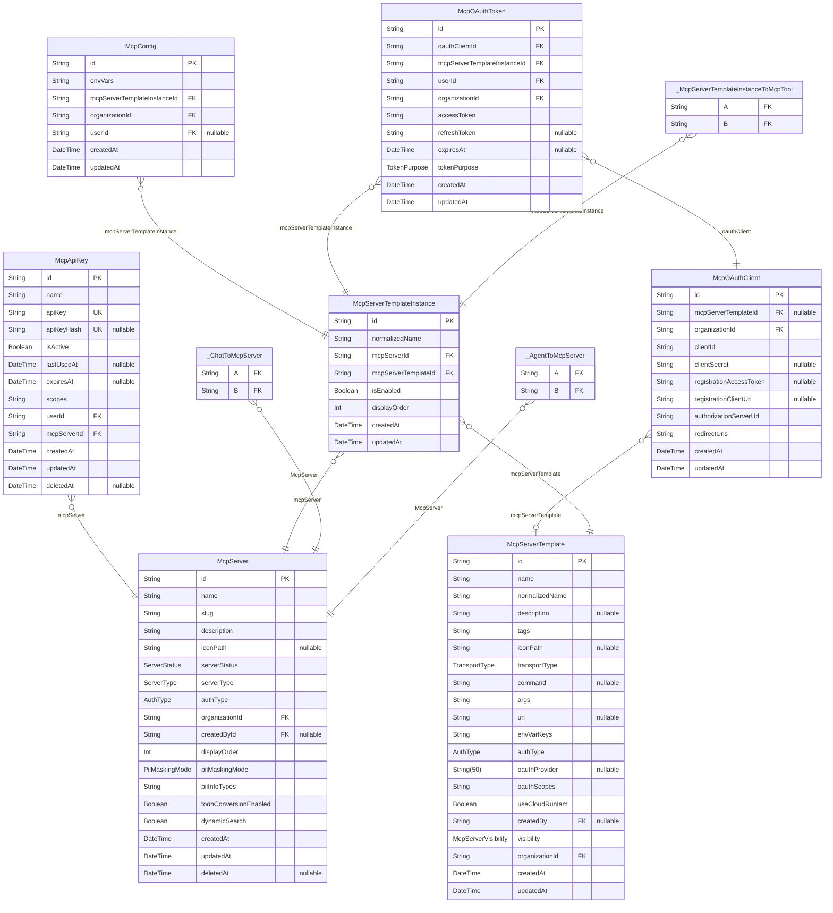

# DB Schema

> Generated by [`prisma-markdown`](https://github.com/samchon/prisma-markdown)

- [Agent](#agent)
- [Auth](#auth)
- [Feedback](#feedback)
- [McpServer](#mcpserver)
- [Notification](#notification)
- [Organization](#organization)
- [RequestLog](#requestlog)
- [UserMcpServer](#usermcpserver)
- [Chat](#chat)
- [default](#default)

## Agent

### `Agent`

AIエージェント定義
システムプロンプト、MCPサーバー紐付け、定期バッチ設定を管理

**Properties**

- `id`:
- `slug`: エージェントの組織内スラグ（URL識別子）
- `name`: エージェント名
- `description`: エージェントの説明
- `iconPath`: アイコンパス
- `systemPrompt`: カスタムシステムプロンプト
- `modelId`: 使用するLLMモデルID（例: "anthropic/claude-3.5-haiku"）
- `visibility`: 可視性（共有設定）
- `estimatedDurationMs`: 推定実行時間（ミリ秒）- 初回は30秒、実行完了後に更新
- `organizationId`: 組織ID
- `createdById`: 作成者ID（作成者削除時はnullに）
- `createdAt`:
- `updatedAt`:

### `AgentSchedule`

スケジュール設定（定期バッチ用）

**Properties**

- `id`:
- `agentId`:
- `name`: スケジュール名
- `cronExpression`: cron式（例: "0 9 \* \* 1-5" = 平日9時）
- `timezone`: タイムゾーン
- `status`: スケジュールのステータス
- `createdAt`:
- `updatedAt`:

### `AgentExecutionLog`

バッチ実行履歴（メタデータのみ、詳細はChatに保存）

**Properties**

- `id`:
- `agentId`:
- `scheduleId`: スケジュールID（スケジュール実行の場合）
- `chatId`: チャットID（実行詳細はChatのMessagesに保存）
- `modelId`: 使用したLLMモデルID（例: "anthropic/claude-3.5-haiku"）
- `success`: 成功したかどうか（null = 実行中）
- `durationMs`: 実行時間（ミリ秒）
- `createdAt`:

### `_AgentToMcpServer`

Pair relationship table between [Agent](#Agent) and [McpServer](#McpServer)

**Properties**

- `A`:
- `B`:

## Auth

### `User`

**Properties**

- `id`: ユーザーID - 主キーとして使用
- `name`: ユーザー名
- `email`: メールアドレス
- `emailVerified`: メールアドレス検証日時 (Auth.js required)
- `image`: プロフィール画像のURL
- `role`: ユーザーの権限
- `defaultOrganizationSlug`
  > セッション管理に移行。新規コードでは使用しないこと。
  > デフォルト組織のスラッグ
- `createdAt`:
- `updatedAt`:

### `Account`

Auth.js Adapter: OAuth プロバイダー連携情報

**Properties**

- `id`:
- `userId`:
- `type`:
- `provider`:
- `providerAccountId`:
- `refresh_token`:
- `access_token`:
- `expires_at`:
- `token_type`:
- `scope`:
- `id_token`:
- `session_state`:
- `createdAt`:
- `updatedAt`:

### `Session`

Auth.js Adapter: セッション情報

**Properties**

- `id`:
- `sessionToken`:
- `userId`:
- `expires`:
- `createdAt`:
- `updatedAt`:

### `VerificationToken`

Auth.js Adapter: メール検証トークン

**Properties**

- `identifier`:
- `token`:
- `expires`:

### `_OrganizationToUser`

Pair relationship table between [Organization](#Organization) and [User](#User)

**Properties**

- `A`:
- `B`:

## Feedback

### `Feedback`

フィードバック（お問い合わせ・機能要望）

**Properties**

- `id`:
- `type`: フィードバック種類
- `subject`: 件名
- `content`: 内容（長文対応）
- `status`: ステータス
- `userId`: 送信者
- `organizationId`: 組織
- `userAgent`: ユーザーエージェント（ブラウザ情報）
- `metadata`: 追加メタデータ（拡張用）
- `slackMessageTs`: Slack投稿のタイムスタンプ（スレッド返信用）
- `adminNote`: 管理者メモ（将来的な拡張用）
- `createdAt`:
- `updatedAt`:

## McpServer

### `McpServerTemplate`

MCP サーバーテンプレート（接続情報や認証方式の「設計図」）
organizationId = OFFICIAL_ORGANIZATION_ID の場合はアプリ提供の公式テンプレート
organizationId が他の値の場合はユーザー作成の組織専用テンプレート

**Properties**

- `id`:
- `name`: MCP サーバー名
- `normalizedName`: 正規化されたサーバー名（小文字、空白をハイフンに変換）
- `description`: MCPサーバーの説明
- `tags`: タグ（カテゴリー分類用）
- `iconPath`: アイコンパス
- `transportType`: 接続タイプ（stdio, sse）
- `command`: STDIO用のコマンド
- `args`: STDIO用の引数
- `url`: SSE/Streamable HTTPS接続用のURL
- `envVarKeys`
  > STDIO: 環境変数のキー配列（値はMcpConfigで管理）
  > SSE/Streamable HTTPS: ヘッダーのキー配列（値はMcpConfigで管理）
  > Cloud Run: HTTPヘッダー名（X-DeepL-API-Keyなど）を直接指定し、同名の環境変数から値を取得
- `authType`: 認証タイプ
- `oauthProvider`
  > OAuth プロバイダー（AuthTypeがOAUTHの場合のみ必須）
  > google, github, slack, notion, linkedin など
- `oauthScopes`: OAuth で必要なデフォルトスコープ
- `useCloudRunIam`: Google Cloud Run IAM認証を使用するか
- `createdBy`: ユーザーカスタムサーバーの作成者
- `visibility`: ユーザーカスタムサーバーの可視性
- `organizationId`: 組織ID（公式テンプレートはOFFICIAL_ORGANIZATION_ID、組織専用テンプレートは組織ID）
- `createdAt`:
- `updatedAt`:

### `McpTool`

各MCPサーバーが提供するツール一覧

**Properties**

- `id`:
- `name`: ツールの名前
- `description`: ツールの説明
- `inputSchema`: ツールの入力スキーマ（JSON Schema形式）
- `mcpServerTemplateId`:
- `createdAt`:
- `updatedAt`:

### `_McpServerTemplateInstanceToMcpTool`

Pair relationship table between [McpServerTemplateInstance](#McpServerTemplateInstance) and [McpTool](#McpTool)

**Properties**

- `A`:
- `B`:

## Notification

### `Notification`

通知テーブル

**Properties**

- `id`:
- `type`
  > 通知タイプ（文字列で管理）
  > 例: "MCP_TOOL_CHANGED", "MCP_SERVER_STATUS_CHANGED", "ORGANIZATION_INVITATION_SENT" など
- `priority`: 通知優先度
- `title`: 通知タイトル（日本語）
- `message`: 通知メッセージ（日本語）
- `linkUrl`: リンク先URL（クリック時の遷移先）
- `isRead`: 既読フラグ
- `readAt`: 既読日時
- `organizationId`: 関連する組織ID
- `userId`: 通知の受信者（ユーザーID）
- `triggeredById`: アクションをトリガーしたユーザー（誰が変更したか）
- `isDeleted`: 論理削除フラグ（非表示）
- `expiresAt`: 有効期限（古い通知の自動削除用）
- `createdAt`:
- `updatedAt`:

## Organization

### `Organization`

**Properties**

- `id`: Keycloak Group ID
- `name`: 組織名（表示名）
- `slug`: 組織のURL識別子（Keycloak Group名: "@user-id" or "team-slug"）
- `description`: 組織の説明
- `logoUrl`: 組織のロゴURL
- `isDeleted`: 論理削除フラグ
- `isPersonal`: 個人組織フラグ（個人ユーザー用の組織の場合true）
- `maxMembers`: 最大メンバー数（個人組織の場合は1）
- `createdBy`: 組織の作成者
- `createdAt`:
- `updatedAt`:

### `OrganizationMember`

**Properties**

- `id`:
- `organizationId`:
- `userId`:
- `createdAt`:
- `updatedAt`:

### `OrganizationInvitation`

**Properties**

- `id`:
- `organizationId`:
- `email`: 招待先メールアドレス
- `token`: 招待トークン
- `invitedBy`: 招待者のユーザーID
- `roles`: 招待時に付与するロール（Keycloak管理）
- `expires`: 招待の有効期限
- `createdAt`:
- `updatedAt`:

### `OrganizationRole`

アプリケーションロール定義（権限セット）

**Properties**

- `organizationSlug`: 組織slug（URLで使用される識別子）
- `slug`: ロールslug（例: data-engineer）
- `name`: ロール名（表示用）
- `description`: ロールの説明
- `isDefault`: デフォルトロールか（新メンバーに自動付与）
- `defaultRead`: 全MCPサーバーに適用するデフォルト権限
- `defaultWrite`:
- `defaultExecute`:
- `createdAt`:
- `updatedAt`:

### `McpPermission`

特定MCPサーバーへの権限設定（参照整合性あり）

**Properties**

- `id`:
- `organizationSlug`: 親のロール
- `roleSlug`:
- `mcpServerId`: 対象MCPサーバー（削除時に自動削除）
- `read`: 権限（trueで権限付与）
- `write`:
- `execute`:
- `createdAt`:
- `updatedAt`:

### `_OrganizationToUser`

Pair relationship table between [Organization](#Organization) and [User](#User)

**Properties**

- `A`:
- `B`:

## RequestLog

### `McpServerRequestLog`

MCPサーバーインスタンスへのリクエストログ
リレーションを排除し、IDのみ保持することでサイズを削減

**Properties**

- `id`: レコードID（cuid: 25文字）
- `mcpServerId`: MCPサーバーインスタンスID
- `organizationId`: 組織ID
- `userId`: リクエストを実行したユーザーID
- `mcpApiKeyId`: 使用されたAPIキーID（認証タイプがAPI_KEYの場合のみ）
- `toolName`: 実行されたツール名（最大255文字に制限）
- `transportType`: リクエスト時のトランスポートタイプ
- `method`: MCPメソッド（例: "tools/call", "resources/read"）
- `httpStatus`: HTTPステータスコード（Int型で保存、例: 200, 404, 500）
- `durationMs`: 実行時間（ミリ秒）
- `inputBytes`: 入力データサイズ（LLMからMCPサーバーに送信されるデータのバイト数）
- `outputBytes`: 出力データサイズ（MCPサーバーからLLMに返すデータのバイト数）
- `errorCode`
  > エラー情報（エラー発生時のみ）
  > MCPエラーコード（例: -32600, -32601, -32603）
- `errorSummary`: エラーメッセージ要約（最大500文字、詳細はBigQuery）
- `userAgent`: ユーザーエージェント（最大512文字に制限）
- `toolCallId`
  > AIツール呼び出しID（AI SDKが生成、チャットメッセージとの紐付け用）
  > チャットのMessage.partsからBigQueryのresponseBodyを参照するために使用
- `piiMaskingMode`
  > PIIマスキングモード（DISABLEDの場合はマスキング無効）
  > MCPサーバー設定のpiiMaskingModeをそのまま記録
- `piiDetectedRequestCount`: リクエストPII検出件数
- `piiDetectedResponseCount`: レスポンスPII検出件数
- `piiDetectedInfoTypes`
  > 検出されたInfoType名の配列（リクエスト+レスポンス、重複なし）
  > 例: ["EMAIL_ADDRESS", "PHONE_NUMBER", "CREDIT_CARD_NUMBER"]
- `toonConversionEnabled`
  > TOON変換メトリクス
  > TOON変換が有効だったかどうか
- `inputTokens`: TOON変換前のトークン数（元データのトークン数）
- `outputTokens`: AIに渡される最終的な出力トークン数
- `createdAt`:

## UserMcpServer

### `McpConfig`

APIキー等の認証情報（組織レベル/ユーザーレベル）
userId = null で組織共通設定、userId 設定済みでユーザー個別設定

**Properties**

- `id`:
- `envVars`: MCPサーバーの envVars を文字配列を key にしたオブジェクトを Object.stringify + 暗号化したもの
- `mcpServerTemplateInstanceId`: 関連するMCPサーバーテンプレートインスタンス（インスタンスごとに異なる設定）
- `organizationId`: 組織（必須）
- `userId`: ユーザー（nullの場合は組織共通設定、設定済みでユーザー個別設定）
- `createdAt`:
- `updatedAt`:

### `McpServer`

実際に稼働するMCPサーバー
1つまたは複数のMcpServerTemplateから作成

**Properties**

- `id`:
- `name`: 稼働中のMCPサーバー名
- `slug`: URL用スラッグ（組織内でユニーク）
- `description`: サーバーの説明
- `iconPath`: アイコンパス
- `serverStatus`: サーバーの状態
- `serverType`: サーバーの種類
- `authType`: 使用する認証タイプ（API_KEY, OAUTH, NONE）
- `organizationId`: 組織
- `createdById`: 作成者（既存データ対応のためオプショナル）
- `displayOrder`: 表示順序（ユーザーごと）
- `piiMaskingMode`
  > PIIマスキングモード設定（GCP DLPによるマスキング）
  > DISABLED: マスキングなし（デフォルト）
  > REQUEST: リクエストのみマスキング
  > RESPONSE: レスポンスのみマスキング
  > BOTH: 両方マスキング
- `piiInfoTypes`
  > 使用するInfoType一覧（GCP DLP）
  > 空配列の場合は全InfoTypeを使用
- `toonConversionEnabled`
  > TOON変換を有効にするかどうか（AIへのトークン削減用）
  > true: レスポンスをTOON形式に変換してからAIに返す
  > false: JSONのままAIに返す（デフォルト）
- `dynamicSearch`
  > Dynamic Search を有効にするかどうか
  > true: 元のツールを公開せず、search_tools/describe_tools/execute_tool のみ公開
  > false: 従来通り全ツールを公開（デフォルト）
- `createdAt`:
- `updatedAt`:
- `deletedAt`: 論理削除用のタイムスタンプ

### `McpApiKey`

APIキー管理テーブル

**Properties**

- `id`:
- `name`: APIキー名（ユーザーが設定）
- `apiKey`: 暗号化されたAPIキー（client_id として使用）
- `apiKeyHash`: APIキーをハッシュ化したもの（SHA-256、自動生成）
- `isActive`: APIキーが有効かどうか
- `lastUsedAt`: 最後に使用された日時
- `expiresAt`: APIキーの有効期限
- `scopes`: スコープ情報（例: ["mcp:access:notion", "mcp:access:figma"]）
- `userId`: 関連するユーザー
- `mcpServerId`: 関連するMcpServerのID
- `createdAt`:
- `updatedAt`:
- `deletedAt`: 論理削除用のタイムスタンプ

### `McpOAuthClient`

OAuth クライアント情報（Dynamic Client Registration で取得）
mcpServerId = null の場合はTumiki自体のOAuth（第1層）
mcpServerId 設定済みの場合は外部MCPサーバー用OAuth（第2層）

**Properties**

- `id`:
- `mcpServerTemplateId`: 関連するMCPサーバー（null=Tumiki OAuth、設定済み=外部MCPサーバー用）
- `organizationId`: 組織ID
- `clientId`: DCRで取得したクライアント情報
- `clientSecret`:
- `registrationAccessToken`:
- `registrationClientUri`:
- `authorizationServerUrl`: Authorization ServerのベースURL（Discoveryエンドポイント導出用）
- `redirectUris`: リダイレクトURI（DCR登録時に使用）
- `createdAt`:
- `updatedAt`:

### `McpOAuthToken`

OAuth トークン情報（ユーザー×インスタンスごと）
整合性保証: organizationIdは、参照するMcpOAuthClientのorganizationIdと一致する必要がある（アプリケーションレベルで検証）

**Properties**

- `id`:
- `oauthClientId`: 関連するOAuthクライアント
- `mcpServerTemplateInstanceId`: どのインスタンス用のトークンか（インスタンスごとに独立したOAuth認証）
- `userId`: ユーザー
- `organizationId`: 組織（トークンは組織ごとに発行、組織横断で使い回さない）
- `accessToken`: トークン情報
- `refreshToken`:
- `expiresAt`:
- `tokenPurpose`: トークンの用途を明確化
- `createdAt`:
- `updatedAt`:

### `McpServerTemplateInstance`

MCPサーバーとテンプレートの関連（同じテンプレートを複数追加可能）

**Properties**

- `id`:
- `normalizedName`: インスタンスの識別用正規化名（例: "github-work", "github-personal"）
- `mcpServerId`: 関連するMCPサーバー
- `mcpServerTemplateId`: 関連するMCPサーバーテンプレート
- `isEnabled`: このテンプレートインスタンスが有効か
- `displayOrder`: 統合サーバー内での表示順序
- `createdAt`:
- `updatedAt`:

### `_ChatToMcpServer`

Pair relationship table between [Chat](#Chat) and [McpServer](#McpServer)

**Properties**

- `A`:
- `B`:

### `_McpServerTemplateInstanceToMcpTool`

Pair relationship table between [McpServerTemplateInstance](#McpServerTemplateInstance) and [McpTool](#McpTool)

**Properties**

- `A`:
- `B`:

### `McpServerTemplate`

MCP サーバーテンプレート（接続情報や認証方式の「設計図」）
organizationId = OFFICIAL_ORGANIZATION_ID の場合はアプリ提供の公式テンプレート
organizationId が他の値の場合はユーザー作成の組織専用テンプレート

**Properties**

- `id`:
- `name`: MCP サーバー名
- `normalizedName`: 正規化されたサーバー名（小文字、空白をハイフンに変換）
- `description`: MCPサーバーの説明
- `tags`: タグ（カテゴリー分類用）
- `iconPath`: アイコンパス
- `transportType`: 接続タイプ（stdio, sse）
- `command`: STDIO用のコマンド
- `args`: STDIO用の引数
- `url`: SSE/Streamable HTTPS接続用のURL
- `envVarKeys`
  > STDIO: 環境変数のキー配列（値はMcpConfigで管理）
  > SSE/Streamable HTTPS: ヘッダーのキー配列（値はMcpConfigで管理）
  > Cloud Run: HTTPヘッダー名（X-DeepL-API-Keyなど）を直接指定し、同名の環境変数から値を取得
- `authType`: 認証タイプ
- `oauthProvider`
  > OAuth プロバイダー（AuthTypeがOAUTHの場合のみ必須）
  > google, github, slack, notion, linkedin など
- `oauthScopes`: OAuth で必要なデフォルトスコープ
- `useCloudRunIam`: Google Cloud Run IAM認証を使用するか
- `createdBy`: ユーザーカスタムサーバーの作成者
- `visibility`: ユーザーカスタムサーバーの可視性
- `organizationId`: 組織ID（公式テンプレートはOFFICIAL_ORGANIZATION_ID、組織専用テンプレートは組織ID）
- `createdAt`:
- `updatedAt`:

### `_AgentToMcpServer`

Pair relationship table between [Agent](#Agent) and [McpServer](#McpServer)

**Properties**

- `A`:
- `B`:

## Chat

### `User`

**Properties**

- `id`: ユーザーID - 主キーとして使用
- `name`: ユーザー名
- `email`: メールアドレス
- `emailVerified`: メールアドレス検証日時 (Auth.js required)
- `image`: プロフィール画像のURL
- `role`: ユーザーの権限
- `defaultOrganizationSlug`
  > セッション管理に移行。新規コードでは使用しないこと。
  > デフォルト組織のスラッグ
- `createdAt`:
- `updatedAt`:

### `_OrganizationToUser`

Pair relationship table between [Organization](#Organization) and [User](#User)

**Properties**

- `A`:
- `B`:

## default

### `Chat`

**Properties**

- `id`:
- `createdAt`:
- `title`:
- `userId`:
- `visibility`: チャットの可視性（McpServerVisibility を共通利用）
- `organizationId`: 組織ID（組織レベルでのチャット管理）
- `agentId`: エージェントID（エージェント実行の場合に設定、nullならユーザーチャット）

### `Message`

**Properties**

- `id`:
- `chatId`:
- `role`:
- `parts`:
- `attachments`:
- `createdAt`:

### `Vote`

**Properties**

- `chatId`:
- `messageId`:
- `isUpvoted`:

### `Document`

**Properties**

- `id`:
- `createdAt`:
- `title`:
- `content`:
- `kind`:
- `userId`:

### `Suggestion`

**Properties**

- `id`:
- `documentId`:
- `documentCreatedAt`:
- `originalText`:
- `suggestedText`:
- `description`:
- `isResolved`:
- `userId`:
- `createdAt`:

### `Stream`

**Properties**

- `id`:
- `chatId`:
- `createdAt`:

### `waiting_list`

**Properties**

- `id`:
- `email`:
- `name`:
- `company`:
- `useCase`:
- `createdAt`:
