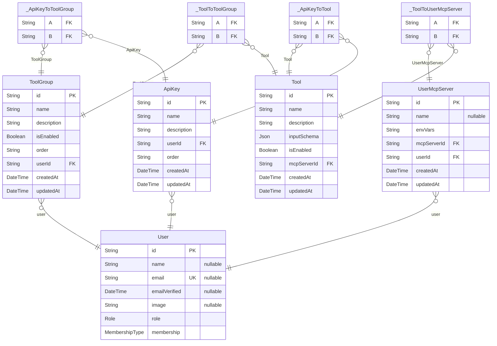
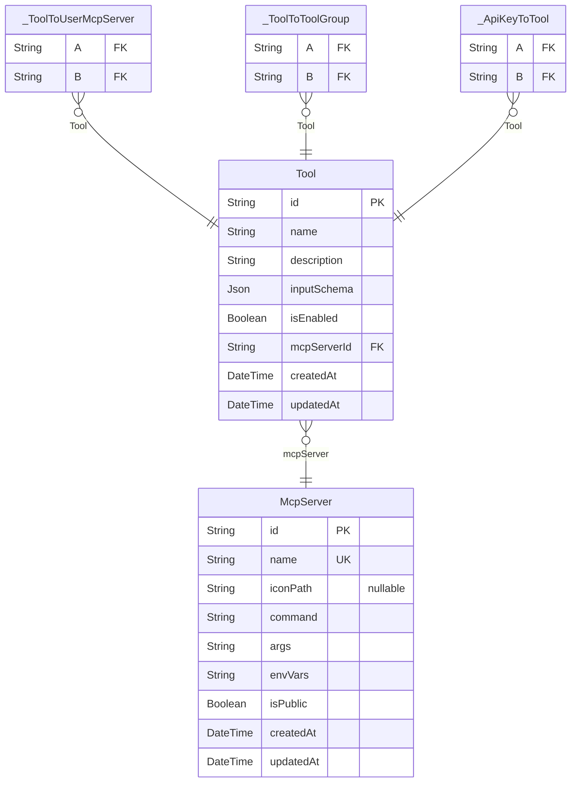
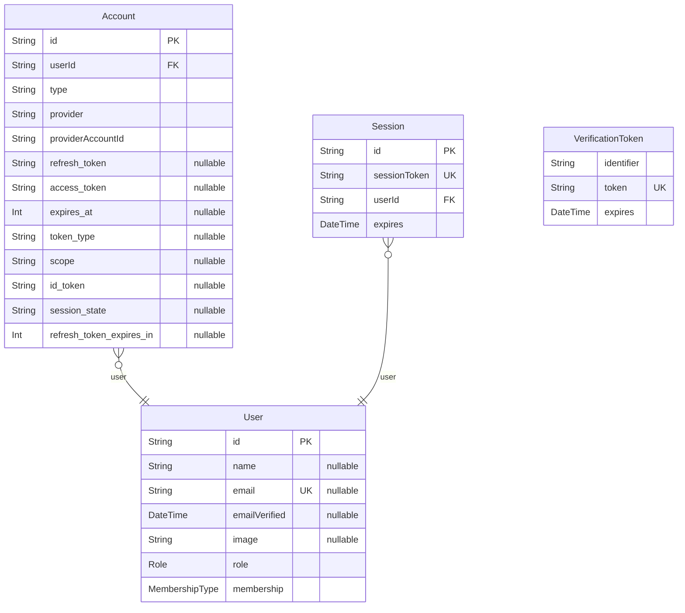

# DB Schema
> Generated by [`prisma-markdown`](https://github.com/samchon/prisma-markdown)

- [ApiAccess](#apiaccess)
- [McpServer](#mcpserver)
- [NextAuth](#nextauth)

## ApiAccess

### `UserMcpServer`
ユーザーが利用できるMCPサーバーの設定

**Properties**
  - `id`: 
  - `name`: カスタムMCPサーバー名 (ユーザーが設定した名前)
  - `envVars`: MCPサーバーの envVars を文字配列を key にしたオブジェクトを Object.stringify + 暗号化したもの
  - `mcpServerId`: MCPサーバーID
  - `userId`: ユーザーID
  - `createdAt`: 
  - `updatedAt`: 

### `ToolGroup`
どのツール群を利用するかを設定する

**Properties**
  - `id`: 
  - `name`: ツールグループ名
  - `description`: ツールグループの説明
  - `isEnabled`: ツールグループが有効かどうか
  - `order`: ツールの表示順序を保持するためのID配列
  - `userId`: ユーザーID
  - `createdAt`: 
  - `updatedAt`: 

### `ApiKey`
APIアクセスの設定

**Properties**
  - `id`: 
  - `name`: APIアクセス名
  - `description`: APIアクセスの説明
  - `userId`: ユーザーID
  - `order`: ツールグループとツールの表示順序を保持するためのID配列
  - `createdAt`: 
  - `updatedAt`: 

### `_ApiKeyToToolGroup`
Pair relationship table between [ApiKey](#ApiKey) and [ToolGroup](#ToolGroup)

**Properties**
  - `A`: 
  - `B`: 

### `_ApiKeyToTool`
Pair relationship table between [ApiKey](#ApiKey) and [Tool](#Tool)

**Properties**
  - `A`: 
  - `B`: 

### `Tool`
MCP サーバーのツール一覧

**Properties**
  - `id`: 
  - `name`: ツールの名前
  - `description`: ツールの説明
  - `inputSchema`: ツールの入力スキーマ（JSON Schema形式）
  - `isEnabled`: ツールを有効にするか
  - `mcpServerId`: 
  - `createdAt`: 
  - `updatedAt`: 

### `User`

**Properties**
  - `id`: 
  - `name`: ユーザー名
  - `email`: メールアドレス
  - `emailVerified`: メールアドレスの検証日時
  - `image`: プロフィール画像のURL
  - `role`: ユーザーの権限
  - `membership`: メンバーシップの種類

### `_ToolToUserMcpServer`
Pair relationship table between [Tool](#Tool) and [UserMcpServer](#UserMcpServer)

**Properties**
  - `A`: 
  - `B`: 

### `_ToolToToolGroup`
Pair relationship table between [Tool](#Tool) and [ToolGroup](#ToolGroup)

**Properties**
  - `A`: 
  - `B`: 

## McpServer

### `McpServer`
MCP サーバー (github や notion などの接続する外部 MCP サーバー)

**Properties**
  - `id`: 
  - `name`: MCP サーバー名
  - `iconPath`: アイコンパス
  - `command`: コマンド
  - `args`: 引数
  - `envVars`: 環境変数
  - `isPublic`: サーバーが公開されているか
  - `createdAt`: 
  - `updatedAt`: 

### `Tool`
MCP サーバーのツール一覧

**Properties**
  - `id`: 
  - `name`: ツールの名前
  - `description`: ツールの説明
  - `inputSchema`: ツールの入力スキーマ（JSON Schema形式）
  - `isEnabled`: ツールを有効にするか
  - `mcpServerId`: 
  - `createdAt`: 
  - `updatedAt`: 

### `_ToolToUserMcpServer`
Pair relationship table between [Tool](#Tool) and [UserMcpServer](#UserMcpServer)

**Properties**
  - `A`: 
  - `B`: 

### `_ToolToToolGroup`
Pair relationship table between [Tool](#Tool) and [ToolGroup](#ToolGroup)

**Properties**
  - `A`: 
  - `B`: 

### `_ApiKeyToTool`
Pair relationship table between [ApiKey](#ApiKey) and [Tool](#Tool)

**Properties**
  - `A`: 
  - `B`: 

## NextAuth

### `Account`

**Properties**
  - `id`: 
  - `userId`: 
  - `type`: 認証プロバイダーの種類（oauth, oidc, email, credentials）
  - `provider`: 認証プロバイダー名（google, github, etc.）
  - `providerAccountId`: プロバイダー側のアカウントID
  - `refresh_token`: リフレッシュトークン
  - `access_token`: アクセストークン
  - `expires_at`: トークンの有効期限（Unixタイムスタンプ）
  - `token_type`: トークンの種類
  - `scope`: 認可スコープ
  - `id_token`: IDトークン
  - `session_state`: セッション状態
  - `refresh_token_expires_in`: リフレッシュトークンの有効期限（秒）

### `Session`

**Properties**
  - `id`: 
  - `sessionToken`: セッショントークン
  - `userId`: 
  - `expires`: セッションの有効期限

### `User`

**Properties**
  - `id`: 
  - `name`: ユーザー名
  - `email`: メールアドレス
  - `emailVerified`: メールアドレスの検証日時
  - `image`: プロフィール画像のURL
  - `role`: ユーザーの権限
  - `membership`: メンバーシップの種類

### `VerificationToken`

**Properties**
  - `identifier`: 検証対象の識別子（メールアドレスなど）
  - `token`: 検証トークン
  - `expires`: トークンの有効期限