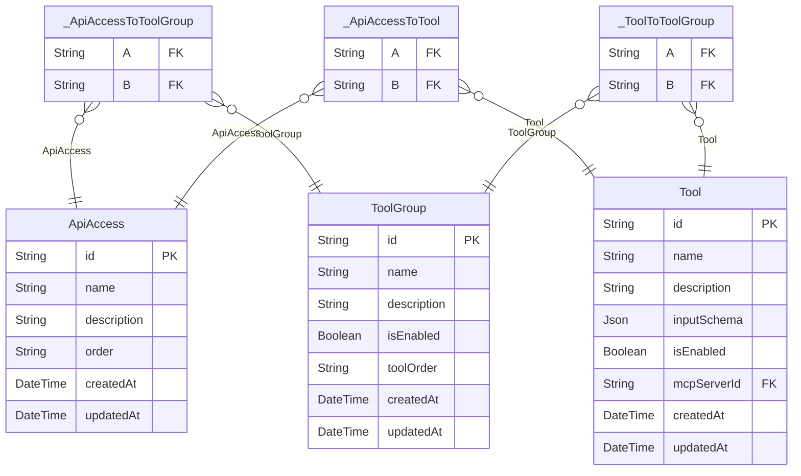
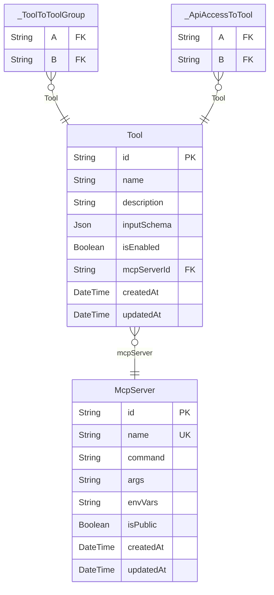
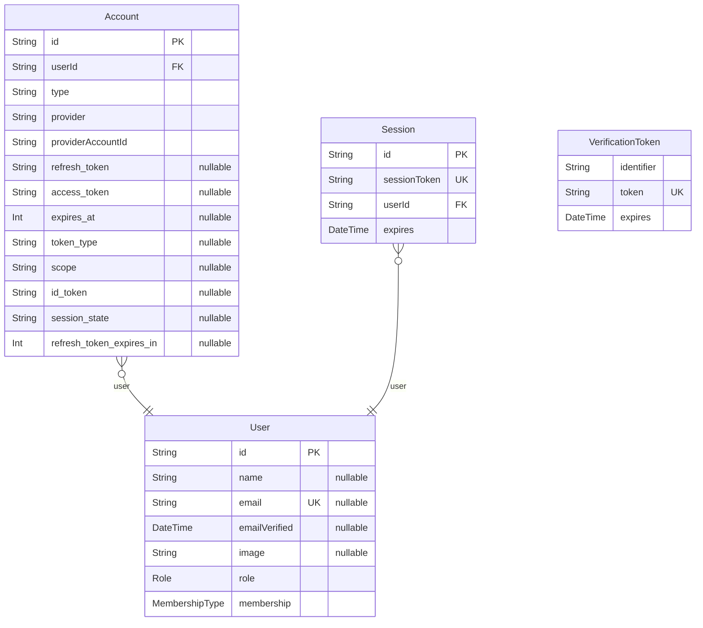

# DB Schema
> Generated by [`prisma-markdown`](https://github.com/samchon/prisma-markdown)

- [ApiAccess](#apiaccess)
- [McpServer](#mcpserver)
- [NextAuth](#nextauth)

## ApiAccess

### `ToolGroup`
どのツール群を利用するかを設定する

**Properties**
  - `id`: 
  - `name`: ツールグループ名
  - `description`: ツールグループの説明
  - `isEnabled`: ツールグループが有効かど���か
  - `toolOrder`: 
  - `createdAt`: 
  - `updatedAt`: 

### `ApiAccess`
APIアクセスの設定

**Properties**
  - `id`: 
  - `name`: APIアクセス名
  - `description`: APIアクセスの説明
  - `order`: ツールグループとツールの順序を保持するためのID配列
  - `createdAt`: 
  - `updatedAt`: 

### `_ApiAccessToToolGroup`
Pair relationship table between [ApiAccess](#ApiAccess) and [ToolGroup](#ToolGroup)

**Properties**
  - `A`: 
  - `B`: 

### `_ApiAccessToTool`
Pair relationship table between [ApiAccess](#ApiAccess) and [Tool](#Tool)

**Properties**
  - `A`: 
  - `B`: 

### `Tool`
MCP サーバーのツール一覧

**Properties**
  - `id`: 
  - `name`: ツールの名前
  - `description`: ツールの説明
  - `inputSchema`: ツールの入力スキーマ（JSON Schema形式）
  - `isEnabled`: ツールを有効にするか
  - `mcpServerId`: 
  - `createdAt`: 
  - `updatedAt`: 

### `_ToolToToolGroup`
Pair relationship table between [Tool](#Tool) and [ToolGroup](#ToolGroup)

**Properties**
  - `A`: 
  - `B`: 

## McpServer

### `McpServer`
MCP サーバー (github や notion などの接続する外部 MCP サーバー)

**Properties**
  - `id`: 
  - `name`: MCP サーバー名
  - `command`: コマンド
  - `args`: 引数
  - `envVars`: 環境変数
  - `isPublic`: サーバーが公開されているか
  - `createdAt`: 
  - `updatedAt`: 

### `Tool`
MCP サーバーのツール一覧

**Properties**
  - `id`: 
  - `name`: ツールの名前
  - `description`: ツールの説明
  - `inputSchema`: ツールの入力スキーマ（JSON Schema形式）
  - `isEnabled`: ツールを有効にするか
  - `mcpServerId`: 
  - `createdAt`: 
  - `updatedAt`: 

### `_ToolToToolGroup`
Pair relationship table between [Tool](#Tool) and [ToolGroup](#ToolGroup)

**Properties**
  - `A`: 
  - `B`: 

### `_ApiAccessToTool`
Pair relationship table between [ApiAccess](#ApiAccess) and [Tool](#Tool)

**Properties**
  - `A`: 
  - `B`: 

## NextAuth

### `Account`

**Properties**
  - `id`: 
  - `userId`: 
  - `type`: 
  - `provider`: 
  - `providerAccountId`: 
  - `refresh_token`: 
  - `access_token`: 
  - `expires_at`: 
  - `token_type`: 
  - `scope`: 
  - `id_token`: 
  - `session_state`: 
  - `refresh_token_expires_in`: 

### `Session`

**Properties**
  - `id`: 
  - `sessionToken`: 
  - `userId`: 
  - `expires`: 

### `User`

**Properties**
  - `id`: 
  - `name`: 
  - `email`: 
  - `emailVerified`: 
  - `image`: 
  - `role`: 
  - `membership`: 

### `VerificationToken`

**Properties**
  - `identifier`: 
  - `token`: 
  - `expires`: 